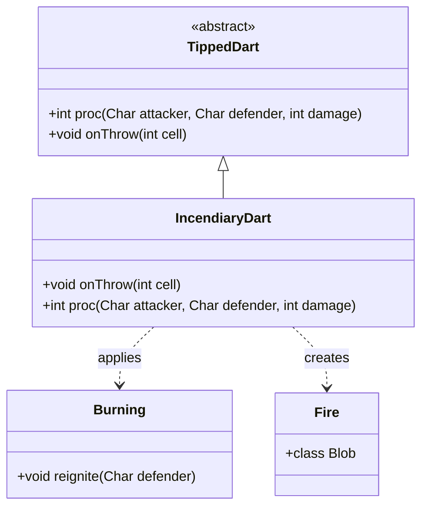

# IncendiaryDart 类文档

## 1. 基本信息
| 属性 | 值 |
|------|-----|
| 文件路径 | core/src/main/java/com/shatteredpixel/shatteredpixeldungeon/items/weapon/missiles/darts/IncendiaryDart.java |
| 包名 | com.shatteredpixel.shatteredpixeldungeon.items.weapon.missiles.darts |
| 类类型 | public class |
| 继承关系 | extends TippedDart |
| 代码行数 | 65 行 |

## 2. 类职责说明
IncendiaryDart（燃烧飞镖）是由Firebloom（Firebloom.Seed）种子制作的药尖飞镖。命中后对目标施加燃烧效果，持续造成火焰伤害。如果落在可燃地形上而没有命中敌人，会点燃该地形。这是一个简单直接的伤害型道具。

## 4. 继承与协作关系


## 静态常量表
| 常量名 | 类型 | 值 | 说明 |
|--------|------|-----|------|
| 无 | - | - | 此类无静态常量 |

## 实例字段表
| 字段名 | 类型 | 修饰符 | 说明 |
|--------|------|--------|------|
| image | int | - | 物品图标，使用ItemSpriteSheet.INCENDIARY_DART |

## 7. 方法详解

### onThrow
**签名**: `protected void onThrow(int cell)`
**功能**: 处理投掷落地事件
**参数**: 
- `cell` - 落地位置
**返回值**: 无
**实现逻辑**: 
```java
// 第41-54行
Char enemy = Actor.findChar( cell );                 // 查找目标位置的敌人
if ((enemy == null || enemy == curUser) && Dungeon.level.flamable[cell]) {
    // 如果没有敌人（或只是投掷者自己）且地形可燃
    GameScene.add(Blob.seed(cell, 4, Fire.class));   // 点燃地形
    decrementDurability();                           // 消耗耐久度
    
    if (durability > 0 || spawnedForEffect){
        super.onThrow(cell);                         // 还有耐久度，继续处理
    } else {
        // 耐久度耗尽，掉落普通飞镖
        Dungeon.level.drop(new Dart().quantity(1), cell).sprite.drop();
    }
} else{
    super.onThrow(cell);                             // 正常处理
}
```

### proc
**签名**: `public int proc(Char attacker, Char defender, int damage)`
**功能**: 处理命中效果，施加燃烧
**参数**: 
- `attacker` - 攻击者
- `defender` - 防御者
- `damage` - 基础伤害
**返回值**: 处理后的伤害值
**实现逻辑**: 
```java
// 第57-63行
// 充能射击时只燃烧敌人，不影响友军
if (!processingChargedShot || attacker.alignment != defender.alignment) {
    Buff.affect(defender, Burning.class).reignite(defender);  // 施加燃烧效果
}
return super.proc( attacker, defender, damage );
```

## 11. 使用示例
```java
// 对敌人使用
// 施加燃烧效果，持续造成火焰伤害

// 对可燃地形使用
// 点燃地形，创建火焰区域

// 配合充能射击
// 范围内的敌人都会燃烧
```

## 注意事项
1. **地形点火**: 如果落在可燃地形上，会点燃该地形
2. **充能射击保护**: 充能射击时不会燃烧友军
3. **燃烧效果**: 使用reignite方法刷新燃烧持续时间
4. **耐久度处理**: 点燃地形也会消耗耐久度
5. **制作材料**: 需要Firebloom.Seed

## 最佳实践
1. 可以用来点燃可燃地形，制造火焰陷阱
2. 燃烧效果可以持续造成伤害
3. 对付草丛中的隐藏敌人有效
4. 配合冰冻效果可以产生蒸汽