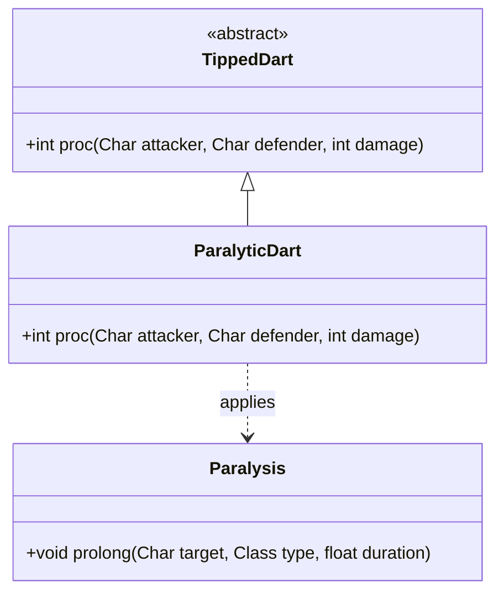

# ParalyticDart 类文档

## 1. 基本信息
| 属性 | 值 |
|------|-----|
| 文件路径 | core/src/main/java/com/shatteredpixel/shatteredpixeldungeon/items/weapon/missiles/darts/ParalyticDart.java |
| 包名 | com.shatteredpixel.shatteredpixeldungeon.items.weapon.missiles.darts |
| 类类型 | public class |
| 继承关系 | extends TippedDart |
| 代码行数 | 44 行 |

## 2. 类职责说明
ParalyticDart（麻痹飞镖）是由Earthroot（Earthroot.Seed）种子制作的药尖飞镖。命中后对目标施加麻痹效果，使其完全无法行动5秒。这是一个非常强大的控制道具，可以让敌人完全失去行动能力。

## 4. 继承与协作关系


## 静态常量表
| 常量名 | 类型 | 值 | 说明 |
|--------|------|-----|------|
| 无 | - | - | 此类无静态常量 |

## 实例字段表
| 字段名 | 类型 | 修饰符 | 说明 |
|--------|------|--------|------|
| image | int | - | 物品图标，使用ItemSpriteSheet.PARALYTIC_DART |

## 7. 方法详解

### proc
**签名**: `public int proc(Char attacker, Char defender, int damage)`
**功能**: 处理命中效果，施加麻痹
**参数**: 
- `attacker` - 攻击者
- `defender` - 防御者
- `damage` - 基础伤害
**返回值**: 处理后的伤害值
**实现逻辑**: 
```java
// 第36-42行
// 充能射击时只麻痹敌人，不影响友军
if (!processingChargedShot || attacker.alignment != defender.alignment) {
    Buff.prolong(defender, Paralysis.class, 5f);     // 施加5秒麻痹效果
}
return super.proc( attacker, defender, damage );
```

## 11. 使用示例
```java
// 对敌人使用
// 敌人完全无法行动5秒

// 配合充能射击
// 范围内所有敌人被麻痹

// 战术用途
// - 对付强力敌人
// - 创造逃跑机会
// - 安全施法时间
```

## 注意事项
1. **麻痹效果**: 目标完全无法行动、攻击或使用技能
2. **持续时间**: 固定5秒
3. **充能射击保护**: 充能射击时不会麻痹友军
4. **最强控制**: 麻痹是最强的控制效果之一
5. **制作材料**: 需要Earthroot.Seed

## 最佳实践
1. 对付强力敌人时非常有效
2. 可以创造逃跑的机会
3. 用于安全地施法或使用道具
4. 配合充能射击可以群体麻痹