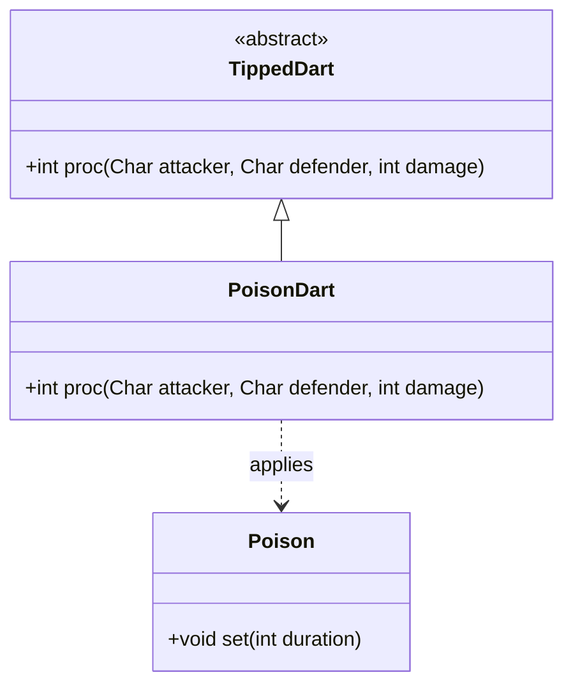

# PoisonDart 类文档

## 1. 基本信息
| 属性 | 值 |
|------|-----|
| 文件路径 | core/src/main/java/com/shatteredpixel/shatteredpixeldungeon/items/weapon/missiles/darts/PoisonDart.java |
| 包名 | com.shatteredpixel.shatteredpixeldungeon.items.weapon.missiles.darts |
| 类类型 | public class |
| 继承关系 | extends TippedDart |
| 代码行数 | 46 行 |

## 2. 类职责说明
PoisonDart（毒镖）是由Sorrowmoss（Sorrowmoss.Seed）种子制作的药尖飞镖。命中后对目标施加中毒效果，持续造成毒伤害。中毒的伤害量随地下城深度增加，使其在更深层更加有效。

## 4. 继承与协作关系


## 静态常量表
| 常量名 | 类型 | 值 | 说明 |
|--------|------|-----|------|
| 无 | - | - | 此类无静态常量 |

## 实例字段表
| 字段名 | 类型 | 修饰符 | 说明 |
|--------|------|--------|------|
| image | int | - | 物品图标，使用ItemSpriteSheet.POISON_DART |

## 7. 方法详解

### proc
**签名**: `public int proc(Char attacker, Char defender, int damage)`
**功能**: 处理命中效果，施加中毒
**参数**: 
- `attacker` - 攻击者
- `defender` - 防御者
- `damage` - 基础伤害
**返回值**: 处理后的伤害值
**实现逻辑**: 
```java
// 第37-45行
// 充能射击时只对敌人施加中毒
if (!processingChargedShot || attacker.alignment != defender.alignment) {
    // 中毒持续时间 = 3 + 深度/2
    Buff.affect(defender, Poison.class).set(3 + Dungeon.scalingDepth() / 2);
}

return super.proc(attacker, defender, damage);
```

## 11. 使用示例
```java
// 对敌人使用
// 施加中毒效果，持续造成伤害

// 在深层地下城使用
// 中毒持续时间更长，效果更明显

// 配合充能射击
// 范围内所有敌人都会中毒
```

## 注意事项
1. **中毒持续时间**: 基础3回合 + 地下城深度/2
2. **充能射击保护**: 充能射击时不会毒害友军
3. **深度加成**: 越深的层数效果越强
4. **持续伤害**: 中毒会持续造成伤害直到效果结束
5. **制作材料**: 需要Sorrowmoss.Seed

## 最佳实践
1. 在深层地下城使用效果更好
2. 可以用来消耗敌人的生命值
3. 对付高血量敌人很有效
4. 配合其他减益效果使用