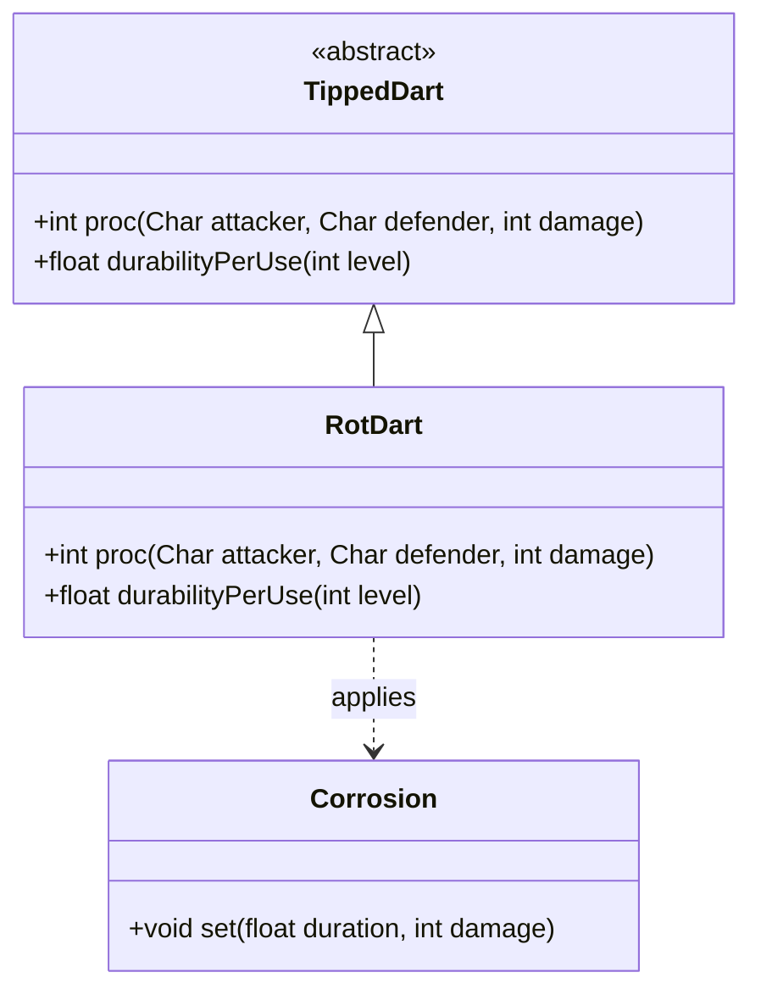

# RotDart 类文档

## 1. 基本信息
| 属性 | 值 |
|------|-----|
| 文件路径 | core/src/main/java/com/shatteredpixel/shatteredpixeldungeon/items/weapon/missiles/darts/RotDart.java |
| 包名 | com.shatteredpixel.shatteredpixeldungeon.items.weapon.missiles.darts |
| 类类型 | public class |
| 继承关系 | extends TippedDart |
| 代码行数 | 57 行 |

## 2. 类职责说明
RotDart（腐烂飞镖）是由Rotberry（Rotberry.Seed）种子制作的药尖飞镖。命中后对目标施加腐蚀效果，造成持续腐蚀伤害。对Boss和精英敌人效果减半，但仍然有效。与其他药尖飞镖不同，腐烂飞镖固定只有5次使用机会。

## 4. 继承与协作关系


## 静态常量表
| 常量名 | 类型 | 值 | 说明 |
|--------|------|-----|------|
| 无 | - | - | 此类无静态常量 |

## 实例字段表
| 字段名 | 类型 | 修饰符 | 说明 |
|--------|------|--------|------|
| image | int | - | 物品图标，使用ItemSpriteSheet.ROT_DART |

## 7. 方法详解

### proc
**签名**: `public int proc(Char attacker, Char defender, int damage)`
**功能**: 处理命中效果，施加腐蚀
**参数**: 
- `attacker` - 攻击者
- `defender` - 防御者
- `damage` - 基础伤害
**返回值**: 处理后的伤害值
**实现逻辑**: 
```java
// 第38-51行
// 充能射击时不影响友军
if (processingChargedShot && attacker.alignment == defender.alignment) {
    // 什么都不做
} else if (defender.properties().contains(Char.Property.BOSS)
        || defender.properties().contains(Char.Property.MINIBOSS)){
    // Boss和精英：持续5秒，伤害 = 深度/3
    Buff.affect(defender, Corrosion.class).set(5f, Dungeon.scalingDepth()/3);
} else {
    // 普通敌人：持续10秒，伤害 = 深度
    Buff.affect(defender, Corrosion.class).set(10f, Dungeon.scalingDepth());
}

return super.proc(attacker, defender, damage);
```

### durabilityPerUse
**签名**: `public float durabilityPerUse(int level)`
**功能**: 计算每次使用的耐久度消耗
**参数**: 
- `level` - 武器等级
**返回值**: 每次使用消耗的耐久度
**实现逻辑**: 
```java
// 第54-56行
return MAX_DURABILITY/5f;                             // 固定5次使用
```

## 11. 使用示例
```java
// 对普通敌人使用
// 10秒腐蚀，每秒造成深度点伤害

// 对Boss使用
// 5秒腐蚀，每秒造成深度/3点伤害（效果减半）

// 注意：固定5次使用机会
```

## 注意事项
1. **固定使用次数**: 无论任何加成，固定只能使用5次
2. **Boss效果减半**: 对Boss和精英持续时间和伤害都减半
3. **充能射击保护**: 充能射击时不会腐蚀友军
4. **腐蚀伤害**: 基于地下城深度计算
5. **制作材料**: 需要Rotberry.Seed（较稀有）

## 最佳实践
1. 对付高血量敌人非常有效
2. 对Boss仍然有效，只是伤害减半
3. 腐蚀可以绕过护甲
4. 使用次数有限，谨慎使用