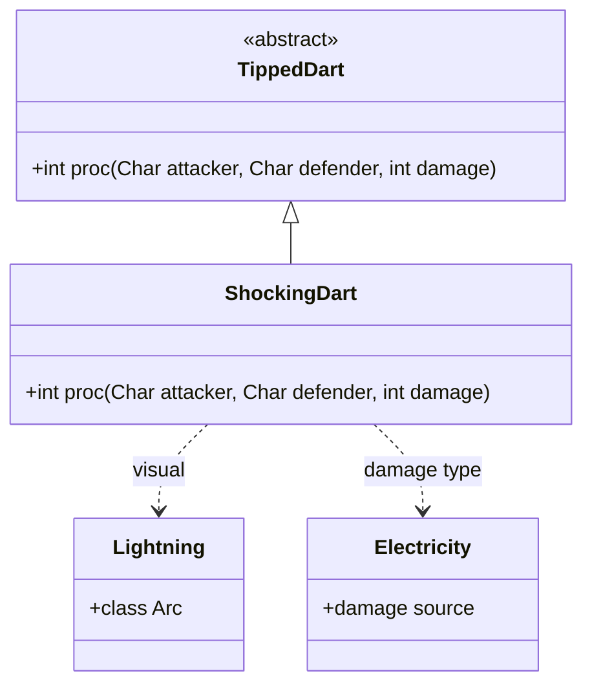

# ShockingDart 类文档

## 1. 基本信息
| 属性 | 值 |
|------|-----|
| 文件路径 | core/src/main/java/com/shatteredpixel/shatteredpixeldungeon/items/weapon/missiles/darts/ShockingDart.java |
| 包名 | com.shatteredpixel.shatteredpixeldungeon.items.weapon.missiles.darts |
| 类类型 | public class |
| 继承关系 | extends TippedDart |
| 代码行数 | 62 行 |

## 2. 类职责说明
ShockingDart（电击飞镖）是由Stormvine（Stormvine.Seed）种子制作的药尖飞镖。命中后对目标造成即时电击伤害，并显示闪电视觉效果。电击伤害随地下城深度增加，是一个直接伤害型道具。

## 4. 继承与协作关系


## 静态常量表
| 常量名 | 类型 | 值 | 说明 |
|--------|------|-----|------|
| 无 | - | - | 此类无静态常量 |

## 实例字段表
| 字段名 | 类型 | 修饰符 | 说明 |
|--------|------|--------|------|
| image | int | - | 物品图标，使用ItemSpriteSheet.SHOCKING_DART |

## 7. 方法详解

### proc
**签名**: `public int proc(Char attacker, Char defender, int damage)`
**功能**: 处理命中效果，造成电击伤害
**参数**: 
- `attacker` - 攻击者
- `defender` - 防御者
- `damage` - 基础伤害
**返回值**: 处理后的伤害值
**实现逻辑**: 
```java
// 第44-61行
// 充能射击时只电击敌人
if (!processingChargedShot || attacker.alignment != defender.alignment) {
    // 电击伤害：5+深度/4 到 10+深度/4
    defender.damage(Random.NormalIntRange(5 + Dungeon.scalingDepth() / 4, 10 + Dungeon.scalingDepth() / 4), new Electricity());

    // 显示闪电视觉效果
    CharSprite s = defender.sprite;
    if (s != null && s.parent != null) {
        ArrayList<Lightning.Arc> arcs = new ArrayList<>();
        // 创建水平和垂直两条闪电弧
        arcs.add(new Lightning.Arc(new PointF(s.x, s.y + s.height / 2), new PointF(s.x + s.width, s.y + s.height / 2)));
        arcs.add(new Lightning.Arc(new PointF(s.x + s.width / 2, s.y), new PointF(s.x + s.width / 2, s.y + s.height)));
        s.parent.add(new Lightning(arcs, null));
        Sample.INSTANCE.play(Assets.Sounds.LIGHTNING);  // 播放闪电音效
    }
}

return super.proc(attacker, defender, damage);
```

## 11. 使用示例
```java
// 对敌人使用
// 造成即时电击伤害并显示闪电效果

// 在深层地下城使用
// 电击伤害随深度增加

// 配合充能射击
// 范围内所有敌人都会被电击
```

## 注意事项
1. **即时伤害**: 电击是即时伤害，不是持续效果
2. **伤害范围**: 5+深度/4 到 10+深度/4
3. **充能射击保护**: 充能射击时不会电击友军
4. **视觉效果**: 会显示闪电穿过目标的动画
5. **制作材料**: 需要Stormvine.Seed

## 最佳实践
1. 用于造成额外伤害
2. 电击可以触发水中的导电效果
3. 在深层地下城伤害更高
4. 与水中敌人配合可以造成额外伤害