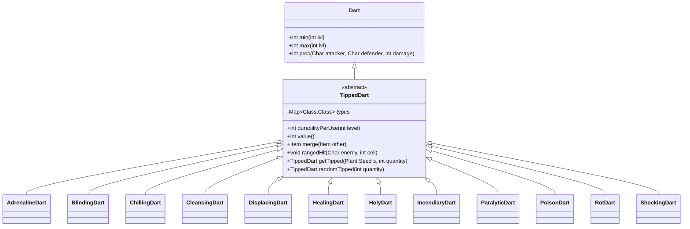

# TippedDart 类文档

## 1. 基本信息
| 属性 | 值 |
|------|-----|
| 文件路径 | core/src/main/java/com/shatteredpixel/shatteredpixeldungeon/items/weapon/missiles/darts/TippedDart.java |
| 包名 | com.shatteredpixel.shatteredpixeldungeon.items.weapon.missiles.darts |
| 类类型 | public abstract class |
| 继承关系 | extends Dart |
| 代码行数 | 253 行 |

## 2. 类职责说明
TippedDart（药尖飞镖）是所有特殊效果飞镖的抽象基类。它通过将种子蘸取到普通飞镖上制作而成，每种种子对应一种特殊效果的药尖飞镖。药尖飞镖使用后会消耗并恢复为普通飞镖，同时具有"清洁"功能可以将药尖飞镖恢复为普通飞镖。

## 4. 继承与协作关系


## 静态常量表
| 常量名 | 类型 | 值 | 说明 |
|--------|------|-----|------|
| AC_CLEAN | String | "CLEAN" | 清洁动作标识符 |
| types | LinkedHashMap<Class<? extends Plant.Seed>, Class<? extends TippedDart>> | 12种映射 | 种子类型到药尖飞镖类型的映射表 |
| lostDarts | int | 0 | 由于合并操作损失的飞镖计数 |
| targetPos | int | -1 | 目标位置，用于耐久度计算 |

## 实例字段表
| 字段名 | 类型 | 修饰符 | 说明 |
|--------|------|--------|------|
| tier | int | - | 武器层级，设为2 |
| baseUses | float | - | 基础使用次数，设为1（一次性） |

## 7. 方法详解

### actions
**签名**: `public ArrayList<String> actions(Hero hero)`
**功能**: 获取药尖飞镖的可用动作列表
**参数**: 
- `hero` - 执行动作的英雄
**返回值**: 动作字符串列表
**实现逻辑**: 
```java
// 第69-74行
ArrayList<String> actions = super.actions( hero );   // 获取父类动作
actions.remove( AC_TIP );                            // 移除"蘸取"动作（不能再蘸取）
actions.add( AC_CLEAN );                             // 添加"清洁"动作
return actions;
```

### execute
**签名**: `public void execute(final Hero hero, String action)`
**功能**: 执行指定动作
**参数**: 
- `hero` - 执行动作的英雄
- `action` - 动作名称
**返回值**: 无
**实现逻辑**: 
```java
// 第77-123行
super.execute(hero, action);                         // 调用父类execute
if (action.equals( AC_CLEAN )){                      // 如果是清洁动作
    // 根据数量显示不同的选项
    String[] options;
    if (quantity() > 1){
        options = new String[]{
            Messages.get(this, "clean_all"),         // 清洁全部
            Messages.get(this, "clean_one"),         // 清洁一个
            Messages.get(this, "cancel")             // 取消
        };
    } else {
        options = new String[]{
            Messages.get(this, "clean_one"),         // 只有一个选项
            Messages.get(this, "cancel")
        };
    }
    
    GameScene.show(new WndOptions(...){              // 显示选项窗口
        protected void onSelect(int index) {
            if (index == 0){                         // 清洁全部或唯一
                detachAll(hero.belongings.backpack); // 移除药尖飞镖
                new Dart().quantity(quantity).collect();  // 获得普通飞镖
                // 消耗时间和播放动画
            } else if (index == 1 && quantity() > 1){  // 清洁一个
                detach(hero.belongings.backpack);      // 移除一个
                new Dart().quantity(1).collect();      // 获得一个普通飞镖
                durability = MAX_DURABILITY;           // 重置剩余药尖飞镖的耐久度
            }
        }
    });
}
```

### rangedHit
**签名**: `protected void rangedHit(Char enemy, int cell)`
**功能**: 处理远程命中效果
**参数**: 
- `enemy` - 被击中的敌人
- `cell` - 命中的格子
**返回值**: 无
**实现逻辑**: 
```java
// 第128-147行
targetPos = cell;                                    // 记录目标位置
super.rangedHit( enemy, cell);                       // 调用父类方法

// 如果耐久度耗尽且不是特效生成的
if (durability <= 0 && !spawnedForEffect){
    Dart d = new Dart();                             // 创建普通飞镖
    d.quantity(1);
    Catalog.countUse(getClass());                    // 记录使用统计
    
    // 尝试将飞镖插在敌人身上（PinCushion效果）
    if (sticky && enemy != null && enemy.isAlive() && enemy.alignment != Char.Alignment.ALLY){
        PinCushion p = Buff.affect(enemy, PinCushion.class);
        if (p.target == enemy){
            p.stick(d);                              // 插在敌人身上
            return;
        }
    }
    // 否则掉落在地
    Dungeon.level.drop( d, enemy.pos ).sprite.drop();
}
```

### merge
**签名**: `public Item merge(Item other)`
**功能**: 合并两个药尖飞镖堆
**参数**: 
- `other` - 要合并的物品
**返回值**: 合并后的物品
**实现逻辑**: 
```java
// 第153-163行
int total = quantity() + other.quantity();           // 记录合并前的总数
super.merge(other);                                  // 调用父类合并
int extra = total - quantity();                      // 计算多余的数量

// 多余的药尖飞镖变成普通飞镖
if (extra > 0){
    lostDarts += extra;                              // 记录损失的飞镖数
}
return this;
```

### durabilityPerUse
**签名**: `public float durabilityPerUse(int level)`
**功能**: 计算每次使用消耗的耐久度
**参数**: 
- `level` - 武器等级
**返回值**: 每次使用消耗的耐久度
**实现逻辑**: 
```java
// 第172-215行
float use = super.durabilityPerUse(level);           // 获取基础消耗

if (Dungeon.hero != null) {
    // 天赋：耐用尖端 - 减少消耗
    use /= (1 + Dungeon.hero.pointsInTalent(Talent.DURABLE_TIPS));

    // 检查莲花（WandOfRegrowth.Lotus）的种子保护效果
    float lotusPreserve = 0f;
    if (targetPos != -1) {
        for (Char ch : Actor.chars()) {
            if (ch instanceof WandOfRegrowth.Lotus) {
                WandOfRegrowth.Lotus l = (WandOfRegrowth.Lotus) ch;
                if (l.inRange(targetPos)) {
                    lotusPreserve = Math.max(lotusPreserve, l.seedPreservation());
                }
            }
        }
        targetPos = -1;
    }
    // 同时检查使用者位置
    int p = curUser == null ? Dungeon.hero.pos : curUser.pos;
    for (Char ch : Actor.chars()) {
        if (ch instanceof WandOfRegrowth.Lotus) {
            // ... 类似逻辑
        }
    }
    use *= (1f - lotusPreserve);                      // 应用莲花保护
}

float usages = Math.round(MAX_DURABILITY/use);

// 充能射击增加使用次数
if (bow != null && Dungeon.hero != null && Dungeon.hero.buff(Crossbow.ChargedShot.class) != null){
    usages += 3 + bow.buffedLvl();
}

// 100次以上视为永久
if (usages >= 100f) return 0;

return (MAX_DURABILITY/usages) + 0.001f;              // 加一点防止舍入误差
```

### value
**签名**: `public int value()`
**功能**: 计算出售价值
**参数**: 无
**返回值**: 出售价格
**实现逻辑**: 
```java
// 第218-221行
// 普通飞镖价值 + 种子价值的一半
return Math.round(7.5f * quantity);                  // 每个药尖飞镖7.5金币
```

### getTipped
**签名**: `public static TippedDart getTipped(Plant.Seed s, int quantity)`
**功能**: 根据种子类型获取对应的药尖飞镖
**参数**: 
- `s` - 种子
- `quantity` - 数量
**返回值**: 对应的药尖飞镖实例
**实现逻辑**: 
```java
// 第239-241行
return (TippedDart) Reflection.newInstance(types.get(s.getClass())).quantity(quantity);
// 通过反射创建对应类型的药尖飞镖
```

### randomTipped
**签名**: `public static TippedDart randomTipped(int quantity)`
**功能**: 随机生成一个药尖飞镖
**参数**: 
- `quantity` - 数量
**返回值**: 随机类型的药尖飞镖
**实现逻辑**: 
```java
// 第243-251行
Plant.Seed s;
do{
    s = (Plant.Seed) Generator.randomUsingDefaults(Generator.Category.SEED);
} while (!types.containsKey(s.getClass()));          // 确保种子类型有效

return getTipped(s, quantity);
```

## 种子与飞镖映射表
| 种子 | 药尖飞镖 | 效果 |
|------|----------|------|
| Rotberry.Seed | RotDart | 腐蚀伤害 |
| Sungrass.Seed | HealingDart | 治疗效果 |
| Fadeleaf.Seed | DisplacingDart | 传送效果 |
| Icecap.Seed | ChillingDart | 冰冻减速 |
| Firebloom.Seed | IncendiaryDart | 燃烧效果 |
| Sorrowmoss.Seed | PoisonDart | 中毒效果 |
| Swiftthistle.Seed | AdrenalineDart | 激素涌动/致残 |
| Blindweed.Seed | BlindingDart | 致盲效果 |
| Stormvine.Seed | ShockingDart | 电击伤害 |
| Earthroot.Seed | ParalyticDart | 麻痹效果 |
| Mageroyal.Seed | CleansingDart | 净化效果 |
| Starflower.Seed | HolyDart | 祝福/对亡灵伤害 |

## 11. 使用示例
```java
// 从种子创建药尖飞镖
Plant.Seed seed = new Sungrass.Seed();
TippedDart healingDart = TippedDart.getTipped(seed, 5);  // 5个治疗飞镖

// 随机获取药尖飞镖
TippedDart randomDart = TippedDart.randomTipped(3);

// 清洁药尖飞镖恢复为普通飞镖
// 玩家点击药尖飞镖选择"CLEAN"动作

// 合并时的处理
// 当两个不同效果的药尖飞镖被强制合并时，多余的部分会变成普通飞镖
```

## 注意事项
1. **一次性使用**: 药尖飞镖使用后会消耗，恢复为普通飞镖
2. **合并损失**: 不同类型的药尖飞镖合并会造成损失
3. **天赋加成**: "耐用尖端"天赋可以增加药尖飞镖的使用次数
4. **莲花保护**: 再生法杖召唤的莲花可以保护种子效果

## 最佳实践
1. 使用前考虑目标类型，某些飞镖对友军有特殊效果
2. 配合弩使用可以触发充能射击的范围效果
3. 在莲花范围内使用可以提高耐久度
4. 保持足够的普通飞镖作为"弹药"