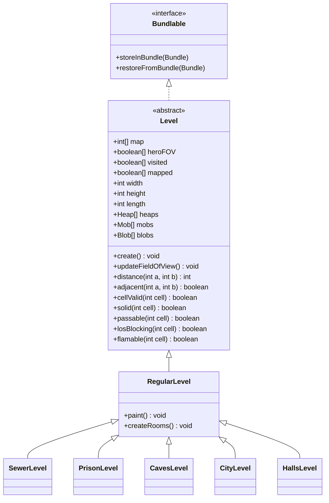

# Level 类文档

## 1. 基本信息
| 属性 | 值 |
|------|-----|
| 文件路径 | core/src/main/java/com/shatteredpixel/shatteredpixeldungeon/levels/Level.java |
| 包名 | com.shatteredpixel.shatteredpixeldungeon.levels |
| 类类型 | abstract class |
| 继承关系 | implements Bundlable |
| 代码行数 | 1657 |

## 2. 类职责说明
Level是游戏中所有关卡地形的抽象基类，管理地图数据、地形类型、视野计算、角色移动和物品放置等核心功能。它是游戏世界的基础架构，定义了地图生成、碰撞检测、视野系统和各种地形交互逻辑。

## 4. 继承与协作关系


## 实例字段表
| 字段名 | 类型 | 修饰符 | 说明 |
|--------|------|--------|------|
| map | int[] | public | 地图数据，存储每个格子的地形类型 |
| heroFOV | boolean[] | public | 英雄视野范围 |
| visited | boolean[] | public | 已访问过的格子 |
| mapped | boolean[] | public | 已绘制在地图上的格子 |
| width | int | public | 地图宽度（默认48） |
| height | int | public | 地图高度（默认48） |
| length | int | public | 地图总格子数 |
| heaps | Heap[] | public | 地上的物品堆 |
| plants | Plant[] | public | 植物数组 |
| traps | Trap[] | public | 陷阱数组 |
| mobs | HashSet\<Mob\> | public | 当前关卡所有怪物 |
| blobs | HashSet\<Blob\> | public | 当前关卡所有Blob效果 |

## 7. 方法详解

### create()
**签名**: `public void create()`
**功能**: 创建关卡，生成地图
**实现逻辑**: 抽象方法，由子类实现具体的地图生成逻辑

### updateFieldOfView(Char c, boolean[] fov)
**签名**: `public void updateFieldOfView(Char c, boolean[] fov)`
**功能**: 更新角色视野
**参数**: `c`-角色, `fov`-视野数组
**实现逻辑**: 使用ShadowCaster算法计算视野范围

### distance(int a, int b)
**签名**: `public static int distance(int a, int b)`
**功能**: 计算两个格子之间的距离
**参数**: `a`-格子1, `b`-格子2
**返回值**: 曼哈顿距离

### adjacent(int a, int b)
**签名**: `public static boolean adjacent(int a, int b)`
**功能**: 判断两个格子是否相邻
**返回值**: 相邻返回true

### solid(int cell)
**签名**: `public boolean solid(int cell)`
**功能**: 判断格子是否为实心（不可通过）
**参数**: `cell`-格子位置
**返回值**: 实心返回true

### passable(int cell)
**签名**: `public boolean passable(int cell)`
**功能**: 判断格子是否可通过
**返回值**: 可通过返回true

### flamable(int cell)
**签名**: `public boolean flamable(int cell)`
**功能**: 判断格子是否可燃
**返回值**: 可燃返回true

### setTrap(Trap trap, int pos)
**签名**: `public void setTrap(Trap trap, int pos)`
**功能**: 在指定位置放置陷阱
**参数**: `trap`-陷阱, `pos`-位置

### discover(int cell)
**签名**: `public boolean discover(int cell)`
**功能**: 发现指定格子的隐藏内容（陷阱、秘密门等）
**返回值**: 发现了内容返回true

## 地形类型 (Terrain)
| 常量 | 值 | 说明 |
|------|-----|------|
| EMPTY | 0 | 空地 |
| GRASS | 1 | 草地 |
| EMPTY_WELL | 2 | 井上方空地 |
| ENTRANCE | 4 | 入口 |
| EXIT | 5 | 出口 |
| WALL | 6 | 墙壁 |
| DOOR | 7 | 门 |
| OPEN_DOOR | 8 | 打开的门 |
| WATER | 9 | 水 |
| TRAP | 10 | 陷阱 |
| HIGH_GRASS | 11 | 高草 |
| SECRET_TRAP | 12 | 隐藏陷阱 |
| SECRET_DOOR | 13 | 秘密门 |

## 11. 使用示例

```java
// 检查格子是否可通过
if (Dungeon.level.passable(targetPos)) {
    hero.move(targetPos);
}

// 计算距离
int dist = Level.distance(hero.pos, enemy.pos);

// 获取视野
Level.updateFieldOfView(hero, hero.fieldOfView);

// 检查是否在视野内
if (Dungeon.level.heroFOV[targetPos]) {
    // 目标在视野内
}
```

## 注意事项

1. **地图尺寸**: 默认48x48，BOSS关卡可能不同
2. **视野更新**: 每次移动后需要更新视野
3. **地形修改**: 修改地形后需要调用press()等方法触发效果
4. **性能优化**: 视野计算使用缓存机制

## 子类列表

| 关卡类型 | 类名 | 层数 |
|----------|------|------|
| 下水道 | SewerLevel | 1-5层 |
| 下水道Boss | SewerBossLevel | 5层Boss |
| 监狱 | PrisonLevel | 6-10层 |
| 监狱Boss | PrisonBossLevel | 10层Boss |
| 洞穴 | CavesLevel | 11-15层 |
| 洞穴Boss | CavesBossLevel | 15层Boss |
| 城市 | CityLevel | 16-20层 |
| 城市Boss | CityBossLevel | 20层Boss |
| 大厅 | HallsLevel | 21-25层 |
| 大厅Boss | HallsBossLevel | 25层Boss |
| 最终层 | LastLevel | 26层 |
| 金库 | VaultLevel | 特殊关卡 |