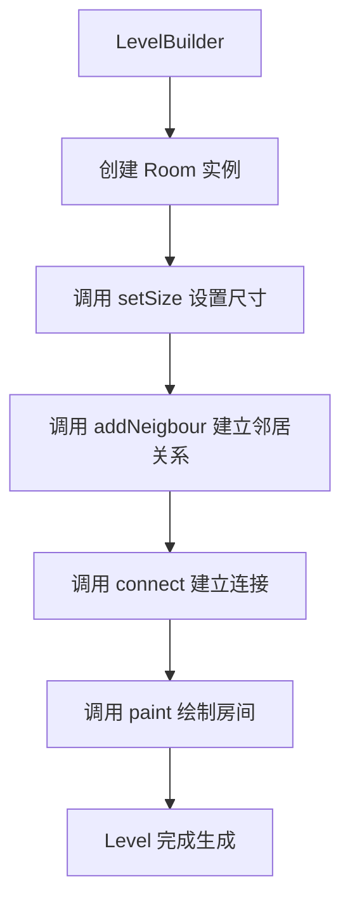

# Room 类文档

## 1. 基本信息

| 属性 | 值 |
|------|-----|
| **文件路径** | core/src/main/java/com/shatteredpixel/shatteredpixeldungeon/levels/rooms/Room.java |
| **包名** | com.shatteredpixel.shatteredpixeldungeon.levels.rooms |
| **文件类型** | abstract class |
| **继承关系** | extends Rect implements Graph.Node, Bundlable |
| **代码行数** | 488 行 |
| **所属模块** | core |

---

## 2. 文件职责说明

### 核心职责

Room 是所有房间类型的**抽象基类**，定义了地牢关卡中房间的基本结构和行为。它负责：

1. **空间表示**：定义房间的矩形边界（left、top、right、bottom）
2. **连接管理**：维护房间之间的邻居关系和门连接
3. **尺寸约束**：定义房间的最小/最大宽高限制
4. **绘制接口**：提供抽象方法 `paint()` 供子类实现具体绘制逻辑
5. **可放置性检查**：定义水、草地、陷阱、物品、角色等是否可放置于特定位置

### 系统定位

Room 是关卡生成系统的核心组件，位于 `levels.rooms` 包的顶层。它是整个房间继承体系的根基，所有具体房间类型（如标准房间、特殊房间、连接房间等）都继承自此类。

### 不负责什么

- 不负责具体的地形绘制逻辑（由子类的 `paint()` 实现）
- 不负责关卡的整体布局规划（由 Level 类和 Builder 类负责）
- 不负责持久化房间之间的连接关系（源码注释标明 FIXME：connections 和 neighbours 目前不会在加载时保留）

---

## 3. 结构总览

### 主要成员概览

**实例字段**：
- `neigbours`：邻居房间列表
- `connected`：已连接的房间及其门的映射
- `distance`：用于图算法的距离值
- `price`：用于图算法的路径代价

**静态常量**：
- `ALL`、`LEFT`、`TOP`、`RIGHT`、`BOTTOM`：方向常量

**内部类**：
- `Door`：门类，表示房间之间的连接点

### 主要逻辑块概览

1. **空间逻辑（Spatial logic）**：尺寸设置、点计算、边界检查
2. **连接逻辑（Connection logic）**：邻居管理、连接建立、方向限制
3. **绘制逻辑（Painter Logic）**：绘制接口、可放置性检查
4. **图节点接口（Graph.Node interface）**：路径查找支持
5. **序列化接口（Bundlable）**：保存/加载支持

### 生命周期/调用时机

1. **创建阶段**：由 LevelBuilder 创建 Room 实例
2. **尺寸设置**：调用 `setSize()` 系列方法设置房间大小
3. **连接建立**：通过 `addNeigbour()` 和 `connect()` 建立房间关系
4. **绘制阶段**：调用 `paint()` 方法绘制房间内容
5. **运行时**：通过 `canPlace*` 系列方法检查物品/角色放置

---

## 4. 继承与协作关系

### 父类提供的能力

**继承自 Rect**：
- `left`、`top`、`right`、`bottom`：矩形边界字段
- `width()`、`height()`、`square()`：尺寸计算
- `set()`、`shift()`、`resize()`：矩形操作
- `intersect()`、`union()`：矩形运算
- `inside()`、`center()`、`getPoints()`：点计算

**实现 Graph.Node 接口**：
- `distance()` / `distance(int)`：距离获取/设置
- `price()` / `price(int)`：代价获取/设置
- `edges()`：获取可通行的边（已连接的房间）

**实现 Bundlable 接口**：
- `storeInBundle(Bundle)`：序列化房间数据
- `restoreFromBundle(Bundle)`：反序列化房间数据

### 覆写的方法

- `width()`：宽度计算（+1，因为房间右侧和下侧是包含的）
- `height()`：高度计算（+1，同上）

### 实现的接口契约

| 接口 | 方法 | 说明 |
|------|------|------|
| Graph.Node | `distance()` | 返回 distance 字段 |
| Graph.Node | `distance(int)` | 设置 distance 字段 |
| Graph.Node | `price()` | 返回 price 字段 |
| Graph.Node | `price(int)` | 设置 price 字段 |
| Graph.Node | `edges()` | 返回可通行的连接房间 |
| Bundlable | `storeInBundle(Bundle)` | 保存边界坐标 |
| Bundlable | `restoreFromBundle(Bundle)` | 恢复边界坐标 |

### 依赖的关键类

| 类 | 用途 |
|-----|------|
| `com.watabou.utils.Rect` | 父类，提供矩形操作 |
| `com.watabou.utils.Point` | 点坐标表示 |
| `com.watabou.utils.Graph.Node` | 图节点接口 |
| `com.watabou.utils.Bundle` | 序列化支持 |
| `com.watabou.utils.Random` | 随机数生成 |
| `com.shatteredpixel.shatteredpixeldungeon.levels.Level` | 关卡类，paint 方法的参数 |
| `com.shatteredpixel.shatteredpixeldungeon.levels.painters.Painter` | 绘制工具类 |

### 使用者

- `LevelBuilder` 及其子类：创建和管理房间
- `RegularLevel` 及其子类：关卡生成
- 各种具体的 Room 子类

---

## 5. 字段/常量详解

### 静态常量

| 常量名 | 类型 | 值 | 说明 |
|--------|------|-----|------|
| `ALL` | int | 0 | 表示所有方向的常量 |
| `LEFT` | int | 1 | 表示左侧方向的常量 |
| `TOP` | int | 2 | 表示上方方向的常量 |
| `RIGHT` | int | 3 | 表示右侧方向的常量 |
| `BOTTOM` | int | 4 | 表示下方方向的常量 |

### 实例字段

| 字段名 | 类型 | 默认值 | 说明 |
|--------|------|--------|------|
| `neigbours` | ArrayList\<Room\> | new ArrayList<>() | 相邻房间列表，通过 `addNeigbour()` 添加 |
| `connected` | LinkedHashMap\<Room, Door\> | new LinkedHashMap<>() | 已连接房间到门的映射，保持插入顺序 |
| `distance` | int | 0 | 图算法中的距离值，用于路径计算 |
| `price` | int | 1 | 图算法中的路径代价，默认为 1 |

---

## 6. 构造与初始化机制

### 构造器

**无参构造器**：
```java
public Room(){
    super();
}
```
调用父类 Rect 的无参构造器，初始化 left=top=right=bottom=0。

**拷贝构造器**：
```java
public Room( Rect other ){
    super(other);
}
```
调用父类 Rect 的拷贝构造器，复制边界值。

### 初始化块

无显式初始化块。字段在声明时直接初始化。

### 初始化注意事项

- `neigbours` 和 `connected` 在声明时初始化为空集合
- `distance` 默认为 0（Graph 算法会将其设为 MAX_VALUE）
- `price` 默认为 1

---

## 7. 方法详解

### Room()

**可见性**：public

**是否覆写**：否

**方法职责**：无参构造器，创建一个边界全为 0 的房间实例。

**参数**：无

**返回值**：无

---

### Room(Rect other)

**可见性**：public

**是否覆写**：否

**方法职责**：拷贝构造器，基于另一个 Rect 创建房间实例。

**参数**：
- `other` (Rect)：要复制的矩形

**返回值**：无

---

### set(Room other)

**可见性**：public

**是否覆写**：是，覆写自 Rect.set(Rect)

**方法职责**：将当前房间设置为另一个房间的副本，同时转移所有邻居关系和连接关系。

**参数**：
- `other` (Room)：要复制的房间

**返回值**：Room，返回当前实例（支持链式调用）

**核心实现逻辑**：
```java
public Room set( Room other ) {
    super.set( other );  // 复制边界
    // 转移邻居关系
    for (Room r : other.neigbours){
        neigbours.add(r);
        r.neigbours.remove(other);
        r.neigbours.add(this);
    }
    // 转移连接关系
    for (Room r : other.connected.keySet()){
        Door d = other.connected.get(r);
        r.connected.remove(other);
        r.connected.put(this, d);
        connected.put(r, d);
    }
    return this;
}
```

**副作用**：修改 other 的邻居和连接，将其转移到当前实例

---

### minWidth() / maxWidth() / minHeight() / maxHeight()

**可见性**：public

**是否覆写**：否（子类应覆写）

**方法职责**：定义房间的尺寸约束。

**参数**：无

**返回值**：int，默认返回 -1（表示无限制）

**注意事项**：源码注释要求覆写时必须存储随机决定的值，确保相同参数多次调用返回相同结果。

---

### setSize()

**可见性**：public

**是否覆写**：否

**方法职责**：使用最小/最大尺寸约束设置房间大小。

**参数**：无

**返回值**：boolean，设置是否成功

**核心实现逻辑**：
```java
public boolean setSize(){
    return setSize(minWidth(), maxWidth(), minHeight(), maxHeight());
}
```

---

### forceSize(int w, int h)

**可见性**：public

**是否覆写**：否

**方法职责**：强制设置房间为指定大小（宽高必须相等）。

**参数**：
- `w` (int)：宽度和高度值

**返回值**：boolean，设置是否成功

---

### setSizeWithLimit(int w, int h)

**可见性**：public

**是否覆写**：否

**方法职责**：在限制范围内设置房间大小，如果超出则缩放到限制内。

**参数**：
- `w` (int)：最大宽度限制
- `h` (int)：最大高度限制

**返回值**：boolean，设置是否成功

**前置条件**：限制值不能小于房间的最小尺寸

**核心实现逻辑**：
```java
public boolean setSizeWithLimit( int w, int h ){
    if ( w < minWidth() || h < minHeight()) {
        return false;
    } else {
        setSize();
        if (width() > w || height() > h){
            resize(Math.min(width(), w)-1, Math.min(height(), h)-1);
        }
        return true;
    }
}
```

---

### setSize(int minW, int maxW, int minH, int maxH)

**可见性**：protected

**是否覆写**：否

**方法职责**：使用指定的最小/最大宽高范围设置房间大小。

**参数**：
- `minW` (int)：最小宽度
- `maxW` (int)：最大宽度
- `minH` (int)：最小高度
- `maxH` (int)：最大高度

**返回值**：boolean，设置是否成功

**前置条件**：参数必须在 minWidth/maxWidth/minHeight/maxHeight 范围内

**核心实现逻辑**：
```java
protected boolean setSize(int minW, int maxW, int minH, int maxH) {
    if (minW < minWidth() || maxW > maxWidth() 
            || minH < minHeight() || maxH > maxHeight()
            || minW > maxW || minH > maxH){
        return false;
    } else {
        // -1 因为房间右侧和下侧是包含的
        resize(Random.NormalIntRange(minW, maxW) - 1,
                Random.NormalIntRange(minH, maxH) - 1);
        return true;
    }
}
```

---

### pointInside(Point from, int n)

**可见性**：public

**是否覆写**：否

**方法职责**：从边界点向内移动 n 步，返回新点。

**参数**：
- `from` (Point)：起始点（应在房间边界上）
- `n` (int)：向内移动的步数

**返回值**：Point，移动后的点

**核心实现逻辑**：
```java
public Point pointInside(Point from, int n){
    Point step = new Point(from);
    if (from.x == left) {
        step.offset( +n, 0 );
    } else if (from.x == right) {
        step.offset( -n, 0 );
    } else if (from.y == top) {
        step.offset( 0, +n );
    } else if (from.y == bottom) {
        step.offset( 0, -n );
    }
    return step;
}
```

---

### width()

**可见性**：public

**是否覆写**：是，覆写自 Rect.width()

**方法职责**：返回房间宽度。

**参数**：无

**返回值**：int，宽度值（+1 因为房间右侧是包含的）

---

### height()

**可见性**：public

**是否覆写**：是，覆写自 Rect.height()

**方法职责**：返回房间高度。

**参数**：无

**返回值**：int，高度值（+1 因为房间下侧是包含的）

---

### random() / random(int m)

**可见性**：public

**是否覆写**：否

**方法职责**：返回房间内的随机点。

**参数**：
- `m` (int)：边距，默认为 1

**返回值**：Point，房间内的随机点

**核心实现逻辑**：
```java
public Point random( int m ) {
    return new Point( Random.IntRange( left + m, right - m ),
            Random.IntRange( top + m, bottom - m ));
}
```

---

### inside(Point p)

**可见性**：public

**是否覆写**：是，覆写自 Rect.inside(Point)

**方法职责**：检查点是否在房间内部（不含边界）。

**参数**：
- `p` (Point)：要检查的点

**返回值**：boolean，点是否在房间内部

**核心实现逻辑**：
```java
public boolean inside( Point p ) {
    return p.x > left && p.y > top && p.x < right && p.y < bottom;
}
```

**边界情况**：边界上的点返回 false

---

### center()

**可见性**：public

**是否覆写**：是，覆写自 Rect.center()

**方法职责**：返回房间中心点。

**参数**：无

**返回值**：Point，房间中心点

**核心实现逻辑**：
```java
public Point center() {
    return new Point(
            (left + right) / 2 + (((right - left) % 2) == 1 ? Random.Int( 2 ) : 0),
            (top + bottom) / 2 + (((bottom - top) % 2) == 1 ? Random.Int( 2 ) : 0) );
}
```

**边界情况**：奇数尺寸时随机偏移以选择中心点

---

### minConnections(int direction)

**可见性**：public

**是否覆写**：否（子类应覆写）

**方法职责**：返回指定方向的最小连接数。

**参数**：
- `direction` (int)：方向常量（ALL/LEFT/TOP/RIGHT/BOTTOM）

**返回值**：int，默认 ALL 方向返回 1，其他方向返回 0

---

### curConnections(int direction)

**可见性**：public

**是否覆写**：否

**方法职责**：返回指定方向的当前连接数。

**参数**：
- `direction` (int)：方向常量

**返回值**：int，当前连接数

**核心实现逻辑**：
```java
public int curConnections(int direction){
    if (direction == ALL) {
        return connected.size();
    } else {
        int total = 0;
        for (Room r : connected.keySet()){
            Rect i = intersect( r );
            if      (direction == LEFT && i.width() == 0 && i.left == left)         total++;
            else if (direction == TOP && i.height() == 0 && i.top == top)           total++;
            else if (direction == RIGHT && i.width() == 0 && i.right == right)      total++;
            else if (direction == BOTTOM && i.height() == 0 && i.bottom == bottom)  total++;
        }
        return total;
    }
}
```

---

### remConnections(int direction)

**可见性**：public

**是否覆写**：否

**方法职责**：返回指定方向的剩余可连接数。

**参数**：
- `direction` (int)：方向常量

**返回值**：int，剩余可连接数

**核心实现逻辑**：
```java
public int remConnections(int direction){
    if (curConnections(ALL) >= maxConnections(ALL)) return 0;
    else return maxConnections(direction) - curConnections(direction);
}
```

---

### maxConnections(int direction)

**可见性**：public

**是否覆写**：否（子类可覆写）

**方法职责**：返回指定方向的最大连接数。

**参数**：
- `direction` (int)：方向常量

**返回值**：int，默认 ALL 方向返回 16，其他方向返回 4

---

### canConnect(Point p)

**可见性**：public

**是否覆写**：否

**方法职责**：检查指定点是否可以建立连接（仅检查点位置限制）。

**参数**：
- `p` (Point)：要检查的点

**返回值**：boolean，是否可以连接

**核心实现逻辑**：
```java
public boolean canConnect(Point p){
    // 点必须恰好在一条边上，不能是角落
    return (p.x == left || p.x == right) != (p.y == top || p.y == bottom);
}
```

---

### canConnect(int direction)

**可见性**：public

**是否覆写**：否

**方法职责**：检查指定方向是否可以建立连接（仅检查方向限制）。

**参数**：
- `direction` (int)：方向常量

**返回值**：boolean，是否可以连接

---

### canConnect(Room r)

**可见性**：public

**是否覆写**：否

**方法职责**：检查是否可以与另一个房间建立连接（检查点限制和方向限制）。

**参数**：
- `r` (Room)：目标房间

**返回值**：boolean，是否可以连接

**前置条件**：
- 入口房间和出口房间不能直接连接
- 两个房间必须有交集区域
- 交集区域必须存在可连接的点

**核心实现逻辑**：
```java
public boolean canConnect( Room r ){
    if (isExit() && r.isEntrance() || isEntrance() && r.isExit()){
        return false;  // 入口和出口不能直接连接
    }
    Rect i = intersect( r );
    boolean foundPoint = false;
    for (Point p : i.getPoints()){
        if (canConnect(p) && r.canConnect(p)){
            foundPoint = true;
            break;
        }
    }
    if (!foundPoint) return false;
    // 检查方向限制...
}
```

---

### canMerge(Level l, Room other, Point p, int mergeTerrain)

**可见性**：public

**是否覆写**：否（子类可覆写）

**方法职责**：检查是否可以与另一个房间合并。

**参数**：
- `l` (Level)：关卡实例
- `other` (Room)：目标房间
- `p` (Point)：合并点
- `mergeTerrain` (int)：合并地形

**返回值**：boolean，默认返回 false

---

### merge(Level l, Room other, Rect merge, int mergeTerrain)

**可见性**：public

**是否覆写**：否（子类可覆写）

**方法职责**：与另一个房间合并。

**参数**：
- `l` (Level)：关卡实例
- `other` (Room)：目标房间
- `merge` (Rect)：合并区域
- `mergeTerrain` (int)：合并地形

**返回值**：无

**核心实现逻辑**：
```java
public void merge(Level l, Room other, Rect merge, int mergeTerrain){
    Painter.fill(l, merge, mergeTerrain);
}
```

---

### addNeigbour(Room other)

**可见性**：public

**是否覆写**：否

**方法职责**：将另一个房间添加为邻居。

**参数**：
- `other` (Room)：目标房间

**返回值**：boolean，是否添加成功

**前置条件**：两个房间必须相邻（交集宽度或高度至少为 2）

**核心实现逻辑**：
```java
public boolean addNeigbour( Room other ) {
    if (neigbours.contains(other)) return true;
    Rect i = intersect( other );
    if ((i.width() == 0 && i.height() >= 2) ||
        (i.height() == 0 && i.width() >= 2)) {
        neigbours.add( other );
        other.neigbours.add( this );
        return true;
    }
    return false;
}
```

---

### connect(Room room)

**可见性**：public

**是否覆写**：否

**方法职责**：与另一个房间建立连接。

**参数**：
- `room` (Room)：目标房间

**返回值**：boolean，是否连接成功

**前置条件**：
- 必须是邻居或可以成为邻居
- 尚未连接
- 满足 canConnect 条件

**核心实现逻辑**：
```java
public boolean connect( Room room ) {
    if ((neigbours.contains(room) || addNeigbour(room))
            && !connected.containsKey( room ) && canConnect(room)) {
        connected.put( room, null );
        room.connected.put( this, null );
        return true;
    }
    return false;
}
```

---

### clearConnections()

**可见性**：public

**是否覆写**：否

**方法职责**：清除所有邻居和连接关系。

**参数**：无

**返回值**：无

**副作用**：同时清除对方的引用

---

### isEntrance()

**可见性**：public

**是否覆写**：否（子类可覆写）

**方法职责**：判断是否为入口房间。

**参数**：无

**返回值**：boolean，默认返回 false

---

### isExit()

**可见性**：public

**是否覆写**：否（子类可覆写）

**方法职责**：判断是否为出口房间。

**参数**：无

**返回值**：boolean，默认返回 false

---

### paint(Level level)

**可见性**：public abstract

**是否覆写**：否（子类必须实现）

**方法职责**：绘制房间内容。

**参数**：
- `level` (Level)：关卡实例

**返回值**：无

---

### canPlaceWater(Point p)

**可见性**：public

**是否覆写**：否（子类可覆写）

**方法职责**：检查指定点是否可以放置水。

**参数**：
- `p` (Point)：目标点

**返回值**：boolean，默认返回 true

---

### waterPlaceablePoints()

**可见性**：public final

**是否覆写**：否（final 方法）

**方法职责**：返回所有可放置水的点列表。

**参数**：无

**返回值**：ArrayList\<Point\>，可放置水的点列表

---

### canPlaceGrass(Point p)

**可见性**：public

**是否覆写**：否（子类可覆写）

**方法职责**：检查指定点是否可以放置草地。

**参数**：
- `p` (Point)：目标点

**返回值**：boolean，默认返回 true

---

### grassPlaceablePoints()

**可见性**：public final

**是否覆写**：否（final 方法）

**方法职责**：返回所有可放置草地的点列表。

**参数**：无

**返回值**：ArrayList\<Point\>，可放置草地的点列表

---

### canPlaceTrap(Point p)

**可见性**：public

**是否覆写**：否（子类可覆写）

**方法职责**：检查指定点是否可以放置陷阱。

**参数**：
- `p` (Point)：目标点

**返回值**：boolean，默认返回 true

---

### trapPlaceablePoints()

**可见性**：public final

**是否覆写**：否（final 方法）

**方法职责**：返回所有可放置陷阱的点列表。

**参数**：无

**返回值**：ArrayList\<Point\>，可放置陷阱的点列表

---

### canPlaceItem(Point p, Level l)

**可见性**：public

**是否覆写**：否（子类可覆写）

**方法职责**：检查指定点是否可以放置物品。

**参数**：
- `p` (Point)：目标点
- `l` (Level)：关卡实例

**返回值**：boolean，默认调用 inside(p)

---

### itemPlaceablePoints(Level l)

**可见性**：public final

**是否覆写**：否（final 方法）

**方法职责**：返回所有可放置物品的点列表。

**参数**：
- `l` (Level)：关卡实例

**返回值**：ArrayList\<Point\>，可放置物品的点列表

---

### canPlaceCharacter(Point p, Level l)

**可见性**：public

**是否覆写**：否（子类可覆写）

**方法职责**：检查指定点是否可以放置角色。

**参数**：
- `p` (Point)：目标点
- `l` (Level)：关卡实例

**返回值**：boolean，默认调用 inside(p)

---

### charPlaceablePoints(Level l)

**可见性**：public final

**是否覆写**：否（final 方法）

**方法职责**：返回所有可放置角色的点列表。

**参数**：
- `l` (Level)：关卡实例

**返回值**：ArrayList\<Point\>，可放置角色的点列表

---

### distance()

**可见性**：public

**是否覆写**：是，实现 Graph.Node 接口

**方法职责**：返回距离值。

**参数**：无

**返回值**：int，distance 字段值

---

### distance(int value)

**可见性**：public

**是否覆写**：是，实现 Graph.Node 接口

**方法职责**：设置距离值。

**参数**：
- `value` (int)：新的距离值

**返回值**：无

---

### price()

**可见性**：public

**是否覆写**：是，实现 Graph.Node 接口

**方法职责**：返回路径代价。

**参数**：无

**返回值**：int，price 字段值

---

### price(int value)

**可见性**：public

**是否覆写**：是，实现 Graph.Node 接口

**方法职责**：设置路径代价。

**参数**：
- `value` (int)：新的代价值

**返回值**：无

---

### edges()

**可见性**：public

**是否覆写**：是，实现 Graph.Node 接口

**方法职责**：返回可通行的边（连接的房间），用于路径查找。

**参数**：无

**返回值**：Collection\<Room\>，可通行的连接房间列表

**核心实现逻辑**：
```java
@Override
public Collection<Room> edges() {
    ArrayList<Room> edges = new ArrayList<>();
    for( Room r : connected.keySet()){
        Door d = connected.get(r);
        // 忽略锁定、阻塞或隐藏的门
        if (d.type == Door.Type.EMPTY || d.type == Door.Type.TUNNEL
                || d.type == Door.Type.UNLOCKED || d.type == Door.Type.REGULAR){
            edges.add(r);
        }
    }
    return edges;
}
```

---

### storeInBundle(Bundle bundle)

**可见性**：public

**是否覆写**：是，实现 Bundlable 接口

**方法职责**：将房间数据保存到 Bundle。

**参数**：
- `bundle` (Bundle)：目标 Bundle

**返回值**：无

**核心实现逻辑**：
```java
@Override
public void storeInBundle( Bundle bundle ) {
    bundle.put( "left", left );
    bundle.put( "top", top );
    bundle.put( "right", right );
    bundle.put( "bottom", bottom );
}
```

---

### restoreFromBundle(Bundle bundle)

**可见性**：public

**是否覆写**：是，实现 Bundlable 接口

**方法职责**：从 Bundle 恢复房间数据。

**参数**：
- `bundle` (Bundle)：源 Bundle

**返回值**：无

**核心实现逻辑**：
```java
@Override
public void restoreFromBundle( Bundle bundle ) {
    left = bundle.getInt( "left" );
    top = bundle.getInt( "top" );
    right = bundle.getInt( "right" );
    bottom = bundle.getInt( "bottom" );
}
```

---

### onLevelLoad(Level level)

**可见性**：public

**是否覆写**：否（子类可覆写）

**方法职责**：关卡加载后的回调，用于恢复运行时状态。

**参数**：
- `level` (Level)：关卡实例

**返回值**：无

**注意事项**：源码注释标明 FIXME：connections 和 neighbours 目前不会在加载时保留

---

## 8. 对外暴露能力

### 显式 API

**空间操作**：
- `setSize()`、`forceSize()`、`setSizeWithLimit()`：设置房间大小
- `width()`、`height()`：获取尺寸
- `random()`、`center()`：获取随机点/中心点
- `inside()`：检查点是否在内部

**连接操作**：
- `addNeigbour()`：添加邻居
- `connect()`：建立连接
- `clearConnections()`：清除连接
- `canConnect()`：检查连接可行性
- `curConnections()`、`remConnections()`、`maxConnections()`：连接数查询

**放置检查**：
- `canPlaceWater()`、`canPlaceGrass()`、`canPlaceTrap()`
- `canPlaceItem()`、`canPlaceCharacter()`
- 对应的 `*PlaceablePoints()` 方法

**绘制接口**：
- `paint(Level)`：抽象方法，子类实现

### 内部辅助方法

- `pointInside()`：从边界向内移动
- `minConnections()`、`minWidth()` 等尺寸/连接约束方法

### 扩展入口

**必须覆写**：
- `paint(Level)`：绘制逻辑

**可覆写**：
- `minWidth()`、`maxWidth()`、`minHeight()`、`maxHeight()`：尺寸约束
- `minConnections()`、`maxConnections()`：连接约束
- `canPlace*` 系列方法：放置规则
- `isEntrance()`、`isExit()`：房间类型标识
- `canMerge()`、`merge()`：合并逻辑
- `onLevelLoad()`：加载后处理

---

## 9. 运行机制与调用链

### 创建时机

由 `LevelBuilder` 在关卡生成过程中创建，根据关卡配置和随机权重选择具体的房间类型。

### 调用者

- `RegularLevel` 及其子类：管理和绘制房间
- `LevelBuilder`：创建和连接房间
- `Painter`：绘制房间内容

### 被调用者

- `Level`：提供地图数据和绘制目标
- `Painter`：绘制工具
- `Random`：随机数生成
- `Graph`：路径计算

### 系统流程位置



---

## 10. 资源、配置与国际化关联

### 引用的 messages 文案

无直接引用。Room 类不涉及用户可见文本。

### 依赖的资源

无直接依赖资源文件。

### 中文翻译来源

不适用。

---

## 11. 使用示例

### 基本用法

```java
// 创建一个自定义房间
public class MyRoom extends Room {
    @Override
    public int minWidth() { return 5; }
    @Override
    public int maxWidth() { return 7; }
    @Override
    public int minHeight() { return 5; }
    @Override
    public int maxHeight() { return 7; }
    
    @Override
    public void paint(Level level) {
        Painter.fill(level, this, Terrain.WALL);
        Painter.fill(level, this, 1, Terrain.EMPTY);
        for (Door door : connected.values()) {
            door.set(Door.Type.REGULAR);
        }
    }
}

// 使用房间
Room myRoom = new MyRoom();
myRoom.setSize();  // 设置尺寸
myRoom.connect(otherRoom);  // 连接其他房间
myRoom.paint(level);  // 绘制
```

### 扩展示例

```java
// 自定义放置规则
@Override
public boolean canPlaceTrap(Point p) {
    // 不允许在中心区域放置陷阱
    Point center = center();
    int dist = Math.abs(p.x - center.x) + Math.abs(p.y - center.y);
    return dist > 2;  // 距离中心超过 2 格才允许
}

// 自定义连接限制
@Override
public int maxConnections(int direction) {
    if (direction == ALL) return 4;  // 最多 4 个连接
    return 1;  // 每个方向最多 1 个
}
```

---

## 12. 开发注意事项

### 状态依赖

- `connected` 和 `neigbours` 的状态依赖于 `connect()` 和 `addNeigbour()` 方法的正确调用
- `distance` 和 `price` 字段由外部 Graph 算法设置，不应手动修改

### 生命周期耦合

- 房间的尺寸在 `setSize()` 后确定，后续不应修改
- 连接关系在 `paint()` 调用前应已完全建立
- `onLevelLoad()` 用于恢复加载后的状态，但当前实现有 FIXME 标记

### 常见陷阱

1. **尺寸计算**：`width()` 和 `height()` 返回值比 Rect 父类多 1，因为房间边界是包含的
2. **连接检查**：`canConnect(Point)` 只检查点限制，`canConnect(Room)` 才检查完整条件
3. **邻居 vs 连接**：邻居关系不等于连接关系，两个房间可能相邻但未连接
4. **加载恢复**：当前连接关系不会随存档保存，加载后需要重新建立

---

## 13. 修改建议与扩展点

### 适合扩展的位置

1. **尺寸约束**：覆写 `minWidth()` 等方法定义房间大小范围
2. **连接规则**：覆写 `minConnections()` 等方法控制连接数
3. **放置规则**：覆写 `canPlace*` 系列方法自定义放置逻辑
4. **绘制逻辑**：实现 `paint()` 方法定义房间外观

### 不建议修改的位置

- `width()` 和 `height()` 的计算逻辑（依赖边界包含语义）
- `edges()` 方法中的门类型过滤（影响路径查找）
- `storeInBundle()` 和 `restoreFromBundle()` 的序列化格式（影响存档兼容）

### 重构建议

1. **FIXME 修复**：实现连接关系的持久化，或在 `onLevelLoad()` 中重建
2. **拼写修正**：`neigbours` 应修正为 `neighbours`

---

## 14. 事实核查清单

- [x] 是否已覆盖全部字段
- [x] 是否已覆盖全部方法
- [x] 是否已检查继承链与覆写关系
- [x] 是否已核对官方中文翻译（不适用）
- [x] 是否存在任何推测性表述
- [x] 示例代码是否真实可用
- [x] 是否遗漏资源/配置/本地化关联
- [x] 是否明确说明了注意事项与扩展点