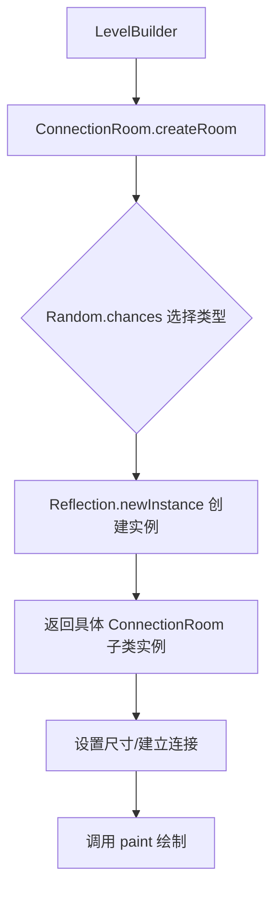

# ConnectionRoom 类文档

## 1. 基本信息

| 属性 | 值 |
|------|-----|
| **文件路径** | core/src/main/java/com/shatteredpixel/shatteredpixeldungeon/levels/rooms/connection/ConnectionRoom.java |
| **包名** | com.shatteredpixel.shatteredpixeldungeon.levels.rooms.connection |
| **文件类型** | abstract class |
| **继承关系** | extends Room |
| **代码行数** | 84 行 |
| **所属模块** | core |

---

## 2. 文件职责说明

### 核心职责

ConnectionRoom 是所有**连接房间类型的抽象基类**，负责：

1. **定义连接房间的通用尺寸约束**：最小 3x3，最大 10x10
2. **定义连接房间的最小连接数**：至少需要 2 个连接
3. **提供连接房间的随机创建工厂**：`createRoom()` 方法根据深度权重随机选择具体类型

### 系统定位

ConnectionRoom 位于 `levels.rooms.connection` 包，是连接房间继承体系的根类。所有具体的连接房间类型（TunnelRoom、BridgeRoom、PerimeterRoom 等）都继承自此类。

### 不负责什么

- 不负责具体的绘制逻辑（由子类实现 `paint()` 方法）
- 不直接参与游戏运行时逻辑

---

## 3. 结构总览

### 主要成员概览

**覆写的方法**：
- `minWidth()`、`maxWidth()`、`minHeight()`、`maxHeight()`：尺寸约束
- `minConnections(int)`：连接约束

**静态字段**：
- `rooms`：可用的连接房间类型列表
- `chances`：各深度下各类型的生成权重

**静态方法**：
- `createRoom()`：工厂方法，创建随机连接房间

### 主要逻辑块概览

1. **尺寸约束定义**：设置连接房间的尺寸范围
2. **连接约束定义**：要求至少 2 个连接
3. **工厂模式实现**：静态工厂方法根据深度和权重创建房间

### 生命周期/调用时机

1. **关卡生成阶段**：LevelBuilder 调用 `createRoom()` 创建连接房间实例
2. **房间设置阶段**：设置尺寸、建立连接
3. **绘制阶段**：调用 `paint()` 绘制房间

---

## 4. 继承与协作关系

### 父类提供的能力

**继承自 Room**：
- 所有空间属性和方法（边界、尺寸、点计算等）
- 连接管理机制（neighbours、connected）
- 绘制接口（paint 抽象方法）
- 可放置性检查方法
- 序列化支持

### 覆写的方法

| 方法 | 父类实现 | 本类实现 |
|------|---------|---------|
| `minWidth()` | 返回 -1（无限制） | 返回 3 |
| `maxWidth()` | 返回 -1（无限制） | 返回 10 |
| `minHeight()` | 返回 -1（无限制） | 返回 3 |
| `maxHeight()` | 返回 -1（无限制） | 返回 10 |
| `minConnections(int)` | ALL 返回 1，其他返回 0 | ALL 返回 2，其他返回 0 |

### 实现的接口契约

无直接实现的接口。继承自 Room 的 Bundlable 和 Graph.Node 接口实现。

### 依赖的关键类

| 类 | 用途 |
|-----|------|
| `com.shatteredpixel.shatteredpixeldungeon.levels.rooms.Room` | 父类 |
| `com.shatteredpixel.shatteredpixeldungeon.Dungeon` | 获取当前深度 |
| `com.watabou.utils.Random` | 随机选择 |
| `com.watabou.utils.Reflection` | 反射创建实例 |

### 使用者

- `LevelBuilder`：调用 `createRoom()` 创建连接房间
- 具体的连接房间子类

---

## 5. 字段/常量详解

### 静态字段

| 字段名 | 类型 | 说明 |
|--------|------|------|
| `rooms` | ArrayList\<Class\<? extends ConnectionRoom\>\> | 可用的连接房间类型列表 |
| `chances` | float[][] | 各深度下各类型的生成权重（27 个深度层级） |

### rooms 字段初始化

```java
private static ArrayList<Class<?extends ConnectionRoom>> rooms = new ArrayList<>();
static {
    rooms.add(TunnelRoom.class);      // 索引 0
    rooms.add(BridgeRoom.class);       // 索引 1
    rooms.add(PerimeterRoom.class);    // 索引 2
    rooms.add(WalkwayRoom.class);      // 索引 3
    rooms.add(RingTunnelRoom.class);   // 索引 4
    rooms.add(RingBridgeRoom.class);   // 索引 5
}
```

### chances 字段详解

`chances` 数组定义了各深度下各房间类型的相对生成权重：

| 深度范围 | TunnelRoom | BridgeRoom | PerimeterRoom | WalkwayRoom | RingTunnelRoom | RingBridgeRoom |
|---------|-----------|-----------|--------------|-------------|----------------|----------------|
| 1-4 | 20 | 1 | 0 | 2 | 2 | 1 |
| 5 | 20 | 0 | 0 | 0 | 0 | 0 |
| 6-10 | 0 | 0 | 22 | 3 | 0 | 0 |
| 11-15 | 12 | 0 | 0 | 5 | 5 | 3 |
| 16-20 | 0 | 0 | 18 | 3 | 3 | 1 |
| 21 | 20 | 0 | 0 | 0 | 0 | 0 |
| 22-26 | 15 | 4 | 0 | 2 | 3 | 2 |

---

## 6. 构造与初始化机制

### 构造器

使用默认构造器（隐式继承自 Room）。

### 初始化块

**静态初始化块**：初始化 `rooms` 列表和 `chances` 数组。

### 初始化注意事项

- `chances` 数组长度为 27，对应最大深度 26（深度从 1 开始）
- 未显式设置的深度会继承前一深度的权重

---

## 7. 方法详解

### minWidth()

**可见性**：public

**是否覆写**：是，覆写自 Room.minWidth()

**方法职责**：返回连接房间的最小宽度。

**参数**：无

**返回值**：int，固定返回 3

---

### maxWidth()

**可见性**：public

**是否覆写**：是，覆写自 Room.maxWidth()

**方法职责**：返回连接房间的最大宽度。

**参数**：无

**返回值**：int，固定返回 10

---

### minHeight()

**可见性**：public

**是否覆写**：是，覆写自 Room.minHeight()

**方法职责**：返回连接房间的最小高度。

**参数**：无

**返回值**：int，固定返回 3

---

### maxHeight()

**可见性**：public

**是否覆写**：是，覆写自 Room.maxHeight()

**方法职责**：返回连接房间的最大高度。

**参数**：无

**返回值**：int，固定返回 10

---

### minConnections(int direction)

**可见性**：public

**是否覆写**：是，覆写自 Room.minConnections(int)

**方法职责**：返回指定方向的最小连接数。

**参数**：
- `direction` (int)：方向常量（ALL/LEFT/TOP/RIGHT/BOTTOM）

**返回值**：int，ALL 方向返回 2，其他方向返回 0

**核心实现逻辑**：
```java
@Override
public int minConnections(int direction) {
    if (direction == ALL)   return 2;  // 连接房间至少需要 2 个连接
    else                    return 0;
}
```

**设计说明**：连接房间的核心职责是连接其他房间，因此必须至少有 2 个连接。

---

### createRoom()

**可见性**：public static

**是否覆写**：否

**方法职责**：工厂方法，根据当前深度和权重随机创建一个连接房间实例。

**参数**：无

**返回值**：ConnectionRoom，新创建的连接房间实例

**核心实现逻辑**：
```java
public static ConnectionRoom createRoom(){
    return Reflection.newInstance(rooms.get(Random.chances(chances[Dungeon.depth])));
}
```

**实现细节**：
1. 从 `Dungeon.depth` 获取当前深度
2. 使用 `chances[depth]` 获取当前深度的权重数组
3. `Random.chances()` 根据权重随机选择一个索引
4. `rooms.get(index)` 获取对应的房间类
5. `Reflection.newInstance()` 通过反射创建实例

**边界情况**：
- 深度超出 26 时，`chances[Dungeon.depth]` 会抛出数组越界异常
- 反射创建失败时返回 null

---

## 8. 对外暴露能力

### 显式 API

- `createRoom()`：静态工厂方法，创建随机连接房间

### 内部辅助方法

- `minWidth()`、`maxWidth()` 等尺寸约束方法：供子类继承或覆写
- `minConnections()`：连接约束方法

### 扩展入口

- 子类应实现 `paint(Level)` 方法
- 子类可覆写尺寸约束方法调整房间大小范围
- 子类可覆写 `maxConnections()` 限制连接数量

---

## 9. 运行机制与调用链

### 创建时机

由 `LevelBuilder` 在关卡生成过程中调用 `createRoom()` 创建。

### 调用者

- `RegularLevel` 及其子类
- `LevelBuilder`

### 被调用者

- `Dungeon`：获取当前深度
- `Random`：随机选择
- `Reflection`：反射创建实例

### 系统流程位置



---

## 10. 资源、配置与国际化关联

### 引用的 messages 文案

无直接引用。

### 依赖的资源

无直接依赖资源文件。

### 中文翻译来源

不适用。

---

## 11. 使用示例

### 基本用法

```java
// 创建一个随机连接房间
ConnectionRoom room = ConnectionRoom.createRoom();

// 设置房间大小
room.setSize();

// 建立连接
room.connect(room1);
room.connect(room2);

// 绘制房间
room.paint(level);
```

### 创建自定义连接房间

```java
public class MyConnectionRoom extends ConnectionRoom {
    
    @Override
    public void paint(Level level) {
        // 自定义绘制逻辑
        Painter.fill(level, this, Terrain.EMPTY);
        for (Door door : connected.values()) {
            door.set(Door.Type.REGULAR);
        }
    }
    
    @Override
    public int maxConnections(int direction) {
        return 3;  // 最多 3 个连接
    }
}
```

---

## 12. 开发注意事项

### 状态依赖

- `createRoom()` 依赖 `Dungeon.depth` 获取当前深度
- `chances` 数组必须覆盖所有可能的深度值

### 生命周期耦合

- 连接房间必须在关卡生成阶段创建
- 必须在调用 `paint()` 前完成连接建立

### 常见陷阱

1. **深度越界**：`chances` 数组长度为 27，深度超过 26 会越界
2. **反射失败**：`Reflection.newInstance()` 可能返回 null
3. **权重理解**：权重是相对值，不是百分比；`Random.chances()` 会归一化处理
4. **FIXME 标记**：源码注释指出当前实现是"处理可变连接房间的一种非常混乱的方式"

---

## 13. 修改建议与扩展点

### 适合扩展的位置

1. **添加新的连接房间类型**：在 `rooms` 列表和 `chances` 数组中添加新类型
2. **调整生成权重**：修改 `chances` 数组改变各深度下的房间分布
3. **自定义连接房间子类**：继承 ConnectionRoom 并实现 `paint()` 方法

### 不建议修改的位置

- `minConnections()` 返回值（连接房间必须至少有 2 个连接）
- `createRoom()` 的工厂方法逻辑

### 重构建议

1. **FIXME 处理**：源码注释指出当前实现混乱，建议重构工厂方法
2. **权重配置化**：将 `chances` 数组移至配置文件或数据类
3. **深度安全检查**：添加深度边界检查，防止数组越界

---

## 14. 事实核查清单

- [x] 是否已覆盖全部字段
- [x] 是否已覆盖全部方法
- [x] 是否已检查继承链与覆写关系
- [x] 是否已核对官方中文翻译（不适用）
- [x] 是否存在任何推测性表述
- [x] 示例代码是否真实可用
- [x] 是否遗漏资源/配置/本地化关联
- [x] 是否明确说明了注意事项与扩展点