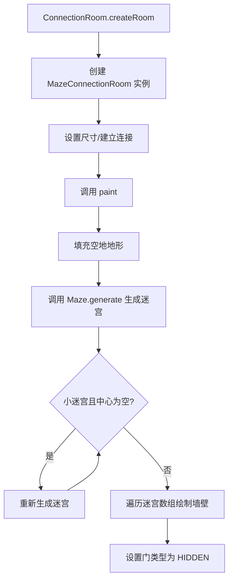

# MazeConnectionRoom 类文档

## 1. 基本信息

| 属性 | 值 |
|------|-----|
| **文件路径** | core/src/main/java/com/shatteredpixel/shatteredpixeldungeon/levels/rooms/connection/MazeConnectionRoom.java |
| **包名** | com.shatteredpixel.shatteredpixeldungeon.levels.rooms.connection |
| **文件类型** | class |
| **继承关系** | extends ConnectionRoom |
| **代码行数** | 65 行 |
| **所属模块** | core |

---

## 2. 文件职责说明

### 核心职责

MazeConnectionRoom 是一种**迷宫型连接房间**，负责：

1. **生成迷宫结构**：使用 Maze 工具类生成迷宫墙壁
2. **隐藏门设置**：将所有门设置为隐藏类型，增加探索难度
3. **限制连接数**：最多允许 2 个连接，保持迷宫的简单性

### 系统定位

MazeConnectionRoom 继承自 ConnectionRoom，是一种特殊的连接房间，内部包含随机生成的迷宫结构，玩家需要通过迷宫才能到达另一端。

### 不负责什么

- 不负责迷宫生成算法（由 `Maze` 类实现）
- 不处理特殊地形（如深渊、水等）

---

## 3. 结构总览

### 主要成员概览

**公共方法**：
- `paint(Level)`：绘制迷宫房间
- `maxConnections(int)`：限制最大连接数

### 主要逻辑块概览

1. **基础填充**：填充空地地形
2. **迷宫生成**：调用 `Maze.generate()` 生成迷宫结构
3. **小迷宫优化**：对小尺寸迷宫重新生成直到中心被填充
4. **墙壁绘制**：根据迷宫数组绘制墙壁
5. **门类型设置**：将所有门设置为 HIDDEN 类型

### 生命周期/调用时机

由 `ConnectionRoom.createRoom()` 根据深度权重随机创建，在关卡生成阶段调用 `paint()` 方法绘制。

---

## 4. 继承与协作关系

### 父类提供的能力

**继承自 ConnectionRoom**：
- 尺寸约束：3x3 到 10x10
- 连接约束：至少 2 个连接

**继承自 Room**：
- 空间属性和方法
- 连接管理机制
- 绘制接口

### 覆写的方法

| 方法 | 父类实现 | 本类实现 |
|------|---------|---------|
| `paint(Level)` | 抽象方法 | 生成并绘制迷宫 |
| `maxConnections(int)` | ALL 返回 16，其他返回 4 | 固定返回 2 |

### 依赖的关键类

| 类 | 用途 |
|-----|------|
| `com.shatteredpixel.shatteredpixeldungeon.levels.Level` | 关卡类 |
| `com.shatteredpixel.shatteredpixeldungeon.levels.Terrain` | 地形常量 |
| `com.shatteredpixel.shatteredpixeldungeon.levels.features.Maze` | 迷宫生成工具 |
| `com.shatteredpixel.shatteredpixeldungeon.levels.painters.Painter` | 绘制工具 |

### 使用者

- `ConnectionRoom.createRoom()`：通过反射创建实例

---

## 5. 字段/常量详解

### 实例字段

无。所有状态继承自父类。

---

## 6. 构造与初始化机制

### 构造器

使用默认构造器（隐式继承自 ConnectionRoom）。

### 初始化块

无。

### 初始化注意事项

无特殊初始化逻辑。

---

## 7. 方法详解

### paint(Level level)

**可见性**：public

**是否覆写**：是，覆写自 Room.paint(Level)

**方法职责**：绘制迷宫房间，生成随机迷宫结构。

**参数**：
- `level` (Level)：关卡实例

**返回值**：无

**核心实现逻辑**：
```java
@Override
public void paint(Level level) {
    // 填充空地地形
    Painter.fill(level, this, 1, Terrain.EMPTY);

    // 配置迷宫生成参数（不允许对角线）
    Maze.allowDiagonals = false;
    boolean[][] maze = Maze.generate(this);

    // 小迷宫优化：确保中心被填充（增加迷宫感）
    while (width() >= 5 && height() >= 5
            && (width() <= 7 || height() <= 7)
            && maze[width() / 2][height() / 2] == Maze.EMPTY) {
        maze = Maze.generate(this);
    }

    // 重新填充空地
    Painter.fill(level, this, 1, Terrain.EMPTY);
    
    // 根据迷宫数组绘制墙壁
    for (int x = 0; x < maze.length; x++){
        for (int y = 0; y < maze[0].length; y++) {
            if (maze[x][y] == Maze.FILLED) {
                Painter.fill(level, x + left, y + top, 1, 1, Terrain.WALL);
            }
        }
    }
    
    // 设置门为隐藏类型
    for (Door door : connected.values()) {
        door.set( Door.Type.HIDDEN );
    }
}
```

**实现细节**：
1. **基础填充**：填充 `Terrain.EMPTY` 作为基础地形
2. **迷宫生成**：
   - 设置 `Maze.allowDiagonals = false` 禁止对角线
   - 调用 `Maze.generate(this)` 生成迷宫数组
3. **小迷宫优化**：
   - 对于 5x5 到 7x7 的小迷宫
   - 如果中心是空的，重新生成直到中心被填充
   - 这增加了迷宫的视觉效果
4. **墙壁绘制**：
   - 遍历迷宫数组
   - 对于每个 `FILLED` 位置绘制 `Terrain.WALL`
5. **门类型设置**：所有门设置为 `HIDDEN` 类型

**边界情况**：
- 迷宫数组索引：`maze[x][y]` 中 x 对应宽度，y 对应高度
- 房间边界：墙壁绘制在房间内部（从 `left` 和 `top` 开始）

---

### maxConnections(int direction)

**可见性**：public

**是否覆写**：是，覆写自 Room.maxConnections(int)

**方法职责**：返回最大连接数，限制为 2 个。

**参数**：
- `direction` (int)：方向常量（被忽略）

**返回值**：int，固定返回 2

**核心实现逻辑**：
```java
@Override
public int maxConnections(int direction) {
    return 2;
}
```

**设计说明**：迷宫房间限制为最多 2 个连接，保持迷宫结构的简洁性，避免过于复杂的迷宫布局。

---

## 8. 对外暴露能力

### 显式 API

- `paint(Level)`：绘制迷宫房间
- `maxConnections(int)`：限制最大连接数为 2

### 内部辅助方法

无。

### 扩展入口

- 可覆写 `paint()` 改变迷宫生成或绘制逻辑

---

## 9. 运行机制与调用链

### 创建时机

由 `ConnectionRoom.createRoom()` 根据深度权重随机创建。

### 调用者

- `LevelBuilder`：创建和管理房间

### 被调用者

- `Maze.generate()`：生成迷宫数组
- `Painter.fill()`：填充地形
- `Terrain.EMPTY`、`Terrain.WALL`：地形常量

### 系统流程位置



---

## 10. 资源、配置与国际化关联

### 引用的 messages 文案

无直接引用。

### 依赖的资源

无直接依赖资源文件。

### 中文翻译来源

不适用。

---

## 11. 使用示例

### 基本用法

```java
// MazeConnectionRoom 由工厂方法创建
ConnectionRoom room = ConnectionRoom.createRoom();  // 可能返回 MazeConnectionRoom

// 或直接创建
MazeConnectionRoom maze = new MazeConnectionRoom();
maze.setSize();
maze.connect(room1);
maze.connect(room2);  // 最多 2 个连接
maze.paint(level);
```

### 继承扩展示例

```java
public class MyMazeRoom extends MazeConnectionRoom {
    @Override
    public void paint(Level level) {
        // 先调用父类绘制迷宫
        super.paint(level);
        
        // 添加自定义装饰（如宝箱）
        Point center = center();
        // ...
    }
}
```

---

## 12. 开发注意事项

### 状态依赖

- 依赖 `connected` 集合已正确填充
- `Maze.allowDiagonals` 是静态字段，会影响后续迷宫生成

### 生命周期耦合

- 必须在连接建立后调用 `paint()`
- `Maze.generate(this)` 需要门位置信息来正确生成迷宫

### 常见陷阱

1. **静态字段影响**：`Maze.allowDiagonals` 是静态字段，修改会影响其他迷宫生成
2. **连接数限制**：最多 2 个连接，多余连接会导致 `connect()` 失败
3. **小迷宫优化**：只在特定尺寸范围内（5x5 到 7x7）触发中心填充检查
4. **门类型**：所有门都被设置为 HIDDEN 类型，玩家需要搜索才能发现

---

## 13. 修改建议与扩展点

### 适合扩展的位置

1. **覆写 `paint()`**：添加自定义迷宫后处理
2. **覆写 `maxConnections()`**：改变连接数限制（需谨慎）

### 不建议修改的位置

- 迷宫生成参数（`Maze.allowDiagonals`）
- 门类型设置逻辑（HIDDEN 门是迷宫房间的特色）

### 重构建议

无重大重构需求。当前实现清晰且功能完整。

---

## 14. 事实核查清单

- [x] 是否已覆盖全部字段
- [x] 是否已覆盖全部方法
- [x] 是否已检查继承链与覆写关系
- [x] 是否已核对官方中文翻译（不适用）
- [x] 是否存在任何推测性表述
- [x] 示例代码是否真实可用
- [x] 是否遗漏资源/配置/本地化关联
- [x] 是否明确说明了注意事项与扩展点