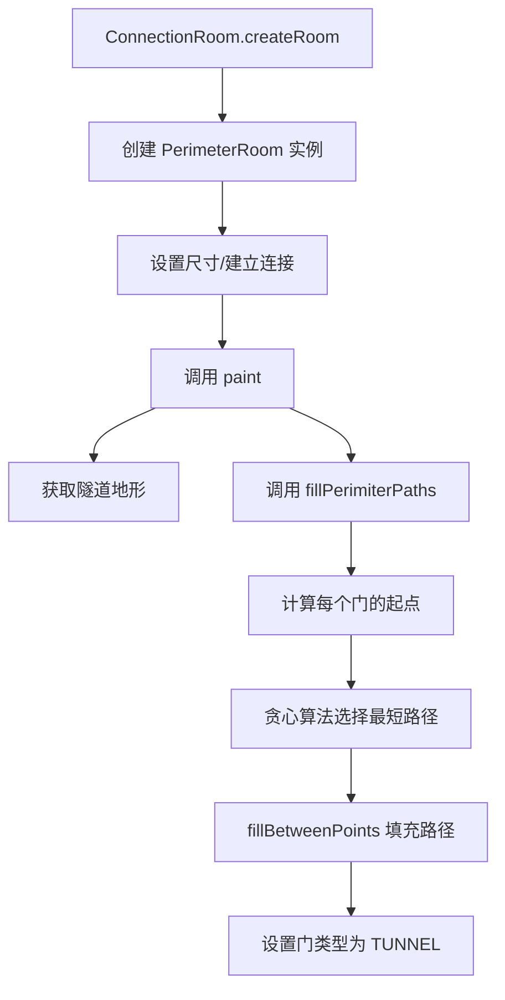

# PerimeterRoom 类文档

## 1. 基本信息

| 属性 | 值 |
|------|-----|
| **文件路径** | core/src/main/java/com/shatteredpixel/shatteredpixeldungeon/levels/rooms/connection/PerimeterRoom.java |
| **包名** | com.shatteredpixel.shatteredpixeldungeon.levels.rooms.connection |
| **文件类型** | class |
| **继承关系** | extends ConnectionRoom |
| **代码行数** | 171 行 |
| **所属模块** | core |

---

## 2. 文件职责说明

### 核心职责

PerimeterRoom 是一种**沿边缘路径的连接房间**，负责：

1. **沿边界绘制隧道**：在房间边缘区域绘制连接通道
2. **多门连接**：处理多个门之间的路径规划
3. **最短路径选择**：使用贪心算法选择最短路径连接各门

### 系统定位

PerimeterRoom 继承自 ConnectionRoom，是一种特殊的连接房间，其隧道沿着房间边缘（周长）绘制，而非穿过中心。这使其适合需要绕行或环形的场景。

### 不负责什么

- 不处理中心连接（由 TunnelRoom 处理）
- 不负责深渊地形（由 BridgeRoom 和 WalkwayRoom 处理）

---

## 3. 结构总览

### 主要成员概览

**公共方法**：
- `paint(Level)`：绘制房间

**公共静态方法**：
- `fillPerimiterPaths(Level, Room, int)`：填充边缘路径（供子类复用）

**私有静态方法**：
- `spaceBetween(int, int)`：计算两点间的空间距离
- `distanceBetweenPoints(Room, Point, Point)`：计算路径距离
- `fillBetweenPoints(Level, Room, Point, Point, int)`：填充两点间路径

**私有静态字段**：
- `corners`：房间四个角的缓存

### 主要逻辑块概览

1. **路径规划**：使用贪心算法规划连接所有门的最短路径
2. **路径绘制**：沿房间边缘绘制隧道
3. **角落处理**：处理相邻边和对边门之间的连接

### 生命周期/调用时机

由 `ConnectionRoom.createRoom()` 根据深度权重随机创建，在关卡生成阶段调用 `paint()` 方法绘制。

---

## 4. 继承与协作关系

### 父类提供的能力

**继承自 ConnectionRoom**：
- 尺寸约束：3x3 到 10x10
- 连接约束：至少 2 个连接
- 工厂方法支持

**继承自 Room**：
- 空间属性和方法
- 连接管理机制
- 绘制接口

### 覆写的方法

| 方法 | 父类实现 | 本类实现 |
|------|---------|---------|
| `paint(Level)` | 抽象方法 | 沿边缘绘制隧道 |

### 依赖的关键类

| 类 | 用途 |
|-----|------|
| `com.shatteredpixel.shatteredpixeldungeon.levels.Level` | 关卡类 |
| `com.shatteredpixel.shatteredpixeldungeon.levels.painters.Painter` | 绘制工具 |
| `com.shatteredpixel.shatteredpixeldungeon.levels.rooms.Room` | 房间基类 |
| `com.watabou.utils.Point` | 点坐标 |
| `com.watabou.utils.Rect` | 矩形区域 |

### 使用者

- `ConnectionRoom.createRoom()`：通过反射创建实例
- `WalkwayRoom`：继承此类并复用 `fillPerimiterPaths` 方法

---

## 5. 字段/常量详解

### 私有静态字段

| 字段名 | 类型 | 说明 |
|--------|------|------|
| `corners` | Point[] | 房间四个角点的缓存，用于路径计算 |

---

## 6. 构造与初始化机制

### 构造器

使用默认构造器（隐式继承自 ConnectionRoom）。

### 初始化块

无。

### 初始化注意事项

无特殊初始化逻辑。`corners` 字段在 `fillBetweenPoints` 方法中动态初始化。

---

## 7. 方法详解

### paint(Level level)

**可见性**：public

**是否覆写**：是，覆写自 Room.paint(Level)

**方法职责**：绘制沿边缘的隧道房间。

**参数**：
- `level` (Level)：关卡实例

**返回值**：无

**核心实现逻辑**：
```java
public void paint( Level level ) {
    int floor = level.tunnelTile();  // 获取隧道地形类型
    
    fillPerimiterPaths(level, this, floor);  // 填充边缘路径
    
    // 设置门类型
    for (Door door : connected.values()) {
        door.set( Door.Type.TUNNEL );
    }
}
```

---

### fillPerimiterPaths(Level l, Room r, int floor)

**可见性**：public static

**是否覆写**：否

**方法职责**：在房间边缘填充连接所有门的路径。

**参数**：
- `l` (Level)：关卡实例
- `r` (Room)：目标房间
- `floor` (int)：地形类型

**返回值**：无

**核心实现逻辑**：
```java
public static void fillPerimiterPaths( Level l, Room r, int floor ){
    corners = null;  // 重置角落缓存
    
    // 计算每个门的起始填充点（向内一格）
    ArrayList<Point> pointsToFill = new ArrayList<>();
    for (Point door : r.connected.values()) {
        Point p = new Point(door);
        if (p.y == r.top){
            p.y++;
        } else if (p.y == r.bottom) {
            p.y--;
        } else if (p.x == r.left){
            p.x++;
        } else {
            p.x--;
        }
        pointsToFill.add( p );
    }
    
    // 使用贪心算法连接所有点
    ArrayList<Point> pointsFilled = new ArrayList<>();
    pointsFilled.add(pointsToFill.remove(0));
    
    Point from = null, to = null;
    int shortestDistance;
    while(!pointsToFill.isEmpty()){
        shortestDistance = Integer.MAX_VALUE;
        // 找到最近的未连接点
        for (Point f : pointsFilled){
            for (Point t : pointsToFill){
                int dist = distanceBetweenPoints(r, f, t);
                if (dist < shortestDistance){
                    from = f;
                    to = t;
                    shortestDistance = dist;
                }
            }
        }
        fillBetweenPoints(l, r, from, to, floor);
        pointsFilled.add(to);
        pointsToFill.remove(to);
    }
}
```

**算法说明**：
1. 计算每个门的起始填充点（门位置向内一格）
2. 使用贪心算法：每次选择距离最近的两个点连接
3. 重复直到所有点都被连接

---

### spaceBetween(int a, int b)

**可见性**：private static

**是否覆写**：否

**方法职责**：计算两个坐标值之间的空间距离。

**参数**：
- `a` (int)：第一个坐标
- `b` (int)：第二个坐标

**返回值**：int，`|a - b| - 1`

**核心实现逻辑**：
```java
private static int spaceBetween(int a, int b){
    return Math.abs(a - b)-1;
}
```

---

### distanceBetweenPoints(Room r, Point a, Point b)

**可见性**：private static

**是否覆写**：否

**方法职责**：计算两点之间的路径距离（沿边缘）。

**参数**：
- `r` (Room)：房间实例
- `a` (Point)：第一个点
- `b` (Point)：第二个点

**返回值**：int，路径距离

**核心实现逻辑**：
```java
private static int distanceBetweenPoints(Room r, Point a, Point b){
    // 同一边：直接计算距离
    if (((a.x == r.left+1 || a.x == r.right-1) && a.y == b.y)
            || ((a.y == r.top+1 || a.y == r.bottom-1) && a.x == b.x)){
        return Math.max(spaceBetween(a.x, b.x), spaceBetween(a.y, b.y));
    }
    
    // 不同边：计算沿两条边的最短路径
    return
        Math.min(spaceBetween(r.left, a.x) + spaceBetween(r.left, b.x),
        spaceBetween(r.right, a.x) + spaceBetween(r.right, b.x))
        +
        Math.min(spaceBetween(r.top, a.y) + spaceBetween(r.top, b.y),
        spaceBetween(r.bottom, a.y) + spaceBetween(r.bottom, b.y))
        -
        1;  // 减去重叠部分
}
```

**算法说明**：
- 如果两点在同一边，直接计算距离
- 如果两点在不同边，计算沿左/右或上/下边缘的最短路径

---

### fillBetweenPoints(Level level, Room r, Point from, Point to, int floor)

**可见性**：private static

**是否覆写**：否

**方法职责**：填充两点之间的最短路径。

**参数**：
- `level` (Level)：关卡实例
- `r` (Room)：房间实例
- `from` (Point)：起点
- `to` (Point)：终点
- `floor` (int)：地形类型

**返回值**：无

**核心实现逻辑**：
```java
private static void fillBetweenPoints(Level level, Room r, Point from, Point to, int floor){
    // 情况1：两点在同一边
    if (((from.x == r.left+1 || from.x == r.right-1) && from.x == to.x)
            || ((from.y == r.top+1 || from.y == r.bottom-1) && from.y == to.y)){
        Painter.fill(level,
                Math.min(from.x, to.x),
                Math.min(from.y, to.y),
                spaceBetween(from.x, to.x) + 2,
                spaceBetween(from.y, to.y) + 2,
                floor);
        return;
    }
    
    // 初始化角落缓存
    if (corners == null){
        corners = new Point[4];
        corners[0] = new Point(r.left+1, r.top+1);
        corners[1] = new Point(r.right-1, r.top+1);
        corners[2] = new Point(r.right-1, r.bottom-1);
        corners[3] = new Point(r.left+1, r.bottom-1);
    }
    
    // 情况2：两点在相邻边
    for (Point c : corners){
        if ((c.x == from.x || c.y == from.y) && (c.x == to.x || c.y == to.y)){
            Painter.drawLine(level, from, c, floor);
            Painter.drawLine(level, c, to, floor);
            return;
        }
    }
    
    // 情况3：两点在对边
    Point side;
    if (from.y == r.top+1 || from.y == r.bottom-1){
        // 选择沿左或右边缘
        if (spaceBetween(r.left, from.x) + spaceBetween(r.left, to.x) <=
            spaceBetween(r.right, from.x) + spaceBetween(r.right, to.x)){
            side = new Point(r.left+1, r.top + r.height()/2);
        } else {
            side = new Point(r.right-1, r.top + r.height()/2);
        }
    } else {
        // 选择沿上或下边缘
        if (spaceBetween(r.top, from.y) + spaceBetween(r.top, to.y) <=
            spaceBetween(r.bottom, from.y) + spaceBetween(r.bottom, to.y)){
            side = new Point(r.left + r.width()/2, r.top+1);
        } else {
            side = new Point(r.left + r.width()/2, r.bottom-1);
        }
    }
    // 递归处理：分解为两段相邻边的情况
    fillBetweenPoints(level, r, from, side, floor);
    fillBetweenPoints(level, r, side, to, floor);
}
```

**算法说明**：
1. **同一边**：直接填充直线
2. **相邻边**：通过角落点连接
3. **对边**：选择较短的边缘路径，递归处理

---

## 8. 对外暴露能力

### 显式 API

- `paint(Level)`：绘制边缘隧道房间
- `fillPerimiterPaths(Level, Room, int)`：静态方法，供子类复用

### 内部辅助方法

- `spaceBetween()`：计算空间距离
- `distanceBetweenPoints()`：计算路径距离
- `fillBetweenPoints()`：填充路径

### 扩展入口

- `fillPerimiterPaths()` 是公共静态方法，可供其他类直接调用
- 子类可覆写 `paint()` 方法添加额外逻辑

---

## 9. 运行机制与调用链

### 创建时机

由 `ConnectionRoom.createRoom()` 根据深度权重随机创建。

### 调用者

- `LevelBuilder`：创建和管理房间
- `WalkwayRoom`：复用 `fillPerimiterPaths` 方法

### 被调用者

- `Level.tunnelTile()`：获取隧道地形类型
- `Painter.fill()`、`Painter.drawLine()`：绘制地形

### 系统流程位置



---

## 10. 资源、配置与国际化关联

### 引用的 messages 文案

无直接引用。

### 依赖的资源

无直接依赖资源文件。

### 中文翻译来源

不适用。

---

## 11. 使用示例

### 基本用法

```java
// PerimeterRoom 由工厂方法创建
ConnectionRoom room = ConnectionRoom.createRoom();  // 可能返回 PerimeterRoom

// 或直接创建
PerimeterRoom perimeter = new PerimeterRoom();
perimeter.setSize();
perimeter.connect(room1);
perimeter.connect(room2);
perimeter.connect(room3);  // 可以有多个门
perimeter.paint(level);
```

### 复用 fillPerimiterPaths 方法

```java
public class MyPerimeterRoom extends ConnectionRoom {
    @Override
    public void paint(Level level) {
        // 复用 PerimeterRoom 的路径填充逻辑
        PerimeterRoom.fillPerimiterPaths(level, this, Terrain.EMPTY);
        
        // 添加自定义处理
        for (Door door : connected.values()) {
            door.set(Door.Type.HIDDEN);
        }
    }
}
```

---

## 12. 开发注意事项

### 状态依赖

- 依赖 `connected` 集合已正确填充
- `corners` 缓存在方法调用间共享

### 生命周期耦合

- 必须在连接建立后调用 `paint()`
- `fillPerimiterPaths` 会重置 `corners` 缓存

### 常见陷阱

1. **角落缓存**：`corners` 是静态字段，在多次调用间共享，需要在使用前重置
2. **递归调用**：`fillBetweenPoints` 在对边情况下会递归调用自身
3. **贪心算法局限性**：不保证全局最优解，但实际效果足够好

---

## 13. 修改建议与扩展点

### 适合扩展的位置

1. **覆写 `paint()`**：在边缘路径基础上添加装饰
2. **复用 `fillPerimiterPaths`**：子类可直接调用此方法

### 不建议修改的位置

- `distanceBetweenPoints` 的距离计算逻辑
- `fillBetweenPoints` 的路径填充逻辑

### 重构建议

1. **角落缓存**：考虑将 `corners` 改为局部变量，避免静态状态
2. **算法优化**：可考虑使用 Prim 或 Kruskal 算法求最小生成树

---

## 14. 事实核查清单

- [x] 是否已覆盖全部字段
- [x] 是否已覆盖全部方法
- [x] 是否已检查继承链与覆写关系
- [x] 是否已核对官方中文翻译（不适用）
- [x] 是否存在任何推测性表述
- [x] 示例代码是否真实可用
- [x] 是否遗漏资源/配置/本地化关联
- [x] 是否明确说明了注意事项与扩展点