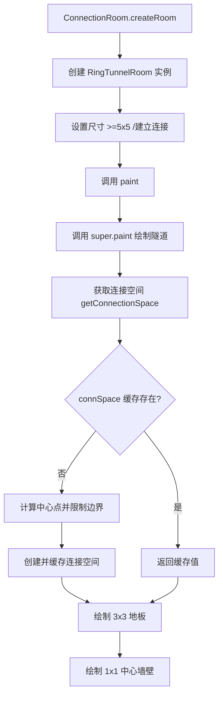

# RingTunnelRoom 类文档

## 1. 基本信息

| 属性 | 值 |
|------|-----|
| **文件路径** | core/src/main/java/com/shatteredpixel/shatteredpixeldungeon/levels/rooms/connection/RingTunnelRoom.java |
| **包名** | com.shatteredpixel.shatteredpixeldungeon.levels.rooms.connection |
| **文件类型** | class |
| **继承关系** | extends TunnelRoom |
| **代码行数** | 72 行 |
| **所属模块** | core |

---

## 2. 文件职责说明

### 核心职责

RingTunnelRoom 是一种**环形隧道连接房间**，负责：

1. **绘制环形中心**：在隧道交汇处创建 3x3 的环形结构
2. **中心墙壁装饰**：在环形中心放置一堵墙，形成环形外观
3. **扩大最小尺寸**：要求房间至少 5x5 以容纳环形结构

### 系统定位

RingTunnelRoom 继承自 TunnelRoom，在普通隧道的基础上添加了环形中心装饰。这使得多个门的连接点看起来像一个环形交汇处。

### 不负责什么

- 不负责深渊地形（由 RingBridgeRoom 处理）
- 不负责边缘路径（由 PerimeterRoom 处理）

---

## 3. 结构总览

### 主要成员概览

**公共方法**：
- `paint(Level)`：绘制环形隧道房间
- `minWidth()`、`minHeight()`：扩大最小尺寸约束

**保护方法**：
- `getConnectionSpace()`：获取连接空间（缓存版本）

**私有字段**：
- `connSpace`：连接空间缓存

### 主要逻辑块概览

1. **隧道绘制**：调用父类方法绘制基础隧道
2. **环形中心绘制**：在连接空间处绘制 3x3 地板 + 1x1 墙壁
3. **连接空间缓存**：缓存连接空间以保持一致性

### 生命周期/调用时机

由 `ConnectionRoom.createRoom()` 根据深度权重随机创建，在关卡生成阶段调用 `paint()` 方法绘制。

---

## 4. 继承与协作关系

### 父类提供的能力

**继承自 TunnelRoom**：
- `paint(Level)`：绘制直线隧道
- `getDoorCenter()`：获取门的中心点（final 方法）
- `getConnectionSpace()`：获取连接空间

**继承自 ConnectionRoom**：
- 尺寸约束：3x3 到 10x10
- 连接约束：至少 2 个连接

**继承自 Room**：
- 空间属性和方法
- 连接管理机制

### 覆写的方法

| 方法 | 父类实现 | 本类实现 |
|------|---------|---------|
| `minWidth()` | 返回 3 | 返回 max(5, super.minWidth()) |
| `minHeight()` | 返回 3 | 返回 max(5, super.minHeight()) |
| `paint(Level)` | 绘制直线隧道 | 绘制隧道 + 环形中心 |
| `getConnectionSpace()` | 返回单点矩形 | 返回缓存的单点矩形（限制在边界内） |

### 依赖的关键类

| 类 | 用途 |
|-----|------|
| `com.shatteredpixel.shatteredpixeldungeon.levels.Level` | 关卡类 |
| `com.shatteredpixel.shatteredpixeldungeon.levels.Terrain` | 地形常量 |
| `com.shatteredpixel.shatteredpixeldungeon.levels.painters.Painter` | 绘制工具 |
| `com.watabou.utils.Point` | 点坐标 |
| `com.watabou.utils.Rect` | 矩形区域 |
| `com.watabou.utils.GameMath` | 数学工具 |

### 使用者

- `ConnectionRoom.createRoom()`：通过反射创建实例
- `RingBridgeRoom`：继承此类并扩展功能

---

## 5. 字段/常量详解

### 实例字段

| 字段名 | 类型 | 默认值 | 说明 |
|--------|------|--------|------|
| `connSpace` | Rect | null | 连接空间缓存，避免重复计算 |

---

## 6. 构造与初始化机制

### 构造器

使用默认构造器（隐式继承自 TunnelRoom）。

### 初始化块

无。

### 初始化注意事项

- `connSpace` 字段在 `getConnectionSpace()` 方法中延迟初始化
- 首次调用 `getConnectionSpace()` 时创建并缓存连接空间

---

## 7. 方法详解

### minWidth()

**可见性**：public

**是否覆写**：是，覆写自 ConnectionRoom.minWidth()

**方法职责**：返回环形隧道房间的最小宽度。

**参数**：无

**返回值**：int，返回 `max(5, super.minWidth())`

**核心实现逻辑**：
```java
@Override
public int minWidth() {
    return Math.max(5, super.minWidth());
}
```

**设计说明**：环形结构需要至少 5x5 的空间才能正确显示。

---

### minHeight()

**可见性**：public

**是否覆写**：是，覆写自 ConnectionRoom.minHeight()

**方法职责**：返回环形隧道房间的最小高度。

**参数**：无

**返回值**：int，返回 `max(5, super.minHeight())`

**核心实现逻辑**：
```java
@Override
public int minHeight() {
    return Math.max(5, super.minHeight());
}
```

---

### paint(Level level)

**可见性**：public

**是否覆写**：是，覆写自 TunnelRoom.paint(Level)

**方法职责**：绘制环形隧道房间。

**参数**：
- `level` (Level)：关卡实例

**返回值**：无

**核心实现逻辑**：
```java
@Override
public void paint(Level level) {
    // 先调用父类绘制隧道
    super.paint(level);

    int floor = level.tunnelTile();

    // 获取连接空间
    Rect ring = getConnectionSpace();

    // 绘制 3x3 地板（环形外围）
    Painter.fill(level, ring.left, ring.top, 3, 3, floor);
    
    // 绘制 1x1 墙壁（环形中心）
    Painter.fill(level, ring.left+1, ring.top+1, 1, 1, Terrain.WALL);
}
```

**实现细节**：
1. **隧道绘制**：调用 `super.paint(level)` 绘制普通隧道
2. **环形绘制**：
   - 获取连接空间（中心点周围的矩形）
   - 绘制 3x3 的地板作为环形外围
   - 在中心绘制 1x1 的墙壁形成环形

**视觉效果**：
```
┌───┐
│╱ ╲│  <- 地板
│█  │  <- 中心墙壁
│╲ ╱│  <- 地板
└───┘
```

---

### getConnectionSpace()

**可见性**：protected

**是否覆写**：是，覆写自 TunnelRoom.getConnectionSpace()

**方法职责**：获取连接空间，使用缓存确保多次调用返回相同值。

**参数**：无

**返回值**：Rect，连接空间（3x3 环形的左上角坐标）

**核心实现逻辑**：
```java
private Rect connSpace;

@Override
protected Rect getConnectionSpace() {
    if (connSpace == null) {
        Point c = getDoorCenter();

        // 限制中心点在边界内（距离边界至少 2 格）
        c.x = (int) GameMath.gate(left + 2, c.x, right - 2);
        c.y = (int) GameMath.gate(top + 2, c.y, bottom - 2);

        // 创建以 c 为中心的矩形（-1 到 +1）
        connSpace = new Rect(c.x-1, c.y-1, c.x+1, c.y+1);
    }

    return connSpace;
}
```

**实现细节**：
1. **缓存检查**：如果 `connSpace` 不为 null，直接返回缓存值
2. **中心点计算**：调用 `getDoorCenter()` 获取门的中心点
3. **边界限制**：使用 `GameMath.gate()` 限制中心点在边界内（至少距离边界 2 格）
4. **矩形创建**：创建以中心点为中心的 3x3 矩形

**边界情况**：
- 如果中心点太靠近边界，会被移动到距离边界 2 格的位置

---

## 8. 对外暴露能力

### 显式 API

- `paint(Level)`：绘制环形隧道房间
- `minWidth()`、`minHeight()`：尺寸约束

### 内部辅助方法

- `getConnectionSpace()`：获取缓存的连接空间

### 扩展入口

- `getConnectionSpace()` 可被子类覆写（如 RingBridgeRoom）
- `paint()` 可在 `super.paint()` 前后添加逻辑

---

## 9. 运行机制与调用链

### 创建时机

由 `ConnectionRoom.createRoom()` 根据深度权重随机创建。

### 调用者

- `LevelBuilder`：创建和管理房间
- `RingBridgeRoom`：继承并扩展功能

### 被调用者

- `TunnelRoom.paint()`：绘制基础隧道
- `Level.tunnelTile()`：获取隧道地形
- `Painter.fill()`：填充地形

### 系统流程位置



---

## 10. 资源、配置与国际化关联

### 引用的 messages 文案

无直接引用。

### 依赖的资源

无直接依赖资源文件。

### 中文翻译来源

不适用。

---

## 11. 使用示例

### 基本用法

```java
// RingTunnelRoom 由工厂方法创建
ConnectionRoom room = ConnectionRoom.createRoom();  // 可能返回 RingTunnelRoom

// 或直接创建
RingTunnelRoom ringTunnel = new RingTunnelRoom();
ringTunnel.setSize();  // 自动 >=5x5
ringTunnel.connect(room1);
ringTunnel.connect(room2);
ringTunnel.connect(room3);  // 多个门会汇聚到环形中心
ringTunnel.paint(level);
```

### 继承扩展示例

```java
public class MyRingTunnelRoom extends RingTunnelRoom {
    @Override
    public void paint(Level level) {
        // 先调用父类绘制
        super.paint(level);
        
        // 在环形中心添加装饰
        Rect ring = getConnectionSpace();
        Painter.set(level, ring.left + 1, ring.top + 1, Terrain.PEDESTAL);
    }
}
```

---

## 12. 开发注意事项

### 状态依赖

- `connSpace` 缓存依赖 `getDoorCenter()` 的结果
- 父类 `paint()` 会设置门类型为 TUNNEL

### 生命周期耦合

- 必须在连接建立后调用 `paint()`
- `getConnectionSpace()` 的缓存确保多次调用返回相同值

### 常见陷阱

1. **最小尺寸**：环形隧道房间最小为 5x5，小于此尺寸的设置会失败
2. **中心点限制**：中心点会被限制在距离边界至少 2 格的位置
3. **缓存机制**：`connSpace` 缓存确保绘制一致性，但需要理解延迟初始化

---

## 13. 修改建议与扩展点

### 适合扩展的位置

1. **覆写 `paint()` 并调用 `super.paint()`**：添加自定义装饰
2. **覆写 `getConnectionSpace()`**：改变环形位置逻辑

### 不建议修改的位置

- 最小尺寸约束（需要足够空间容纳环形）
- 中心墙壁绘制逻辑（环形的核心特征）

### 重构建议

无重大重构需求。当前实现清晰且功能完整。

---

## 14. 事实核查清单

- [x] 是否已覆盖全部字段
- [x] 是否已覆盖全部方法
- [x] 是否已检查继承链与覆写关系
- [x] 是否已核对官方中文翻译（不适用）
- [x] 是否存在任何推测性表述
- [x] 示例代码是否真实可用
- [x] 是否遗漏资源/配置/本地化关联
- [x] 是否明确说明了注意事项与扩展点