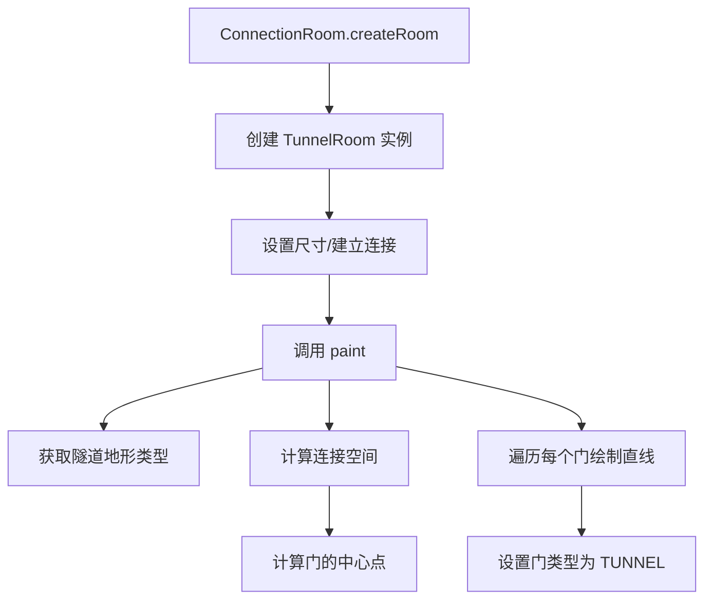

# TunnelRoom 类文档

## 1. 基本信息

| 属性 | 值 |
|------|-----|
| **文件路径** | core/src/main/java/com/shatteredpixel/shatteredpixeldungeon/levels/rooms/connection/TunnelRoom.java |
| **包名** | com.shatteredpixel.shatteredpixeldungeon.levels.rooms.connection |
| **文件类型** | class |
| **继承关系** | extends ConnectionRoom |
| **代码行数** | 123 行 |
| **所属模块** | core |

---

## 2. 文件职责说明

### 核心职责

TunnelRoom 是一种**隧道型连接房间**，负责：

1. **绘制直线路径**：从每个门向房间中心绘制直线隧道
2. **中心连接点计算**：计算所有门的等距中心点作为路径交汇处
3. **大房间优化**：在较大房间中随机填充对角线瓷砖，增加视觉多样性

### 系统定位

TunnelRoom 是 ConnectionRoom 的具体实现之一，是最基础的连接房间类型。它通过直线隧道连接各个门，形成星形或十字形的路径结构。

### 不负责什么

- 不处理特殊地形（如深渊、水等）
- 不负责复杂的路径规划（由 PerimeterRoom 处理）

---

## 3. 结构总览

### 主要成员概览

**公共方法**：
- `paint(Level)`：绘制房间

**保护方法**：
- `getConnectionSpace()`：获取连接空间（路径交汇区域）
- `getDoorCenter()`：获取门的等距中心点

### 主要逻辑块概览

1. **隧道绘制**：从每个门向中心绘制两段直线
2. **中心计算**：计算所有门的几何中心作为交汇点
3. **大房间优化**：在大型房间中添加随机对角线填充

### 生命周期/调用时机

由 LevelBuilder 在关卡生成阶段创建，调用 `paint()` 方法绘制房间内容。

---

## 4. 继承与协作关系

### 父类提供的能力

**继承自 ConnectionRoom**：
- 尺寸约束：3x3 到 10x10
- 连接约束：至少 2 个连接
- 工厂方法支持

**继承自 Room**：
- 空间属性和方法
- 连接管理机制
- 绘制接口

### 覆写的方法

| 方法 | 父类实现 | 本类实现 |
|------|---------|---------|
| `paint(Level)` | 抽象方法 | 绘制直线隧道 |

### 依赖的关键类

| 类 | 用途 |
|-----|------|
| `com.shatteredpixel.shatteredpixeldungeon.levels.Level` | 关卡类，提供地图和绘制目标 |
| `com.shatteredpixel.shatteredpixeldungeon.levels.painters.Painter` | 绘制工具类 |
| `com.watabou.utils.Point` | 点坐标 |
| `com.watabou.utils.Rect` | 矩形区域 |
| `com.watabou.utils.PointF` | 浮点点坐标（用于中心计算） |
| `com.watabou.utils.GameMath` | 数学工具（gate 方法用于限制范围） |
| `com.watabou.utils.Random` | 随机数生成 |
| `com.watabou.utils.PathFinder` | 路径查找常量 |

### 使用者

- `ConnectionRoom.createRoom()`：通过反射创建实例
- `BridgeRoom`、`RingTunnelRoom`：继承此类并扩展功能

---

## 5. 字段/常量详解

### 实例字段

无。所有状态继承自父类。

---

## 6. 构造与初始化机制

### 构造器

使用默认构造器（隐式继承自 ConnectionRoom）。

### 初始化块

无。

### 初始化注意事项

无特殊初始化逻辑。

---

## 7. 方法详解

### paint(Level level)

**可见性**：public

**是否覆写**：是，覆写自 Room.paint(Level)

**方法职责**：绘制隧道房间，从每个门向中心绘制直线隧道。

**参数**：
- `level` (Level)：关卡实例

**返回值**：无

**核心实现逻辑**：
```java
public void paint(Level level) {
    int floor = level.tunnelTile();  // 获取隧道地形类型
    Rect c = getConnectionSpace();    // 获取中心区域
    
    for (Door door : connected.values()) {
        // 计算起点（门向内一格）
        Point start = new Point(door);
        if (start.x == left)        start.x++;
        else if (start.y == top)    start.y++;
        else if (start.x == right)  start.x--;
        else if (start.y == bottom) start.y--;
        
        // 计算偏移量
        int rightShift, downShift;
        if (start.x < c.left)       rightShift = c.left - start.x;
        else if (start.x > c.right) rightShift = c.right - start.x;
        else                        rightShift = 0;
        // ... 类似处理 downShift
        
        // 先向内走，再向中心走
        if (door.x == left || door.x == right){
            mid = new Point(start.x + rightShift, start.y);
            end = new Point(mid.x, mid.y + downShift);
        } else {
            mid = new Point(start.x, start.y + downShift);
            end = new Point(mid.x + rightShift, mid.y);
        }
        
        Painter.drawLine(level, start, mid, floor);
        Painter.drawLine(level, mid, end, floor);
    }
    
    // 大房间优化：添加随机对角线填充
    if (width() >= 7 && height() >= 7 && connected.size() >= 4 && c.square() == 0){
        // ...
    }
    
    // 设置门类型
    for (Door door : connected.values()) {
        door.set(Door.Type.TUNNEL);
    }
}
```

**实现细节**：
1. 获取隧道地形类型（`level.tunnelTile()`）
2. 计算连接空间（中心点）
3. 对每个门：
   - 计算起点（门位置向内一格）
   - 计算到中心需要的偏移
   - 先向内绘制一段直线
   - 再向中心绘制一段直线
4. 对于大型房间（>=7x7）且连接数>=4的情况，随机添加对角线填充
5. 将所有门设置为 TUNNEL 类型

**边界情况**：
- 门位于左边界：向右移动起点
- 门位于右边界：向左移动起点
- 门位于上边界：向下移动起点
- 门位于下边界：向上移动起点

---

### getConnectionSpace()

**可见性**：protected

**是否覆写**：否（子类 RingTunnelRoom 覆写）

**方法职责**：返回所有门必须连接的空间区域。

**参数**：无

**返回值**：Rect，连接空间（默认为单个中心点）

**核心实现逻辑**：
```java
protected Rect getConnectionSpace(){
    Point c = getDoorCenter();
    return new Rect(c.x, c.y, c.x, c.y);
}
```

**设计说明**：返回一个单点的矩形，表示路径交汇点。

---

### getDoorCenter()

**可见性**：protected final

**是否覆写**：否（final 方法，不可覆写）

**方法职责**：计算所有门的等距中心点。

**参数**：无

**返回值**：Point，所有门的几何中心

**核心实现逻辑**：
```java
protected final Point getDoorCenter(){
    PointF doorCenter = new PointF(0, 0);
    
    // 计算所有门坐标的平均值
    for (Door door : connected.values()) {
        doorCenter.x += door.x;
        doorCenter.y += door.y;
    }
    
    // 整数化中心点，带随机偏移
    Point c = new Point(
        (int)doorCenter.x / connected.size(), 
        (int)doorCenter.y / connected.size()
    );
    if (Random.Float() < doorCenter.x % 1) c.x++;
    if (Random.Float() < doorCenter.y % 1) c.y++;
    
    // 限制在房间边界内
    c.x = (int)GameMath.gate(left+1, c.x, right-1);
    c.y = (int)GameMath.gate(top+1, c.y, bottom-1);
    
    return c;
}
```

**实现细节**：
1. 使用 `PointF` 累加所有门的坐标
2. 计算平均值得到浮点中心
3. 转换为整数坐标，小数部分用于随机偏移
4. 使用 `GameMath.gate()` 限制坐标在房间边界内

**边界情况**：
- 中心点不能在房间边界上（必须 left+1 到 right-1，top+1 到 bottom-1）

---

## 8. 对外暴露能力

### 显式 API

- `paint(Level)`：绘制隧道房间

### 内部辅助方法

- `getConnectionSpace()`：获取连接空间
- `getDoorCenter()`：获取门的中心点

### 扩展入口

- `getConnectionSpace()`：子类可覆写以改变连接空间大小
- `paint()` 的调用顺序提供了扩展点（子类可在 super.paint() 前后添加逻辑）

---

## 9. 运行机制与调用链

### 创建时机

由 `ConnectionRoom.createRoom()` 根据深度权重随机创建。

### 调用者

- `LevelBuilder`：创建和管理房间
- `BridgeRoom`、`RingTunnelRoom`：继承并扩展功能

### 被调用者

- `Level.tunnelTile()`：获取隧道地形类型
- `Painter.drawLine()`：绘制直线
- `Painter.set()`：设置单个格子

### 系统流程位置



---

## 10. 资源、配置与国际化关联

### 引用的 messages 文案

无直接引用。

### 依赖的资源

无直接依赖资源文件。

### 中文翻译来源

不适用。

---

## 11. 使用示例

### 基本用法

```java
// TunnelRoom 由工厂方法创建
ConnectionRoom room = ConnectionRoom.createRoom();  // 可能返回 TunnelRoom

// 或直接创建
TunnelRoom tunnel = new TunnelRoom();
tunnel.setSize();
tunnel.connect(room1);
tunnel.connect(room2);
tunnel.paint(level);
```

### 继承扩展示例

```java
public class MyTunnelRoom extends TunnelRoom {
    @Override
    public void paint(Level level) {
        // 先调用父类绘制
        super.paint(level);
        
        // 添加自定义装饰
        Point center = getDoorCenter();
        Painter.set(level, center, Terrain.PEDESTAL);
    }
    
    @Override
    protected Rect getConnectionSpace() {
        // 扩大连接空间
        Point c = getDoorCenter();
        return new Rect(c.x - 1, c.y - 1, c.x + 1, c.y + 1);
    }
}
```

---

## 12. 开发注意事项

### 状态依赖

- 依赖 `connected` 集合已正确填充
- 依赖房间边界已正确设置

### 生命周期耦合

- 必须在连接建立后调用 `paint()`
- `getDoorCenter()` 依赖 `connected` 集合

### 常见陷阱

1. **路径绘制顺序**：先向内再向中心，顺序影响最终形状
2. **大房间对角填充**：仅在特定条件下触发（>=7x7 且 >=4 连接）
3. **门类型设置**：所有门都设置为 TUNNEL 类型

---

## 13. 修改建议与扩展点

### 适合扩展的位置

1. **覆写 `getConnectionSpace()`**：改变路径交汇区域大小
2. **覆写 `paint()` 并调用 `super.paint()`**：在基础隧道上添加装饰

### 不建议修改的位置

- `getDoorCenter()` 是 final 方法，设计上不允许修改
- 路径绘制逻辑（start -> mid -> end 的顺序）

### 重构建议

无重大重构需求。当前实现清晰且功能完整。

---

## 14. 事实核查清单

- [x] 是否已覆盖全部字段
- [x] 是否已覆盖全部方法
- [x] 是否已检查继承链与覆写关系
- [x] 是否已核对官方中文翻译（不适用）
- [x] 是否存在任何推测性表述
- [x] 示例代码是否真实可用
- [x] 是否遗漏资源/配置/本地化关联
- [x] 是否明确说明了注意事项与扩展点