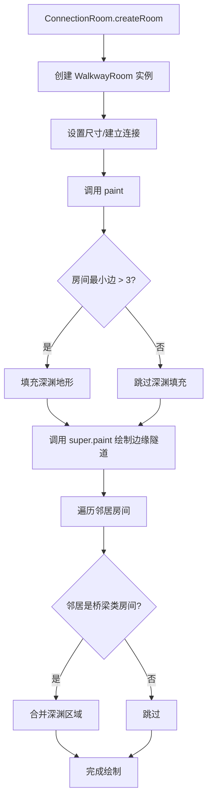

# WalkwayRoom 类文档

## 1. 基本信息

| 属性 | 值 |
|------|-----|
| **文件路径** | core/src/main/java/com/shatteredpixel/shatteredpixeldungeon/levels/rooms/connection/WalkwayRoom.java |
| **包名** | com.shatteredpixel.shatteredpixeldungeon.levels.rooms.connection |
| **文件类型** | class |
| **继承关系** | extends PerimeterRoom |
| **代码行数** | 61 行 |
| **所属模块** | core |

---

## 2. 文件职责说明

### 核心职责

WalkwayRoom 是一种**走道型连接房间**，负责：

1. **创建走道通道**：在深渊地形上沿边缘绘制走道
2. **邻居深渊合并**：与相邻的桥梁类房间合并深渊区域
3. **边缘路径复用**：继承 PerimeterRoom 的边缘路径算法

### 系统定位

WalkwayRoom 继承自 PerimeterRoom，是带有深渊地形的边缘隧道房间。它在边缘隧道的基础上添加了深渊背景，使走道看起来像环绕深渊的栈道。

### 不负责什么

- 不负责深渊的掉落逻辑（由游戏机制处理）
- 不负责中心连接（由 TunnelRoom 处理）

---

## 3. 结构总览

### 主要成员概览

**公共方法**：
- `paint(Level)`：绘制走道房间
- `canMerge(Level, Room, Point, int)`：检查是否可以合并

### 主要逻辑块概览

1. **深渊填充**：如果房间足够大，填充深渊地形
2. **边缘隧道绘制**：调用父类方法绘制边缘隧道
3. **邻居合并**：与相邻的桥梁类房间合并深渊区域

### 生命周期/调用时机

由 `ConnectionRoom.createRoom()` 根据深度权重随机创建，在关卡生成阶段调用 `paint()` 方法绘制。

---

## 4. 继承与协作关系

### 父类提供的能力

**继承自 PerimeterRoom**：
- `paint(Level)`：绘制边缘隧道
- `fillPerimiterPaths(Level, Room, int)`：填充边缘路径

**继承自 ConnectionRoom**：
- 尺寸约束：3x3 到 10x10
- 连接约束：至少 2 个连接

**继承自 Room**：
- 空间属性和方法
- 连接管理机制

### 覆写的方法

| 方法 | 父类实现 | 本类实现 |
|------|---------|---------|
| `paint(Level)` | 沿边缘绘制隧道 | 先填充深渊，再绘制边缘隧道，最后合并邻居 |
| `canMerge(Level, Room, Point, int)` | 返回 false | 当合并地形为 CHASM 时返回 true |

### 依赖的关键类

| 类 | 用途 |
|-----|------|
| `com.shatteredpixel.shatteredpixeldungeon.levels.Level` | 关卡类 |
| `com.shatteredpixel.shatteredpixeldungeon.levels.Terrain` | 地形常量 |
| `com.shatteredpixel.shatteredpixeldungeon.levels.painters.Painter` | 绘制工具 |
| `com.shatteredpixel.shatteredpixeldungeon.levels.rooms.Room` | 房间基类 |
| `com.watabou.utils.Point` | 点坐标 |
| `com.watabou.utils.Rect` | 矩形区域 |

### 使用者

- `ConnectionRoom.createRoom()`：通过反射创建实例

---

## 5. 字段/常量详解

### 实例字段

无。所有状态继承自父类。

---

## 6. 构造与初始化机制

### 构造器

使用默认构造器（隐式继承自 PerimeterRoom）。

### 初始化块

无。

### 初始化注意事项

无特殊初始化逻辑。

---

## 7. 方法详解

### paint(Level level)

**可见性**：public

**是否覆写**：是，覆写自 PerimeterRoom.paint(Level)

**方法职责**：绘制走道房间，在深渊背景上绘制边缘隧道。

**参数**：
- `level` (Level)：关卡实例

**返回值**：无

**核心实现逻辑**：
```java
@Override
public void paint(Level level) {
    // 如果房间足够大（最小边 > 3），填充深渊
    if (Math.min(width(), height()) > 3) {
        Painter.fill(level, this, 1, Terrain.CHASM);
    }
    
    // 调用父类方法绘制边缘隧道
    super.paint(level);
    
    // 与相邻的桥梁类房间合并深渊区域
    for (Room r : neigbours){
        if (r instanceof BridgeRoom || r instanceof RingBridgeRoom || r instanceof WalkwayRoom){
            Rect i = intersect(r);
            // 调整合并区域（避免角落）
            if (i.width() != 0){
                i.left++;
                i.right--;
            } else {
                i.top++;
                i.bottom--;
            }
            Painter.fill(level, i.left, i.top, i.width()+1, i.height()+1, Terrain.CHASM);
        }
    }
}
```

**实现细节**：
1. **深渊填充**：仅当房间最小边 > 3 时填充深渊
2. **边缘隧道绘制**：调用 `super.paint(level)` 绘制边缘隧道
3. **邻居合并**：
   - 遍历所有邻居房间
   - 如果邻居是 BridgeRoom、RingBridgeRoom 或 WalkwayRoom
   - 计算交集区域并调整（排除角落）
   - 填充深渊地形

**边界情况**：
- 小房间（<=3x3）不会填充深渊，只绘制普通边缘隧道

---

### canMerge(Level l, Room other, Point p, int mergeTerrain)

**可见性**：public

**是否覆写**：是，覆写自 Room.canMerge(Level, Room, Point, int)

**方法职责**：检查是否可以与另一个房间合并。

**参数**：
- `l` (Level)：关卡实例
- `other` (Room)：目标房间
- `p` (Point)：合并点
- `mergeTerrain` (int)：合并地形类型

**返回值**：boolean，当合并地形为 CHASM 时返回 true，否则返回 false

**核心实现逻辑**：
```java
@Override
public boolean canMerge(Level l, Room other, Point p, int mergeTerrain) {
    return mergeTerrain == Terrain.CHASM;
}
```

**设计说明**：WalkwayRoom 只允许与深渊地形合并，确保相邻桥梁房间的深渊区域可以正确连接。

---

## 8. 对外暴露能力

### 显式 API

- `paint(Level)`：绘制走道房间
- `canMerge(Level, Room, Point, int)`：合并检查

### 内部辅助方法

无。继承自 PerimeterRoom 的 `fillPerimiterPaths` 方法。

### 扩展入口

- 可覆写 `canMerge()` 改变合并规则
- 可覆写 `paint()` 并调用 `super.paint()` 添加额外逻辑

---

## 9. 运行机制与调用链

### 创建时机

由 `ConnectionRoom.createRoom()` 根据深度权重随机创建。

### 调用者

- `LevelBuilder`：创建和管理房间

### 被调用者

- `PerimeterRoom.paint()`：绘制边缘隧道
- `Painter.fill()`：填充地形
- `Terrain.CHASM`：深渊地形常量

### 系统流程位置



---

## 10. 资源、配置与国际化关联

### 引用的 messages 文案

无直接引用。

### 依赖的资源

无直接依赖资源文件。

### 中文翻译来源

不适用。

---

## 11. 使用示例

### 基本用法

```java
// WalkwayRoom 由工厂方法创建
ConnectionRoom room = ConnectionRoom.createRoom();  // 可能返回 WalkwayRoom

// 或直接创建
WalkwayRoom walkway = new WalkwayRoom();
walkway.setSize();
walkway.connect(room1);
walkway.connect(room2);
walkway.connect(room3);  // 可以有多个门，沿边缘连接
walkway.paint(level);
```

### 继承扩展示例

```java
public class MyWalkwayRoom extends WalkwayRoom {
    @Override
    public void paint(Level level) {
        // 先调用父类绘制
        super.paint(level);
        
        // 添加自定义装饰（如栏杆）
        // 沿边缘添加装饰...
    }
}
```

---

## 12. 开发注意事项

### 状态依赖

- 依赖 `neigbours` 集合已正确填充
- 依赖房间边界已正确设置

### 生命周期耦合

- 必须在连接和邻居关系建立后调用 `paint()`
- 深渊合并依赖邻居房间的类型判断

### 常见陷阱

1. **小房间处理**：<=3x3 的房间不会填充深渊，仅绘制普通边缘隧道
2. **邻居类型判断**：只与特定类型（BridgeRoom、RingBridgeRoom、WalkwayRoom）合并深渊
3. **边缘路径 vs 中心路径**：WalkwayRoom 使用边缘路径，BridgeRoom 使用中心路径

---

## 13. 修改建议与扩展点

### 适合扩展的位置

1. **覆写 `paint()` 并调用 `super.paint()`**：添加自定义装饰
2. **覆写 `canMerge()`**：改变合并规则

### 不建议修改的位置

- 深渊填充条件
- 邻居类型判断逻辑

### 重构建议

无重大重构需求。当前实现清晰且功能完整。

---

## 14. 事实核查清单

- [x] 是否已覆盖全部字段
- [x] 是否已覆盖全部方法
- [x] 是否已检查继承链与覆写关系
- [x] 是否已核对官方中文翻译（不适用）
- [x] 是否存在任何推测性表述
- [x] 示例代码是否真实可用
- [x] 是否遗漏资源/配置/本地化关联
- [x] 是否明确说明了注意事项与扩展点