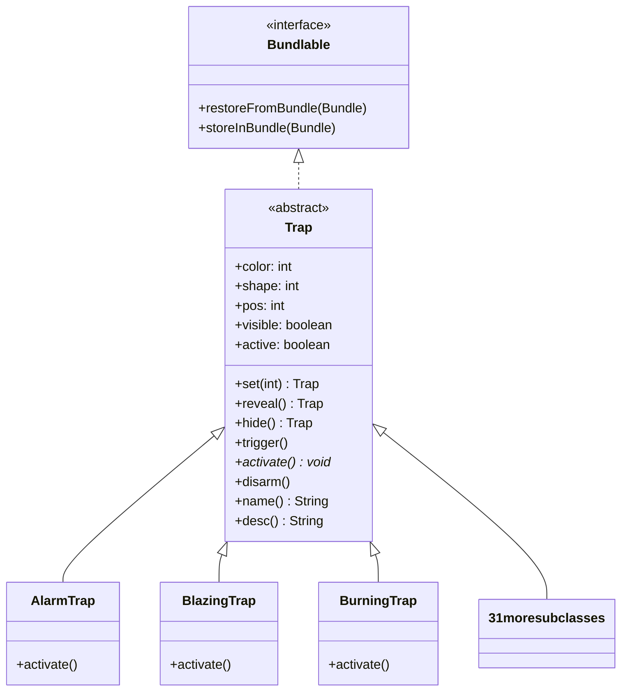

# Trap 文档

## 1. 基本信息

| 属性 | 值 |
|------|-----|
| **文件路径** | core/src/main/java/com/shatteredpixel/shatteredpixeldungeon/levels/traps/Trap.java |
| **包名** | com.shatteredpixel.shatteredpixeldungeon.levels.traps |
| **文件类型** | abstract class |
| **继承关系** | implements Bundlable |
| **代码行数** | 151 |
| **所属模块** | core |

## 2. 文件职责说明

### 核心职责
`Trap` 是所有陷阱类型的抽象基类，定义了陷阱的通用属性、行为和生命周期管理。它负责：
- 定义陷阱的颜色（color）和形状（shape）视觉属性
- 管理陷阱的位置、可见性、激活状态
- 提供陷阱的触发、激活、解除机制
- 实现陷阱状态的序列化与反序列化

### 系统定位
陷阱系统的基础设施层，所有具体陷阱类型（如 `AlarmTrap`、`BlazingTrap` 等）都继承此类。陷阱是关卡（Level）中的重要元素，与玩家探索、战斗策略紧密相关。

### 不负责什么
- 不负责具体陷阱效果的实现（由子类的 `activate()` 方法实现）
- 不负责陷阱的生成逻辑（由关卡生成器处理）
- 不负责陷阱的具体渲染（由游戏场景处理）

## 3. 结构总览

### 主要成员概览

**静态常量（颜色）**：
- `RED`, `ORANGE`, `YELLOW`, `GREEN`, `TEAL`, `VIOLET`, `WHITE`, `GREY`, `BLACK`

**静态常量（形状）**：
- `DOTS`, `WAVES`, `GRILL`, `STARS`, `DIAMOND`, `CROSSHAIR`, `LARGE_DOT`

**实例字段**：
- `color` - 陷阱颜色
- `shape` - 陷阱形状
- `pos` - 陷阱位置
- `reclaimed` - 是否由回收陷阱生成
- `visible` - 是否可见
- `active` - 是否激活
- `disarmedByActivation` - 触发后是否自动解除
- `canBeHidden` - 是否可以被隐藏
- `canBeSearched` - 是否可以被搜索发现
- `avoidsHallways` - 是否避免放置在走廊

### 主要逻辑块概览
1. **初始化与配置**：`set()`, `reveal()`, `hide()`
2. **触发与激活**：`trigger()`, `activate()`（抽象）, `disarm()`
3. **属性访问**：`name()`, `desc()`, `scalingDepth()`
4. **序列化**：`restoreFromBundle()`, `storeInBundle()`

### 生命周期/调用时机
```
创建 → set(pos) → hide()/reveal() → trigger() → activate() → disarm()
                              ↓
                        序列化保存/恢复
```

## 4. 继承与协作关系

### 父类提供的能力
`Trap` 实现 `Bundlable` 接口，获得序列化能力：
- `restoreFromBundle(Bundle)` - 从 Bundle 恢复状态
- `storeInBundle(Bundle)` - 将状态存储到 Bundle

### 覆写的方法
| 方法 | 来源 | 说明 |
|------|------|------|
| `restoreFromBundle(Bundle)` | Bundlable | 恢复 pos、visible、active |
| `storeInBundle(Bundle)` | Bundlable | 存储 pos、visible、active |

### 实现的接口契约
- `Bundlable`：支持游戏存档时的状态保存与恢复

### 依赖的关键类
| 类名 | 用途 |
|------|------|
| `Dungeon` | 获取当前关卡、深度信息 |
| `GameScene` | 更新地图显示 |
| `Sample` | 播放音效 |
| `Messages` | 获取本地化文本 |
| `Bestiary` | 记录怪物/陷阱遭遇信息 |
| `FlavourBuff` | HazardAssistTracker 的基类 |
| `Bundle` | 序列化数据容器 |

### 使用者
- **关卡生成器**：创建并放置陷阱
- **关卡类（Level）**：管理陷阱集合
- **角色移动逻辑**：检测并触发陷阱
- **具体陷阱子类**：继承并实现具体效果



## 5. 字段/常量详解

### 静态常量

#### 颜色常量
| 常量名 | 类型 | 值 | 说明 |
|--------|------|-----|------|
| `RED` | int | 0 | 红色陷阱 |
| `ORANGE` | int | 1 | 橙色陷阱 |
| `YELLOW` | int | 2 | 黄色陷阱 |
| `GREEN` | int | 3 | 绿色陷阱 |
| `TEAL` | int | 4 | 青色陷阱 |
| `VIOLET` | int | 5 | 紫色陷阱 |
| `WHITE` | int | 6 | 白色陷阱 |
| `GREY` | int | 7 | 灰色陷阱 |
| `BLACK` | int | 8 | 黑色陷阱 |

#### 形状常量
| 常量名 | 类型 | 值 | 说明 |
|--------|------|-----|------|
| `DOTS` | int | 0 | 点状图案 |
| `WAVES` | int | 1 | 波浪图案 |
| `GRILL` | int | 2 | 格栅图案 |
| `STARS` | int | 3 | 星形图案 |
| `DIAMOND` | int | 4 | 菱形图案 |
| `CROSSHAIR` | int | 5 | 十字准星图案 |
| `LARGE_DOT` | int | 6 | 大点图案 |

### 实例字段
| 字段名 | 类型 | 默认值 | 说明 |
|--------|------|--------|------|
| `color` | int | 0 | 陷阱颜色索引，由子类初始化块设置 |
| `shape` | int | 0 | 陷阱形状索引，由子类初始化块设置 |
| `pos` | int | 0 | 陷阱在地牢中的位置坐标 |
| `reclaimed` | boolean | false | 是否由"回收陷阱"效果生成 |
| `visible` | boolean | false | 陷阱是否对玩家可见 |
| `active` | boolean | true | 陷阱是否处于激活状态 |
| `disarmedByActivation` | boolean | true | 触发后是否自动解除（变为非激活状态） |
| `canBeHidden` | boolean | true | 是否可以被隐藏 |
| `canBeSearched` | boolean | true | 是否可以通过搜索发现 |
| `avoidsHallways` | boolean | false | 是否在关卡生成时避免放置在走廊 |

## 6. 构造与初始化机制

### 构造器
`Trap` 没有显式构造器，使用默认无参构造器。子类通过实例初始化块设置 `color` 和 `shape`。

### 初始化块
无显式初始化块。字段使用默认值，子类通过实例初始化块设置特定值。

### 初始化注意事项
1. 创建陷阱后必须调用 `set(int pos)` 设置位置
2. `color` 和 `shape` 必须由子类在初始化块中设置
3. 初始状态下 `visible = false`，需要调用 `reveal()` 使其可见

**子类初始化示例**：
```java
public class AlarmTrap extends Trap {
    {
        color = RED;
        shape = DOTS;
    }
    // ...
}
```

## 7. 方法详解

### set(int pos)

**可见性**：public

**是否覆写**：否

**方法职责**：设置陷阱的位置坐标，返回陷阱自身以支持链式调用。

**参数**：
- `pos` (int)：陷阱在地牢中的位置索引

**返回值**：Trap，返回当前陷阱实例

**前置条件**：无

**副作用**：修改 `this.pos` 字段

**核心实现逻辑**：
```java
public Trap set(int pos){
    this.pos = pos;
    return this;
}
```

**边界情况**：无特殊边界处理

---

### reveal()

**可见性**：public

**是否覆写**：否

**方法职责**：使陷阱对玩家可见，更新地图显示。

**参数**：无

**返回值**：Trap，返回当前陷阱实例

**前置条件**：`pos` 字段已正确设置

**副作用**：
- 修改 `visible` 为 `true`
- 调用 `GameScene.updateMap(pos)` 更新地图显示

**核心实现逻辑**：
```java
public Trap reveal() {
    visible = true;
    GameScene.updateMap(pos);
    return this;
}
```

**边界情况**：无

---

### hide()

**可见性**：public

**是否覆写**：否

**方法职责**：隐藏陷阱（如果允许隐藏），否则强制显示。

**参数**：无

**返回值**：Trap，返回当前陷阱实例

**前置条件**：`pos` 字段已正确设置

**副作用**：
- 可能修改 `visible` 为 `false`
- 调用 `GameScene.updateMap(pos)` 更新地图显示

**核心实现逻辑**：
```java
public Trap hide() {
    if (canBeHidden) {
        visible = false;
        GameScene.updateMap(pos);
        return this;
    } else {
        return reveal();
    }
}
```

**边界情况**：当 `canBeHidden = false` 时，调用 `reveal()` 强制显示

---

### trigger()

**可见性**：public

**是否覆写**：否

**方法职责**：触发陷阱，执行陷阱效果。这是陷阱被踩中时的主要入口方法。

**参数**：无

**返回值**：void

**前置条件**：`active = true`

**副作用**：
- 播放陷阱音效（如果在视野内）
- 调用 `disarm()`（如果 `disarmedByActivation = true`）
- 调用 `Dungeon.level.discover(pos)`
- 记录怪物图鉴遭遇
- 调用抽象方法 `activate()`

**核心实现逻辑**：
```java
public void trigger() {
    if (active) {
        if (Dungeon.level.heroFOV[pos]) {
            Sample.INSTANCE.play(Assets.Sounds.TRAP);
        }
        if (disarmedByActivation) disarm();
        Dungeon.level.discover(pos);
        Bestiary.setSeen(getClass());
        Bestiary.countEncounter(getClass());
        activate();
    }
}
```

**边界情况**：如果 `active = false`，方法不执行任何操作

---

### activate()

**可见性**：public abstract

**是否覆写**：由子类实现

**方法职责**：执行陷阱的具体效果。这是一个抽象方法，所有具体陷阱必须实现。

**参数**：无

**返回值**：void

**前置条件**：由 `trigger()` 调用，陷阱处于激活状态

**副作用**：由子类定义

**核心实现逻辑**：抽象方法，无实现

---

### disarm()

**可见性**：public

**是否覆写**：否

**方法职责**：解除陷阱，使其变为非激活状态。

**参数**：无

**返回值**：void

**前置条件**：无

**副作用**：
- 修改 `active` 为 `false`
- 调用 `Dungeon.level.disarmTrap(pos)`

**核心实现逻辑**：
```java
public void disarm(){
    active = false;
    Dungeon.level.disarmTrap(pos);
}
```

**边界情况**：无

---

### scalingDepth()

**可见性**：protected

**是否覆写**：可被子类覆写

**方法职责**：返回陷阱用于计算威力的深度值。如果是关卡的一部分，使用真实深度；如果是回收陷阱产生的，使用缩放深度。

**参数**：无

**返回值**：int，用于计算的深度值

**前置条件**：无

**副作用**：无

**核心实现逻辑**：
```java
protected int scalingDepth(){
    return (reclaimed || Dungeon.level.traps.get(pos) != this) 
           ? Dungeon.scalingDepth() 
           : Dungeon.depth;
}
```

**边界情况**：当陷阱不在关卡的陷阱集合中时，使用缩放深度

---

### name()

**可见性**：public

**是否覆写**：否

**方法职责**：获取陷阱的本地化名称。

**参数**：无

**返回值**：String，陷阱的名称

**前置条件**：无

**副作用**：无

**核心实现逻辑**：
```java
public String name(){
    return Messages.get(this, "name");
}
```

**边界情况**：无

---

### desc()

**可见性**：public

**是否覆写**：否

**方法职责**：获取陷阱的本地化描述文本。

**参数**：无

**返回值**：String，陷阱的描述

**前置条件**：无

**副作用**：无

**核心实现逻辑**：
```java
public String desc() {
    return Messages.get(this, "desc");
}
```

**边界情况**：无

---

### restoreFromBundle(Bundle bundle)

**可见性**：public

**是否覆写**：是，覆写自 Bundlable 接口

**方法职责**：从 Bundle 恢复陷阱的状态。

**参数**：
- `bundle` (Bundle)：包含序列化数据的数据包

**返回值**：void

**前置条件**：无

**副作用**：恢复 `pos`、`visible`、`active` 字段值

**核心实现逻辑**：
```java
@Override
public void restoreFromBundle( Bundle bundle ) {
    pos = bundle.getInt( POS );
    visible = bundle.getBoolean( VISIBLE );
    if (bundle.contains(ACTIVE)){
        active = bundle.getBoolean(ACTIVE);
    }
}
```

**边界情况**：`active` 字段使用向后兼容检查，旧存档可能不包含此字段

---

### storeInBundle(Bundle bundle)

**可见性**：public

**是否覆写**：是，覆写自 Bundlable 接口

**方法职责**：将陷阱状态存储到 Bundle。

**参数**：
- `bundle` (Bundle)：目标数据包

**返回值**：void

**前置条件**：无

**副作用**：向 Bundle 写入 `pos`、`visible`、`active` 字段

**核心实现逻辑**：
```java
@Override
public void storeInBundle( Bundle bundle ) {
    bundle.put( POS, pos );
    bundle.put( VISIBLE, visible );
    bundle.put( ACTIVE, active );
}
```

**边界情况**：无

## 8. 对外暴露能力

### 显式 API
| 方法 | 用途 |
|------|------|
| `set(int pos)` | 设置陷阱位置 |
| `reveal()` | 显示陷阱 |
| `hide()` | 隐藏陷阱 |
| `trigger()` | 触发陷阱 |
| `activate()` | 激活陷阱效果（抽象，由子类实现） |
| `disarm()` | 解除陷阱 |
| `name()` | 获取陷阱名称 |
| `desc()` | 获取陷阱描述 |

### 内部辅助方法
| 方法 | 用途 |
|------|------|
| `scalingDepth()` | 计算陷阱威力相关的深度值 |

### 扩展入口
- **`activate()`**：子类必须实现此方法以定义具体陷阱效果
- **`color`/`shape`**：子类在初始化块中设置视觉属性
- **`disarmedByActivation`**：子类可设置为 `false` 以允许多次触发
- **`canBeHidden`**：子类可设置为 `false` 以防止隐藏
- **`canBeSearched`**：子类可设置为 `false` 以防止被搜索发现
- **`avoidsHallways`**：子类可设置为 `true` 以在关卡生成时避免走廊

## 9. 运行机制与调用链

### 创建时机
1. 关卡生成时由关卡生成器创建
2. 某些技能/物品效果（如回收陷阱）动态创建

### 调用者
- `Level` 类：管理陷阱集合
- `Level` 的移动检测：检测角色是否踩中陷阱
- 关卡生成器：创建并放置陷阱

### 被调用者
- `GameScene`：更新地图显示
- `Dungeon.level`：访问关卡数据
- `Sample`：播放音效
- `Messages`：获取本地化文本
- `Bestiary`：记录遭遇信息
- 具体效果类（由子类 `activate()` 调用）

### 系统流程位置
```
关卡生成
    ↓
创建陷阱实例
    ↓
set(pos) 设置位置
    ↓
hide()/reveal() 设置可见性
    ↓
角色移动检测
    ↓
trigger() 触发
    ↓
activate() 执行效果（子类实现）
    ↓
disarm() 解除
```

## 10. 资源、配置与国际化关联

### 引用的 messages 文案
| 键名 | 中文翻译 | 用途 |
|------|---------|------|
| `levels.traps.trap.discover_hint` | 你可在地牢中概率找到该陷阱，每个区域中都会生成不同的陷阱。 | 发现提示 |
| `levels.traps.trap.rankings_desc` | 死于%s | 排行榜描述 |

注：具体陷阱的 `name` 和 `desc` 键由子类定义，如 `levels.traps.alarmtrap.name`。

### 依赖的资源
| 资源类型 | 资源路径 | 用途 |
|----------|----------|------|
| 音效 | `Assets.Sounds.TRAP` | 陷阱触发音效 |

### 中文翻译来源
- 文件：`core/src/main/assets/messages/levels/levels_zh.properties`
- "陷阱" 为官方译名（见 DOC_STANDARDS.md 术语对照表）

## 11. 使用示例

### 基本用法
```java
// 创建并放置一个陷阱
AlarmTrap trap = new AlarmTrap();
trap.set(somePosition);
trap.reveal();  // 使陷阱可见

// 触发陷阱
trap.trigger();

// 解除陷阱（不触发效果）
trap.disarm();

// 检查陷阱状态
if (trap.active && trap.visible) {
    // 陷阱处于激活且可见状态
}
```

### 扩展示例：创建自定义陷阱
```java
public class MyCustomTrap extends Trap {
    
    {
        color = VIOLET;
        shape = DIAMOND;
        // 可多次触发
        disarmedByActivation = false;
        // 总是可见
        canBeHidden = false;
    }
    
    @Override
    public void activate() {
        // 实现具体效果
        // 使用 scalingDepth() 获取适当的深度值
        int depth = scalingDepth();
        // ... 执行效果
    }
}
```

### 隐藏陷阱的处理
```java
// 创建隐藏陷阱
Trap hiddenTrap = new SomeTrap();
hiddenTrap.set(position);
hiddenTrap.hide();  // 隐藏，需要搜索发现

// 搜索发现陷阱后
if (trap.canBeSearched) {
    trap.reveal();
}
```

## 12. 开发注意事项

### 状态依赖
1. **`active` 状态**：`trigger()` 只在 `active = true` 时执行效果
2. **`visible` 状态**：影响玩家能否看到陷阱
3. **`pos` 必须正确设置**：大多数方法依赖正确的位置值

### 生命周期耦合
1. 陷阱创建后必须调用 `set(int pos)` 设置位置
2. 陷阱状态由 `Level` 管理，序列化时需要正确实现 `Bundlable`
3. `trigger()` 会自动调用 `disarm()`（除非 `disarmedByActivation = false`）

### 常见陷阱
1. **忘记设置 `color` 和 `shape`**：子类必须设置这两个属性，否则使用默认值 0
2. **多次触发陷阱**：设置 `disarmedByActivation = false` 时，需要手动管理陷阱状态
3. **序列化遗漏**：添加新字段时需要在 `storeInBundle` 和 `restoreFromBundle` 中处理
4. **深度计算**：使用 `scalingDepth()` 而非 `Dungeon.depth`，以正确处理回收陷阱效果

## 13. 修改建议与扩展点

### 适合扩展的位置
1. **`activate()` 方法**：实现具体陷阱效果的主要扩展点
2. **初始化块**：设置 `color`、`shape` 及其他配置属性
3. **`scalingDepth()` 方法**：需要自定义深度计算逻辑时可覆写

### 不建议修改的位置
1. **`trigger()` 方法**：核心触发逻辑，修改可能导致不一致行为
2. **序列化键（POS, VISIBLE, ACTIVE）**：修改会破坏存档兼容性
3. **颜色和形状常量值**：这些值被资源系统引用

### 重构建议
1. 考虑将 `color` 和 `shape` 提取为枚举类型，提高类型安全性
2. `HazardAssistTracker` 内部类可考虑提取为独立类
3. 可引入 `TrapBuilder` 模式简化陷阱创建

## 14. 事实核查清单

- [x] 是否已覆盖全部字段：已覆盖 10 个实例字段 + 16 个静态常量
- [x] 是否已覆盖全部方法：已覆盖 10 个方法
- [x] 是否已检查继承链与覆写关系：已明确实现 Bundlable 接口
- [x] 是否已核对官方中文翻译：已确认"陷阱"为官方译名
- [x] 是否存在任何推测性表述：无，所有信息均来自源码
- [x] 示例代码是否真实可用：示例代码基于实际 API 编写
- [x] 是否遗漏资源/配置/本地化关联：已列出音效资源和消息键
- [x] 是否明确说明了注意事项与扩展点：已在第 12、13 章详细说明