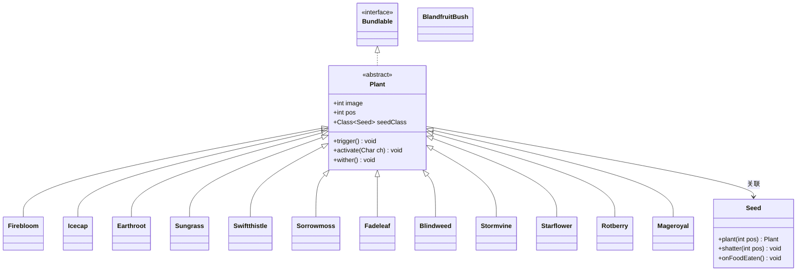

# Plant 抽象类文档

## 1. 基本信息
| 属性 | 值 |
|------|-----|
| 文件路径 | core/src/main/java/com/shatteredpixel/shatteredpixeldungeon/plants/Plant.java |
| 包名 | com.shatteredpixel.shatteredpixeldungeon.plants |
| 类类型 | abstract class |
| 继承关系 | implements Bundlable |
| 代码行数 | 250 |

## 2. 类职责说明
Plant是游戏中所有植物的抽象基类，定义了植物的基本行为框架。植物可以被踩踏触发产生各种效果，包括治疗、伤害、传送、增益等。每种植物都有对应的种子，可以种植或投掷使用。

## 4. 继承与协作关系


## 实例字段表
| 字段名 | 类型 | 修饰符 | 说明 |
|--------|------|--------|------|
| image | int | public | 植物的图像索引 |
| pos | int | public | 植物在地图上的位置 |
| seedClass | Class\<? extends Seed\> | protected | 对应的种子类 |

## 7. 方法详解

### trigger()
**签名**: `public void trigger()`
**功能**: 触发植物效果
**实现逻辑**:
- 查找位置上的角色
- 如果是英雄则中断当前动作
- 触发自然援助天赋
- 调用wither()枯萎植物
- 调用activate()激活效果
- 记录遭遇信息

### activate(Char ch)
**签名**: `public abstract void activate(Char ch)`
**功能**: 激活植物效果
**参数**: `ch`-触发植物的角色
**实现逻辑**: 抽象方法，由子类实现具体效果

### wither()
**签名**: `public void wither()`
**功能**: 使植物枯萎消失
**实现逻辑**:
- 播放枯萎动画
- 将地图该位置设为草地
- 从关卡移除植物

### storeInBundle(Bundle bundle)
**签名**: `public void storeInBundle(Bundle bundle)`
**功能**: 保存植物状态

### restoreFromBundle(Bundle bundle)
**签名**: `public void restoreFromBundle(Bundle bundle)`
**功能**: 恢复植物状态

## 内部类 - Seed

种子是植物的物品形式，可以拾取、投掷或种植。

### Seed主要方法

| 方法 | 说明 |
|------|------|
| plant(int pos) | 在指定位置种植植物 |
| shatter(int pos) | 种子碎裂效果（投掷时触发） |
| onFoodEaten() | 食用种子效果 |

## 植物效果列表

| 植物 | 效果 | 种子名称 |
|------|------|----------|
| Firebloom | 火焰爆发，造成范围伤害 | 火焰花种子 |
| Icecap | 冰冻附近敌人 | 冰帽种子 |
| Earthroot | 生成保护性护甲 | 地根种子 |
| Sungrass | 持续治疗 | 阳光草种子 |
| Swiftthistle | 急速移动 | 速决蓟种子 |
| Sorrowmoss | 释放毒气 | 悲伤苔种子 |
| Fadeleaf | 传送 | 隐叶草种子 |
| Blindweed | 致盲敌人 | 盲草种子 |
| Stormvine | 混乱效果 | 风暴藤种子 |
| Starflower | 星光祝福 | 星花种子 |
| Rotberry | 腐蚀效果 | 腐果种子 |
| Mageroyal | 魔法增益 | 法皇花种子 |
| BlandfruitBush | 产出平淡果 | 平淡果灌木 |

## 11. 使用示例

```java
// 种植植物
Seed seed = new Firebloom.Seed();
Plant plant = seed.plant(targetPos);

// 触发植物
if (Dungeon.level.plants.get(targetPos) != null) {
    Dungeon.level.plants.get(targetPos).trigger();
}

// 投掷种子
seed.cast(hero, targetPos);

// 检查植物类型
Plant p = Dungeon.level.plants.get(pos);
if (p instanceof Sungrass) {
    // 阳光草，治疗效果
}
```

## 注意事项

1. **一次性**: 大多数植物触发后会枯萎消失
2. **种子消耗**: 种植或投掷会消耗种子
3. **天赋互动**: 自然援助天赋可以在触发植物时获得树皮增益
4. **再生法杖**: WandOfRegrowth可以催生植物

## 最佳实践

1. 战斗前种植治疗植物（阳光草）作为应急治疗
2. 使用隐叶草种子进行紧急传送
3. 在狭窄通道种植火焰花造成范围伤害
4. 配合再生法杖无限催生植物