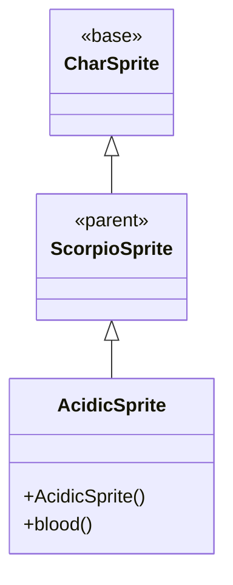

# AcidicSprite 源码详解

## 1. 基本信息

| 属性 | 值 |
|------|-----|
| **文件路径** | core/src/main/java/com/shatteredpixel/shatteredpixeldungeon/sprites/AcidicSprite.java |
| **包名** | com.shatteredpixel.shatteredpixeldungeon.sprites |
| **类类型** | class（非抽象） |
| **继承关系** | extends ScorpioSprite |
| **代码行数** | 57 |

---

## 类职责

AcidicSprite 是酸性蝎子怪物的精灵类，继承自 ScorpioSprite。它专门处理酸性蝎子的视觉表现：

1. **自定义动画帧**：基于 Scorpio 精灵表定义酸性蝎子特有的动画序列
2. **特殊血液颜色**：重写 `blood()` 方法返回绿色血液（符合酸性主题）
3. **继承基础功能**：复用 ScorpioSprite 和 CharSprite 的所有移动、状态效果等功能

**设计特点**：
- **主题一致性**：绿色血液颜色与酸性属性相匹配
- **动画优化**：空闲动画包含更复杂的呼吸效果（14帧序列）
- **资源复用**：使用与普通蝎子相同的精灵表资源

---

## 4. 继承与协作关系



---

## 构造方法详解

### AcidicSprite()

```java
public AcidicSprite() {
    super();
    texture(Assets.Sprites.SCORPIO);
    TextureFilm frames = new TextureFilm(texture, 17, 17);
    
    idle = new Animation(12, true);
    idle.frames(frames, 15, 15, 15, 15, 15, 15, 15, 15, 16, 17, 16, 17, 16, 17);
    
    run = new Animation(4, true);
    run.frames(frames, 20, 21);
    
    attack = new Animation(15, false);
    attack.frames(frames, 15, 18, 19);
    
    zap = attack.clone();
    
    die = new Animation(12, false);
    die.frames(frames, 15, 22, 23, 24, 25);
    
    play(idle);
}
```

**初始化流程**：
1. 调用父类构造方法
2. 设置纹理为 SCORPIO 精灵表
3. 创建 17x17 像素的纹理胶片
4. 定义各动画的帧序列

**动画帧分析**：
- **idle**：14帧复杂序列，包含长时间静止（帧15）和轻微动作（帧16-17）
- **run**：2帧快速循环，适合高速移动
- **attack**：3帧攻击序列，从静止到攻击完成
- **die**：5帧死亡序列，逐步倒下

---

## 方法重写

### blood()

```java
@Override
public int blood() {
    return 0xFF66FF22;
}
```

**方法作用**：返回酸性蝎子的血液颜色。

**颜色说明**：
- RGB值：#66FF22（亮绿色）
- Alpha值：FF（完全不透明）
- 设计意图：绿色血液体现酸性/毒性特征

---

## 资源使用

### 精灵表布局

AcidicSprite 使用 Assets.Sprites.SCORPIO 精灵表，帧布局如下：

| 帧索引 | 用途 | 说明 |
|--------|------|------|
| 15-17 | 空闲状态 | 主体静止，局部微动 |
| 18-19 | 攻击状态 | 攻击动作 |
| 20-21 | 奔跑状态 | 移动动画 |
| 22-25 | 死亡状态 | 死亡倒下过程 |

---

## 11. 使用示例

```java
// 创建酸性蝎子精灵
AcidicSprite acidicSprite = new AcidicSprite();

// 关联到酸性蝎子怪物
acidicSprite.link(acidicScorpioMob);

// 血液效果会自动使用绿色
acidicSprite.bloodBurstA(fromPoint, damage); // 显示绿色血液
```

---

## 注意事项

### 继承关系

- AcidicSprite → ScorpioSprite → MobSprite → CharSprite
- 继承了所有父类的移动、状态效果、粒子系统等功能

### 视觉特色

- **绿色血液**：与其他怪物的红色血液形成对比，突出酸性特性
- **复杂空闲动画**：14帧序列比普通怪物更生动
- **快速奔跑动画**：仅2帧但高帧率（4fps），营造敏捷感

### 最佳实践

- 利用继承的完整功能集，无需额外实现
- 血液颜色自动适配，无需手动设置
- 动画帧序列已优化，直接使用即可