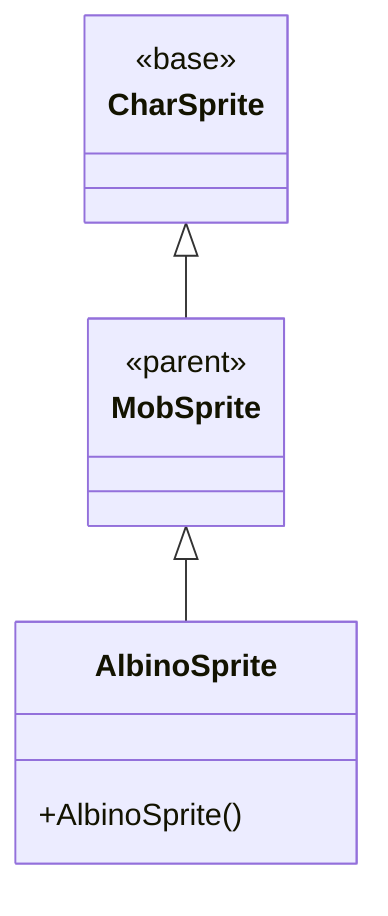

# AlbinoSprite 源码详解

## 1. 基本信息

| 属性 | 值 |
|------|-----|
| **文件路径** | core/src/main/java/com/shatteredpixel/shatteredpixeldungeon/sprites/AlbinoSprite.java |
| **包名** | com.shatteredpixel.shatteredpixeldungeon.sprites |
| **类类型** | class（非抽象） |
| **继承关系** | extends MobSprite |
| **代码行数** | 50 |

---

## 类职责

AlbinoSprite 是白化老鼠怪物的精灵类，继承自 MobSprite。它处理白化老鼠的视觉表现：

1. **专用动画帧**：基于 RAT 精灵表定义白化老鼠特有的动画序列  
2. **继承完整功能**：复用 MobSprite 和 CharSprite 的所有移动、状态效果、死亡淡出等功能
3. **资源优化**：与普通老鼠共享同一精灵表资源，仅使用不同帧区域

**设计特点**：
- **资源复用**：使用现有 RAT 精灵表，避免额外资源开销
- **视觉区分**：通过不同帧序列体现白化变异特征
- **简单实现**：仅需定义动画帧，无需额外逻辑

---

## 4. 继承与协作关系



---

## 构造方法详解

### AlbinoSprite()

```java
public AlbinoSprite() {
    super();
    texture(Assets.Sprites.RAT);
    TextureFilm frames = new TextureFilm(texture, 16, 15);
    
    idle = new Animation(2, true);
    idle.frames(frames, 16, 16, 16, 17);
    
    run = new Animation(10, true);
    run.frames(frames, 22, 23, 24, 25, 26);
    
    attack = new Animation(15, false);
    attack.frames(frames, 18, 19, 20, 21);
    
    die = new Animation(10, false);
    die.frames(frames, 27, 28, 29, 30);
    
    play(idle);
}
```

**初始化流程**：
1. 调用父类构造方法
2. 设置纹理为 RAT 精灵表  
3. 创建 16x15 像素的纹理胶片
4. 定义各动画的帧序列

**动画帧分析**：
- **idle**：4帧序列，主要为静止状态（帧16）配合轻微动作（帧17）
- **run**：5帧奔跑序列，流畅的移动动画
- **attack**：4帧攻击序列，完整的攻击动作
- **die**：4帧死亡序列，逐步倒下过程

---

## 资源使用

### 精灵表布局

AlbinoSprite 使用 Assets.Sprites.RAT 精灵表，帧索引范围为16-30：

| 帧索引范围 | 用途 | 说明 |
|------------|------|------|
| 16-17 | 空闲状态 | 白化老鼠特有的静止姿态 |
| 18-21 | 攻击状态 | 攻击动作序列 |
| 22-26 | 奔跑状态 | 移动动画序列 |
| 27-30 | 死亡状态 | 死亡倒下过程 |

**资源复用优势**：
- 与 RatSprite 共享同一精灵表
- 减少纹理内存占用
- 简化资源管理

---

## 继承功能

作为 MobSprite 的子类，AlbinoSprite 自动获得以下功能：

### 移动和动画
- `move(int, int)`：网格间移动动画
- `attack(int)`：攻击动画和回调
- `die()`：死亡动画和淡出效果
- `place(int)`：位置放置

### 状态效果
- `add(State)` / `remove(State)`：各种视觉状态效果
- 燃烧、冰冻、隐形、盾牌等状态支持

### 特殊行为
- `fall()`：坠落动画（旋转+缩放+透明度）
- 自动睡眠状态检测和表情显示
- 死亡后渐隐淡出效果

---

## 11. 使用示例

```java
// 创建白化老鼠精灵
AlbinoSprite albinoSprite = new AlbinoSprite();

// 关联到白化老鼠怪物
albinoSprite.link(albinoRatMob);

// 所有标准行为自动可用
albinoSprite.move(fromPos, toPos);     // 移动
albinoSprite.attack(targetPos);         // 攻击
albinoSprite.add(State.BURNING);        // 添加燃烧效果
albinoSprite.die();                    // 死亡淡出
```

---

## 注意事项

### 实现简洁性

- **无额外逻辑**：仅定义动画帧，所有行为继承自父类
- **资源高效**：复用现有精灵表，避免重复资源
- **维护简单**：修改动画只需调整帧序列

### 与其他老鼠变种的关系

- **RatSprite**：使用 RAT 精灵表帧0-15
- **AlbinoSprite**：使用 RAT 精灵表帧16-30  
- **FetidRatSprite**：可能使用其他精灵表或帧范围

### 最佳实践

- 利用完整的继承功能集，无需重复实现
- 动画帧序列已优化，直接使用即可
- 如需自定义行为，可重写相应方法