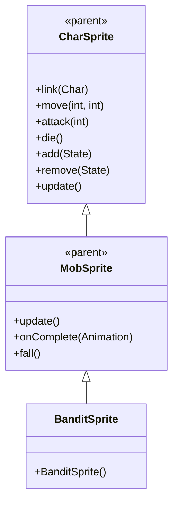

# BanditSprite 源码详解

## 1. 基本信息

| 属性 | 值 |
|------|-----|
| **文件路径** | core/src/main/java/com/shatteredpixel/shatteredpixeldungeon/sprites/BanditSprite.java |
| **包名** | com.shatteredpixel.shatteredpixeldungeon.sprites |
| **类类型** | class（非抽象） |
| **继承关系** | extends MobSprite |
| **代码行数** | 49 |

---

## 类职责

BanditSprite 是游戏中强盗怪物的精灵类，继承自 MobSprite。它负责加载强盗的纹理资源并定义其各种动画帧序列：

1. **纹理加载**：使用 Assets.Sprites.THIEF 纹理集（与 ThiefSprite 共享）
2. **动画定义**：为 idle、run、attack、die 四种状态定义具体的帧序列
3. **帧尺寸设置**：指定纹理帧的尺寸为 12x13 像素
4. **默认状态**：初始化时自动播放 idle 动画

**设计特点**：
- **资源共享**：与 ThiefSprite 共用同一套纹理资源，节省内存
- **帧序列复杂**：idle 动画有较长的帧序列，提供更丰富的闲置表现
- **轻量级实现**：仅包含必要的动画定义，复用父类的所有功能

---

## 4. 继承与协作关系



---

## 构造方法详解

### BanditSprite()

```java
public BanditSprite() {
    super();
    
    texture( Assets.Sprites.THIEF );
    TextureFilm film = new TextureFilm( texture, 12, 13 );
    
    idle = new Animation( 1, true );
    idle.frames( film, 21, 21, 21, 22, 21, 21, 21, 21, 22 );
    
    run = new Animation( 15, true );
    run.frames( film, 21, 21, 23, 24, 24, 25 );
    
    die = new Animation( 10, false );
    die.frames( film, 25, 27, 28, 29, 30 );
    
    attack = new Animation( 12, false );
    attack.frames( film, 31, 32, 33 );
    
    idle();
}
```

**构造方法作用**：初始化强盗精灵的所有动画。

**纹理和帧设置**：
- **纹理源**：Assets.Sprites.THIEF（与 ThiefSprite 共享）
- **帧尺寸**：12 像素宽 × 13 像素高
- **帧索引范围**：21-33（使用纹理集的后半部分）

**动画参数说明**：

| 动画类型 | 帧率 (FPS) | 循环 | 帧序列 | 说明 |
|----------|------------|------|--------|------|
| `idle` | 1 | true | [21, 21, 21, 22, 21, 21, 21, 21, 22] | 闲置状态，大部分时间显示帧21，偶尔切换到帧22 |
| `run` | 15 | true | [21, 21, 23, 24, 24, 25] | 跑动动画，6帧循环，起始两帧保持静止姿态 |
| `attack` | 12 | false | [31, 32, 33] | 攻击动画，3帧快速完成攻击动作 |
| `die` | 10 | false | [25, 27, 28, 29, 30] | 死亡动画，5帧播放一次 |

**关键特性**：
- **Idle动画节奏**：帧率为1 FPS，配合长帧序列创造自然的呼吸/等待效果
- **Run动画起始**：前两帧为帧21，确保跑动开始时姿态正确
- **纹理共享优化**：与 ThiefSprite 共用纹理，减少资源重复

---

## 使用的资源

### 纹理资源

| 资源 | 用途 |
|------|------|
| `Assets.Sprites.THIEF` | 强盗和盗贼共用的纹理集 |

### 工具类

| 类名 | 用途 |
|------|------|
| `TextureFilm` | 将大纹理分割成多个小帧用于动画 |

---

## 与其他类的交互

### 继承关系

| 父类 | 继承的功能 |
|------|-----------|
| `MobSprite` | 睡眠状态管理、死亡淡出效果、坠落动画等 |
| `CharSprite` | 所有基础动画、移动、状态效果、粒子系统等 |

### 关联的怪物类

BanditSprite 对应的怪物类是 `com.shatteredpixel.shatteredpixeldungeon.actors.mobs.Bandit`，该类定义了强盗的行为逻辑，而 BanditSprite 只负责视觉表现。

### 资源共享关系

| 共享类 | 共享资源 | 说明 |
|--------|----------|------|
| `ThiefSprite` | Assets.Sprites.THIEF | 同一套纹理集，不同帧索引 |

---

## 11. 使用示例

### 基本使用

```java
// 创建强盗精灵
BanditSprite banditSprite = new BanditSprite();

// 关联强盗怪物对象
banditSprite.link(banditMob);

// 自动播放 idle 动画（构造时已调用 idle()）

// 触发动画
banditSprite.run();     // 播放跑动动画  
banditSprite.attack(targetPos); // 播放攻击动画
banditSprite.die();     // 播放死亡动画（包含淡出效果）
```

### 纹理共享示例

```java
// ThiefSprite 和 BanditSprite 都使用同一纹理集
ThiefSprite thief = new ThiefSprite();    // 使用帧 0-20
BanditSprite bandit = new BanditSprite(); // 使用帧 21-33
```

---

## 注意事项

### 设计模式理解

1. **资源共享策略**：相似怪物共用纹理集，通过不同帧索引区分
2. **动画节奏控制**：低帧率 idle 动画创造更自然的等待效果
3. **分离关注点**：BanditSprite 只处理视觉表现，行为逻辑在 Bandit 类中

### 性能考虑

1. **内存优化**：共享纹理减少 GPU 内存占用
2. **渲染效率**：固定帧尺寸便于批处理渲染

### 常见的坑

1. **帧索引冲突**：确保与 ThiefSprite 的帧索引不重叠
2. **纹理尺寸匹配**：12x13 的尺寸必须与实际纹理匹配
3. **动画完整性**：死亡动画必须完整播放所有帧

### 最佳实践

1. **遵循资源共享模式**：创建相似怪物时考虑共享纹理
2. **优化 idle 动画**：使用长帧序列配合低帧率创造生动效果
3. **测试动画流畅性**：确保各状态切换自然连贯