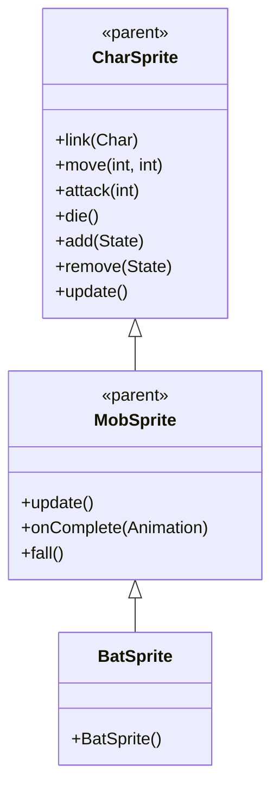

# BatSprite 源码详解

## 1. 基本信息

| 属性 | 值 |
|------|-----|
| **文件路径** | core/src/main/java/com/shatteredpixel/shatteredpixeldungeon/sprites/BatSprite.java |
| **包名** | com.shatteredpixel.shatteredpixeldungeon.sprites |
| **类类型** | class（非抽象） |
| **继承关系** | extends MobSprite |
| **代码行数** | 50 |

---

## 类职责

BatSprite 是游戏中蝙蝠怪物的精灵类，继承自 MobSprite。它负责加载蝙蝠的纹理资源并定义其各种动画帧序列：

1. **纹理加载**：使用 Assets.Sprites.BAT 纹理集
2. **动画定义**：为 idle、run、attack、die 四种状态定义具体的帧序列
3. **帧尺寸设置**：指定纹理帧的尺寸为 15x15 像素（正方形）
4. **默认状态**：初始化时自动播放 idle 动画

**设计特点**：
- **简单高效**：idle 和 run 使用相同的两帧循环，体现蝙蝠悬停和飞行的相似性
- **攻击动画连贯**：攻击后回到基础姿态（帧0,1），确保动作完整性
- **轻量级实现**：仅使用6个纹理帧，资源占用极小

---

## 4. 继承与协作关系



---

## 构造方法详解

### BatSprite()

```java
public BatSprite() {
    super();
    
    texture( Assets.Sprites.BAT );
    
    TextureFilm frames = new TextureFilm( texture, 15, 15 );
    
    idle = new Animation( 8, true );
    idle.frames( frames, 0, 1 );
    
    run = new Animation( 12, true );
    run.frames( frames, 0, 1 );
    
    attack = new Animation( 12, false );
    attack.frames( frames, 2, 3, 0, 1 );
    
    die = new Animation( 12, false );
    die.frames( frames, 4, 5, 6 );
    
    play( idle );
}
```

**构造方法作用**：初始化蝙蝠精灵的所有动画。

**纹理和帧设置**：
- **纹理源**：Assets.Sprites.BAT
- **帧尺寸**：15 像素宽 × 15 像素高（正方形）
- **帧总数**：7 帧（索引 0-6）

**动画参数说明**：

| 动画类型 | 帧率 (FPS) | 循环 | 帧序列 | 说明 |
|----------|------------|------|--------|------|
| `idle` | 8 | true | [0, 1] | 闲置状态，两帧快速循环模拟翅膀扇动 |
| `run` | 12 | true | [0, 1] | 跑动/飞行状态，与 idle 相同但帧率更快 |
| `attack` | 12 | false | [2, 3, 0, 1] | 攻击动画，专用攻击帧后回到基础姿态 |
| `die` | 12 | false | [4, 5, 6] | 死亡动画，3帧播放一次 |

**关键特性**：
- **Idle/Run 共享帧**：体现蝙蝠悬停和飞行动作的相似性
- **帧率差异**：run 动画比 idle 快（12 FPS vs 8 FPS），表现速度差异
- **攻击姿态恢复**：攻击完成后回到帧0,1，确保角色姿态正确

---

## 使用的资源

### 纹理资源

| 资源 | 用途 |
|------|------|
| `Assets.Sprites.BAT` | 蝙蝠精灵的完整纹理集 |

### 工具类

| 类名 | 用途 |
|------|------|
| `TextureFilm` | 将大纹理分割成多个小帧用于动画 |

---

## 与其他类的交互

### 继承关系

| 父类 | 继承的功能 |
|------|-----------|
| `MobSprite` | 睡眠状态管理、死亡淡出效果、坠落动画等 |
| `CharSprite` | 所有基础动画、移动、状态效果、粒子系统等 |

### 关联的怪物类

BatSprite 对应的怪物类是 `com.shatteredpixel.shatteredpixeldungeon.actors.mobs.Bat`，该类定义了蝙蝠的行为逻辑，而 BatSprite 只负责视觉表现。

---

## 11. 使用示例

### 基本使用

```java
// 创建蝙蝠精灵
BatSprite batSprite = new BatSprite();

// 关联蝙蝠怪物对象
batSprite.link(batMob);

// 自动播放 idle 动画（构造时已设置）

// 触发动画
batSprite.run();     // 播放跑动/飞行动画（更快的翅膀扇动）  
batSprite.attack(targetPos); // 播放攻击动画
batSprite.die();     // 播放死亡动画（包含淡出效果）
```

### 动画对比

```java
// Idle 和 Run 的区别仅在于帧率
batSprite.idle(); // 8 FPS - 缓慢翅膀扇动
batSprite.run();  // 12 FPS - 快速翅膀扇动
```

---

## 注意事项

### 设计模式理解

1. **动作简化**：蝙蝠的悬停和飞行使用相同帧序列，通过帧率区分
2. **资源最小化**：仅使用7个纹理帧实现完整动画
3. **分离关注点**：BatSprite 只处理视觉表现，行为逻辑在 Bat 类中

### 性能考虑

1. **内存效率**：极小的纹理集，适合大量生成的蝙蝠群
2. **渲染优化**：正方形帧尺寸便于 GPU 处理

### 常见的坑

1. **帧序列理解**：idle 和 run 虽然帧相同但帧率不同
2. **攻击动画完整性**：必须包含回到基础姿态的帧（0,1）
3. **纹理尺寸匹配**：15x15 的尺寸必须与实际纹理匹配

### 最佳实践

1. **帧率控制节奏**：通过调整帧率而非帧序列来表现动作强度差异
2. **保持资源精简**：对于简单怪物，尽量减少纹理帧数量
3. **测试动画流畅性**：确保翅膀扇动看起来自然连贯