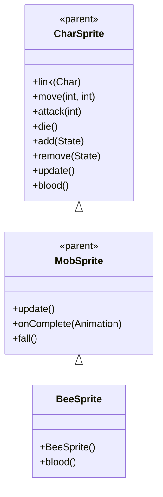

# BeeSprite 源码详解

## 1. 基本信息

| 属性 | 值 |
|------|-----|
| **文件路径** | core/src/main/java/com/shatteredpixel/shatteredpixeldungeon/sprites/BeeSprite.java |
| **包名** | com.shatteredpixel.shatteredpixeldungeon.sprites |
| **类类型** | class（非抽象） |
| **继承关系** | extends MobSprite |
| **代码行数** | 55 |

---

## 类职责

BeeSprite 是游戏中蜜蜂怪物的精灵类，继承自 MobSprite。它负责加载蜜蜂的纹理资源并定义其各种动画帧序列，同时提供特殊的血液颜色：

1. **纹理加载**：使用 Assets.Sprites.BEE 纹理集
2. **动画定义**：为 idle、run、attack、die 四种状态定义具体的帧序列
3. **帧尺寸设置**：指定纹理帧的尺寸为 16x16 像素（正方形）
4. **特殊血液颜色**：重写 blood() 方法提供黄色血液效果
5. **默认状态**：初始化时自动播放 idle 动画

**设计特点**：
- **Idle/Run 共享复杂序列**：使用6帧循环创造生动的蜜蜂悬停效果
- **特殊视觉效果**：黄色血液区别于普通红色血液
- **攻击死亡专用帧**：攻击和死亡使用完全独立的帧序列

---

## 4. 继承与协作关系



---

## 构造方法详解

### BeeSprite()

```java
public BeeSprite() {
    super();
    
    texture( Assets.Sprites.BEE );
    
    TextureFilm frames = new TextureFilm( texture, 16, 16 );
    
    idle = new Animation( 12, true );
    idle.frames( frames, 0, 1, 1, 0, 2, 2 );
    
    run = new Animation( 15, true );
    run.frames( frames, 0, 1, 1, 0, 2, 2 );
    
    attack = new Animation( 20, false );
    attack.frames( frames, 3, 4, 5, 6 );
    
    die = new Animation( 20, false );
    die.frames( frames, 7, 8, 9, 10 );
    
    play( idle );
}
```

**构造方法作用**：初始化蜜蜂精灵的所有动画。

**纹理和帧设置**：
- **纹理源**：Assets.Sprites.BEE
- **帧尺寸**：16 像素宽 × 16 像素高（正方形）
- **帧总数**：11 帧（索引 0-10）

**动画参数说明**：

| 动画类型 | 帧率 (FPS) | 循环 | 帧序列 | 说明 |
|----------|------------|------|--------|------|
| `idle` | 12 | true | [0, 1, 1, 0, 2, 2] | 闲置状态，6帧复杂循环模拟蜜蜂悬停抖动 |
| `run` | 15 | true | [0, 1, 1, 0, 2, 2] | 跑动状态，与 idle 相同但帧率更快 |
| `attack` | 20 | false | [3, 4, 5, 6] | 攻击动画，4帧专用攻击序列 |
| `die` | 20 | false | [7, 8, 9, 10] | 死亡动画，4帧专用死亡序列 |

**关键特性**：
- **复杂 Idle 序列**：[0, 1, 1, 0, 2, 2] 创造自然的蜜蜂悬停效果
- **帧率差异**：run 动画比 idle 快（15 FPS vs 12 FPS）
- **帧分离**：基础姿态（0-2）、攻击（3-6）、死亡（7-10）完全分离

---

## 特殊方法

### blood()

```java
@Override
public int blood() {
    return 0xffd500;
}
```

**方法作用**：返回蜜蜂受伤时的血液颜色。

**颜色说明**：
- **十六进制值**：0xffd500
- **颜色名称**：亮黄色/金色
- **设计意图**：符合蜜蜂的真实特征，区别于普通怪物的红色血液

**使用场景**：
- 怪物受到伤害时显示的血液粒子效果
- 视觉上区分蜜蜂与其他昆虫或怪物

---

## 使用的资源

### 纹理资源

| 资源 | 用途 |
|------|------|
| `Assets.Sprites.BEE` | 蜜蜂精灵的完整纹理集 |

### 工具类

| 类名 | 用途 |
|------|------|
| `TextureFilm` | 将大纹理分割成多个小帧用于动画 |

---

## 与其他类的交互

### 继承关系

| 父类 | 继承/重写的功能 |
|------|----------------|
| `MobSprite` | 睡眠状态管理、死亡淡出效果、坠落动画等 |
| `CharSprite` | 所有基础动画、移动、状态效果、粒子系统等，重写 blood() 方法 |

### 关联的怪物类

BeeSprite 对应的怪物类是 `com.shatteredpixel.shatteredpixeldungeon.actors.mobs.Bee`，该类定义了蜜蜂的行为逻辑，而 BeeSprite 只负责视觉表现。

---

## 11. 使用示例

### 基本使用

```java
// 创建蜜蜂精灵
BeeSprite beeSprite = new BeeSprite();

// 关联蜜蜂怪物对象
beeSprite.link(beeMob);

// 自动播放 idle 动画（构造时已设置）

// 触发动画
beeSprite.run();     // 播放跑动动画（更快的悬停抖动）  
beeSprite.attack(targetPos); // 播放攻击动画
beeSprite.die();     // 播放死亡动画（包含淡出效果）
```

### 血液效果

```java
// 获取蜜蜂血液颜色（通常由游戏引擎自动调用）
int beeBloodColor = beeSprite.blood(); // 返回 0xffd500 (亮黄色)
```

---

## 注意事项

### 设计模式理解

1. **生物特征还原**：黄色血液符合蜜蜂的真实特征
2. **动画节奏控制**：复杂的 idle 序列配合适中帧率创造生动效果
3. **资源分离策略**：不同动作状态使用完全独立的帧序列

### 性能考虑

1. **内存效率**：合理的纹理帧数量（11帧），适合召唤物大量生成
2. **渲染优化**：正方形帧尺寸便于 GPU 处理

### 常见的坑

1. **帧序列完整性**：idle/run 的6帧序列必须保持完整以确保抖动效果
2. **颜色格式**：blood() 返回的 ARGB 格式颜色值
3. **纹理尺寸匹配**：16x16 的尺寸必须与实际纹理匹配

### 最佳实践

1. **生物特征匹配**：为不同生物设计符合其特征的视觉效果
2. **复杂 idle 动画**：使用长帧序列创造更生动的基础姿态
3. **帧分离设计**：确保不同动作状态的帧序列不互相干扰