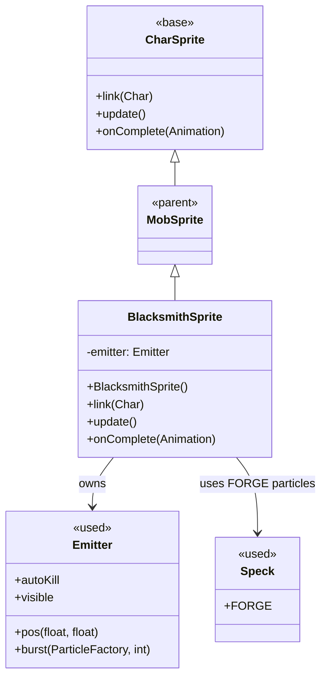

# BlacksmithSprite 源码详解

## 1. 基本信息

| 属性 | 值 |
|------|-----|
| **文件路径** | core/src/main/java/com/shatteredpixel/shatteredpixeldungeon/sprites/BlacksmithSprite.java |
| **包名** | com.shatteredpixel.shatteredpixeldungeon.sprites |
| **类类型** | class（非抽象） |
| **继承关系** | extends MobSprite |
| **代码行数** | 88 |

---

## 类职责

BlacksmithSprite 是铁匠NPC的精灵类，继承自 MobSprite。它处理铁匠特有的视觉和听觉效果：

1. **锻造粒子效果**：持续产生锻造火花粒子（Speck.FORGE）
2. **距离感知音效**：根据与英雄的距离播放锻造音效  
3. **自定义动画**：基于TROLL精灵表定义铁匠特有的动画序列
4. **Emitter管理**：创建并管理专用的粒子发射器
5. **可见性同步**：确保粒子效果与精灵可见性保持一致

**设计特点**：
- **沉浸式体验**：通过视觉和听觉效果增强铁匠角色的存在感
- **性能优化**：使用非自动销毁的Emitter，避免频繁创建销毁
- **距离衰减**：音效音量随距离增加而衰减，提供真实感

---

## 4. 继承与协作关系



---

## 实例字段

| 字段名 | 类型 | 说明 |
|--------|------|------|
| `emitter` | Emitter | 专用粒子发射器，用于产生锻造火花 |

---

## 构造方法详解

### BlacksmithSprite()

```java
public BlacksmithSprite() {
    super();
    texture(Assets.Sprites.TROLL);
    TextureFilm frames = new TextureFilm(texture, 13, 16);
    
    idle = new Animation(15, true);
    idle.frames(frames, 0, 0, 0, 0, 0, 0, 0, 1, 2, 2, 2, 3);
    
    run = new Animation(20, true);
    run.frames(frames, 0);
    
    die = new Animation(20, false);
    die.frames(frames, 0);
    
    play(idle);
}
```

**精灵表规格**：13x16 像素每帧，使用 TROLL 精灵表

**动画特点**：
- **idle**：12帧复杂序列，包含长时间静止和周期性动作
- **run/die**：单帧动画（实际铁匠不会移动或死亡）

---

## 方法重写

### link(Char ch)

```java
@Override
public void link(Char ch) {
    super.link(ch);
    
    emitter = new Emitter();
    emitter.autoKill = false;
    emitter.pos(x + 7, y + 12);
    parent.add(emitter);
}
```

**Emitter初始化**：
- 创建新的粒子发射器
- 设置 `autoKill = false` 避免自动销毁
- 定位在精灵特定位置（x+7, y+12，大约是铁匠工作台位置）
- 添加到父容器中

### update()

```java
@Override
public void update() {
    super.update();
    
    if (emitter != null) {
        emitter.visible = visible;
    }
}
```

**可见性同步**：确保粒子效果与精灵本身的可见性保持一致。

### onComplete(Animation anim)

```java
@Override
public void onComplete(Animation anim) {
    super.onComplete(anim);
    
    if (visible && emitter != null && anim == idle) {
        emitter.burst(Speck.factory(Speck.FORGE), 3);
        if (!Music.INSTANCE.paused()) {
            float volume = 0.2f / (Dungeon.level.distance(ch.pos, Dungeon.hero.pos));
            Sample.INSTANCE.play(Assets.Sounds.EVOKE, volume, volume, 0.8f);
        }
    }
}
```

**核心逻辑**：
1. **粒子爆发**：每次空闲动画完成时产生3个锻造火花粒子
2. **条件检查**：仅在精灵可见且有Emitter时触发
3. **距离计算**：使用 `Dungeon.level.distance()` 计算到英雄的距离
4. **音量衰减**：音量 = 0.2f / 距离，距离越远音量越小
5. **音乐检查**：仅在背景音乐未暂停时播放音效
6. **音效参数**：左右声道相同音量，音调0.8f（略低沉）

---

## 资源使用

### 精灵表
- **来源**：Assets.Sprites.TROLL
- **原因**：铁匠使用巨魔外观，符合游戏设定

### 粒子效果
- **类型**：Speck.FORGE（锻造火花）
- **频率**：每次空闲动画循环完成时触发
- **数量**：每次3个粒子

### 音效
- **资源**：Assets.Sounds.EVOKE
- **用途**：锻造敲击声
- **特性**：支持立体声和音调调整

---

## 11. 使用示例

### 基本使用

```java
// 创建铁匠精灵
BlacksmithSprite blacksmithSprite = new BlacksmithSprite();

// 关联到铁匠角色
blacksmithSprite.link(blacksmith);

// 自动获得所有特效：
// - 锻造火花粒子
// - 距离感知音效  
// - 特定动画序列
```

### 自定义粒子位置

```java
// 如果需要调整粒子发射位置，可以继承并重写link方法
public class CustomBlacksmithSprite extends BlacksmithSprite {
    @Override
    public void link(Char ch) {
        super.link(ch);
        if (emitter != null) {
            emitter.pos(x + 10, y + 15); // 调整到新位置
        }
    }
}
```

---

## 注意事项

### 性能考虑

1. **Emitter生命周期**：设置 `autoKill = false` 避免频繁创建销毁，但需要手动管理
2. **音效频率**：空闲动画每15帧触发一次，频率适中
3. **距离计算开销**：每次触发都计算距离，但对于NPC来说可接受

### 可见性管理

1. **自动同步**：粒子可见性与精灵可见性自动同步
2. **条件检查**：只有在可见状态下才触发粒子和音效
3. **内存安全**：null检查确保安全访问

### 音效设计

1. **距离衰减公式**：`volume = 0.2f / distance`
   - 距离1格：音量0.2f
   - 距离2格：音量0.1f  
   - 距离10格：音量0.02f
2. **音乐状态检查**：避免在游戏中断时播放音效
3. **立体声一致性**：左右声道使用相同音量

### 常见的坑

1. **忘记父类调用**：重写方法时必须调用 `super` 方法
2. **Emitter位置硬编码**：位置偏移(7,12)针对特定精灵尺寸
3. **音量计算异常**：距离为0时会导致除零错误（但游戏中不会发生）

### 最佳实践

1. **利用完整功能集**：无需额外实现，自动获得所有特效
2. **自定义扩展**：通过继承重写特定方法来自定义行为
3. **性能监控**：对于大量类似NPC，注意粒子和音效的总体开销