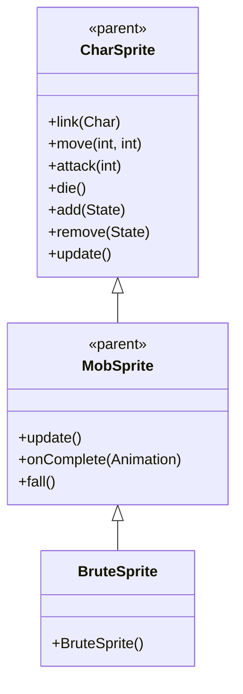

# BruteSprite 源码详解

## 1. 基本信息

| 属性 | 值 |
|------|-----|
| **文件路径** | core/src/main/java/com/shatteredpixel/shatteredpixeldungeon/sprites/BruteSprite.java |
| **包名** | com.shatteredpixel.shatteredpixeldungeon.sprites |
| **类类型** | class（非抽象） |
| **继承关系** | extends MobSprite |
| **代码行数** | 50 |

---

## 类职责

BruteSprite 是游戏中野蛮人怪物的精灵类，继承自 MobSprite。它负责加载野蛮人的纹理资源并定义其各种动画帧序列：

1. **纹理加载**：使用 Assets.Sprites.BRUTE 纹理集
2. **动画定义**：为 idle、run、attack、die 四种状态定义具体的帧序列
3. **帧尺寸设置**：指定纹理帧的尺寸为 12x16 像素
4. **默认状态**：初始化时自动播放 idle 动画

**设计特点**：
- **复杂 Idle 序列**：8帧序列创造自然的呼吸/等待效果
- **攻击姿态恢复**：攻击完成后回到基础姿态（帧0）
- **轻量级实现**：仅包含必要的动画定义，复用父类的所有功能

---

## 4. 继承与协作关系



---

## 构造方法详解

### BruteSprite()

```java
public BruteSprite() {
    super();
    
    texture( Assets.Sprites.BRUTE );
    
    TextureFilm frames = new TextureFilm( texture, 12, 16 );
    
    idle = new Animation( 2, true );
    idle.frames( frames, 0, 0, 0, 1, 0, 0, 1, 1 );
    
    run = new Animation( 12, true );
    run.frames( frames, 4, 5, 6, 7 );
    
    attack = new Animation( 12, false );
    attack.frames( frames, 2, 3, 0 );
    
    die = new Animation( 12, false );
    die.frames( frames, 8, 9, 10 );
    
    play( idle );
}
```

**构造方法作用**：初始化野蛮人精灵的所有动画。

**纹理和帧设置**：
- **纹理源**：Assets.Sprites.BRUTE
- **帧尺寸**：12 像素宽 × 16 像素高
- **帧总数**：11 帧（索引 0-10）

**动画参数说明**：

| 动画类型 | 帧率 (FPS) | 循环 | 帧序列 | 说明 |
|----------|------------|------|--------|------|
| `idle` | 2 | true | [0, 0, 0, 1, 0, 0, 1, 1] | 闲置状态，大部分时间显示帧0，偶尔切换到帧1 |
| `run` | 12 | true | [4, 5, 6, 7] | 跑动动画，4帧循环 |
| `attack` | 12 | false | [2, 3, 0] | 攻击动画，从准备到恢复，最后回到帧0 |
| `die` | 12 | false | [8, 9, 10] | 死亡动画，3帧播放一次 |

**关键特性**：
- **Idle动画设计**：帧序列为 [0, 0, 0, 1, 0, 0, 1, 1] 表示大部分时间保持静止（帧0），偶尔有小动作（帧1）
- **攻击动画完整性**：攻击完成后回到帧0，确保角色回到基础姿态
- **帧分离清晰**：idle(0-1)、attack(2-3)、run(4-7)、die(8-10) 各状态帧不重叠

---

## 使用的资源

### 纹理资源

| 资源 | 用途 |
|------|------|
| `Assets.Sprites.BRUTE` | 野蛮人精灵的完整纹理集 |

### 工具类

| 类名 | 用途 |
|------|------|
| `TextureFilm` | 将大纹理分割成多个小帧用于动画 |

---

## 与其他类的交互

### 继承关系

| 父类 | 继承的功能 |
|------|-----------|
| `MobSprite` | 睡眠状态管理、死亡淡出效果、坠落动画等 |
| `CharSprite` | 所有基础动画、移动、状态效果、粒子系统等 |

### 关联的怪物类

BruteSprite 对应的怪物类是 `com.shatteredpixel.shatteredpixeldungeon.actors.mobs.Brute`，该类定义了野蛮人的行为逻辑，而 BruteSprite 只负责视觉表现。

---

## 11. 使用示例

### 基本使用

```java
// 创建野蛮人精灵
BruteSprite bruteSprite = new BruteSprite();

// 关联野蛮人怪物对象
bruteSprite.link(bruteMob);

// 自动播放 idle 动画（构造时已设置）

// 触发动画
bruteSprite.run();     // 播放跑动动画  
bruteSprite.attack(targetPos); // 播放攻击动画
bruteSprite.die();     // 播放死亡动画（包含淡出效果）
```

### 动画控制

```java
// 手动控制动画（通常不需要，由游戏逻辑自动触发）
bruteSprite.play(bruteSprite.idle);   // 播放闲置动画
bruteSprite.play(bruteSprite.run);    // 播跑动动画
```

---

## 注意事项

### 设计模式理解

1. **分离关注点**：BruteSprite 只处理视觉表现，行为逻辑在 Brute 类中
2. **资源复用**：通过 TextureFilm 高效管理纹理资源
3. **动画标准化**：遵循游戏统一的动画命名和触发机制

### 性能考虑

1. **内存效率**：所有帧共享同一个纹理，减少内存占用
2. **渲染优化**：固定帧尺寸便于 GPU 批处理

### 常见的坑

1. **不要修改帧率**：帧率经过精心调整以匹配游戏节奏
2. **帧序列完整性**：攻击动画必须以帧0结尾，确保姿态正确
3. **纹理尺寸匹配**：12x16 的尺寸必须与实际纹理匹配

### 最佳实践

1. **遵循现有模式**：创建新怪物精灵时参考此实现
2. **保持简洁**：除非必要，不要添加复杂效果
3. **测试动画流畅性**：确保各状态切换自然