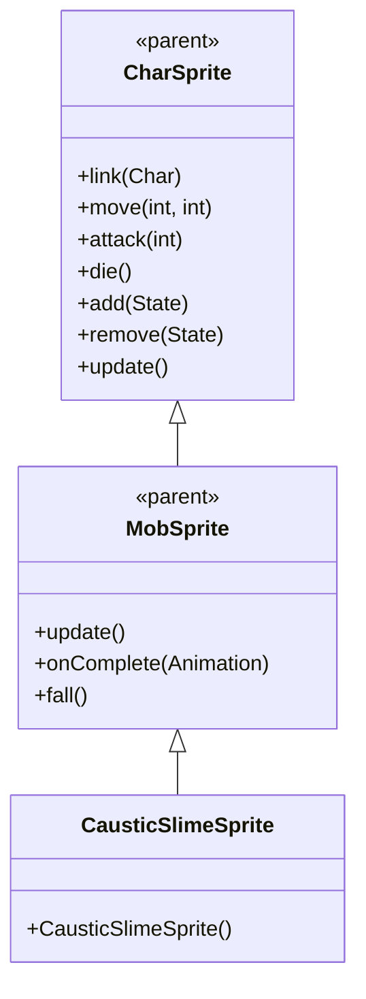

# CausticSlimeSprite 源码详解

## 1. 基本信息

| 属性 | 值 |
|------|-----|
| **文件路径** | core/src/main/java/com/shatteredpixel/shatteredpixeldungeon/sprites/CausticSlimeSprite.java |
| **包名** | com.shatteredpixel.shatteredpixeldungeon.sprites |
| **类类型** | class（非抽象） |
| **继承关系** | extends MobSprite |
| **代码行数** | 53 |

---

## 类职责

CausticSlimeSprite 是游戏中腐蚀史莱姆怪物的精灵类，继承自 MobSprite。它负责加载腐蚀史莱姆的纹理资源并定义其各种动画帧序列：

1. **纹理加载**：使用 Assets.Sprites.SLIME 纹理集（与普通 SlimeSprite 共享）
2. **帧偏移设置**：使用偏移量 c=9 访问纹理集的后半部分
3. **动画定义**：为 idle、run、attack、die 四种状态定义具体的帧序列
4. **帧尺寸设置**：指定纹理帧的尺寸为 14x12 像素
5. **默认状态**：初始化时自动播放 idle 动画

**设计特点**：
- **资源共享策略**：与 SlimeSprite 共用同一套纹理集，通过帧偏移区分不同类型
- **复杂动画序列**：run 和 attack 动画包含回放效果，创造更生动的动作
- **轻量级实现**：仅包含必要的动画定义，复用父类的所有功能

---

## 4. 继承与协作关系



---

## 构造方法详解

### CausticSlimeSprite()

```java
public CausticSlimeSprite() {
    super();
    
    texture( Assets.Sprites.SLIME );
    
    TextureFilm frames = new TextureFilm( texture, 14, 12 );
    
    int c = 9;
    
    idle = new Animation( 3, true );
    idle.frames( frames, c+0, c+1, c+1, c+0 );
    
    run = new Animation( 10, true );
    run.frames( frames, c+0, c+2, c+3, c+3, c+2, c+0 );
    
    attack = new Animation( 15, false );
    attack.frames( frames, c+2, c+3, c+4, c+6, c+5 );
    
    die = new Animation( 10, false );
    die.frames( frames, c+0, c+5, c+6, c+7 );
    
    play(idle);
}
```

**构造方法作用**：初始化腐蚀史莱姆精灵的所有动画。

**纹理和帧设置**：
- **纹理源**：Assets.Sprites.SLIME（与 SlimeSprite 共享）
- **帧尺寸**：14 像素宽 × 12 像素高
- **帧偏移**：c = 9（使用纹理集的后半部分，帧索引 9-16）

**动画参数说明**：

| 动画类型 | 帧率 (FPS) | 循环 | 帧序列（实际索引） | 说明 |
|----------|------------|------|-------------------|------|
| `idle` | 3 | true | [9, 10, 10, 9] | 闲置状态，简单来回抖动效果 |
| `run` | 10 | true | [9, 11, 12, 12, 11, 9] | 跑动动画，去程和回程对称 |
| `attack` | 15 | false | [11, 12, 13, 15, 14] | 攻击动画，包含特殊攻击帧 |
| `die` | 10 | false | [9, 14, 15, 16] | 死亡动画，4帧播放一次 |

**关键特性**：
- **Run动画对称性**：[9, 11, 12, 12, 11, 9] 创造自然的弹跳/蠕动效果
- **Attack动画复杂性**：最后两帧顺序为 [15, 14] 表示特殊的攻击结束姿态
- **资源共享优化**：与 SlimeSprite 共用纹理，减少资源重复

---

## 使用的资源

### 纹理资源

| 资源 | 用途 |
|------|------|
| `Assets.Sprites.SLIME` | 史莱姆精灵的完整纹理集（包含普通和腐蚀变种） |

### 工具类

| 类名 | 用途 |
|------|------|
| `TextureFilm` | 将大纹理分割成多个小帧用于动画 |

---

## 与其他类的交互

### 继承关系

| 父类 | 继承的功能 |
|------|-----------|
| `MobSprite` | 睡眠状态管理、死亡淡出效果、坠落动画等 |
| `CharSprite` | 所有基础动画、移动、状态效果、粒子系统等 |

### 关联的怪物类

CausticSlimeSprite 对应的怪物类是 `com.shatteredpixel.shatteredpixeldungeon.actors.mobs.CausticSlime`，该类定义了腐蚀史莱姆的行为逻辑，而 CausticSlimeSprite 只负责视觉表现。

### 资源共享关系

| 共享类 | 共享资源 | 帧偏移 | 说明 |
|--------|----------|--------|------|
| `SlimeSprite` | Assets.Sprites.SLIME | 0 vs 9 | 同一套纹理集，不同帧范围 |

---

## 11. 使用示例

### 基本使用

```java
// 创建腐蚀史莱姆精灵
CausticSlimeSprite causticSlime = new CausticSlimeSprite();

// 关联腐蚀史莱姆怪物对象
causticSlime.link(causticSlimeMob);

// 自动播放 idle 动画（构造时已设置）

// 触发动画
causticSlime.run();     // 播放跑动/蠕动动画  
causticSlime.attack(targetPos); // 播放攻击动画
causticSlime.die();     // 播放死亡动画（包含淡出效果）
```

### 纹理共享示例

```java
// SlimeSprite 和 CausticSlimeSprite 都使用同一纹理集
SlimeSprite normalSlime = new SlimeSprite();           // 使用帧 0-8
CausticSlimeSprite caustic = new CausticSlimeSprite(); // 使用帧 9-16
```

---

## 注意事项

### 设计模式理解

1. **资源共享策略**：相似怪物共用纹理集，通过帧偏移区分变种
2. **动画对称设计**：run 动画的对称序列创造自然的蠕动效果
3. **分离关注点**：CausticSlimeSprite 只处理视觉表现，行为逻辑在 CausticSlime 类中

### 性能考虑

1. **内存优化**：共享纹理减少 GPU 内存占用
2. **渲染效率**：固定帧尺寸便于批处理渲染

### 常见的坑

1. **帧偏移计算**：确保偏移量 c=9 与纹理集实际布局匹配
2. **纹理尺寸匹配**：14x12 的尺寸必须与实际纹理匹配
3. **动画完整性**：death 动画必须完整播放所有帧

### 最佳实践

1. **遵循资源共享模式**：创建怪物变种时考虑共享纹理
2. **优化动画流畅性**：使用对称帧序列创造自然动作效果
3. **测试动画连贯性**：确保各状态切换平滑自然