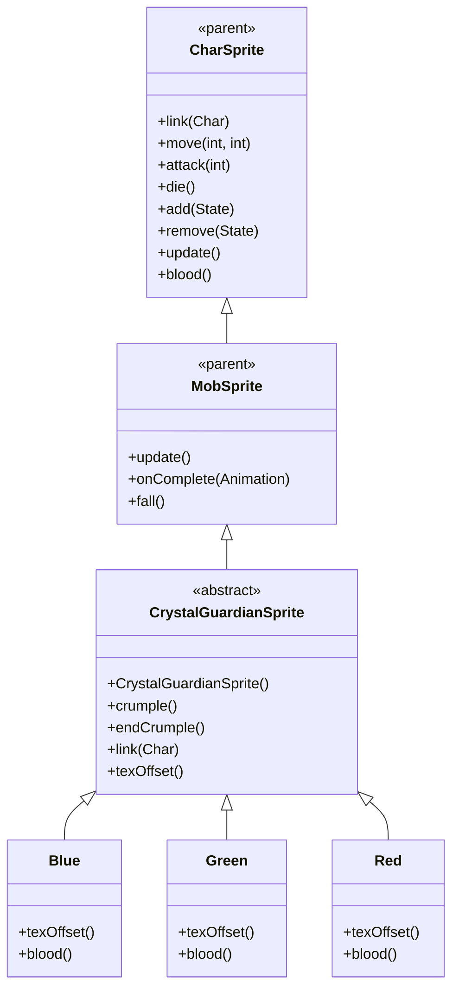

# CrystalGuardianSprite 源码详解

## 1. 基本信息

| 属性 | 值 |
|------|-----|
| **文件路径** | core/src/main/java/com/shatteredpixel/shatteredpixeldungeon/sprites/CrystalGuardianSprite.java |
| **包名** | com.shatteredpixel.shatteredpixeldungeon.sprites |
| **类类型** | abstract class（抽象类） |
| **继承关系** | extends MobSprite |
| **代码行数** | 116 |
| **嵌套类** | Blue, Green, Red（3个静态内部类） |

---

## 类职责

CrystalGuardianSprite 是游戏中水晶守护者怪物的抽象基类精灵，继承自 MobSprite。它提供了一个通用框架，支持三种不同颜色变种（蓝色、绿色、红色），每种变种通过帧偏移访问同一纹理集的不同部分：

1. **抽象基类设计**：定义通用动画逻辑，通过 texOffset() 抽象方法支持变种
2. **特殊动画**：除了标准动画外，还提供 crumple() 动画用于恢复状态
3. **纹理共享**：使用 Assets.Sprites.CRYSTAL_GUARDIAN 纹理集，通过帧偏移区分颜色
4. **缩放处理**：应用 1.25f 缩放以适配实际尺寸需求
5. **特殊血液颜色**：每种变种提供对应颜色的血液效果

**设计特点**：
- **变种模式**：通过抽象方法和静态内部类实现多种变种
- **状态管理**：crumple 动画专门用于表示守护者的恢复状态
- **资源共享优化**：单一纹理集支持三种颜色变种

---

## 4. 继承与协作关系



---

## 构造方法详解

### CrystalGuardianSprite()

```java
public CrystalGuardianSprite() {
    super();
    
    texture( Assets.Sprites.CRYSTAL_GUARDIAN );
    
    TextureFilm frames = new TextureFilm( texture, 12, 15 );
    
    int c = texOffset();
    
    idle = new MovieClip.Animation( 2, true );
    idle.frames( frames, 0+c, 0+c, 0+c, 0+c, 0+c, 1+c, 1+c );
    
    run = new MovieClip.Animation( 15, true );
    run.frames( frames, 2+c, 3+c, 4+c, 5+c, 6+c, 7+c );
    
    attack = new MovieClip.Animation( 12, false );
    attack.frames( frames, 8+c, 9+c, 10+c );
    
    die = new MovieClip.Animation( 5, false );
    die.frames( frames, 11+c, 12+c, 13+c, 14+c, 15+c, 15+c );
    
    crumple = die.clone();
    
    //this is temporary, as ideally the sprite itself should be scaled to 15x19 or so
    scale.set(1.25f);
    
    play( idle );
}
```

**构造方法作用**：初始化水晶守护者精灵的通用动画框架。

**纹理和帧设置**：
- **纹理源**：Assets.Sprites.CRYSTAL_GUARDIAN
- **帧尺寸**：12 像素宽 × 15 像素高
- **帧偏移**：通过 texOffset() 方法动态获取（Blue: 0, Green: 21, Red: 42）
- **缩放因子**：1.25f（临时解决方案，理想情况应调整纹理尺寸）

**动画参数说明**：

| 动画类型 | 帧率 (FPS) | 循环 | 帧序列模式 | 说明 |
|----------|------------|------|------------|------|
| `idle` | 2 | true | [0+c, 0+c, 0+c, 0+c, 0+c, 1+c, 1+c] | 闲置状态，大部分时间显示帧0+c，偶尔切换到帧1+c |
| `run` | 15 | true | [2+c, 3+c, 4+c, 5+c, 6+c, 7+c] | 跑动动画，6帧循环 |
| `attack` | 12 | false | [8+c, 9+c, 10+c] | 攻击动画，3帧快速完成 |
| `die` | 5 | false | [11+c, 12+c, 13+c, 14+c, 15+c, 15+c] | 死亡动画，6帧慢速播放 |
| `crumple` | 5 | false | 克隆 die 动画 | 特殊恢复状态动画 |

**关键特性**：
- **帧偏移动态性**：c = texOffset() 允许不同变种使用不同纹理区域
- **Idle动画节奏**：低帧率配合长序列创造缓慢的呼吸效果
- **死亡动画克隆**：crumple 动画直接克隆 die 动画，复用相同视觉效果

---

## 特殊方法

### crumple() 和 endCrumple()

```java
public void crumple(){
    play(crumple);
}

public void endCrumple(){
    if (curAnim == crumple){
        idle();
    }
}
```

**方法作用**：
- `crumple()`：播放 crumple 动画，表示守护者处于恢复状态
- `endCrumple()`：如果当前正在播放 crumple 动画，则切换回 idle 状态

**使用场景**：
- 当守护者被击败但尚未完全死亡时，进入 crumple 状态
- 恢复完成后自动回到 idle 状态

### link(Char ch)

```java
@Override
public void link(Char ch) {
    super.link(ch);
    if (ch instanceof CrystalGuardian && ((CrystalGuardian) ch).recovering()){
        crumple();
    }
}
```

**方法作用**：关联角色时检查是否处于恢复状态，如果是则自动播放 crumple 动画。

### texOffset() (抽象方法)

```java
protected abstract int texOffset();
```

**方法作用**：子类必须实现此方法返回对应的纹理帧偏移量。

---

## 静态内部类

### Blue 类

```java
public static class Blue extends CrystalGuardianSprite {
    @Override
    protected int texOffset() {
        return 0;
    }
    @Override
    public int blood() {
        return 0xFF8EE3FF;
    }
}
```

- **帧偏移**：0（使用纹理集前21帧）
- **血液颜色**：0xFF8EE3FF（浅蓝色）

### Green 类

```java
public static class Green extends CrystalGuardianSprite {
    @Override
    protected int texOffset() {
        return 21;
    }
    @Override
    public int blood() {
        return 0xFF85FFC8;
    }
}
```

- **帧偏移**：21（使用纹理集中间21帧）
- **血液颜色**：0xFF85FFC8（浅绿色）

### Red 类

```java
public static class Red extends CrystalGuardianSprite {
    @Override
    protected int texOffset() {
        return 42;
    }
    @Override
    public int blood() {
        return 0xFFFFBB33;
    }
}
```

- **帧偏移**：42（使用纹理集后21帧）
- **血液颜色**：0xFFFFBB33（橙色）

---

## 使用的资源

### 纹理资源

| 资源 | 用途 |
|------|------|
| `Assets.Sprites.CRYSTAL_GUARDIAN` | 水晶守护者的完整纹理集（包含三种颜色变种） |

### 工具类

| 类名 | 用途 |
|------|------|
| `TextureFilm` | 将大纹理分割成多个小帧用于动画 |
| `MovieClip.Animation` | 动画定义（显式使用全限定名） |

---

## 与其他类的交互

### 继承关系

| 父类 | 继承/重写的功能 |
|------|----------------|
| `MobSprite` | 睡眠状态管理、死亡淡出效果、坠落动画等 |
| `CharSprite` | 所有基础动画、移动、状态效果、粒子系统等 |

### 关联的怪物类

CrystalGuardianSprite 对应的怪物类是 `com.shatteredpixel.shatteredpixeldungeon.actors.mobs.CrystalGuardian`，该类定义了水晶守护者的行为逻辑。

### 实际使用方式

由于 CrystalGuardianSprite 是抽象类，实际使用时需要实例化具体的变种类：

```java
// 创建蓝色水晶守护者
CrystalGuardianSprite blueGuardian = new CrystalGuardianSprite.Blue();

// 创建绿色水晶守护者  
CrystalGuardianSprite greenGuardian = new CrystalGuardianSprite.Green();

// 创建红色水晶守护者
CrystalGuardianSprite redGuardian = new CrystalGuardianSprite.Red();
```

---

## 11. 使用示例

### 基本使用

```java
// 创建具体颜色的水晶守护者精灵
CrystalGuardianSprite guardian = new CrystalGuardianSprite.Blue();

// 关联怪物对象（自动检测恢复状态）
guardian.link(guardianMob);

// 标准动画触发
guardian.run();     // 播放跑动动画
guardian.attack(targetPos); // 播放攻击动画
guardian.die();     // 播放死亡动画

// 特殊状态控制
guardian.crumple(); // 进入恢复状态
guardian.endCrumple(); // 结束恢复状态（如果正在播放crumple）
```

### 血液效果

```java
// 不同变种的血液颜色
CrystalGuardianSprite.Blue blue = new CrystalGuardianSprite.Blue();
int blueBlood = blue.blood(); // 0xFF8EE3FF (浅蓝色)

CrystalGuardianSprite.Green green = new CrystalGuardianSprite.Green();
int greenBlood = green.blood(); // 0xFF85FFC8 (浅绿色)

CrystalGuardianSprite.Red red = new CrystalGuardianSprite.Red();
int redBlood = red.blood(); // 0xFFFFBB33 (橙色)
```

---

## 注意事项

### 设计模式理解

1. **模板方法模式**：基类定义算法骨架，子类实现具体细节（texOffset）
2. **工厂模式**：通过静态内部类提供具体的变种实例
3. **资源共享策略**：单一纹理集通过帧偏移支持多种变种

### 性能考虑

1. **内存优化**：三种变种共用同一纹理，大幅减少资源占用
2. **缩放开销**：scale.set(1.25f) 会在渲染时产生额外计算开销
3. **动画克隆**：crumple = die.clone() 复用动画数据，节省内存

### 常见的坑

1. **不能直接实例化**：CrystalGuardianSprite 是抽象类，必须使用具体变种
2. **帧偏移计算**：确保 texOffset() 返回值与纹理布局匹配
3. **缩放临时性**：注释提到这是临时方案，理想情况应调整纹理尺寸

### 最佳实践

1. **遵循变种模式**：为需要多变种的怪物采用类似的抽象基类设计
2. **资源共享优先**：尽可能让相似怪物共用纹理资源
3. **状态动画分离**：为特殊状态（如恢复）提供专用动画方法