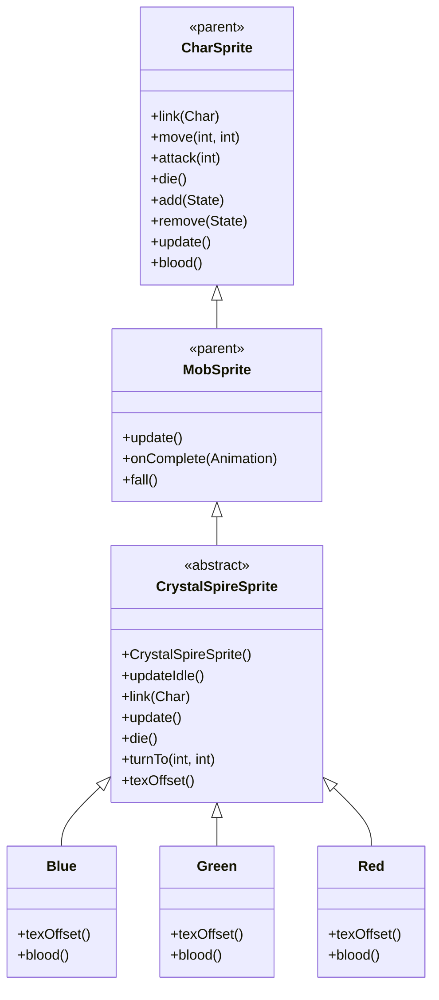

# CrystalSpireSprite 源码详解

## 1. 基本信息

| 属性 | 值 |
|------|-----|
| **文件路径** | core/src/main/java/com/shatteredpixel/shatteredpixeldungeon/sprites/CrystalSpireSprite.java |
| **包名** | com.shatteredpixel.shatteredpixeldungeon.sprites |
| **类类型** | abstract class（抽象类） |
| **继承关系** | extends MobSprite |
| **代码行数** | 162 |
| **嵌套类** | Blue, Green, Red（3个静态内部类） |

---

## 类职责

CrystalSpireSprite 是游戏中水晶尖塔怪物的抽象基类精灵，继承自 MobSprite。它提供了一个通用框架，支持三种不同颜色变种（蓝色、绿色、红色），具有以下特殊功能：

1. **HP敏感动画**：idle 动画根据生命值百分比动态切换不同帧，表现受损状态
2. **墙壁穿透效果**：通过 DungeonWallsTilemap.skipCells 实现上层墙壁透明化
3. **抽象基类设计**：通过 texOffset() 抽象方法支持三种颜色变种
4. **特殊视觉属性**：自定义透视提升、阴影尺寸和偏移
5. **血液溅射效果**：死亡时播放特殊的血液溅射动画

**设计特点**：
- **动态状态表现**：生命值越低，显示越受损的纹理帧
- **环境交互**：自动处理上层墙壁的可见性，确保尖塔完整显示
- **变种模式**：通过抽象方法和静态内部类实现多种颜色变种

---

## 4. 继承与协作关系



---

## 初始化块和构造方法

### 静态初始化块

```java
{
    perspectiveRaise = 7 / 16f; //7 pixels
    
    shadowWidth     = 1f;
    shadowHeight    = 1f;
    shadowOffset    = 1f;
}
```

**视觉属性设置**：
- **perspectiveRaise**：7/16f（约0.4375），将精灵提升7像素以获得更好的透视效果
- **shadowWidth/Height**：1f（100%），阴影与精灵同宽同高
- **shadowOffset**：1f（1像素），阴影向下偏移1像素

### CrystalSpireSprite()

```java
public CrystalSpireSprite(){
    texture( Assets.Sprites.CRYSTAL_SPIRE );
    
    TextureFilm frames = new TextureFilm( texture, 24, 41 );
    
    int c = texOffset();
    
    idle = new Animation(1, true);
    idle.frames( frames, 0+c );
    
    run = idle.clone();
    attack = idle.clone();
    zap = idle.clone();
    
    die = new Animation(1, false);
    die.frames( frames, 4+c );
    
    play(idle);
}
```

**构造方法作用**：初始化水晶尖塔精灵的基础动画框架。

**纹理和帧设置**：
- **纹理源**：Assets.Sprites.CRYSTAL_SPIRE
- **帧尺寸**：24 像素宽 × 41 像素高（高大的尖塔形状）
- **帧偏移**：通过 texOffset() 方法动态获取（Blue: 0, Green: 5, Red: 10）
- **总帧数**：每种颜色有5帧（0-4），总共15帧

**基础动画**：
- **idle**：初始使用帧 0+c（完好状态）
- **run/attack/zap**：克隆 idle 动画（尖塔不移动或攻击）
- **die**：使用帧 4+c（完全破坏状态）

---

## 核心方法详解

### updateIdle()

```java
public void updateIdle(){
    float hpPercent = 1f;
    if (ch != null){
        hpPercent = ch.HP/(float)ch.HT;
    }
    
    TextureFilm frames = new TextureFilm( texture, 24, 41 );
    
    if (hpPercent > 0.9f){
        idle.frames( frames, 0+texOffset() );
    } else if (hpPercent > 0.67f){
        idle.frames( frames, 1+texOffset() );
    } else if (hpPercent > 0.33f){
        idle.frames( frames, 2+texOffset() );
    } else {
        idle.frames( frames, 3+texOffset() );
    }
    play(idle, true);
    run = idle.clone();
    attack = idle.clone();
    zap = idle.clone();
}
```

**方法作用**：根据当前生命值百分比动态更新 idle 动画帧，表现不同受损程度。

**HP阈值和对应帧**：

| HP百分比 | 纹理帧 | 状态描述 |
|----------|--------|----------|
| > 90% | 0+c | 完好无损 |
| 67% - 90% | 1+c | 轻微受损 |
| 33% - 67% | 2+c | 中度受损 |
| ≤ 33% | 3+c | 严重受损 |

**关键特性**：
- **实时更新**：每次调用都会重新计算并更新所有相关动画
- **平滑过渡**：通过 play(idle, true) 强制立即切换到新帧
- **动画同步**：同时更新 run/attack/zap 动画以保持一致性

### link(Char ch)

```java
@Override
public void link(Char ch) {
    super.link(ch);
    updateIdle();
}
```

**方法作用**：关联角色后立即更新 idle 动画以反映初始生命值状态。

### update()

```java
@Override
public void update() {
    super.update();
    if (curAnim != die && ch != null && visible != wasVisible){
        if (visible){
            DungeonWallsTilemap.skipCells.add(ch.pos - 2*Dungeon.level.width());
            DungeonWallsTilemap.skipCells.add(ch.pos - Dungeon.level.width());
        } else {
            DungeonWallsTilemap.skipCells.remove(ch.pos - 2*Dungeon.level.width());
            DungeonWallsTilemap.skipCells.remove(ch.pos - Dungeon.level.width());
        }
        GameScene.updateMap(ch.pos-2*Dungeon.level.width());
        GameScene.updateMap(ch.pos-Dungeon.level.width());
        wasVisible = visible;
    }
}
```

**方法作用**：处理可见性变化时的墙壁穿透效果。

**墙壁穿透机制**：
- **目标位置**：尖塔上方两个格子（ch.pos - width 和 ch.pos - 2*width）
- **可见时**：将上方格子添加到 skipCells，使墙壁透明
- **不可见时**：从 skipCells 移除，恢复墙壁显示
- **地图更新**：调用 GameScene.updateMap() 立即刷新显示

### die()

```java
@Override
public void die() {
    super.die();
    Splash.around(this, blood(), 100);
    if (ch != null && visible){
        DungeonWallsTilemap.skipCells.remove(ch.pos - 2*Dungeon.level.width());
        DungeonWallsTilemap.skipCells.remove(ch.pos - Dungeon.level.width());
        GameScene.updateMap(ch.pos-2*Dungeon.level.width());
        GameScene.updateMap(ch.pos-Dungeon.level.width());
    }
}
```

**方法作用**：处理死亡逻辑，包括血液溅射和墙壁状态清理。

### turnTo(int from, int to)

```java
@Override
public void turnTo(int from, int to) {
    //do nothing
}
```

**方法作用**：尖塔不会转向，因此为空实现。

---

## 静态内部类

### Blue 类

```java
public static class Blue extends CrystalSpireSprite {
    @Override
    protected int texOffset() {
        return 0;
    }
    @Override
    public int blood() {
        return 0xFF8EE3FF;
    }
}
```

- **帧偏移**：0（使用帧 0-4）
- **血液颜色**：0xFF8EE3FF（浅蓝色）

### Green 类

```java
public static class Green extends CrystalSpireSprite {
    @Override
    protected int texOffset() {
        return 5;
    }
    @Override
    public int blood() {
        return 0xFF85FFC8;
    }
}
```

- **帧偏移**：5（使用帧 5-9）
- **血液颜色**：0xFF85FFC8（浅绿色）

### Red 类

```java
public static class Red extends CrystalSpireSprite {
    @Override
    protected int texOffset() {
        return 10;
    }
    @Override
    public int blood() {
        return 0xFFFFBB33;
    }
}
```

- **帧偏移**：10（使用帧 10-14）
- **血液颜色**：0xFFFFBB33（橙色）

---

## 使用的资源

### 纹理资源

| 资源 | 用途 |
|------|------|
| `Assets.Sprites.CRYSTAL_SPIRE` | 水晶尖塔的完整纹理集（包含三种颜色变种） |

### 效果和工具类

| 类名 | 用途 |
|------|------|
| `TextureFilm` | 将大纹理分割成多个小帧用于动画 |
| `Splash` | 死亡时的血液溅射效果 |
| `DungeonWallsTilemap` | 控制墙壁透明化的关键组件 |
| `GameScene` | 地图更新和场景管理 |

---

## 与其他类的交互

### 继承关系

| 父类 | 继承/重写的功能 |
|------|----------------|
| `MobSprite` | 睡眠状态管理、死亡淡出效果、坠落动画等 |
| `CharSprite` | 所有基础动画、移动、状态效果、粒子系统等，重写特定方法 |

### 关联的怪物类

CrystalSpireSprite 对应的怪物类是 `com.shatteredpixel.shatteredpixeldungeon.actors.mobs.CrystalSpire`，该类定义了水晶尖塔的行为逻辑。

### 地图系统交互

- **DungeonWallsTilemap.skipCells**：存储需要跳过渲染的墙壁格子
- **GameScene.updateMap()**：强制刷新指定格子的显示
- **Dungeon.level.width()**：获取当前关卡宽度用于位置计算

---

## 11. 使用示例

### 基本使用

```java
// 创建具体颜色的水晶尖塔精灵
CrystalSpireSprite spire = new CrystalSpireSprite.Blue();

// 关联怪物对象（自动更新初始状态）
spire.link(spireMob);

// 手动更新HP状态（通常由游戏自动触发）
spire.updateIdle();

// 死亡效果（自动处理血液溅射和墙壁清理）
spire.die();
```

### 血液效果

```java
// 不同变种的血液颜色
CrystalSpireSprite.Blue blue = new CrystalSpireSprite.Blue();
int blueBlood = blue.blood(); // 0xFF8EE3FF (浅蓝色)

CrystalSpireSprite.Green green = new CrystalSpireSprite.Green();
int greenBlood = green.blood(); // 0xFF85FFC8 (浅绿色)

CrystalSpireSprite.Red red = new CrystalSpireSprite.Red();
int redBlood = red.blood(); // 0xFFFFBB33 (橙色)
```

### HP状态更新

```java
// 模拟HP变化触发状态更新
spireMob.HP = spireMob.HT * 0.5f; // 设置为50% HP
spire.updateIdle(); // 切换到中度受损帧（帧2）
```

---

## 注意事项

### 设计模式理解

1. **状态驱动渲染**：HP百分比直接驱动视觉表现，无需额外状态变量
2. **环境感知设计**：自动处理与墙壁系统的交互，确保正确显示
3. **模板方法模式**：基类定义算法骨架，子类提供具体实现

### 性能考虑

1. **内存效率**：三种变种共用同一纹理，减少资源占用
2. **更新开销**：updateIdle() 会重新创建 TextureFilm 和动画，避免频繁调用
3. **地图刷新**：每次可见性变化都会触发两次地图更新，有一定性能成本

### 常见的坑

1. **不能直接实例化**：CrystalSpireSprite 是抽象类，必须使用具体变种
2. **帧偏移范围**：确保 texOffset() 返回值在有效范围内（0, 5, 10）
3. **墙壁位置计算**：假设尖塔高度为2格，上方格子计算基于此假设

### 最佳实践

1. **状态可视化**：为有明显状态变化的对象采用类似的HP驱动动画
2. **环境交互封装**：将复杂的环境交互逻辑封装在精灵类内部
3. **资源共享模式**：相似对象的多变种实现应优先考虑纹理共享