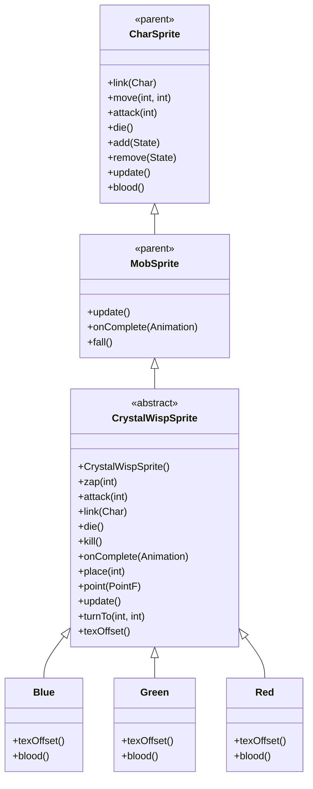

# CrystalWispSprite 源码详解

## 1. 基本信息

| 属性 | 值 |
|------|-----|
| **文件路径** | core/src/main/java/com/shatteredpixel/shatteredpixeldungeon/sprites/CrystalWispSprite.java |
| **包名** | com.shatteredpixel.shatteredpixeldungeon.sprites |
| **类类型** | abstract class（抽象类） |
| **继承关系** | extends MobSprite |
| **代码行数** | 208 |
| **嵌套类** | Blue, Green, Red（3个静态内部类） |

---

## 类职责

CrystalWispSprite 是游戏中水晶妖精怪物的抽象基类精灵，继承自 MobSprite。它提供了一个通用框架，支持三种不同颜色变种（蓝色、绿色、红色），具有以下特殊功能：

1. **漂浮动画效果**：通过正弦波函数实现平滑的上下漂浮效果
2. **动态光源系统**：使用 TorchHalo 创建持续的彩色光晕效果
3. **射线攻击特效**：zap 攻击时创建 Beam.LightRay 光束效果
4. **抽象基类设计**：通过 texOffset() 抽象方法支持三种颜色变种
5. **特殊血液颜色**：每种变种提供对应颜色的血液和光效

**设计特点**：
- **动态视觉效果**：结合漂浮动画、光源和粒子效果创造生动的妖精形象
- **光效同步**：光源颜色与血液颜色保持一致，增强视觉统一性
- **变种模式**：通过抽象方法和静态内部类实现多种颜色变种

---

## 4. 继承与协作关系



---

## 构造方法详解

### CrystalWispSprite()

```java
public CrystalWispSprite() {
    super();
    
    int c = texOffset();
    
    texture( Assets.Sprites.CRYSTAL_WISP );
    
    TextureFilm frames = new TextureFilm( texture, 12, 14 );
    
    idle = new Animation( 1, true );
    idle.frames( frames, c+0 );
    
    run = new Animation( 12, true );
    run.frames( frames, c+0, c+0, c+0, c+1 );
    
    attack = new Animation( 16, false );
    attack.frames( frames, c+2, c+3, c+4, c+5 );
    
    zap = attack.clone();
    
    die = new Animation( 15, false );
    die.frames( frames, c+6, c+7, c+8, c+9, c+10, c+11, c+12, c+11 );
    
    play( idle );
}
```

**构造方法作用**：初始化水晶妖精华灵的基础动画框架。

**纹理和帧设置**：
- **纹理源**：Assets.Sprites.CRYSTAL_WISP
- **帧尺寸**：12 像素宽 × 14 像素高
- **帧偏移**：通过 texOffset() 方法动态获取（Blue: 0, Green: 13, Red: 26）
- **帧分配**：每种颜色有13帧（0-12），总共39帧

**动画参数说明**：

| 动画类型 | 帧率 (FPS) | 循环 | 帧序列模式 | 说明 |
|----------|------------|------|------------|------|
| `idle` | 1 | true | [c+0] | 闲置状态，单帧显示 |
| `run` | 12 | true | [c+0, c+0, c+0, c+1] | 跑动动画，大部分时间显示基础帧 |
| `attack` | 16 | false | [c+2, c+3, c+4, c+5] | 攻击动画，4帧完成攻击动作 |
| `zap` | 16 | false | 克隆 attack 动画 | 射线攻击动画 |
| `die` | 15 | false | [c+6...c+12, c+11] | 死亡动画，8帧播放后回退一帧 |

**关键特性**：
- **Run动画节奏**：[c+0, c+0, c+0, c+1] 创造间歇性的微小动作
- **Zap克隆Attack**：射线攻击复用攻击动画，节省资源
- **死亡动画回退**：最后帧为 c+11（而非 c+12），创造特殊的死亡效果

---

## 核心方法详解

### zap(int cell)

```java
public void zap( int cell ) {
    super.zap( cell );
    
    parent.add(new AlphaTweener(light, 1f, 0.2f) {
        @Override
        public void onComplete() {
            light.alpha(0.3f);
            ((CrystalWisp)ch).onZapComplete();
            Beam ray = new Beam.LightRay(center(), DungeonTilemap.raisedTileCenterToWorld(cell));
            Sample.INSTANCE.play( Assets.Sounds.RAY );
            ray.hardlight(blood() & 0x00FFFFFF);
            parent.add( ray );
        }
    });
}
```

**方法作用**：执行射线攻击，包括光源闪烁和光束特效。

**攻击流程**：
1. 调用父类 zap() 方法开始动画
2. 创建 AlphaTweener 使光源瞬间变亮（alpha=1f）
3. 0.2秒后完成，恢复光源透明度（alpha=0.3f）
4. 通知怪物攻击完成
5. 创建 LightRay 光束从当前位置指向目标位置
6. 播放射线音效
7. 设置光束颜色为血液颜色（去除alpha通道）
8. 添加光束到父容器

### attack(int cell)

```java
@Override
public synchronized void attack(int cell) {
    super.attack(cell);
    parent.add(new AlphaTweener(light, 1f, 0.2f) {
        @Override
        public void onComplete() {
            light.alpha(0.3f);
        }
    });
}
```

**方法作用**：执行近战攻击，仅包含光源闪烁效果（无光束）。

### link(Char ch)

```java
@Override
public void link(Char ch) {
    super.link(ch);
    light = new TorchHalo( this );
    light.hardlight(blood() & 0x00FFFFFF);
    light.alpha(0.3f);
    light.radius(10);
    
    GameScene.effect(light);
}
```

**方法作用**：关联角色时创建并配置光源效果。

**光源配置**：
- **类型**：TorchHalo（火炬光环）
- **颜色**：血液颜色（去除alpha通道）
- **透明度**：0.3f（半透明）
- **半径**：10像素
- **添加到场景**：通过 GameScene.effect() 管理

### update()

```java
@Override
public void update() {
    super.update();
    
    if (!paused && curAnim != die){
        if (Float.isNaN(baseY)) baseY = y;
        y = baseY + Math.abs((float)Math.sin(Game.timeTotal));
        shadowOffset = 0.25f - 0.8f*Math.abs((float)Math.sin(Game.timeTotal));
    }
    
    if (light != null){
        light.visible = visible;
        light.point(center());
    }
}
```

**方法作用**：每帧更新漂浮动画和光源位置。

**漂浮动画实现**：
- **垂直位移**：y = baseY + |sin(time)|，创造平滑上下漂浮
- **阴影偏移**：shadowOffset = 0.25 - 0.8*|sin(time)|，同步调整阴影位置
- **条件限制**：暂停时或死亡动画时不执行漂浮

**光源同步**：
- **可见性同步**：确保光源与精灵可见性一致
- **位置同步**：每帧更新光源位置到精灵中心

### 其他重要方法

- **die()**: 死亡时调用 light.putOut() 熄灭光源
- **kill()**: 彻底移除时调用 light.killAndErase() 清理光源
- **turnTo()**: 空实现（妖精不转向）
- **place()/point()**: 记录基础Y坐标用于漂浮动画

---

## 静态内部类

### Blue 类

```java
public static class Blue extends CrystalWispSprite {
    @Override
    protected int texOffset() {
        return 0;
    }
    @Override
    public int blood() {
        return 0xFF66B3FF;
    }
}
```

- **帧偏移**：0（使用帧 0-12）
- **血液/光效颜色**：0xFF66B3FF（淡蓝色）

### Green 类

```java
public static class Green extends CrystalWispSprite {
    @Override
    protected int texOffset() {
        return 13;
    }
    @Override
    public int blood() {
        return 0xFF2EE62E;
    }
}
```

- **帧偏移**：13（使用帧 13-25）
- **血液/光效颜色**：0xFF2EE62E（亮绿色）

### Red 类

```java
public static class Red extends CrystalWispSprite {
    @Override
    protected int texOffset() {
        return 26;
    }
    @Override
    public int blood() {
        return 0xFFFF7F00;
    }
}
```

- **帧偏移**：26（使用帧 26-38）
- **血液/光效颜色**：0xFFFF7F00（橙红色）

---

## 使用的资源

### 纹理和音频资源

| 资源 | 用途 |
|------|------|
| `Assets.Sprites.CRYSTAL_WISP` | 水晶妖精的完整纹理集 |
| `Assets.Sounds.RAY` | 射线攻击音效 |

### 效果和工具类

| 类名 | 用途 |
|------|------|
| `TextureFilm` | 将大纹理分割成多个小帧用于动画 |
| `TorchHalo` | 创建动态光源效果 |
| `Beam.LightRay` | 创建射线攻击特效 |
| `AlphaTweener` | 控制光源透明度变化 |
| `DungeonTilemap` | 坐标转换（精灵位置到世界位置） |
| `GameScene` | 特效管理 |
| `Sample` | 音频播放 |

---

## 与其他类的交互

### 继承关系

| 父类 | 继承/重写的功能 |
|------|----------------|
| `MobSprite` | 睡眠状态管理、死亡淡出效果、坠落动画等 |
| `CharSprite` | 所有基础动画、移动、状态效果、粒子系统等 |

### 关联的怪物类

CrystalWispSprite 对应的怪物类是 `com.shatteredpixel.shatteredpixeldungeon.actors.mobs.CrystalWisp`，该类定义了水晶妖精的行为逻辑。

### 场景系统交互

- **GameScene.effect()**：将光源添加到场景特效管理系统
- **parent.add()**：将临时特效（如光束）添加到父容器
- **DungeonTilemap.raisedTileCenterToWorld()**：坐标转换工具

---

## 11. 使用示例

### 基本使用

```java
// 创建具体颜色的水晶妖精华灵
CrystalWispSprite wisp = new CrystalWispSprite.Blue();

// 关联怪物对象（自动创建光源）
wisp.link(wispMob);

// 自动漂浮动画（无需手动触发）

// 触发动画
wisp.attack(targetPos); // 近战攻击（光源闪烁）
wisp.zap(targetCell);   // 射线攻击（光源闪烁+光束）
wisp.die();             // 死亡动画（熄灭光源）
```

### 血液和光效

```java
// 不同变种的血液/光效颜色
CrystalWispSprite.Blue blue = new CrystalWispSprite.Blue();
int blueColor = blue.blood(); // 0xFF66B3FF (淡蓝色)

CrystalWispSprite.Green green = new CrystalWispSprite.Green();
int greenColor = green.blood(); // 0xFF2EE62E (亮绿色)

CrystalWispSprite.Red red = new CrystalWispSprite.Red();
int redColor = red.blood(); // 0xFFFF7F00 (橙红色)
```

### 光源控制

```java
// 光源自动创建和管理，通常无需手动干预
// 如果需要访问光源对象：
TorchHalo light = wisp.light; // 注意：这是私有字段，实际使用中通过精灵自动管理
```

---

## 注意事项

### 设计模式理解

1. **装饰器模式**：通过 TorchHalo 为基本精灵添加光源装饰
2. **模板方法模式**：基类定义算法骨架，子类提供具体实现
3. **观察者模式**：光源自动同步精灵的位置和可见性

### 性能考虑

1. **内存效率**：三种变种共用同一纹理，减少资源占用
2. **计算开销**：每帧计算正弦函数和光源位置，有一定CPU开销
3. **特效管理**：光束特效自动添加和清理，避免内存泄漏

### 常见的坑

1. **不能直接实例化**：CrystalWispSprite 是抽象类，必须使用具体变种
2. **帧偏移计算**：确保 texOffset() 返回值间隔13（每种颜色13帧）
3. **颜色格式处理**：blood() & 0x00FFFFFF 用于去除alpha通道获取RGB颜色

### 最佳实践

1. **动态效果封装**：将复杂的动态效果（漂浮、光源）封装在精灵类内部
2. **资源同步管理**：确保特效的生命周期与精灵保持同步
3. **数学函数应用**：使用三角函数创造自然的周期性动画效果