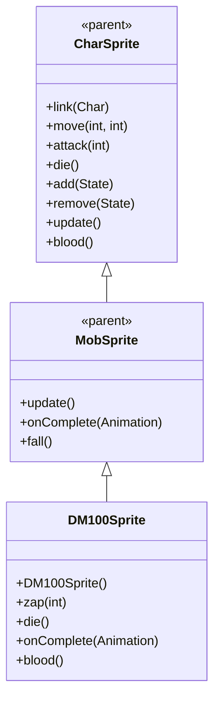

# DM100Sprite 源码详解

## 1. 基本信息

| 属性 | 值 |
|------|-----|
| **文件路径** | core/src/main/java/com/shatteredpixel/shatteredpixeldungeon/sprites/DM100Sprite.java |
| **包名** | com.shatteredpixel.shatteredpixeldungeon.sprites |
| **类类型** | class（非抽象） |
| **继承关系** | extends MobSprite |
| **代码行数** | 103 |

---

## 类职责

DM100Sprite 是游戏中 DM-100 机器人怪物的精灵类，继承自 MobSprite。它负责加载 DM-100 的纹理资源并定义其各种动画帧序列，同时提供特殊的闪电攻击效果：

1. **纹理加载**：使用 Assets.Sprites.DM100 纹理集
2. **动画定义**：为 idle、run、attack、zap、die 五种状态定义具体的帧序列
3. **特殊闪电攻击**：zap() 方法创建从眼睛发射的 Lightning 特效
4. **死亡粒子效果**：die() 方法添加 Speck.WOOL 粒子特效
5. **特殊血液颜色**：重写 blood() 方法提供半透明白色血液效果

**设计特点**：
- **多状态动画**：包含额外的 zap 动画状态用于闪电攻击
- **精准特效定位**：闪电从机器人眼睛位置发射，而非精灵中心
- **视觉反馈丰富**：结合闪光、音效和粒子效果创造完整的攻击体验

---

## 4. 继承与协作关系



---

## 构造方法详解

### DM100Sprite()

```java
public DM100Sprite () {
    super();
    
    texture( Assets.Sprites.DM100 );
    
    TextureFilm frames = new TextureFilm( texture, 16, 14 );
    
    idle = new Animation( 1, true );
    idle.frames( frames, 0, 1 );
    
    run = new Animation( 12, true );
    run.frames( frames, 6, 7, 8, 9 );
    
    attack = new Animation( 12, false );
    attack.frames( frames, 2, 3, 4, 0 );
    
    zap = new Animation( 8, false );
    zap.frames( frames, 5, 5, 1 );
    
    die = new Animation( 12, false );
    die.frames( frames, 10, 11, 12, 13, 14, 15 );
    
    play( idle );
}
```

**构造方法作用**：初始化 DM-100 机器人精灵的所有动画。

**纹理和帧设置**：
- **纹理源**：Assets.Sprites.DM100
- **帧尺寸**：16 像素宽 × 14 像素高
- **帧总数**：16 帧（索引 0-15）

**动画参数说明**：

| 动画类型 | 帧率 (FPS) | 循环 | 帧序列 | 说明 |
|----------|------------|------|--------|------|
| `idle` | 1 | true | [0, 1] | 闲置状态，两帧缓慢循环 |
| `run` | 12 | true | [6, 7, 8, 9] | 跑动动画，4帧循环 |
| `attack` | 12 | false | [2, 3, 4, 0] | 近战攻击，最后回到基础姿态 |
| `zap` | 8 | false | [5, 5, 1] | 闪电攻击，保持攻击姿态后回到 idle |
| `die` | 12 | false | [10, 11, 12, 13, 14, 15] | 死亡动画，6帧完整播放 |

**关键特性**：
- **Idle低帧率**：1 FPS 创造缓慢的待机效果
- **Zap专用帧**：帧5专门用于闪电攻击姿态
- **Attack恢复**：攻击完成后回到帧0，确保基础姿态正确

---

## 特殊方法详解

### zap(int pos)

```java
public void zap( int pos ) {
    Char enemy = Actor.findChar(pos);
    
    //shoot lightning from eye, not sprite center.
    PointF origin = center();
    if (flipHorizontal){
        origin.y -= 6*scale.y;
        origin.x -= 1*scale.x;
    } else {
        origin.y -= 8*scale.y;
        origin.x += 1*scale.x;
    }
    if (enemy != null) {
        parent.add(new Lightning(origin, enemy.sprite.destinationCenter(), (DM100) ch));
    } else {
        parent.add(new Lightning(origin, pos, (DM100) ch));
    }
    Sample.INSTANCE.play( Assets.Sounds.LIGHTNING );
    
    super.zap( ch.pos );
    flash();
}
```

**方法作用**：执行闪电攻击，包括精准的发射点定位、闪电特效和音效。

**核心特性**：

1. **眼睛定位**：
   - **水平翻转时**：origin.y -= 6*scale.y, origin.x -= 1*scale.x
   - **正常方向时**：origin.y -= 8*scale.y, origin.x += 1*scale.x
   - **目的**：确保闪电从机器人的实际眼睛位置发射

2. **闪电目标处理**：
   - 如果目标位置有角色，闪电指向角色精灵的中心
   - 如果目标位置无角色，闪电指向指定位置

3. **完整攻击流程**：
   - 创建 Lightning 特效并添加到父容器
   - 播放闪电音效 (Assets.Sounds.LIGHTNING)
   - 调用父类 zap() 方法开始 zap 动画
   - 调用 flash() 方法提供视觉闪光反馈

### die()

```java
@Override
public void die() {
    emitter().burst( Speck.factory( Speck.WOOL ), 5 );
    super.die();
}
```

**方法作用**：死亡时添加特殊的粒子效果。

**粒子效果**：
- **类型**：Speck.WOOL（羊毛状粒子）
- **数量**：5个粒子
- **时机**：在调用父类 die() 之前，确保特效可见

### onComplete(Animation anim)

```java
@Override
public void onComplete( Animation anim ) {
    if (anim == zap) {
        idle();
    }
    super.onComplete( anim );
}
```

**方法作用**：处理 zap 动画完成后的状态切换。

**逻辑说明**：
- zap 动画完成后自动切换回 idle 状态
- 确保机器人不会停留在 zap 姿态

### blood()

```java
@Override
public int blood() {
    return 0xFFFFFF88;
}
```

**方法作用**：返回 DM-100 受伤时的血液颜色。

**颜色说明**：
- **十六进制值**：0xFFFFFF88
- **颜色特征**：白色带半透明效果（alpha=0x88≈53%不透明度）
- **设计意图**：符合机器人/机械生物的特征，区别于有机生物的红色血液

---

## 使用的资源

### 纹理和音频资源

| 资源 | 用途 |
|------|------|
| `Assets.Sprites.DM100` | DM-100 机器人的完整纹理集 |
| `Assets.Sounds.LIGHTNING` | 闪电攻击音效 |

### 效果和工具类

| 类名 | 用途 |
|------|------|
| `TextureFilm` | 将大纹理分割成多个小帧用于动画 |
| `Lightning` | 创建闪电攻击特效 |
| `Speck` | 创建死亡时的粒子效果 |
| `Actor` | 查找目标位置的角色 |
| `Sample` | 播放音效 |
| `PointF` | 处理精确的坐标计算 |

---

## 与其他类的交互

### 继承关系

| 父类 | 继承/重写的功能 |
|------|----------------|
| `MobSprite` | 睡眠状态管理、死亡淡出效果、坠落动画等 |
| `CharSprite` | 所有基础动画、移动、状态效果、粒子系统等，重写特定方法 |

### 关联的怪物类

DM100Sprite 对应的怪物类是 `com.shatteredpixel.shatteredpixeldungeon.actors.mobs.DM100`，该类定义了 DM-100 机器人的行为逻辑，而 DM100Sprite 只负责视觉表现。

### 特效系统交互

- **Lightning 构造函数**：接受发射点、目标点和攻击者对象
- **Particle 系统**：通过 emitter().burst() 添加死亡粒子
- **Audio 系统**：通过 Sample.INSTANCE.play() 播放音效

---

## 11. 使用示例

### 基本使用

```java
// 创建 DM-100 机器人精灵
DM100Sprite dm100 = new DM100Sprite();

// 关联 DM-100 怪物对象
dm100.link(dm100Mob);

// 自动播放 idle 动画（构造时已设置）

// 触发动画
dm100.run();     // 播放跑动动画
dm100.attack(targetPos); // 播放近战攻击动画
dm100.zap(enemyPos);    // 播放闪电攻击动画（从眼睛发射）
dm100.die();     // 播放死亡动画（包含羊毛粒子效果）
```

### 闪电攻击细节

```java
// zap 方法会自动处理眼睛定位
// 无需手动计算发射点
dm100.zap(enemyPosition);

// 闪电会自动：
// 1. 从正确的眼睛位置发射
// 2. 指向目标或目标位置  
// 3. 播放音效
// 4. 执行 zap 动画
// 5. 完成后回到 idle 状态
```

### 血液效果

```java
// 获取 DM-100 血液颜色（通常由游戏引擎自动调用）
int dm100BloodColor = dm100.blood(); // 返回 0xFFFFFF88 (半透明白色)
```

---

## 注意事项

### 设计模式理解

1. **精准特效定位**：通过条件判断处理不同朝向的眼睛位置
2. **状态管理**：zap 动画完成后自动回到 idle 状态
3. **分离关注点**：DM100Sprite 只处理视觉表现，行为逻辑在 DM100 类中

### 性能考虑

1. **内存效率**：合理的纹理帧数量（16帧），适合机器人怪物
2. **特效管理**：Lightning 特效自动添加到父容器，由场景管理生命周期
3. **粒子优化**：仅在死亡时创建粒子，避免持续开销

### 常见的坑

1. **眼睛定位计算**：确保 flipHorizontal 判断与实际渲染方向一致
2. **帧序列完整性**：attack 动画必须以帧0结尾，确保姿态正确
3. **纹理尺寸匹配**：16x14 的尺寸必须与实际纹理匹配

### 最佳实践

1. **特效精准定位**：为有明确攻击部位的角色实现精确的特效发射点
2. **完整攻击反馈**：结合视觉、听觉和动画效果创造沉浸式体验
3. **状态自动管理**：确保特殊动画完成后自动回到正确状态