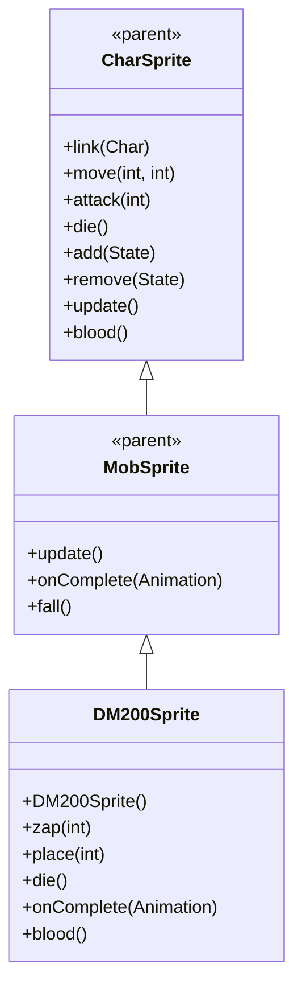

# DM200Sprite 源码详解

## 1. 基本信息

| 属性 | 值 |
|------|-----|
| **文件路径** | core/src/main/java/com/shatteredpixel/shatteredpixeldungeon/sprites/DM200Sprite.java |
| **包名** | com.shatteredpixel.shatteredpixeldungeon.sprites |
| **类类型** | class（非抽象） |
| **继承关系** | extends MobSprite |
| **代码行数** | 104 |

---

## 类职责

DM200Sprite 是游戏中 DM-200 机器人怪物的精灵类，继承自 MobSprite。它负责加载 DM-200 的纹理资源并定义其各种动画帧序列，同时提供特殊的毒气攻击效果：

1. **纹理加载**：使用 Assets.Sprites.DM200 纹理集
2. **动画定义**：为 idle、run、attack、zap、die 五种状态定义具体的帧序列
3. **毒气攻击特效**：zap() 方法创建 MagicMissile.SPECK + Speck.TOXIC 特效
4. **死亡粒子效果**：die() 方法添加 Speck.WOOL 粒子特效
5. **特殊血液颜色**：重写 blood() 方法提供半透明白色血液效果
6. **游戏日志提示**：攻击时显示 "vent" 消息提示

**设计特点**：
- **多状态动画**：包含额外的 zap 动画状态用于毒气攻击
- **视觉音频反馈**：结合魔法导弹特效、气体音效和文字提示
- **层级管理**：place() 方法确保精灵始终在最上层显示

---

## 4. 继承与协作关系



---

## 构造方法详解

### DM200Sprite()

```java
public DM200Sprite () {
    super();
    
    texture( Assets.Sprites.DM200 );
    
    TextureFilm frames = new TextureFilm( texture, 21, 18 );
    
    idle = new Animation( 10, true );
    idle.frames( frames, 0, 1 );
    
    run = new Animation( 10, true );
    run.frames( frames, 2, 3 );
    
    attack = new Animation( 15, false );
    attack.frames( frames, 4, 5, 6 );
    
    zap = new Animation( 15, false );
    zap.frames( frames, 7, 8, 8, 7 );
    
    die = new Animation( 8, false );
    die.frames( frames, 9, 10, 11 );
    
    play( idle );
}
```

**构造方法作用**：初始化 DM-200 机器人精灵的所有动画。

**纹理和帧设置**：
- **纹理源**：Assets.Sprites.DM200
- **帧尺寸**：21 像素宽 × 18 像素高（较宽的机器人形状）
- **帧总数**：12 帧（索引 0-11）

**动画参数说明**：

| 动画类型 | 帧率 (FPS) | 循环 | 帧序列 | 说明 |
|----------|------------|------|--------|------|
| `idle` | 10 | true | [0, 1] | 闲置状态，两帧循环 |
| `run` | 10 | true | [2, 3] | 跑动动画，两帧循环 |
| `attack` | 15 | false | [4, 5, 6] | 近战攻击，3帧完成 |
| `zap` | 15 | false | [7, 8, 8, 7] | 毒气攻击，对称播放 |
| `die` | 8 | false | [9, 10, 11] | 死亡动画，3帧快速播放 |

**关键特性**：
- **Idle/Run相同帧率**：都是10 FPS，保持动作节奏一致
- **Zap对称序列**：[7, 8, 8, 7] 创造自然的攻击-恢复效果
- **死亡动画简洁**：3帧快速完成，适合机械生物

---

## 特殊方法详解

### zap(int cell)

```java
public void zap( int cell ) {
    super.zap( cell );
    
    MagicMissile.boltFromChar( parent,
            MagicMissile.SPECK + Speck.TOXIC,
            this,
            cell,
            new Callback() {
                @Override
                public void call() {
                    ((DM200)ch).onZapComplete();
                }
            } );
    Sample.INSTANCE.play( Assets.Sounds.GAS );
    GLog.w(Messages.get(DM200.class, "vent"));
}
```

**方法作用**：执行毒气攻击，包括魔法导弹特效、气体音效和游戏日志提示。

**攻击流程**：

1. **调用父类 zap()**：开始 zap 动画
2. **创建魔法导弹**：
   - **特效类型**：MagicMissile.SPECK + Speck.TOXIC（毒气效果）
   - **发射源**：当前精灵
   - **目标**：指定格子
   - **回调**：攻击完成后通知 DM200 怪物
3. **播放气体音效**：Assets.Sounds.GAS
4. **显示游戏日志**：GLog.w(Messages.get(DM200.class, "vent")) 显示 "vent" 提示

**特效组合**：
- **MagicMissile.SPECK**：基础魔法导弹效果
- **Speck.TOXIC**：毒性粒子效果
- **组合效果**：创造独特的毒气攻击视觉效果

### place(int cell)

```java
@Override
public void place(int cell) {
    if (parent != null) parent.bringToFront(this);
    super.place(cell);
}
```

**方法作用**：放置精灵时确保其显示在最上层。

**层级管理**：
- **bringToFront(this)**：将精灵移动到渲染队列的最前面
- **应用场景**：确保 DM-200 在复杂场景中始终可见，不被其他元素遮挡

### die()

```java
@Override
public void die() {
    emitter().burst( Speck.factory( Speck.WOOL ), 8 );
    super.die();
}
```

**方法作用**：死亡时添加特殊的粒子效果。

**粒子效果**：
- **类型**：Speck.WOOL（羊毛状粒子）
- **数量**：8个粒子（比 DM100 的5个更多）
- **时机**：在调用父类 die() 之前，确保特效可见

### onComplete(Animation anim)

```java
@Override
public void onComplete( Animation anim ) {
    if (anim == zap) {
        idle();
    }
    super.onComplete( anim );
}
```

**方法作用**：处理 zap 动画完成后的状态切换。

**逻辑说明**：
- zap 动画完成后自动切换回 idle 状态
- 确保机器人不会停留在 zap 姿态

### blood()

```java
@Override
public int blood() {
    return 0xFFFFFF88;
}
```

**方法作用**：返回 DM-200 受伤时的血液颜色。

**颜色说明**：
- **十六进制值**：0xFFFFFF88
- **颜色特征**：白色带半透明效果（alpha=0x88≈53%不透明度）
- **设计意图**：符合机器人/机械生物的特征，与 DM100 保持一致

---

## 使用的资源

### 纹理和音频资源

| 资源 | 用途 |
|------|------|
| `Assets.Sprites.DM200` | DM-200 机器人的完整纹理集 |
| `Assets.Sounds.GAS` | 毒气攻击音效 |

### 效果和工具类

| 类名 | 用途 |
|------|------|
| `TextureFilm` | 将大纹理分割成多个小帧用于动画 |
| `MagicMissile` | 创建魔法导弹攻击特效 |
| `Speck` | 创建粒子效果（TOXIC 和 WOOL） |
| `Sample` | 播放音效 |
| `GLog` | 显示游戏日志消息 |
| `Messages` | 获取本地化消息文本 |
| `Callback` | 处理异步操作完成回调 |

---

## 与其他类的交互

### 继承关系

| 父类 | 继承/重写的功能 |
|------|----------------|
| `MobSprite` | 睡眠状态管理、死亡淡出效果、坠落动画等 |
| `CharSprite` | 所有基础动画、移动、状态效果、粒子系统等，重写特定方法 |

### 关联的怪物类

DM200Sprite 对应的怪物类是 `com.shatteredpixel.shatteredpixeldungeon.actors.mobs.DM200`，该类定义了 DM-200 机器人的行为逻辑，而 DM200Sprite 只负责视觉表现。

### 系统交互

- **MagicMissile 系统**：boltFromChar 方法处理从角色发射的魔法特效
- **GLog 系统**：显示警告级别的游戏日志消息
- **Messages 系统**：获取本地化的 "vent" 消息文本
- **Parent 容器**：通过 bringToFront 管理渲染层级

---

## 11. 使用示例

### 基本使用

```java
// 创建 DM-200 机器人精灵
DM200Sprite dm200 = new DM200Sprite();

// 关联 DM-200 怪物对象
dm200.link(dm200Mob);

// 自动播放 idle 动画（构造时已设置）

// 触发动画
dm200.run();     // 播放跑动动画
dm200.attack(targetPos); // 播放近战攻击动画
dm200.zap(enemyCell);    // 播放毒气攻击动画（魔法导弹+气体音效+日志提示）
dm200.die();     // 播放死亡动画（包含羊毛粒子效果）
```

### 毒气攻击细节

```java
// zap 方法会自动处理完整攻击流程
dm200.zap(targetPosition);

// 攻击会自动：
// 1. 开始 zap 动画
// 2. 创建毒气魔法导弹特效
// 3. 播放气体音效  
// 4. 显示 "vent" 日志消息
// 5. 完成后回到 idle 状态
```

### 层级管理

```java
// place 方法确保 DM-200 始终在最上层
dm200.place(somePosition);
// 精灵会自动被 bringToFront()
```

---

## 注意事项

### 设计模式理解

1. **完整攻击反馈**：结合视觉（魔法导弹）、听觉（气体音效）、文字（日志提示）三重反馈
2. **层级优先级**：重要角色精灵确保始终可见
3. **状态管理**：zap 动画完成后自动回到 idle 状态

### 性能考虑

1. **内存效率**：较少的纹理帧数量（12帧），适合机器人怪物
2. **特效管理**：MagicMissile 特效自动处理生命周期
3. **粒子优化**：仅在死亡时创建粒子，避免持续开销

### 常见的坑

1. **回调处理**：确保 onZapComplete() 回调正确触发怪物逻辑
2. **消息本地化**：Messages.get() 确保支持多语言
3. **纹理尺寸匹配**：21x18 的尺寸必须与实际纹理匹配

### 最佳实践

1. **多重反馈机制**：为重要攻击提供视觉、听觉、文字的完整反馈
2. **层级管理**：确保关键角色在游戏中始终可见
3. **状态自动恢复**：特殊动画完成后自动回到基础状态