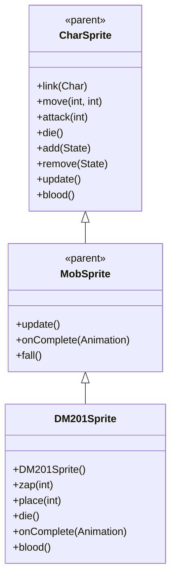

# DM201Sprite 源码详解

## 1. 基本信息

| 属性 | 值 |
|------|-----|
| **文件路径** | core/src/main/java/com/shatteredpixel/shatteredpixeldungeon/sprites/DM201Sprite.java |
| **包名** | com.shatteredpixel.shatteredpixeldungeon.sprites |
| **类类型** | class（非抽象） |
| **继承关系** | extends MobSprite |
| **代码行数** | 106 |

---

## 类职责

DM201Sprite 是游戏中 DM-201 机器人怪物的精灵类，继承自 MobSprite。它与 DM200 共享同一套纹理资源，通过帧偏移实现不同的视觉表现，并提供特殊的腐蚀攻击效果：

1. **共享纹理资源**：使用 Assets.Sprites.DM200 纹理集，通过偏移量 c=12 访问不同帧
2. **动画定义**：为 idle、run、attack、zap、die 五种状态定义具体的帧序列
3. **腐蚀攻击特效**：zap() 方法创建 MagicMissile.CORROSION 特效
4. **死亡粒子效果**：die() 方法添加 Speck.WOOL 粒子特效
5. **特殊血液颜色**：重写 blood() 方法提供半透明白色血液效果
6. **游戏日志提示**：攻击时显示 "vent" 消息提示

**设计特点**：
- **资源共享优化**：与 DM200 共用纹理，减少资源重复
- **多状态动画**：包含额外的 zap 动画状态用于腐蚀攻击
- **双重音效设计**：攻击时播放 MISS 音效，完成时播放 GAS 音效

---

## 4. 继承与协作关系



---

## 构造方法详解

### DM201Sprite()

```java
public DM201Sprite () {
    super();
    
    texture( Assets.Sprites.DM200 );
    
    TextureFilm frames = new TextureFilm( texture, 21, 18 );
    
    int c = 12;
    
    idle = new Animation( 2, true );
    idle.frames( frames, c+0, c+1 );
    
    run = idle.clone();
    
    attack = new Animation( 15, false );
    attack.frames( frames, c+4, c+5, c+6 );
    
    zap = new Animation( 15, false );
    zap.frames( frames, c+7, c+8, c+8, c+7 );
    
    die = new Animation( 8, false );
    die.frames( frames, c+9, c+10, c+11 );
    
    play( idle );
}
```

**构造方法作用**：初始化 DM-201 机器人精灵的所有动画。

**纹理和帧设置**：
- **纹理源**：Assets.Sprites.DM200（与 DM200 共享）
- **帧尺寸**：21 像素宽 × 18 像素高
- **帧偏移**：c = 12（使用纹理集的后半部分，帧索引 12-23）
- **帧总数**：12 帧（索引 12-23）

**动画参数说明**：

| 动画类型 | 帧率 (FPS) | 循环 | 帧序列（实际索引） | 说明 |
|----------|------------|------|-------------------|------|
| `idle` | 2 | true | [12, 13] | 闲置状态，两帧缓慢循环 |
| `run` | 2 | true | 克隆 idle | 跑动状态与闲置相同 |
| `attack` | 15 | false | [16, 17, 18] | 近战攻击，3帧完成 |
| `zap` | 15 | false | [19, 20, 20, 19] | 腐蚀攻击，对称播放 |
| `die` | 8 | false | [21, 22, 23] | 死亡动画，3帧快速播放 |

**关键特性**：
- **Idle低帧率**：2 FPS 创造缓慢的待机效果
- **Run克隆Idle**：跑动和闲置使用相同动画，体现机器人静止特性
- **Zap对称序列**：[19, 20, 20, 19] 创造自然的攻击-恢复效果

---

## 特殊方法详解

### zap(int cell)

```java
public void zap( int cell ) {
    super.zap( cell );
    
    MagicMissile.boltFromChar( parent,
            MagicMissile.CORROSION,
            this,
            cell,
            new Callback() {
                @Override
                public void call() {
                    Sample.INSTANCE.play( Assets.Sounds.GAS );
                    ((DM201)ch).onZapComplete();
                }
            } );
    Sample.INSTANCE.play( Assets.Sounds.MISS, 1f, 1.5f );
    GLog.w(Messages.get(DM201.class, "vent"));
}
```

**方法作用**：执行腐蚀攻击，包括魔法导弹特效、双重音效和游戏日志提示。

**攻击流程**：

1. **调用父类 zap()**：开始 zap 动画
2. **创建腐蚀魔法导弹**：
   - **特效类型**：MagicMissile.CORROSION（腐蚀效果）
   - **发射源**：当前精灵
   - **目标**：指定格子
   - **回调**：攻击完成后播放 GAS 音效并通知 DM201 怪物
3. **立即播放MISS音效**：Assets.Sounds.MISS（音调 1.5f）
4. **显示游戏日志**：GLog.w(Messages.get(DM201.class, "vent")) 显示 "vent" 提示

**音效设计**：
- **初始音效**：MISS 音效（高音调 1.5f）表示攻击发射
- **完成音效**：GAS 音效在魔法导弹到达目标时播放
- **双重反馈**：提供攻击开始和结束的完整听觉反馈

### place(int cell)

```java
@Override
public void place(int cell) {
    if (parent != null) parent.bringToFront(this);
    super.place(cell);
}
```

**方法作用**：放置精灵时确保其显示在最上层（与 DM200 相同）。

### die()

```java
@Override
public void die() {
    emitter().burst( Speck.factory( Speck.WOOL ), 8 );
    super.die();
}
```

**方法作用**：死亡时添加 Speck.WOOL 粒子特效（与 DM200 相同）。

### onComplete(Animation anim)

```java
@Override
public void onComplete( Animation anim ) {
    if (anim == zap) {
        idle();
    }
    super.onComplete( anim );
}
```

**方法作用**：zap 动画完成后自动切换回 idle 状态。

### blood()

```java
@Override
public int blood() {
    return 0xFFFFFF88;
}
```

**方法作用**：返回半透明白色血液颜色（与 DM200/DM100 保持一致）。

---

## 使用的资源

### 纹理和音频资源

| 资源 | 用途 |
|------|------|
| `Assets.Sprites.DM200` | DM-201 机器人的纹理集（与 DM200 共享） |
| `Assets.Sounds.MISS` | 攻击发射音效 |
| `Assets.Sounds.GAS` | 攻击完成音效 |

### 效果和工具类

| 类名 | 用途 |
|------|------|
| `TextureFilm` | 将大纹理分割成多个小帧用于动画 |
| `MagicMissile` | 创建腐蚀魔法导弹特效 |
| `Speck` | 创建死亡粒子效果 |
| `Sample` | 播放音效 |
| `GLog` | 显示游戏日志消息 |
| `Messages` | 获取本地化消息文本 |
| `Callback` | 处理异步操作完成回调 |

---

## 与其他类的交互

### 继承关系

| 父类 | 继承/重写的功能 |
|------|----------------|
| `MobSprite` | 睡眠状态管理、死亡淡出效果、坠落动画等 |
| `CharSprite` | 所有基础动画、移动、状态效果、粒子系统等 |

### 资源共享关系

| 共享类 | 共享资源 | 帧偏移 | 说明 |
|--------|----------|--------|------|
| `DM200Sprite` | Assets.Sprites.DM200 | 0 vs 12 | 同一套纹理集，不同帧范围 |

### 关联的怪物类

DM201Sprite 对应的怪物类是 `com.shatteredpixel.shatteredpixeldungeon.actors.mobs.DM201`，该类定义了 DM-201 机器人的行为逻辑。

---

## 11. 使用示例

### 基本使用

```java
// 创建 DM-201 机器人精灵
DM201Sprite dm201 = new DM201Sprite();

// 关联 DM-201 怪物对象
dm201.link(dm201Mob);

// 自动播放 idle 动画（构造时已设置）

// 触发动画
dm201.run();     // 播放跑动动画（与idle相同）
dm201.attack(targetPos); // 播放近战攻击动画
dm201.zap(enemyCell);    // 播放腐蚀攻击动画（双重音效+日志提示）
dm201.die();     // 播放死亡动画（包含羊毛粒子效果）
```

### 腐蚀攻击细节

```java
// zap 方法会自动处理完整攻击流程
dm201.zap(targetPosition);

// 攻击会自动：
// 1. 开始 zap 动画
// 2. 播放 MISS 音效（高音调）
// 3. 创建腐蚀魔法导弹
// 4. 导弹到达时播放 GAS 音效
// 5. 显示 "vent" 日志消息  
// 6. 完成后回到 idle 状态
```

### 纹理共享示例

```java
// DM200 和 DM201 共用同一纹理集
DM200Sprite dm200 = new DM200Sprite(); // 使用帧 0-11
DM201Sprite dm201 = new DM201Sprite(); // 使用帧 12-23
```

---

## 注意事项

### 设计模式理解

1. **资源共享策略**：相似怪物共用纹理集，通过帧偏移区分变种
2. **双重音效反馈**：攻击开始和结束分别提供不同音效
3. **状态管理**：zap 动画完成后自动回到 idle 状态

### 性能考虑

1. **内存优化**：共享纹理大幅减少 GPU 内存占用
2. **渲染效率**：固定帧尺寸便于批处理渲染
3. **音效管理**：异步播放避免阻塞主线程

### 常见的坑

1. **帧偏移计算**：确保偏移量 c=12 与纹理集实际布局匹配
2. **Run动画克隆**：run = idle.clone() 意味着跑动和闲置完全相同
3. **音效顺序**：MISS 音效立即播放，GAS 音效在回调中播放

### 最佳实践

1. **遵循资源共享模式**：创建相似怪物时优先考虑纹理共享
2. **完整攻击反馈**：结合视觉、听觉、文字提供沉浸式体验
3. **帧分离设计**：确保不同动作状态的帧序列不互相干扰