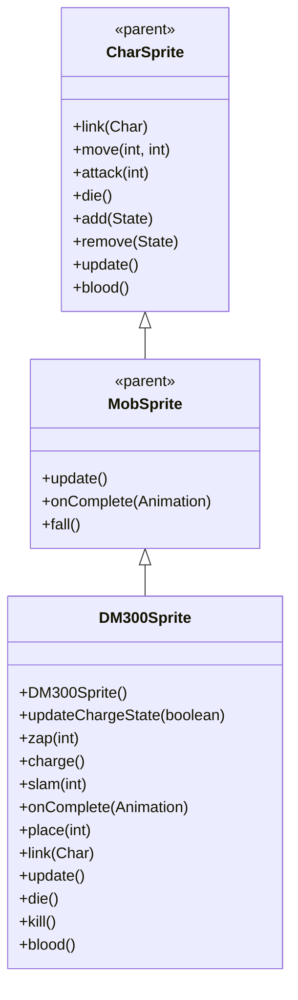

# DM300Sprite 源码详解

## 1. 基本信息

| 属性 | 值 |
|------|-----|
| **文件路径** | core/src/main/java/com/shatteredpixel/shatteredpixeldungeon/sprites/DM300Sprite.java |
| **包名** | com.shatteredpixel.shatteredpixeldungeon.sprites |
| **类类型** | class（非抽象） |
| **继承关系** | extends MobSprite |
| **代码行数** | 183 |

---

## 类职责

DM300Sprite 是游戏中 DM-300 超级机器人怪物的精灵类，继承自 MobSprite。作为游戏中的重要Boss级别角色，它具有以下复杂功能：

1. **双状态动画系统**：普通状态和超级充能状态，通过 updateChargeState() 动态切换
2. **特殊攻击模式**：包含 zap（毒气）、charge（充能）、slam（猛击）三种特殊攻击
3. **粒子特效系统**：超级充能时显示 SparkParticle 静电粒子效果
4. **地震效果**：slam 攻击时触发 PixelScene.shake() 地震效果
5. **复杂死亡动画**：death 动画使用重复帧序列创造特殊的死亡效果
6. **资源优化设计**：通过条件初始化避免重复创建动画对象

**设计特点**：
- **状态驱动渲染**：根据超级充能状态动态切换整套动画
- **丰富的视觉反馈**：结合粒子效果、地震、音效创造沉浸式Boss战体验
- **生命周期管理**：完善的粒子系统清理机制

---

## 4. 继承与协作关系



---

## 核心字段

### 动画字段

| 字段名 | 类型 | 说明 |
|--------|------|------|
| `charge` | Animation | 充能动画（循环播放帧0和帧10） |
| `slam` | Animation | 猛击动画（克隆 attack 动画） |

### 特效字段

| 字段名 | 类型 | 说明 |
|--------|------|------|
| `superchargeSparks` | Emitter | 超级充能状态下的静电粒子发射器 |

---

## 构造方法和核心方法详解

### DM300Sprite()

```java
public DM300Sprite() {
    super();
    
    texture( Assets.Sprites.DM300 );
    
    updateChargeState(false);
}
```

**构造方法作用**：初始化 DM-300 精灵并设置为普通状态。

### updateChargeState(boolean enraged)

```java
public void updateChargeState( boolean enraged ){
    if (superchargeSparks != null) superchargeSparks.on = enraged;

    int c = enraged ? 10 : 0;

    TextureFilm frames = new TextureFilm( texture, 25, 22 );

    idle = new Animation( enraged ? 15 : 10, true );
    idle.frames( frames, c+0, c+1 );

    run = new Animation( enraged ? 15 : 10, true );
    run.frames( frames, c+0, c+2 );

    attack = new Animation( 15, false );
    attack.frames( frames, c+3, c+4, c+5 );

    //unaffected by enrage state

    if (charge == null) {
        char charge = new Animation(4, true);
        charge.frames(frames, 0, 10);

        slam = attack.clone();

        zap = new Animation(15, false);
        zap.frames(frames, 6, 7, 7, 6);

        die = new Animation(20, false);
        die.frames(frames, 0, 10, 0, 10, 0, 10, 0, 10, 0, 10, 0, 10, 0, 10, 0, 10, 0, 10, 0, 10);
    }

    if (curAnim != charge) play(idle);
}
```

**方法作用**：根据超级充能状态动态更新所有动画。

**状态切换机制**：

| 状态 | 帧偏移(c) | Idle帧率 | Run帧率 | 使用帧范围 |
|------|-----------|----------|---------|------------|
| 普通 | 0 | 10 FPS | 10 FPS | 0-9 |
| 超级充能 | 10 | 15 FPS | 15 FPS | 10-19 |

**关键特性**：
- **条件初始化**：仅在第一次调用时创建 charge、slam、zap、die 动画
- **Death动画特殊性**：使用 [0,10] 交替序列创造独特的死亡闪烁效果
- **Charge动画独立**：不受充能状态影响，始终使用基础帧
- **状态保护**：如果当前正在播放 charge 动画，则不切换到 idle

### 特殊攻击方法

#### zap(int cell)
- **特效**：MagicMissile.SPECK + Speck.TOXIC（毒气魔法导弹）
- **音效**：Assets.Sounds.GAS
- **完成回调**：通知 DM300 怪物攻击完成

#### charge()
- **动画**：播放 charge 动画（帧0和帧10循环）
- **用途**：表示 DM-300 正在充能准备强力攻击

#### slam(int cell)
- **转向**：调用 turnTo() 面向目标
- **动画**：播放 slam 动画（克隆的 attack 动画）
- **音效**：Assets.Sounds.ROCKS（岩石破碎声）
- **地震效果**：PixelScene.shake(3, 0.7f) 创造屏幕震动
- **完成回调**：通知 DM300 怪物猛击完成

### 生命周期方法

#### link(Char ch)
- **粒子初始化**：创建 SparkParticle.STATIC 粒子发射器
- **自动检测**：如果关联的怪物已处于超级充能状态，立即切换动画

#### die()
- **粒子关闭**：关闭超级充能粒子效果
- **父类调用**：执行标准死亡逻辑

#### kill()
- **粒子清理**：彻底移除粒子发射器，避免内存泄漏

#### onComplete(Animation anim)
- **状态恢复**：zap 和 slam 完成后自动回到 idle 状态
- **死亡特效**：播放 BLAST 音效，发射 100 个 BlastParticle，并调用 killAndErase()

---

## 纹理和动画参数

**纹理设置**：
- **纹理源**：Assets.Sprites.DM300
- **帧尺寸**：25 像素宽 × 22 像素高（大型Boss尺寸）

**完整帧分配**：
- **普通状态**：帧 0-9
  - idle: [0, 1]
  - run: [0, 2]  
  - attack: [3, 4, 5]
  - zap: [6, 7, 7, 6]
- **超级充能状态**：帧 10-19
  - idle: [10, 11]
  - run: [10, 12]
  - attack: [13, 14, 15]
- **共享帧**：
  - charge: [0, 10]（跨越两种状态）
  - die: [0, 10] 交替（跨越两种状态）

---

## 使用的资源

### 纹理和音频资源

| 资源 | 用途 |
|------|------|
| `Assets.Sprites.DM300` | DM-300 的完整纹理集 |
| `Assets.Sounds.GAS` | 毒气攻击音效 |
| `Assets.Sounds.ROCKS` | 猛击攻击音效 |
| `Assets.Sounds.BLAST` | 死亡爆炸音效 |

### 效果和工具类

| 类名 | 用途 |
|------|------|
| `TextureFilm` | 纹理帧管理 |
| `MagicMissile` | 魔法导弹特效 |
| `SparkParticle` | 超级充能静电粒子 |
| `BlastParticle` | 死亡爆炸粒子 |
| `PixelScene` | 地震屏幕效果 |
| `Emitter` | 粒子发射器管理 |

---

## 与其他类的交互

### 继承关系

| 父类 | 继承/重写的功能 |
|------|----------------|
| `MobSprite` | 睡眠状态管理、死亡淡出效果、坠落动画等 |
| `CharSprite` | 所有基础动画、移动、状态效果、粒子系统等 |

### 关联的怪物类

DM300Sprite 对应的怪物类是 `com.shatteredpixel.shatteredpixeldungeon.actors.mobs.DM300`，该类定义了 DM-300 的复杂行为逻辑，包括超级充能状态切换、多种攻击模式等。

### 系统交互

- **场景系统**：PixelScene.shake() 提供地震反馈
- **粒子系统**：完善的粒子生命周期管理
- **音效系统**：多种音效配合不同攻击模式

---

## 11. 使用示例

### 基本使用

```java
// 创建 DM-300 精灵
DM300Sprite dm300 = new DM300Sprite();

// 关联 DM-300 怪物对象
dm300.link(dm300Mob);

// 状态切换（通常由怪物逻辑触发）
dm300.updateChargeState(true);  // 进入超级充能状态
dm300.updateChargeState(false); // 返回普通状态

// 触发特殊攻击
dm300.zap(enemyCell);    // 毒气攻击
dm300.charge();          // 充能准备
dm300.slam(targetCell);  // 猛击攻击（带地震效果）
```

### 粒子效果管理

```java
// 粒子效果自动管理，无需手动干预
// 超级充能时自动显示静电粒子
// 死亡时自动清理所有粒子
```

### 死亡效果

```java
// 死亡时会自动：
// 1. 播放 BLAST 音效
// 2. 发射 100 个爆炸粒子  
// 3. 彻底从场景中移除
dm300.die();
```

---

## 注意事项

### 设计模式理解

1. **状态模式**：通过 updateChargeState() 实现双状态切换
2. **观察者模式**：粒子效果自动同步精灵可见性
3. **工厂模式**：BlastParticle.FACTORY 提供标准化粒子创建

### 性能考虑

1. **内存管理**：完善的粒子清理机制避免内存泄漏
2. **条件初始化**：避免重复创建动画对象
3. **帧复用**：charge 和 die 动画跨状态复用帧资源

### 常见的坑

1. **状态切换时机**：确保在合适的时机调用 updateChargeState()
2. **粒子生命周期**：必须在 kill() 中清理粒子发射器
3. **动画完整性**：death 动画的特殊帧序列不能修改

### 最佳实践

1. **状态驱动设计**：为复杂角色实现状态驱动的动画系统
2. **完整反馈机制**：结合视觉、听觉、触觉（地震）提供沉浸式体验
3. **资源优化**：通过帧复用和条件初始化优化性能