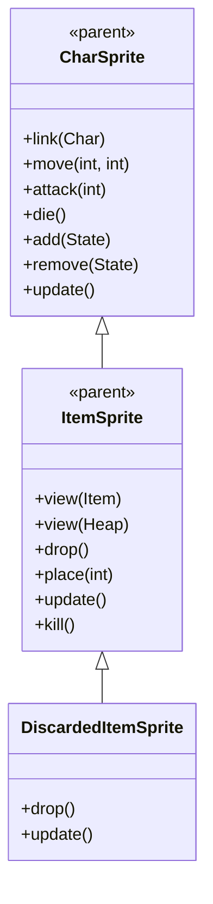

# DiscardedItemSprite 源码详解

## 1. 基本信息

| 属性 | 值 |
|------|-----|
| **文件路径** | core/src/main/java/com/shatteredpixel/shatteredpixeldungeon/sprites/DiscardedItemSprite.java |
| **包名** | com.shatteredpixel.shatteredpixeldungeon.sprites |
| **类类型** | class（非抽象） |
| **继承关系** | extends ItemSprite |
| **代码行数** | 50 |

---

## 类职责

DiscardedItemSprite 是游戏中被丢弃物品的特殊精灵类，继承自 ItemSprite。它专门处理被角色丢弃的物品的视觉效果，具有以下特点：

1. **特殊掉落动画**：重写 drop() 方法提供独特的旋转和缩放效果
2. **自动消失机制**：重写 update() 方法实现随时间逐渐缩小并最终移除
3. **生命周期管理**：物品在丢弃后会自动淡出并从场景中移除
4. **视觉效果优化**：通过 scale、am（alpha multiplier）和 angularSpeed 参数创造生动的丢弃效果

**设计特点**：
- **轻量级扩展**：仅重写必要的方法，复用 ItemSprite 的大部分功能
- **自动清理**：物品丢弃后自动处理生命周期，无需手动移除
- **视觉反馈**：通过旋转、缩放和透明度变化提供清晰的丢弃反馈

---

## 4. 继承与协作关系



---

## 重写方法详解

### drop()

```java
@Override
public void drop() {
    scale.set( 1 );
    am = 1;
    if (emitter != null) emitter.killAndErase();

    origin.set( width/2, height - DungeonTilemap.SIZE/2);
    angularSpeed = 720;
}
```

**方法作用**：初始化丢弃物品的特殊视觉效果。

**参数设置说明**：

| 参数 | 值 | 说明 |
|------|-----|------|
| `scale` | 1 | 重置缩放为正常大小 |
| `am` (alpha multiplier) | 1 | 重置透明度为完全不透明 |
| `emitter` | killAndErase() | 清理可能存在的粒子发射器 |
| `origin` | (width/2, height - SIZE/2) | 设置旋转中心点为底部中心 |
| `angularSpeed` | 720 | 设置角速度为720度/秒（2圈/秒） |

**关键特性**：
- **旋转中心**：origin 设置为底部中心，使物品围绕底部旋转而非中心
- **高速旋转**：720度/秒的角速度创造明显的旋转效果
- **状态重置**：确保物品以完整状态开始丢弃动画

### update()

```java
@Override
public void update() {
    super.update();
    
    scale.set( scale.x -= Game.elapsed );
    y += 12 * Game.elapsed;
    if ((am -= Game.elapsed) <= 0) {
        remove();
    }
}
```

**方法作用**：每帧更新丢弃物品的状态，实现逐渐缩小、下落和淡出效果。

**动画效果组成**：

1. **缩放效果**：`scale.x -= Game.elapsed`
   - 每帧按时间间隔减小缩放比例
   - 创造逐渐缩小的视觉效果

2. **下落效果**：`y += 12 * Game.elapsed`
   - 每帧向下移动12像素/秒
   - 模拟重力下落效果

3. **淡出效果**：`am -= Game.elapsed`
   - 每帧按时间间隔减小透明度
   - 当透明度≤0时自动调用 remove() 从场景中移除

**生命周期**：
- 物品丢弃后开始执行此更新逻辑
- 持续约1秒（am 从1降到0需要1秒）
- 最终自动从场景中移除，无需额外清理

---

## 使用的资源

### 工具类

| 类名 | 用途 |
|------|------|
| `DungeonTilemap` | 获取格子大小常量用于设置旋转原点 |
| `Game` | 获取帧时间间隔 (Game.elapsed) 用于时间相关的动画计算 |

---

## 与其他类的交互

### 继承关系

| 父类 | 继承/重写的功能 |
|------|----------------|
| `ItemSprite` | 所有基础物品显示、纹理管理、位置设置等功能 |
| `CharSprite` | 基础精灵功能（虽然 ItemSprite 不直接继承 CharSprite，但提供了类似的基础功能） |

### 使用场景

DiscardedItemSprite 主要用于以下场景：
- **角色丢弃物品**：当玩家主动丢弃物品时
- **怪物掉落物品**：某些情况下怪物死亡后掉落的临时物品
- **战斗中丢失物品**：特殊游戏事件导致的物品丢弃

### 生命周期管理

- **创建**：由游戏逻辑在需要丢弃物品时创建
- **更新**：每帧自动更新缩放、位置和透明度
- **销毁**：当透明度降到0时自动调用 remove() 方法

---

## 11. 使用示例

### 基本使用

```java
// 创建被丢弃的物品精灵
DiscardedItemSprite discardedItem = new DiscardedItemSprite();

// 设置物品显示（继承自ItemSprite）
discardedItem.view(someItem);

// 设置位置
discardedItem.place(somePosition);

// 触发丢弃动画
discardedItem.drop();

// 后续无需手动管理，物品会自动淡出并移除
```

### 与普通ItemSprite对比

```java
// 普通物品精灵 - 用于地面上的物品堆
ItemSprite normalItem = new ItemSprite();
normalItem.view(itemHeap);
normalItem.place(position);
// 需要手动管理生命周期

// 丢弃物品精灵 - 用于丢弃动画
DiscardedItemSprite discarded = new DiscardedItemSprite();
discarded.view(item);
discarded.place(position);
discarded.drop(); // 自动处理完整生命周期
```

---

## 注意事项

### 设计模式理解

1. **继承重写模式**：通过重写父类的关键方法实现特殊行为
2. **自动生命周期管理**：物品丢弃后的完整生命周期由精灵自身管理
3. **时间驱动动画**：使用 Game.elapsed 确保动画在不同帧率下保持一致

### 性能考虑

1. **内存效率**：自动清理机制避免内存泄漏
2. **计算开销**：简单的数学运算，性能开销极小
3. **渲染优化**：逐渐缩小的物品占用更少渲染资源

### 常见的坑

1. **不要手动移除**：物品会自动移除，不要重复调用 remove()
2. **时间依赖**：动画效果依赖 Game.elapsed，不能在非游戏线程使用
3. **父类方法调用**：update() 中必须调用 super.update() 以确保基础功能正常

### 最佳实践

1. **专用用途**：仅用于需要丢弃动画的场景，不要用于普通物品显示
2. **自动管理**：利用自动生命周期管理，减少手动资源管理
3. **视觉一致性**：丢弃效果与游戏整体风格保持一致