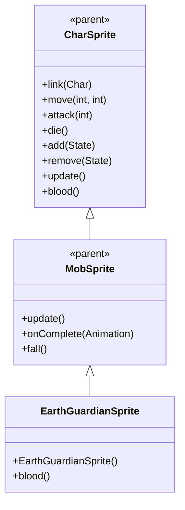

# EarthGuardianSprite 源码详解

## 1. 基本信息

| 属性 | 值 |
|------|-----|
| **文件路径** | core/src/main/java/com/shatteredpixel/shatteredpixeldungeon/sprites/EarthGuardianSprite.java |
| **包名** | com.shatteredpixel.shatteredpixeldungeon.sprites |
| **类类型** | class（非抽象） |
| **继承关系** | extends MobSprite |
| **代码行数** | 56 |

---

## 类职责

EarthGuardianSprite 是游戏中大地守护者怪物的精灵类，继承自 MobSprite。它负责加载大地守护者的纹理资源并定义其各种动画帧序列，同时提供特殊的血液颜色：

1. **纹理加载**：使用 Assets.Sprites.GUARDIAN 纹理集
2. **动画定义**：为 idle、run、attack、die 四种状态定义具体的帧序列
3. **帧尺寸设置**：指定纹理帧的尺寸为 12x15 像素
4. **特殊血液颜色**：重写 blood() 方法提供棕色血液效果
5. **默认状态**：初始化时自动播放 idle 动画

**设计特点**：
- **复杂 Idle 序列**：7帧序列创造自然的呼吸/等待效果
- **死亡动画回退**：最后一帧重复，创造特殊的死亡结束效果
- **生物特征匹配**：棕色血液符合大地/岩石生物的特征

---

## 4. 继承与协作关系



---

## 构造方法详解

### EarthGuardianSprite()

```java
public EarthGuardianSprite() {
    super();
    
    texture( Assets.Sprites.GUARDIAN );
    
    TextureFilm frames = new TextureFilm( texture, 12, 15 );
    
    idle = new Animation( 2, true );
    idle.frames( frames, 0, 0, 0, 0, 0, 1, 1 );
    
    run = new Animation( 15, true );
    run.frames( frames, 2, 3, 4, 5, 6, 7 );
    
    attack = new Animation( 12, false );
    attack.frames( frames, 8, 9, 10 );
    
    die = new Animation( 5, false );
    die.frames( frames, 11, 12, 13, 14, 15, 15 );
    
    play( idle );
}
```

**构造方法作用**：初始化大地守护者精灵的所有动画。

**纹理和帧设置**：
- **纹理源**：Assets.Sprites.GUARDIAN
- **帧尺寸**：12 像素宽 × 15 像素高
- **帧总数**：16 帧（索引 0-15）

**动画参数说明**：

| 动画类型 | 帧率 (FPS) | 循环 | 帧序列 | 说明 |
|----------|------------|------|--------|------|
| `idle` | 2 | true | [0, 0, 0, 0, 0, 1, 1] | 闲置状态，大部分时间显示帧0，偶尔切换到帧1 |
| `run` | 15 | true | [2, 3, 4, 5, 6, 7] | 跑动动画，6帧循环 |
| `attack` | 12 | false | [8, 9, 10] | 攻击动画，3帧快速完成攻击动作 |
| `die` | 5 | false | [11, 12, 13, 14, 15, 15] | 死亡动画，最后一帧重复 |

**关键特性**：
- **Idle动画节奏**：低帧率（2 FPS）配合长序列创造缓慢的呼吸效果
- **Run动画流畅性**：6帧跑动序列提供平滑的移动动画
- **Death动画特殊性**：最后两帧都为15，创造特殊的死亡结束姿态

---

## 特殊方法

### blood()

```java
@Override
public int blood() {
    return 0xFF966400;
}
```

**方法作用**：返回大地守护者受伤时的血液颜色。

**颜色说明**：
- **十六进制值**：0xFF966400
- **颜色名称**：深棕色/赭石色
- **设计意图**：符合大地、岩石或土系生物的真实特征，区别于普通怪物的红色血液

**使用场景**：
- 怪物受到伤害时显示的血液粒子效果
- 视觉上区分大地守护者与其他类型的守护者或怪物

---

## 使用的资源

### 纹理资源

| 资源 | 用途 |
|------|------|
| `Assets.Sprites.GUARDIAN` | 守护者系列的通用纹理集 |

### 工具类

| 类名 | 用途 |
|------|------|
| `TextureFilm` | 将大纹理分割成多个小帧用于动画 |

---

## 与其他类的交互

### 继承关系

| 父类 | 继承/重写的功能 |
|------|----------------|
| `MobSprite` | 睡眠状态管理、死亡淡出效果、坠落动画等 |
| `CharSprite` | 所有基础动画、移动、状态效果、粒子系统等，重写 blood() 方法 |

### 关联的怪物类

EarthGuardianSprite 对应的怪物类是 `com.shatteredpixel.shatteredpixeldungeon.actors.mobs.EarthGuardian`，该类定义了大地守护者的行为逻辑，而 EarthGuardianSprite 只负责视觉表现。

### 纹理共享关系

虽然使用 GUARDIAN 纹理集，但 EarthGuardianSprite 是独立的实现，不像 CrystalGuardianSprite 那样有多个变种共享同一纹理。

---

## 11. 使用示例

### 基本使用

```java
// 创建大地守护者精灵
EarthGuardianSprite earthGuardian = new EarthGuardianSprite();

// 关联大地守护者怪物对象
earthGuardian.link(earthGuardianMob);

// 自动播放 idle 动画（构造时已设置）

// 触发动画
earthGuardian.run();     // 播放跑动动画  
earthGuardian.attack(targetPos); // 播放攻击动画
earthGuardian.die();     // 播放死亡动画（包含淡出效果）
```

### 血液效果

```java
// 获取大地守护者血液颜色（通常由游戏引擎自动调用）
int earthBloodColor = earthGuardian.blood(); // 返回 0xFF966400 (深棕色)
```

### 动画控制

```java
// 手动控制动画（通常不需要，由游戏逻辑自动触发）
earthGuardian.play(earthGuardian.idle);   // 播放闲置动画
earthGuardian.play(earthGuardian.run);    // 播放跑动动画
```

---

## 注意事项

### 设计模式理解

1. **生物特征还原**：棕色血液符合大地/土系生物的真实特征
2. **动画节奏控制**：低帧率 idle 动画配合适当的帧序列创造生动效果
3. **分离关注点**：EarthGuardianSprite 只处理视觉表现，行为逻辑在 EarthGuardian 类中

### 性能考虑

1. **内存效率**：合理的纹理帧数量（16帧），适合守护者级别的怪物
2. **渲染优化**：固定帧尺寸便于 GPU 批处理

### 常见的坑

1. **帧序列完整性**：idle 动画的7帧序列必须保持完整以确保呼吸效果自然
2. **死亡动画特殊性**：最后一帧重复是有意设计，不要修改
3. **纹理尺寸匹配**：12x15 的尺寸必须与实际纹理匹配

### 最佳实践

1. **生物特征匹配**：为不同元素/类型的生物设计符合其特征的视觉效果
2. **动画节奏优化**：使用适当的帧率和序列长度创造自然的动作效果
3. **测试动画流畅性**：确保各状态切换平滑连贯