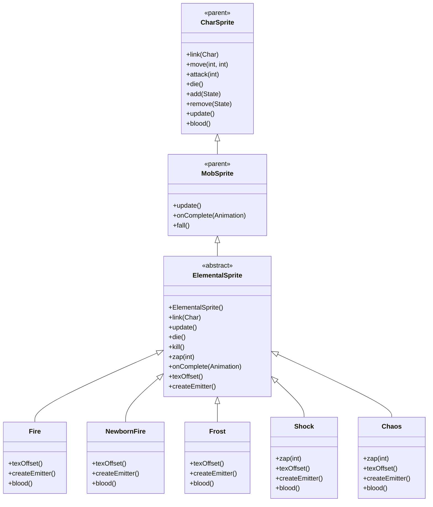

# ElementalSprite 源码详解

## 1. 基本信息

| 属性 | 值 |
|------|-----|
| **文件路径** | core/src/main/java/com/shatteredpixel/shatteredpixeldungeon/sprites/ElementalSprite.java |
| **包名** | com.shatteredpixel.shatteredpixeldungeon.sprites |
| **类类型** | abstract class（抽象类） |
| **继承关系** | extends MobSprite |
| **代码行数** | 260 |
| **嵌套类** | Fire, NewbornFire, Frost, Shock, Chaos（5个静态内部类） |

---

## 类职责

ElementalSprite 是游戏中元素生物怪物的抽象基类精灵，继承自 MobSprite。它提供了一个通用框架，支持五种不同元素类型的变种，每种变种具有独特的粒子效果、魔法导弹类型和血液颜色：

1. **抽象基类设计**：通过 texOffset() 和 createEmitter() 抽象方法支持多种元素变种
2. **动态粒子系统**：每种元素类型使用不同的粒子发射器（火焰、Elmo、魔法、静电、彩虹）
3. **多样化攻击特效**：zap() 方法根据元素类型创建不同的魔法导弹或光束效果
4. **纹理共享优化**：使用 Assets.Sprites.ELEMENTAL 纹理集，通过帧偏移区分元素类型
5. **完整的生命周期管理**：粒子效果的创建、更新和清理

**设计特点**：
- **变种模式**：通过抽象方法和静态内部类实现多种元素类型
- **粒子效果差异化**：每种元素有独特的视觉粒子效果
- **攻击特效定制化**：Shock 元素使用光束而非魔法导弹，Chaos 元素依赖诅咒法杖效果

---

## 4. 继承与协作关系



---

## 构造方法详解

### ElementalSprite()

```java
public ElementalSprite() {
    super();
    
    int c = texOffset();
    
    texture( Assets.Sprites.ELEMENTAL );
    
    TextureFilm frames = new TextureFilm( texture, 12, 14 );
    
    idle = new Animation( 10, true );
    idle.frames( frames, c+0, c+1, c+2 );
    
    run = new Animation( 12, true );
    run.frames( frames, c+0, c+1, c+3 );
    
    attack = new Animation( 15, false );
    attack.frames( frames, c+4, c+5, c+6 );
    
    zap = attack.clone();
    
    die = new Animation( 15, false );
    die.frames( frames, c+7, c+8, c+9, c+10, c+11, c+12, c+13, c+12 );
    
    play( idle );
}
```

**构造方法作用**：初始化元素生物精灵的通用动画框架。

**纹理和帧设置**：
- **纹理源**：Assets.Sprites.ELEMENTAL
- **帧尺寸**：12 像素宽 × 14 像素高
- **帧偏移**：通过 texOffset() 方法动态获取（Fire: 0, NewbornFire: 14, Frost: 28, Shock: 42, Chaos: 56）
- **帧分配**：每种元素有14帧（0-13），总共70帧

**动画参数说明**：

| 动画类型 | 帧率 (FPS) | 循环 | 帧序列模式 | 说明 |
|----------|------------|------|------------|------|
| `idle` | 10 | true | [c+0, c+1, c+2] | 闲置状态，3帧循环 |
| `run` | 12 | true | [c+0, c+1, c+3] | 跑动动画，3帧循环 |
| `attack` | 15 | false | [c+4, c+5, c+6] | 攻击动画，3帧完成 |
| `zap` | 15 | false | 克隆 attack 动画 | 魔法攻击动画 |
| `die` | 15 | false | [c+7...c+13, c+12] | 死亡动画，8帧后回退一帧 |

**关键特性**：
- **Run与Idle差异**：run 使用帧 c+3 而非 c+2，创造不同的移动姿态
- **Zap克隆Attack**：魔法攻击复用近战攻击动画
- **Death动画回退**：最后帧为 c+12（而非 c+13），创造特殊死亡效果

---

## 核心字段和抽象方法

### 核心字段

| 字段名 | 类型 | 说明 |
|--------|------|------|
| `boltType` | int | 魔法导弹类型，由子类在初始化块中设置 |
| `particles` | Emitter | 元素粒子发射器，由 createEmitter() 创建 |

### 抽象方法

```java
protected abstract int texOffset();
protected abstract Emitter createEmitter();
```

**方法作用**：
- `texOffset()`：返回对应元素类型的纹理帧偏移量
- `createEmitter()`：创建对应元素类型的粒子发射器

---

## 生命周期方法

### link(Char ch)

```java
@Override
public void link( Char ch ) {
    super.link( ch );
    
    if (particles == null) {
        particles = createEmitter();
    }
}
```

**方法作用**：关联角色时创建粒子发射器。

### update()

```java
@Override
public void update() {
    super.update();
    
    if (particles != null){
        particles.visible = visible;
    }
}
```

**方法作用**：同步粒子发射器的可见性。

### die() 和 kill()

```java
@Override
public void die() {
    super.die();
    if (particles != null){
        particles.on = false;
    }
}

@Override
public void kill() {
    super.kill();
    if (particles != null){
        particles.killAndErase();
    }
}
```

**方法作用**：
- `die()`：关闭粒子发射器（停止发射新粒子）
- `kill()`：彻底移除粒子发射器（清理内存）

---

## 攻击方法

### zap(int cell) - 基础实现

```java
public void zap( int cell ) {
    super.zap( cell );
    
    MagicMissile.boltFromChar( parent,
            boltType,
            this,
            cell,
            new Callback() {
                @Override
                public void call() {
                    ((Elemental)ch).onZapComplete();
                }
            } );
    Sample.INSTANCE.play( Assets.Sounds.ZAP );
}
```

**方法作用**：执行标准魔法导弹攻击。

### 特殊变种重写

- **Shock.zap()**：使用 Beam.LightRay 光束而非魔法导弹
- **Chaos.zap()**：调用 super.super.zap() 并依赖诅咒法杖效果

---

## 静态内部类详解

### Fire 类

```java
public static class Fire extends ElementalSprite {
    {
        boltType = MagicMissile.FIRE;
    }
    @Override protected int texOffset() { return 0; }
    @Override protected Emitter createEmitter() {
        Emitter emitter = emitter();
        emitter.pour( FlameParticle.FACTORY, 0.06f );
        return emitter;
    }
    @Override public int blood() { return 0xFFFFBB33; }
}
```

- **帧偏移**：0（使用帧 0-13）
- **魔法类型**：MagicMissile.FIRE（火焰）
- **粒子效果**：FlameParticle（火焰粒子）
- **血液颜色**：0xFFFFBB33（橙色）

### NewbornFire 类

```java
public static class NewbornFire extends ElementalSprite {
    {
        boltType = MagicMissile.ELMO;
    }
    @Override protected int texOffset() { return 14; }
    @Override protected Emitter createEmitter() {
        Emitter emitter = emitter();
        emitter.pour( ElmoParticle.FACTORY, 0.06f );
        return emitter;
    }
    @Override public int blood() { return 0xFF85FFC8; }
}
```

- **帧偏移**：14（使用帧 14-27）
- **魔法类型**：MagicMissile.ELMO（Elmo魔法）
- **粒子效果**：ElmoParticle（Elmo粒子）
- **血液颜色**：0xFF85FFC8（浅绿色）

### Frost 类

```java
public static class Frost extends ElementalSprite {
    {
        boltType = MagicMissile.FROST;
    }
    @Override protected int texOffset() { return 28; }
    @Override protected Emitter createEmitter() {
        Emitter emitter = emitter();
        emitter.pour( MagicMissile.MagicParticle.FACTORY, 0.06f );
        return emitter;
    }
    @Override public int blood() { return 0xFF8EE3FF; }
}
```

- **帧偏移**：28（使用帧 28-41）
- **魔法类型**：MagicMissile.FROST（霜冻）
- **粒子效果**：MagicParticle（魔法粒子）
- **血液颜色**：0xFF8EE3FF（浅蓝色）

### Shock 类

```java
public static class Shock extends ElementalSprite {
    //overrides zap to use LightRay instead of MagicMissile
    @Override protected int texOffset() { return 42; }
    @Override protected Emitter createEmitter() {
        Emitter emitter = emitter();
        emitter.pour( SparkParticle.STATIC, 0.06f );
        return emitter;
    }
    @Override public int blood() { return 0xFFFFFF85; }
}
```

- **帧偏移**：42（使用帧 42-55）
- **魔法类型**：无（重写 zap 使用光束）
- **粒子效果**：SparkParticle.STATIC（静电粒子）
- **血液颜色**：0xFFFFFF85（半透明白色）
- **特殊攻击**：使用 Beam.LightRay 光束特效

### Chaos 类

```java
public static class Chaos extends ElementalSprite {
    //relies on cursed wand for effects
    @Override protected int texOffset() { return 56; }
    @Override protected Emitter createEmitter() {
        Emitter emitter = emitter();
        emitter.pour( RainbowParticle.BURST, 0.025f );
        return emitter;
    }
    @Override public int blood() { return 0xFFE3E3E3; }
}
```

- **帧偏移**：56（使用帧 56-69）
- **魔法类型**：无（依赖诅咒法杖效果）
- **粒子效果**：RainbowParticle.BURST（彩虹爆发粒子）
- **血液颜色**：0xFFE3E3E3（浅灰色）
- **特殊攻击**：调用 super.super.zap() 并依赖外部效果

---

## 使用的资源

### 纹理和音频资源

| 资源 | 用途 |
|------|------|
| `Assets.Sprites.ELEMENTAL` | 元素生物的完整纹理集 |
| `Assets.Sounds.ZAP` | 魔法攻击音效 |
| `Assets.Sounds.RAY` | 光束攻击音效（Shock专用） |

### 效果和工具类

| 类名 | 用途 |
|------|------|
| `TextureFilm` | 纹理帧管理 |
| `MagicMissile` | 魔法导弹特效 |
| `Beam.LightRay` | 光束特效（Shock专用） |
| `FlameParticle` | 火焰粒子（Fire专用） |
| `ElmoParticle` | Elmo粒子（NewbornFire专用） |
| `MagicParticle` | 魔法粒子（Frost专用） |
| `SparkParticle` | 静电粒子（Shock专用） |
| `RainbowParticle` | 彩虹粒子（Chaos专用） |

---

## 与其他类的交互

### 继承关系

| 父类 | 继承/重写的功能 |
|------|----------------|
| `MobSprite` | 睡眠状态管理、死亡淡出效果、坠落动画等 |
| `CharSprite` | 所有基础动画、移动、状态效果、粒子系统等 |

### 关联的怪物类

ElementalSprite 对应的怪物类是 `com.shatteredpixel.shatteredpixeldungeon.actors.mobs.Elemental`，该类定义了元素生物的行为逻辑。

### 实际使用方式

由于 ElementalSprite 是抽象类，实际使用时需要实例化具体的元素种类：

```java
// 创建火焰元素
ElementalSprite fireElemental = new ElementalSprite.Fire();

// 创建新生火焰元素  
ElementalSprite newbornFire = new ElementalSprite.NewbornFire();

// 创建霜冻元素
ElementalSprite frostElemental = new ElementalSprite.Frost();

// 创建闪电元素
ElementalSprite shockElemental = new ElementalSprite.Shock();

// 创建混沌元素
ElementalSprite chaosElemental = new ElementalSprite.Chaos();
```

---

## 11. 使用示例

### 基本使用

```java
// 创建具体元素类型的精灵
ElementalSprite elemental = new ElementalSprite.Fire();

// 关联元素怪物对象
elemental.link(elementalMob);

// 自动播放 idle 动画和粒子效果

// 触发动画
elemental.run();     // 播放跑动动画
elemental.attack(targetPos); // 播放近战攻击动画
elemental.zap(enemyCell);    // 播放元素攻击动画
elemental.die();     // 播放死亡动画（自动关闭粒子）
```

### 粒子效果管理

```java
// 粒子效果自动创建和管理
// 不同元素类型自动使用对应的粒子效果
ElementalSprite.Fire fire = new ElementalSprite.Fire();
// 自动创建 FlameParticle 粒子

ElementalSprite.Shock shock = new ElementalSprite.Shock();
// 自动创建 SparkParticle.STATIC 粒子
```

### 特殊攻击处理

```java
// Shock 元素使用光束攻击
ElementalSprite.Shock shock = new ElementalSprite.Shock();
shock.zap(targetCell); // 创建 LightRay 光束而非魔法导弹

// Chaos 元素依赖诅咒法杖效果
ElementalSprite.Chaos chaos = new ElementalSprite.Chaos();
chaos.zap(targetCell); // 调用基础 zap 并依赖外部效果
```

---

## 注意事项

### 设计模式理解

1. **模板方法模式**：基类定义算法骨架，子类提供具体实现
2. **工厂模式**：createEmitter() 作为粒子工厂方法
3. **变种模式**：通过静态内部类提供具体的元素变种

### 性能考虑

1. **内存优化**：五种元素共用同一纹理，大幅减少资源占用
2. **粒子管理**：完善的粒子生命周期管理避免内存泄漏
3. **条件初始化**：particles 仅在第一次 link 时创建

### 常见的坑

1. **不能直接实例化**：ElementalSprite 是抽象类，必须使用具体变种
2. **帧偏移计算**：确保 texOffset() 返回值间隔14（每种元素14帧）
3. **Shock特殊处理**：zap() 方法被重写，不使用 MagicMissile

### 最佳实践

1. **遵循变种模式**：为需要多变种的怪物采用类似的抽象基类设计
2. **粒子效果匹配**：确保粒子效果与元素类型保持视觉一致性
3. **资源共享优先**：尽可能让相似怪物共用纹理资源