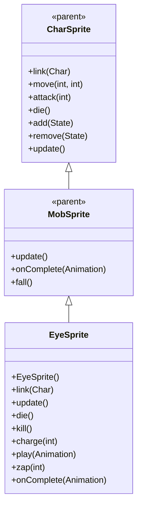

# EyeSprite 源码详解

## 1. 基本信息

| 属性 | 值 |
|------|-----|
| **文件路径** | core/src/main/java/com/shatteredpixel/shatteredpixeldungeon/sprites/EyeSprite.java |
| **包名** | com.shatteredpixel.shatteredpixeldungeon.sprites |
| **类类型** | class（非抽象） |
| **继承关系** | extends MobSprite |
| **代码行数** | 141 |

---

## 类职责

EyeSprite 是游戏中眼睛怪物的精灵类，继承自 MobSprite。作为具有远程死亡凝视能力的特殊怪物，它具有以下复杂功能：

1. **充能动画系统**：包含专用的 charging 动画和粒子效果
2. **死亡射线特效**：zap() 方法创建 Beam.DeathRay 死亡射线光束
3. **粒子特效管理**：充能时显示 MagicMissile.MagicParticle.ATTRACTING 粒子
4. **状态同步机制**：通过重写 play() 方法自动控制粒子开关
5. **特殊攻击流程**：结合充电、射击、死亡凝视的完整攻击序列

**设计特点**：
- **充能可视化**：通过粒子效果和专门动画表现充能状态
- **精准射线定位**：从眼睛中心发射到目标中心或位置
- **完整的生命周期管理**：粒子效果的创建、更新和清理

---

## 4. 继承与协作关系



---

## 核心字段

### 动画和特效字段

| 字段名 | 类型 | 说明 |
|--------|------|------|
| `zapPos` | int | 记录 zap 攻击的目标位置 |
| `charging` | Animation | 充电动画（帧3和帧4循环） |
| `chargeParticles` | Emitter | 充能粒子发射器 |

---

## 构造方法详解

### EyeSprite()

```java
public EyeSprite() {
    super();
    
    texture( Assets.Sprites.EYE );
    
    TextureFilm frames = new TextureFilm( texture, 16, 18 );
    
    idle = new Animation( 8, true );
    idle.frames( frames, 0, 1, 2 );

    charging = new Animation( 12, true);
    charging.frames( frames, 3, 4 );
    
    run = new Animation( 12, true );
    run.frames( frames, 5, 6 );
    
    attack = new Animation( 8, false );
    attack.frames( frames, 4, 3 );
    zap = attack.clone();
    
    die = new Animation( 8, false );
    die.frames( frames, 7, 8, 9 );
    
    play( idle );
}
```

**构造方法作用**：初始化眼睛精灵的所有动画。

**纹理和帧设置**：
- **纹理源**：Assets.Sprites.EYE
- **帧尺寸**：16 像素宽 × 18 像素高
- **帧总数**：10 帧（索引 0-9）

**动画参数说明**：

| 动画类型 | 帧率 (FPS) | 循环 | 帧序列 | 说明 |
|----------|------------|------|--------|------|
| `idle` | 8 | true | [0, 1, 2] | 闲置状态，3帧循环表现眼睛眨动 |
| `charging` | 12 | true | [3, 4] | 充电动画，2帧循环表现充能过程 |
| `run` | 12 | true | [5, 6] | 跑动动画，2帧循环 |
| `attack` | 8 | false | [4, 3] | 攻击动画，反向播放充能帧 |
| `zap` | 8 | false | 克隆 attack | 死亡射线动画 |
| `die` | 8 | false | [7, 8, 9] | 死亡动画，3帧完成 |

**关键特性**：
- **Attack与Charging关联**：attack 动画反向播放 charging 的帧序列 [4, 3]
- **Zap克隆Attack**：死亡射线复用攻击动画
- **Idle眼睛效果**：[0, 1, 2] 序列模拟自然的眼睛眨动

---

## 生命周期方法

### link(Char ch)

```java
@Override
public void link(Char ch) {
    super.link(ch);
    
    chargeParticles = centerEmitter();
    chargeParticles.autoKill = false;
    chargeParticles.pour(MagicMissile.MagicParticle.ATTRACTING, 0.05f);
    chargeParticles.on = false;
    
    if (((Eye)ch).beamCharged) play(charging);
}
```

**方法作用**：关联角色时初始化充能粒子效果并检查初始充能状态。

**粒子配置**：
- **类型**：MagicMissile.MagicParticle.ATTRACTING（吸引粒子）
- **发射率**：0.05f（每秒5个粒子）
- **自动清理**：autoKill = false（手动管理生命周期）
- **初始状态**：on = false（默认关闭）

### update()

```java
@Override
public void update() {
    super.update();
    if (chargeParticles != null){
        chargeParticles.pos( center() );
        chargeParticles.visible = visible;
    }
}
```

**方法作用**：同步粒子位置和可见性。

### die() 和 kill()

```java
@Override
public void die() {
    super.die();
    if (chargeParticles != null){
        chargeParticles.on = false;
    }
}

@Override
public void kill() {
    super.kill();
    if (chargeParticles != null){
        chargeParticles.killAndErase();
    }
}
```

**方法作用**：
- `die()`：关闭充能粒子
- `kill()`：彻底清理充能粒子

---

## 特殊方法详解

### charge(int pos)

```java
public void charge( int pos ){
    turnTo(ch.pos, pos);
    play(charging);
    if (visible) Sample.INSTANCE.play( Assets.Sounds.CHARGEUP );
}
```

**方法作用**：开始充能过程。

**充能流程**：
1. **转向目标**：调用 turnTo() 面向目标位置
2. **播放动画**：切换到 charging 动画
3. **播放音效**：Assets.Sounds.CHARGEUP（仅当可见时）

### play(Animation anim)

```java
@Override
public void play(Animation anim) {
    if (chargeParticles != null) chargeParticles.on = anim == charging;
    super.play(anim);
}
```

**方法作用**：重写 play 方法自动控制粒子开关。

**智能粒子控制**：
- 仅当播放 charging 动画时开启粒子
- 播放其他动画时自动关闭粒子
- 确保粒子效果与动画状态完全同步

### zap(int pos)

```java
@Override
public void zap( int pos ) {
    zapPos = pos;
    super.zap( pos );
}
```

**方法作用**：记录目标位置并开始 zap 动画。

### onComplete(Animation anim)

```java
@Override
public void onComplete( Animation anim ) {
    super.onComplete( anim );
    
    if (anim == zap) {
        idle();
        if (Actor.findChar(zapPos) != null){
            parent.add(new Beam.DeathRay(center(), Actor.findChar(zapPos).sprite.center()));
        } else {
            parent.add(new Beam.DeathRay(center(), DungeonTilemap.raisedTileCenterToWorld(zapPos)));
        }
        Sample.INSTANCE.play( Assets.Sounds.RAY );
        ((Eye)ch).deathGaze();
        ch.next();
    } else if (anim == die){
        chargeParticles.killAndErase();
    }
}
```

**方法作用**：处理动画完成事件，特别是 zap 完成后的死亡射线效果。

**死亡射线流程**：
1. **切换回 idle**：zap 完成后回到基础状态
2. **创建 DeathRay**：
   - 如果目标存在：从眼睛中心指向目标精灵中心
   - 如果目标不存在：从眼睛中心指向目标位置
3. **播放音效**：Assets.Sounds.RAY
4. **触发怪物逻辑**：调用 deathGaze() 和 next()

---

## 使用的资源

### 纹理和音频资源

| 资源 | 用途 |
|------|------|
| `Assets.Sprites.EYE` | 眼睛怪物的完整纹理集 |
| `Assets.Sounds.CHARGEUP` | 充能音效 |
| `Assets.Sounds.RAY` | 死亡射线音效 |

### 效果和工具类

| 类名 | 用途 |
|------|------|
| `TextureFilm` | 纹理帧管理 |
| `Beam.DeathRay` | 死亡射线光束特效 |
| `MagicMissile.MagicParticle` | 充能粒子效果 |
| `Actor` | 查找目标角色 |
| `DungeonTilemap` | 坐标转换 |

---

## 与其他类的交互

### 继承关系

| 父类 | 继承/重写的功能 |
|------|----------------|
| `MobSprite` | 睡眠状态管理、死亡淡出效果、坠落动画等 |
| `CharSprite` | 所有基础动画、移动、状态效果、粒子系统等 |

### 关联的怪物类

EyeSprite 对应的怪物类是 `com.shatteredpixel.shatteredpixeldungeon.actors.mobs.Eye`，该类定义了眼睛怪物的行为逻辑，包括充能状态管理、死亡凝视攻击等。

### 系统交互

- **粒子系统**：完善的粒子生命周期管理
- **音效系统**：充能和射击的双重音效反馈
- **射线系统**：精准的 DeathRay 光束定位

---

## 11. 使用示例

### 基本使用

```java
// 创建眼睛怪物精灵
EyeSprite eye = new EyeSprite();

// 关联眼睛怪物对象
eye.link(eyeMob);

// 自动播放 idle 动画（眼睛眨动）

// 触发充能
eye.charge(targetPosition); // 开始充能并转向目标

// 触发死亡射线
eye.zap(targetPosition);    // 播放射击动画并创建 DeathRay

// 死亡处理
eye.die();                  // 关闭粒子并播放死亡动画
```

### 充能状态管理

```java
// 充能粒子自动管理
// 当播放 charging 动画时自动开启粒子
// 当播放其他动画时自动关闭粒子
eye.play(eye.charging);     // 粒子开启
eye.play(eye.idle);         // 粒子关闭
```

### 死亡射线创建

```java
// DeathRay 自动处理目标定位
eye.zap(enemyPosition);     // 如果 enemy 存在，指向其中心
eye.zap(emptyPosition);     // 如果位置为空，指向该坐标
```

---

## 注意事项

### 设计模式理解

1. **状态同步模式**：通过重写 play() 方法实现动画与粒子的自动同步
2. **精确特效定位**：DeathRay 从眼睛中心精确指向目标
3. **完整攻击流程**：充能 → 射击 → 死亡凝视的三阶段攻击

### 性能考虑

1. **粒子管理**：手动控制 autoKill 避免意外清理
2. **条件音效**：仅在可见时播放充能音效，避免无效音频
3. **内存清理**：死亡时彻底清理粒子发射器

### 常见的坑

1. **粒子同步**：确保 chargeParticles.on 与动画状态完全一致
2. **目标查找**：Actor.findChar() 可能返回 null，需要空值检查
3. **坐标转换**：DungeonTilemap.raisedTileCenterToWorld() 用于世界坐标转换

### 最佳实践

1. **自动状态管理**：通过重写关键方法实现自动化的状态同步
2. **精确特效定位**：为远程攻击提供准确的视觉反馈
3. **完整攻击反馈**：结合视觉（粒子、射线）、听觉（音效）提供沉浸式体验