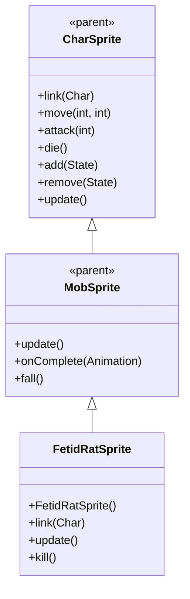

# FetidRatSprite 源码详解

## 1. 基本信息

| 属性 | 值 |
|------|-----|
| **文件路径** | core/src/main/java/com/shatteredpixel/shatteredpixeldungeon/sprites/FetidRatSprite.java |
| **包名** | com.shatteredpixel.shatteredpixeldungeon.sprites |
| **类类型** | class（非抽象） |
| **继承关系** | extends MobSprite |
| **代码行数** | 84 |

---

## 类职责

FetidRatSprite 是游戏中腐臭老鼠怪物的精灵类，继承自 MobSprite。它与普通老鼠共用同一套纹理资源，但使用不同的帧偏移，并提供特殊的恶臭粒子效果：

1. **共享纹理资源**：使用 Assets.Sprites.RAT 纹理集，通过高帧偏移访问不同部分
2. **动画定义**：为 idle、run、attack、die 四种状态定义具体的帧序列
3. **恶臭粒子效果**：持续发射 Speck.STENCH 粒子表现腐臭特征
4. **帧尺寸设置**：指定纹理帧的尺寸为 16x15 像素（与普通 RatSprite 相同）

**设计特点**：
- **资源共享优化**：与 RatSprite 共用纹理，减少资源重复
- **持续粒子效果**：恶臭粒子持续发射，体现腐臭老鼠的独特特征
- **高帧偏移**：使用帧索引 32-46，表明纹理集包含大量帧

---

## 4. 继承与协作关系



---

## 构造方法详解

### FetidRatSprite()

```java
public FetidRatSprite() {
    super();
    
    texture( Assets.Sprites.RAT );
    
    TextureFilm frames = new TextureFilm( texture, 16, 15 );
    
    idle = new Animation( 2, true );
    idle.frames( frames, 32, 32, 32, 33 );
    
    run = new Animation( 10, true );
    run.frames( frames, 38, 39, 40, 41, 42 );
    
    attack = new Animation( 15, false );
    attack.frames( frames, 34, 35, 36, 37, 32 );
    
    die = new Animation( 10, false );
    die.frames( frames, 43, 44, 45, 46 );
    
    play( idle );
}
```

**构造方法作用**：初始化腐臭老鼠精灵的所有动画。

**纹理和帧设置**：
- **纹理源**：Assets.Sprites.RAT（与 RatSprite 共享）
- **帧尺寸**：16 像素宽 × 15 像素高
- **帧偏移范围**：32-46（高索引区域）
- **帧总数**：至少 47 帧（索引 0-46）

**动画参数说明**：

| 动画类型 | 帧率 (FPS) | 循环 | 帧序列 | 说明 |
|----------|------------|------|--------|------|
| `idle` | 2 | true | [32, 32, 32, 33] | 闲置状态，大部分时间显示帧32，偶尔切换到帧33 |
| `run` | 10 | true | [38, 39, 40, 41, 42] | 跑动动画，5帧循环 |
| `attack` | 15 | false | [34, 35, 36, 37, 32] | 攻击动画，从准备到恢复，最后回到帧32 |
| `die` | 10 | false | [43, 44, 45, 46] | 死亡动画，4帧播放一次 |

**关键特性**：
- **Idle动画设计**：帧序列为 [32, 32, 32, 33] 表示大部分时间保持静止（帧32），偶尔有小动作（帧33）
- **Attack动画完整性**：攻击完成后回到帧32，确保角色回到基础姿态
- **高帧偏移**：使用 32+ 的帧索引，表明 RAT 纹理集非常大

---

## 核心字段

### 粒子特效字段

| 字段名 | 类型 | 说明 |
|--------|------|------|
| `cloud` | Emitter | 恶臭粒子发射器，持续发射 Speck.STENCH 粒子 |

---

## 生命周期方法

### link(Char ch)

```java
@Override
public void link( Char ch ) {
    super.link( ch );
    
    if (cloud == null) {
        cloud = emitter();
        cloud.pour( Speck.factory( Speck.STENCH ), 0.7f );
    }
}
```

**方法作用**：关联角色时创建恶臭粒子发射器。

**粒子配置**：
- **类型**：Speck.STENCH（恶臭粒子）
- **发射率**：0.7f（每秒7个粒子，较高频率）
- **条件创建**：仅在第一次调用时创建，避免重复

### update()

```java
@Override
public void update() {
    super.update();
    
    if (cloud != null) {
        cloud.visible = visible;
    }
}
```

**方法作用**：同步恶臭粒子的可见性。

### kill()

```java
@Override
public void kill() {
    super.kill();
    
    if (cloud != null) {
        cloud.on = false;
    }
}
```

**方法作用**：彻底移除时关闭恶臭粒子发射器。

**注意**：这里只关闭粒子（cloud.on = false），没有调用 killAndErase()，可能是因为粒子会自动清理。

---

## 使用的资源

### 纹理资源

| 资源 | 用途 |
|------|------|
| `Assets.Sprites.RAT` | 老鼠系列的通用纹理集（包含普通和腐臭变种） |

### 效果和工具类

| 类名 | 用途 |
|------|------|
| `TextureFilm` | 将大纹理分割成多个小帧用于动画 |
| `Speck` | 创建恶臭粒子效果 |

---

## 与其他类的交互

### 继承关系

| 父类 | 继承的功能 |
|------|-----------|
| `MobSprite` | 睡眠状态管理、死亡淡出效果、坠落动画等 |
| `CharSprite` | 所有基础动画、移动、状态效果、粒子系统等 |

### 资源共享关系

| 共享类 | 共享资源 | 帧范围 | 说明 |
|--------|----------|--------|------|
| `RatSprite` | Assets.Sprites.RAT | 0-14 vs 32-46 | 同一套纹理集，完全不重叠的帧区域 |

### 关联的怪物类

FetidRatSprite 对应的怪物类是 `com.shatteredpixel.shatteredpixeldungeon.actors.mobs.FetidRat`，该类定义了腐臭老鼠的行为逻辑，而 FetidRatSprite 只负责视觉表现。

---

## 11. 使用示例

### 基本使用

```java
// 创建腐臭老鼠精灵
FetidRatSprite fetidRat = new FetidRatSprite();

// 关联腐臭老鼠怪物对象
fetidRat.link(fetidRatMob);

// 自动播放 idle 动画（构造时已设置）
// 自动开始发射恶臭粒子

// 触发动画
fetidRat.run();     // 播放跑动动画  
fetidRat.attack(targetPos); // 播放攻击动画
fetidRat.die();     // 播放死亡动画（包含淡出效果）
```

### 粒子效果管理

```java
// 恶臭粒子自动管理
// 创建时自动开始发射
// 可见性自动同步
// 销毁时自动关闭
```

### 纹理共享示例

```java
// RatSprite 和 FetidRatSprite 都使用同一纹理集
RatSprite normalRat = new RatSprite();             // 使用帧 0-14
FetidRatSprite fetidRat = new FetidRatSprite();   // 使用帧 32-46
```

---

## 注意事项

### 设计模式理解

1. **资源共享策略**：相似怪物共用纹理集，通过高帧偏移区分变种
2. **持续特效**：恶臭粒子持续发射，体现怪物的独特特征
3. **分离关注点**：FetidRatSprite 只处理视觉表现，行为逻辑在 FetidRat 类中

### 性能考虑

1. **内存优化**：共享纹理减少 GPU 内存占用
2. **粒子开销**：较高的粒子发射率（0.7f）会产生一定性能开销
3. **渲染效率**：固定帧尺寸便于 GPU 批处理

### 常见的坑

1. **帧偏移计算**：确保高帧偏移（32+）与纹理集实际布局匹配
2. **粒子清理**：只关闭粒子而未彻底清理，依赖自动垃圾回收
3. **纹理尺寸匹配**：16x15 的尺寸必须与实际纹理匹配

### 最佳实践

1. **遵循资源共享模式**：创建怪物变种时考虑共享纹理
2. **特效特征匹配**：为特殊怪物设计符合其特征的持续粒子效果
3. **测试动画流畅性**：确保各状态切换自然连贯