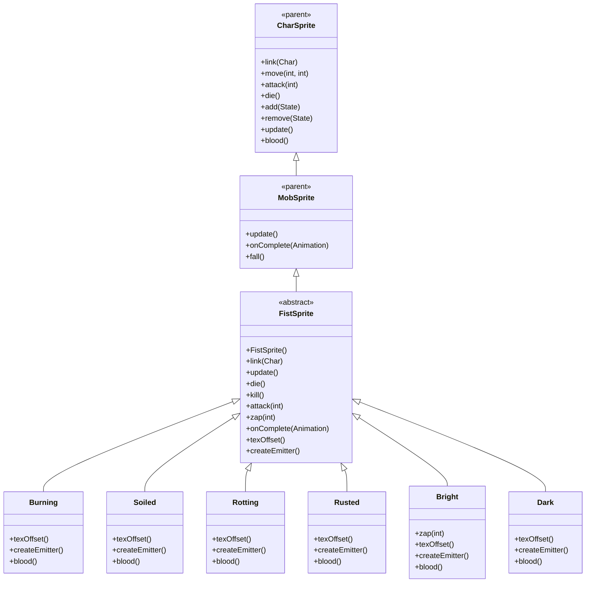

# FistSprite 源码详解

## 1. 基本信息

| 属性 | 值 |
|------|-----|
| **文件路径** | core/src/main/java/com/shatteredpixel/shatteredpixeldungeon/sprites/FistSprite.java |
| **包名** | com.shatteredpixel.shatteredpixeldungeon.sprites |
| **类类型** | abstract class（抽象类） |
| **继承关系** | extends MobSprite |
| **代码行数** | 307 |
| **嵌套类** | Burning, Soiled, Rotting, Rusted, Bright, Dark（6个静态内部类） |

---

## 类职责

FistSprite 是游戏中尤格之拳怪物的抽象基类精灵，继承自 MobSprite。作为最终Boss尤格·索托斯的手下，它提供了一个通用框架，支持六种不同元素类型的拳头变种，每种变种具有独特的粒子效果、魔法导弹类型和血液颜色：

1. **抽象基类设计**：通过 texOffset() 和 createEmitter() 抽象方法支持多种拳类型变种
2. **动态粒子系统**：每种拳类型使用不同的粒子发射器（火焰、树叶、毒性、腐蚀、静电、阴影）
3. **多样化攻击特效**：zap() 方法根据拳类型创建不同的魔法导弹效果，Bright类型使用光束
4. **特殊攻击动画**：attack() 方法包含跳跃和地震效果，模拟重拳砸击
5. **纹理共享优化**：使用 Assets.Sprites.FISTS 纹理集，通过帧偏移区分拳类型

**设计特点**：
- **变种模式**：通过抽象方法和静态内部类实现多种元素拳类型
- **粒子效果差异化**：每种拳类型有独特的视觉粒子效果
- **攻击特效定制化**：Bright拳使用光束而非魔法导弹
- **物理效果增强**：重拳攻击包含跳跃动画和屏幕震动效果

---

## 4. 继承与协作关系



---

## 构造方法详解

### FistSprite()

```java
public FistSprite() {
    super();
    
    int c = texOffset();
    
    texture( Assets.Sprites.FISTS );
    
    TextureFilm frames = new TextureFilm( texture, 24, 17 );
    
    idle = new Animation( 2, true );
    idle.frames( frames, c+0, c+0, c+1 );
    
    run = new Animation( 3, true );
    run.frames( frames, c+0, c+1 );
    
    attack = new Animation( Math.round(1 / SLAM_TIME), false );
    attack.frames( frames, c+0 );
    
    zap = new Animation( 8, false );
    zap.frames( frames, c+0, c+5, c+6 );
    
    die = new Animation( 10, false );
    die.frames( frames, c+0, c+2, c+3, c+4 );
    
    play( idle );
}
```

**构造方法作用**：初始化尤格之拳精灵的通用动画框架。

**常量定义**：
- **SLAM_TIME**：0.33f（重拳砸击持续时间）

**纹理和帧设置**：
- **纹理源**：Assets.Sprites.FISTS
- **帧尺寸**：24 像素宽 × 17 像素高
- **帧偏移**：通过 texOffset() 方法动态获取（Burning: 0, Soiled: 10, Rotting: 20, Rusted: 30, Bright: 40, Dark: 50）
- **帧分配**：每种拳类型有10帧（0-9），总共60帧

**动画参数说明**：

| 动画类型 | 帧率 (FPS) | 循环 | 帧序列模式 | 说明 |
|----------|------------|------|------------|------|
| `idle` | 2 | true | [c+0, c+0, c+1] | 闲置状态，大部分时间显示基础姿态 |
| `run` | 3 | true | [c+0, c+1] | 跑动动画，2帧循环 |
| `attack` | ~3 | false | [c+0] | 重拳攻击，单帧配合跳跃效果 |
| `zap` | 8 | false | [c+0, c+5, c+6] | 魔法攻击，3帧完成 |
| `die` | 10 | false | [c+0, c+2, c+3, c+4] | 死亡动画，4帧完成 |

**关键特性**：
- **Attack特殊处理**：attack 动画仅使用单帧，实际攻击效果通过 jump() 方法实现
- **Zap起始姿态**：从基础姿态开始，然后切换到专用攻击帧
- **Idle节奏控制**：低帧率（2 FPS）配合多数基础姿态创造等待效果

---

## 核心字段和抽象方法

### 核心字段

| 字段名 | 类型 | 说明 |
|--------|------|------|
| `SLAM_TIME` | float | 重拳砸击持续时间（0.33秒） |
| `boltType` | int | 魔法导弹类型，由子类在初始化块中设置 |
| `particles` | Emitter | 元素粒子发射器，由 createEmitter() 创建 |

### 抽象方法

```java
protected abstract int texOffset();
protected abstract Emitter createEmitter();
```

**方法作用**：
- `texOffset()`：返回对应拳类型的纹理帧偏移量
- `createEmitter()`：创建对应拳类型的粒子发射器

---

## 生命周期方法

### link(Char ch)

```java
@Override
public void link( Char ch ) {
    super.link( ch );
    
    if (particles == null) {
        particles = createEmitter();
    }
}
```

**方法作用**：关联角色时创建粒子发射器。

### update()

```java
@Override
public void update() {
    super.update();
    
    if (particles != null){
        particles.visible = visible;
    }
}
```

**方法作用**：同步粒子发射器的可见性。

### die() 和 kill()

```java
@Override
public void die() {
    super.die();
    if (particles != null){
        particles.on = false;
    }
}

@Override
public void kill() {
    super.kill();
    if (particles != null){
        particles.killAndErase();
    }
}
```

**方法作用**：
- `die()`：关闭粒子发射器（停止发射新粒子）
- `kill()`：彻底移除粒子发射器（清理内存）

---

## 攻击方法

### attack(int cell)

```java
@Override
public void attack( int cell ) {
    super.attack( cell );
    
    jump(ch.pos, ch.pos, 9, SLAM_TIME, null );
}
```

**方法作用**：执行重拳砸击攻击。

**攻击效果**：
- **跳跃动画**：jump() 方法创建垂直跳跃效果
- **地震效果**：onComplete() 中触发 PixelScene.shake(4, 0.2f)
- **视觉冲击**：配合单帧 attack 动画创造重击感

### zap(int cell) - 基础实现

```java
public void zap( int cell ) {
    super.zap( cell );
    
    MagicMissile.boltFromChar( parent,
            boltType,
            this,
            cell,
            new Callback() {
                @Override
                public void call() {
                    ((YogFist)ch).onZapComplete();
                }
            } );
    Sample.INSTANCE.play( Assets.Sounds.ZAP );
}
```

**方法作用**：执行标准魔法导弹攻击。

### 特殊变种重写

- **Bright.zap()**：使用 Beam.LightRay 光束而非魔法导弹

### onComplete(Animation anim)

```java
@Override
public void onComplete( Animation anim ) {
    super.onComplete( anim );
    if (anim == attack) {
        PixelScene.shake( 4, 0.2f );
    } else if (anim == zap) {
        idle();
    }
}
```

**方法作用**：
- **Attack完成**：触发屏幕震动效果
- **Zap完成**：切换回 idle 状态

---

## 静态内部类详解

### Burning 类

```java
public static class Burning extends FistSprite {
    { boltType = MagicMissile.FIRE; }
    @Override protected int texOffset() { return 0; }
    @Override protected Emitter createEmitter() {
        Emitter emitter = emitter();
        emitter.pour( FlameParticle.FACTORY, 0.06f );
        return emitter;
    }
    @Override public int blood() { return 0xFFFFDD34; }
}
```

- **帧偏移**：0（使用帧 0-9）
- **魔法类型**：MagicMissile.FIRE（火焰）
- **粒子效果**：FlameParticle（火焰粒子）
- **血液颜色**：0xFFFFDD34（亮橙色）

### Soiled 类

```java
public static class Soiled extends FistSprite {
    { boltType = MagicMissile.FOLIAGE; }
    @Override protected int texOffset() { return 10; }
    @Override protected Emitter createEmitter() {
        Emitter emitter = emitter();
        emitter.pour( LeafParticle.GENERAL, 0.06f );
        return emitter;
    }
    @Override public int blood() { return 0xFF7F5424; }
}
```

- **帧偏移**：10（使用帧 10-19）
- **魔法类型**：MagicMissile.FOLIAGE（植物）
- **粒子效果**：LeafParticle.GENERAL（树叶粒子）
- **血液颜色**：0xFF7F5424（深棕色）

### Rotting 类

```java
public static class Rotting extends FistSprite {
    { boltType = MagicMissile.SPECK + Speck.TOXIC; }
    @Override protected int texOffset() { return 20; }
    @Override protected Emitter createEmitter() {
        Emitter emitter = emitter();
        emitter.pour(Speck.factory(Speck.TOXIC), 0.25f );
        return emitter;
    }
    @Override public int blood() { return 0xFFB8BBA1; }
}
```

- **帧偏移**：20（使用帧 20-29）
- **魔法类型**：MagicMissile.SPECK + Speck.TOXIC（毒性）
- **粒子效果**：Speck.TOXIC（毒性粒子，高频率 0.25f）
- **血液颜色**：0xFFB8BBA1（灰绿色）

### Rusted 类

```java
public static class Rusted extends FistSprite {
    { boltType = MagicMissile.CORROSION; }
    @Override protected int texOffset() { return 30; }
    @Override protected Emitter createEmitter() {
        Emitter emitter = emitter();
        emitter.pour(CorrosionParticle.MISSILE, 0.06f );
        return emitter;
    }
    @Override public int blood() { return 0xFF7F7F7F; }
}
```

- **帧偏移**：30（使用帧 30-39）
- **魔法类型**：MagicMissile.CORROSION（腐蚀）
- **粒子效果**：CorrosionParticle.MISSILE（腐蚀粒子）
- **血液颜色**：0xFF7F7F7F（灰色）

### Bright 类

```java
public static class Bright extends FistSprite {
    { boltType = MagicMissile.RAINBOW; }
    @Override protected int texOffset() { return 40; }
    @Override protected Emitter createEmitter() {
        Emitter emitter = emitter();
        emitter.pour(SparkParticle.STATIC, 0.06f );
        return emitter;
    }
    @Override public void zap( int cell ) {
        super.zap( cell, null );
        ((YogFist)ch).onZapComplete();
        parent.add( new Beam.LightRay(center(), DungeonTilemap.raisedTileCenterToWorld(cell)));
        Sample.INSTANCE.play( Assets.Sounds.RAY );
    }
    @Override public int blood() { return 0xFFFFFFFF; }
}
```

- **帧偏移**：40（使用帧 40-49）
- **魔法类型**：MagicMissile.RAINBOW（彩虹）
- **粒子效果**：SparkParticle.STATIC（静电粒子）
- **血液颜色**：0xFFFFFFFF（纯白色）
- **特殊攻击**：使用 Beam.LightRay 光束特效

### Dark 类

```java
public static class Dark extends FistSprite {
    { boltType = MagicMissile.SHADOW; }
    @Override protected int texOffset() { return 50; }
    @Override protected Emitter createEmitter() {
        Emitter emitter = emitter();
        emitter.pour(ShadowParticle.MISSILE, 0.06f );
        return emitter;
    }
    @Override public int blood() { return 0xFF4A2F53; }
}
```

- **帧偏移**：50（使用帧 50-59）
- **魔法类型**：MagicMissile.SHADOW（阴影）
- **粒子效果**：ShadowParticle.MISSILE（阴影粒子）
- **血液颜色**：0xFF4A2F53（深紫色）

---

## 使用的资源

### 纹理和音频资源

| 资源 | 用途 |
|------|------|
| `Assets.Sprites.FISTS` | 尤格之拳的完整纹理集 |
| `Assets.Sounds.ZAP` | 魔法攻击音效 |
| `Assets.Sounds.RAY` | 光束攻击音效（Bright专用） |

### 效果和工具类

| 类名 | 用途 |
|------|------|
| `TextureFilm` | 纹理帧管理 |
| `MagicMissile` | 魔法导弹特效 |
| `Beam.LightRay` | 光束特效（Bright专用） |
| `FlameParticle` | 火焰粒子（Burning专用） |
| `LeafParticle` | 树叶粒子（Soiled专用） |
| `Speck` | 毒性粒子（Rotting专用） |
| `CorrosionParticle` | 腐蚀粒子（Rusted专用） |
| `SparkParticle` | 静电粒子（Bright专用） |
| `ShadowParticle` | 阴影粒子（Dark专用） |
| `PixelScene` | 屏幕震动效果 |

---

## 与其他类的交互

### 继承关系

| 父类 | 继承/重写的功能 |
|------|----------------|
| `MobSprite` | 睡眠状态管理、死亡淡出效果、坠落动画等 |
| `CharSprite` | 所有基础动画、移动、状态效果、粒子系统等 |

### 关联的怪物类

FistSprite 对应的怪物类是 `com.shatteredpixel.shatteredpixeldungeon.actors.mobs.YogFist`，该类定义了尤格之拳的行为逻辑。

### 实际使用方式

由于 FistSprite 是抽象类，实际使用时需要实例化具体的拳类型：

```java
// 创建燃烧之拳
FistSprite burningFist = new FistSprite.Burning();

// 创建污秽之拳  
FistSprite soiledFist = new FistSprite.Soiled();

// 创建腐烂之拳
FistSprite rottingFist = new FistSprite.Rotting();

// 创建锈蚀之拳
FistSprite rustedFist = new FistSprite.Rusted();

// 创建光明之拳
FistSprite brightFist = new FistSprite.Bright();

// 创建黑暗之拳
FistSprite darkFist = new FistSprite.Dark();
```

---

## 11. 使用示例

### 基本使用

```java
// 创建具体拳类型的精灵
FistSprite fist = new FistSprite.Burning();

// 关联尤格之拳怪物对象
fist.link(fistMob);

// 自动播放 idle 动画和粒子效果

// 触发动画
fist.run();     // 播放跑动动画
fist.attack(targetPos); // 播放重拳攻击（包含跳跃和地震）
fist.zap(enemyCell);    // 播放元素攻击动画
fist.die();     // 播放死亡动画（自动关闭粒子）
```

### 重拳攻击效果

```java
// 重拳攻击会自动：
// 1. 播放单帧 attack 动画
// 2. 执行跳跃效果
// 3. 完成后触发屏幕震动
fist.attack(targetPosition);
```

### 粒子效果管理

```java
// 粒子效果自动创建和管理
// 不同拳类型自动使用对应的粒子效果
FistSprite.Burning burning = new FistSprite.Burning();
// 自动创建 FlameParticle 粒子

FistSprite.Bright bright = new FistSprite.Bright();
// 自动创建 SparkParticle.STATIC 粒子
```

---

## 注意事项

### 设计模式理解

1. **模板方法模式**：基类定义算法骨架，子类提供具体实现
2. **工厂模式**：createEmitter() 作为粒子工厂方法
3. **变种模式**：通过静态内部类提供具体的拳类型变种

### 性能考虑

1. **内存优化**：六种拳类型共用同一纹理，大幅减少资源占用
2. **粒子管理**：完善的粒子生命周期管理避免内存泄漏
3. **条件初始化**：particles 仅在第一次 link 时创建

### 常见的坑

1. **不能直接实例化**：FistSprite 是抽象类，必须使用具体变种
2. **帧偏移计算**：确保 texOffset() 返回值间隔10（每种拳类型10帧）
3. **Bright特殊处理**：zap() 方法被重写，不使用 MagicMissile

### 最佳实践

1. **遵循变种模式**：为需要多变种的怪物采用类似的抽象基类设计
2. **粒子效果匹配**：确保粒子效果与拳类型保持视觉一致性
3. **物理效果增强**：结合跳跃、震动等效果增强攻击冲击力