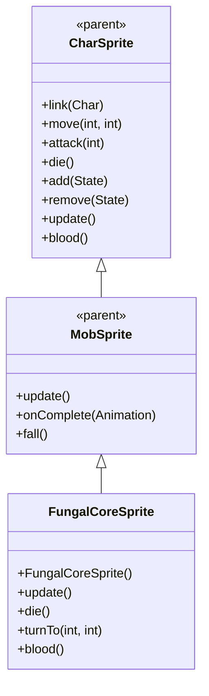

# FungalCoreSprite 源码详解

## 1. 基本信息

| 属性 | 值 |
|------|-----|
| **文件路径** | core/src/main/java/com/shatteredpixel/shatteredpixeldungeon/sprites/FungalCoreSprite.java |
| **包名** | com.shatteredpixel.shatteredpixeldungeon.sprites |
| **类类型** | class（非抽象） |
| **继承关系** | extends MobSprite |
| **代码行数** | 97 |

---

## 类职责

FungalCoreSprite 是游戏中真菌核心怪物的精灵类，继承自 MobSprite。作为静止的核心单位，它具有以下特殊功能：

1. **静态外观设计**：所有动画状态都使用单帧（帧0），体现核心的静止特性
2. **墙壁穿透效果**：通过 DungeonWallsTilemap.skipCells 实现上层墙壁透明化
3. **特殊血液颜色**：重写 blood() 方法提供绿色血液效果
4. **环境交互机制**：自动处理可见性变化时的墙壁状态更新

**设计特点**：
- **极简动画**：所有动画都使用相同的单帧，突出核心的静止本质
- **环境感知**：自动处理与墙壁系统的交互，确保核心完整显示
- **视觉特征匹配**：绿色血液符合真菌生物的特征

---

## 4. 继承与协作关系



---

## 构造方法详解

### FungalCoreSprite()

```java
public FungalCoreSprite(){
    super();
    
    texture( Assets.Sprites.FUNGAL_CORE );
    
    TextureFilm frames = new TextureFilm( texture, 27, 27 );
    
    idle = new Animation( 0, true );
    idle.frames( frames, 0);
    
    run = new Animation( 0, true );
    run.frames( frames, 0);
    
    attack = new Animation( 24, false );
    attack.frames( frames, 0 );
    
    zap = attack.clone();
    
    die = new Animation( 12, false );
    die.frames( frames, 0 );
    
    play( idle );
}
```

**构造方法作用**：初始化真菌核心精灵的基础动画框架。

**纹理和帧设置**：
- **纹理源**：Assets.Sprites.FUNGAL_CORE
- **帧尺寸**：27 像素宽 × 27 像素高（正方形大尺寸）
- **帧总数**：至少1帧（索引0）

**动画参数说明**：

| 动画类型 | 帧率 (FPS) | 循环 | 帧序列 | 说明 |
|----------|------------|------|--------|------|
| `idle` | 0 | true | [0] | 闲置状态，单帧静止显示 |
| `run` | 0 | true | [0] | 跑动状态，单帧静止显示（实际上不移动） |
| `attack` | 24 | false | [0] | 攻击动画，单帧显示 |
| `zap` | 24 | false | 克隆 attack | 魔法攻击动画，单帧显示 |
| `die` | 12 | false | [0] | 死亡动画，单帧显示 |

**关键特性**：
- **零帧率设计**：idle 和 run 的帧率为0，表示完全静止
- **单帧复用**：所有动画状态都使用相同的帧0
- **攻击克隆**：zap 动画克隆 attack 动画，保持一致性

---

## 核心方法详解

### update()

```java
@Override
public void update() {
    super.update();
    if (curAnim != die && ch != null && visible != wasVisible){
        if (visible){
            DungeonWallsTilemap.skipCells.add(ch.pos - 2* Dungeon.level.width());
            DungeonWallsTilemap.skipCells.add(ch.pos - Dungeon.level.width());
        } else {
            DungeonWallsTilemap.skipCells.remove(ch.pos - 2*Dungeon.level.width());
            DungeonWallsTilemap.skipCells.remove(ch.pos - Dungeon.level.width());
        }
        GameScene.updateMap(ch.pos-2*Dungeon.level.width());
        GameScene.updateMap(ch.pos-Dungeon.level.width());
        wasVisible = visible;
    }
}
```

**方法作用**：处理可见性变化时的墙壁穿透效果。

**墙壁穿透机制**：
- **目标位置**：核心上方两个格子（ch.pos - width 和 ch.pos - 2*width）
- **可见时**：将上方格子添加到 skipCells，使墙壁透明
- **不可见时**：从 skipCells 移除，恢复墙壁显示
- **地图更新**：调用 GameScene.updateMap() 立即刷新显示

### die()

```java
@Override
public void die() {
    super.die();
    if (ch != null && visible){
        DungeonWallsTilemap.skipCells.remove(ch.pos - 2*Dungeon.level.width());
        DungeonWallsTilemap.skipCells.remove(ch.pos - Dungeon.level.width());
        GameScene.updateMap(ch.pos-2*Dungeon.level.width());
        GameScene.updateMap(ch.pos-Dungeon.level.width());
    }
}
```

**方法作用**：死亡时清理墙壁穿透状态。

### turnTo(int from, int to)

```java
@Override
public void turnTo(int from, int to) {
    //do nothing
}
```

**方法作用**：核心不会转向，因此为空实现。

### blood()

```java
@Override
public int blood() {
    return 0xFF88CC44;
}
```

**方法作用**：返回真菌核心受伤时的血液颜色。

**颜色说明**：
- **十六进制值**：0xFF88CC44
- **颜色名称**：亮绿色/黄绿色
- **设计意图**：符合真菌生物的真实特征，区别于普通怪物的红色血液

---

## 使用的资源

### 纹理资源

| 资源 | 用途 |
|------|------|
| `Assets.Sprites.FUNGAL_CORE` | 真菌核心的完整纹理集 |

### 效果和工具类

| 类名 | 用途 |
|------|------|
| `TextureFilm` | 将大纹理分割成多个小帧用于动画 |
| `DungeonWallsTilemap` | 控制墙壁透明化的关键组件 |
| `GameScene` | 地图更新和场景管理 |
| `Dungeon` | 获取当前关卡信息 |

---

## 与其他类的交互

### 继承关系

| 父类 | 继承/重写的功能 |
|------|----------------|
| `MobSprite` | 睡眠状态管理、死亡淡出效果、坠落动画等 |
| `CharSprite` | 所有基础动画、移动、状态效果、粒子系统等，重写特定方法 |

### 关联的怪物类

FungalCoreSprite 对应的怪物类是 `com.shatteredpixel.shatteredpixeldungeon.actors.mobs.FungalCore`，该类定义了真菌核心的行为逻辑。

### 地图系统交互

- **DungeonWallsTilemap.skipCells**：存储需要跳过渲染的墙壁格子
- **GameScene.updateMap()**：强制刷新指定格子的显示
- **Dungeon.level.width()**：获取当前关卡宽度用于位置计算

---

## 11. 使用示例

### 基本使用

```java
// 创建真菌核心精灵
FungalCoreSprite fungalCore = new FungalCoreSprite();

// 关联真菌核心怪物对象
fungalCore.link(fungalCoreMob);

// 自动播放 idle 动画（单帧静止显示）

// 触发动画（实际上都是单帧显示）
fungalCore.run();     // 显示单帧（实际上不移动）
fungalCore.attack(targetPos); // 显示单帧攻击姿态
fungalCore.zap(enemyCell);   // 显示单帧魔法攻击
fungalCore.die();     // 显示单帧死亡状态
```

### 墙壁穿透效果

```java
// 墙壁穿透自动处理
// 当核心变为可见时，自动使上方墙壁透明
// 当核心变为不可见或死亡时，自动恢复墙壁显示
```

### 血液效果

```java
// 获取真菌核心血液颜色（通常由游戏引擎自动调用）
int fungalBloodColor = fungalCore.blood(); // 返回 0xFF88CC44 (亮绿色)
```

---

## 注意事项

### 设计模式理解

1. **静态对象设计**：通过零帧率和单帧复用体现核心的静止特性
2. **环境感知设计**：自动处理与墙壁系统的交互，确保正确显示
3. **生物特征还原**：绿色血液符合真菌生物的真实特征

### 性能考虑

1. **内存效率**：仅使用1个纹理帧，资源占用极小
2. **渲染优化**：静态对象减少不必要的渲染计算
3. **地图刷新**：每次可见性变化都会触发两次地图更新，有一定性能成本

### 常见的坑

1. **动画误解**：虽然有 run/attack 等动画，但实际上都是单帧静止显示
2. **墙壁位置计算**：假设核心高度为2格，上方格子计算基于此假设
3. **帧率设置**：帧率为0表示完全静止，不是错误

### 最佳实践

1. **静态对象设计**：为不需要动画的对象采用类似的极简设计
2. **环境交互封装**：将复杂的环境交互逻辑封装在精灵类内部
3. **生物特征匹配**：为不同生物类型设计符合其特征的视觉效果