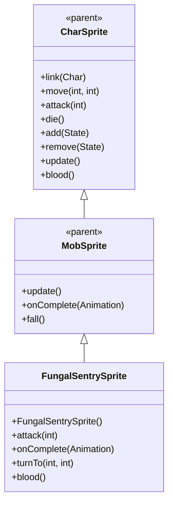

# FungalSentrySprite 源码详解

## 1. 基本信息

| 属性 | 值 |
|------|-----|
| **文件路径** | core/src/main/java/com/shatteredpixel/shatteredpixeldungeon/sprites/FungalSentrySprite.java |
| **包名** | com.shatteredpixel.shatteredpixeldungeon.sprites |
| **类类型** | class（非抽象） |
| **继承关系** | extends MobSprite |
| **代码行数** | 99 |

---

## 类职责

FungalSentrySprite 是游戏中真菌哨兵怪物的精灵类，继承自 MobSprite。作为静止的防御单位，它具有以下特殊功能：

1. **静态外观设计**：所有动画状态都使用单帧（帧0），体现哨兵的静止特性
2. **智能攻击机制**：根据目标距离选择近战或远程毒气攻击
3. **魔法导弹特效**：远程攻击时创建 MagicMissile.POISON 毒气导弹
4. **特殊血液颜色**：重写 blood() 方法提供绿色血液效果

**设计特点**：
- **极简动画**：所有动画都使用相同的单帧，突出哨兵的静止本质
- **距离感知攻击**：自动判断目标距离并选择合适的攻击方式
- **视觉特征匹配**：绿色血液符合真菌生物的特征

---

## 4. 继承与协作关系



---

## 核心字段

### 攻击相关字段

| 字段名 | 类型 | 说明 |
|--------|------|------|
| `cellToAttack` | int | 记录远程攻击的目标位置 |

---

## 构造方法详解

### FungalSentrySprite()

```java
public FungalSentrySprite(){
    super();
    
    texture( Assets.Sprites.FUNGAL_SENTRY );
    
    TextureFilm frames = new TextureFilm( texture, 18, 18 );
    
    idle = new Animation( 0, true );
    idle.frames( frames, 0);
    
    run = new Animation( 0, true );
    run.frames( frames, 0);
    
    attack = new Animation( 24, false );
    attack.frames( frames, 0 );
    
    zap = attack.clone();
    
    die = new Animation( 12, false );
    die.frames( frames, 0 );
    
    play( idle );
}
```

**构造方法作用**：初始化真菌哨兵精灵的基础动画框架。

**纹理和帧设置**：
- **纹理源**：Assets.Sprites.FUNGAL_SENTRY
- **帧尺寸**：18 像素宽 × 18 像素高（正方形）
- **帧总数**：至少1帧（索引0）

**动画参数说明**：

| 动画类型 | 帧率 (FPS) | 循环 | 帧序列 | 说明 |
|----------|------------|------|--------|------|
| `idle` | 0 | true | [0] | 闲置状态，单帧静止显示 |
| `run` | 0 | true | [0] | 跑动状态，单帧静止显示（实际上不移动） |
| `attack` | 24 | false | [0] | 近战攻击动画，单帧显示 |
| `zap` | 24 | false | 克隆 attack | 远程攻击动画，单帧显示 |
| `die` | 12 | false | [0] | 死亡动画，单帧显示 |

**关键特性**：
- **零帧率设计**：idle 和 run 的帧率为0，表示完全静止
- **单帧复用**：所有动画状态都使用相同的帧0
- **攻击克隆**：zap 动画克隆 attack 动画，保持一致性

---

## 核心方法详解

### attack(int cell)

```java
@Override
public void attack( int cell ) {
    if (!Dungeon.level.adjacent( cell, ch.pos )) {
        cellToAttack = cell;
        zap(cell);
    } else {
        super.attack( cell );
    }
}
```

**方法作用**：根据目标距离智能选择攻击方式。

**攻击逻辑**：
- **远程攻击**：如果目标不在相邻格子（!adjacent），则调用 zap() 并记录目标位置
- **近战攻击**：如果目标在相邻格子，则执行标准近战攻击

### onComplete(Animation anim)

```java
@Override
public void onComplete( Animation anim ) {
    if (anim == zap) {
        idle();
        
        MagicMissile.boltFromChar(parent, MagicMissile.POISON, this, cellToAttack, new Callback() {
                    @Override
                    public void call() {
                        ch.onAttackComplete();
                    }
                } );
    } else {
        super.onComplete( anim );
    }
}
```

**方法作用**：处理 zap 动画完成后的魔法导弹创建。

**远程攻击流程**：
1. **切换回 idle**：zap 动画完成后回到静止状态
2. **创建毒气导弹**：MagicMissile.POISON 从哨兵位置指向目标
3. **回调通知**：攻击完成后通知怪物攻击完成

### turnTo(int from, int to)

```java
@Override
public void turnTo(int from, int to) {
    //do nothing
}
```

**方法作用**：哨兵不会转向，因此为空实现。

### blood()

```java
@Override
public int blood() {
    return 0xFF88CC44;
}
```

**方法作用**：返回真菌哨兵受伤时的血液颜色。

**颜色说明**：
- **十六进制值**：0xFF88CC44
- **颜色名称**：亮绿色/黄绿色
- **设计意图**：符合真菌生物的真实特征，与 FungalCoreSprite 保持一致

---

## 使用的资源

### 纹理和特效资源

| 资源 | 用途 |
|------|------|
| `Assets.Sprites.FUNGAL_SENTRY` | 真菌哨兵的完整纹理集 |
| `MagicMissile.POISON` | 毒气魔法导弹特效 |

### 工具类

| 类名 | 用途 |
|------|------|
| `TextureFilm` | 将大纹理分割成多个小帧用于动画 |
| `Dungeon.level` | 判断格子相邻关系 |
| `Callback` | 处理异步攻击完成回调 |

---

## 与其他类的交互

### 继承关系

| 父类 | 继承/重写的功能 |
|------|----------------|
| `MobSprite` | 睡眠状态管理、死亡淡出效果、坠落动画等 |
| `CharSprite` | 所有基础动画、移动、状态效果、粒子系统等，重写特定方法 |

### 关联的怪物类

FungalSentrySprite 对应的怪物类是 `com.shatteredpixel.shatteredpixeldungeon.actors.mobs.FungalSentry`，该类定义了真菌哨兵的行为逻辑。

### 系统交互

- **Dungeon.level.adjacent()**：判断目标是否在相邻格子
- **MagicMissile.boltFromChar()**：创建从角色发射的魔法导弹
- **Callback 系统**：异步通知攻击完成

---

## 11. 使用示例

### 基本使用

```java
// 创建真菌哨兵精灵
FungalSentrySprite sentry = new FungalSentrySprite();

// 关联真菌哨兵怪物对象
sentry.link(sentryMob);

// 自动播放 idle 动画（单帧静止显示）

// 触发动画（根据距离自动选择攻击方式）
sentry.attack(adjacentEnemy);   // 近战攻击（单帧显示）
sentry.attack(distantEnemy);    // 远程攻击（创建毒气导弹）
sentry.die();                  // 显示单帧死亡状态
```

### 智能攻击机制

```java
// 攻击方法自动判断距离：
// - 相邻目标：执行标准 attack 动画
// - 非相邻目标：执行 zap 动画并创建毒气导弹

// 远程攻击会自动：
// 1. 播放 zap 动画（单帧）
// 2. 切换回 idle 状态
// 3. 创建 Poison 魔法导弹
// 4. 完成后通知怪物
```

### 血液效果

```java
// 获取真菌哨兵血液颜色（通常由游戏引擎自动调用）
int sentryBloodColor = sentry.blood(); // 返回 0xFF88CC44 (亮绿色)
```

---

## 注意事项

### 设计模式理解

1. **静态对象设计**：通过零帧率和单帧复用体现哨兵的静止特性
2. **智能攻击模式**：根据环境条件自动选择最合适的攻击方式
3. **生物特征还原**：绿色血液符合真菌生物的真实特征

### 性能考虑

1. **内存效率**：仅使用1个纹理帧，资源占用极小
2. **渲染优化**：静态对象减少不必要的渲染计算
3. **魔法导弹管理**：boltFromChar() 自动处理特效生命周期

### 常见的坑

1. **动画误解**：虽然有 run/attack 等动画，但实际上都是单帧静止显示
2. **距离判断**：Dungeon.level.adjacent() 是核心逻辑，确保正确理解相邻概念
3. **帧率设置**：帧率为0表示完全静止，不是错误

### 最佳实践

1. **静态对象设计**：为不需要动画的对象采用类似的极简设计
2. **环境感知攻击**：根据游戏环境条件智能选择行为
3. **生物特征匹配**：为不同生物类型设计符合其特征的视觉效果