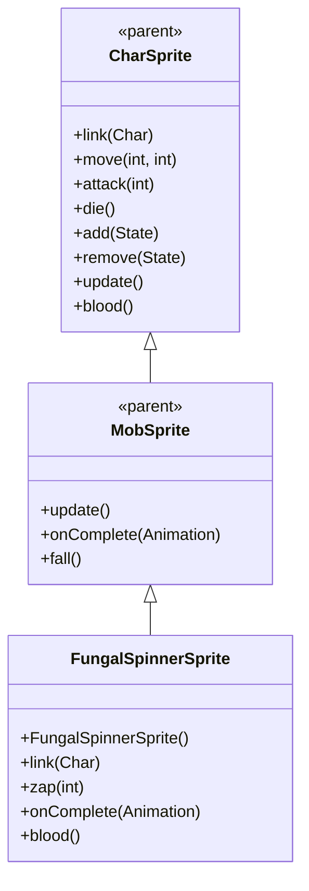

# FungalSpinnerSprite 源码详解

## 1. 基本信息

| 属性 | 值 |
|------|-----|
| **文件路径** | core/src/main/java/com/shatteredpixel/shatteredpixeldungeon/sprites/FungalSpinnerSprite.java |
| **包名** | com.shatteredpixel.shatteredpixeldungeon.sprites |
| **类类型** | class（非抽象） |
| **继承关系** | extends MobSprite |
| **代码行数** | 102 |

---

## 类职责

FungalSpinnerSprite 是游戏中真菌纺锤怪的精灵类，继承自 MobSprite。作为具有远程攻击能力的特殊怪物，它具有以下功能：

1. **复杂动画序列**：idle 动画包含8帧序列，创造自然的等待效果
2. **植物魔法攻击**：zap() 方法创建 MagicMissile.FOLIAGE 植物魔法导弹
3. **特殊渲染属性**：禁用透视提升和阴影，确保正确显示
4. **层级管理**：自动将精灵置于渲染队列后方
5. **特殊血液颜色**：重写 blood() 方法提供绿色血液效果

**设计特点**：
- **生动动画**：复杂的 idle 序列创造自然的生物特征
- **渲染优化**：通过 sendToBack() 确保与其他元素的正确层级关系
- **视觉特征匹配**：绿色血液符合真菌生物的特征

---

## 4. 继承与协作关系



---

## 构造方法详解

### FungalSpinnerSprite()

```java
public FungalSpinnerSprite() {
    super();
    
    perspectiveRaise = 0f;
    
    texture( Assets.Sprites.FUNGAL_SPINNER );
    
    TextureFilm frames = new TextureFilm( texture, 16, 16 );
    
    idle = new MovieClip.Animation( 10, true );
    idle.frames( frames, 0, 0, 0, 0, 0, 1, 0, 1 );
    
    run = new MovieClip.Animation( 15, true );
    run.frames( frames, 0, 2, 0, 3 );
    
    attack = new MovieClip.Animation( 12, false );
    attack.frames( frames, 0, 4, 5, 0 );
    
    zap = attack.clone();
    
    die = new MovieClip.Animation( 12, false );
    die.frames( frames, 6, 7, 8, 9 );
    
    play( idle );
}
```

**构造方法作用**：初始化真菌纺锤怪精灵的所有动画。

**特殊渲染设置**：
- **perspectiveRaise**：0f（禁用透视提升）
- **renderShadow**：false（在 link() 中设置，禁用阴影）

**纹理和帧设置**：
- **纹理源**：Assets.Sprites.FUNGAL_SPINNER
- **帧尺寸**：16 像素宽 × 16 像素高（正方形）
- **帧总数**：10 帧（索引 0-9）

**动画参数说明**：

| 动画类型 | 帧率 (FPS) | 循环 | 帧序列 | 说明 |
|----------|------------|------|--------|------|
| `idle` | 10 | true | [0, 0, 0, 0, 0, 1, 0, 1] | 闲置状态，大部分时间显示帧0，偶尔切换到帧1 |
| `run` | 15 | true | [0, 2, 0, 3] | 跑动动画，4帧循环表现移动姿态 |
| `attack` | 12 | false | [0, 4, 5, 0] | 攻击动画，从准备到恢复，最后回到帧0 |
| `zap` | 12 | false | 克隆 attack | 魔法攻击动画 |
| `die` | 12 | false | [6, 7, 8, 9] | 死亡动画，4帧完整播放 |

**关键特性**：
- **Idle动画节奏**：[0, 0, 0, 0, 0, 1, 0, 1] 序列表示大部分时间静止，偶尔有小动作
- **Run动画对称性**：[0, 2, 0, 3] 创造自然的移动效果
- **Attack动画完整性**：攻击完成后回到帧0，确保角色回到基础姿态

---

## 核心方法详解

### link(Char ch)

```java
@Override
public void link(Char ch) {
    super.link(ch);
    if (parent != null) {
        parent.sendToBack(this);
        if (aura != null){
            parent.sendToBack(aura);
        }
    }
    renderShadow = false;
}
```

**方法作用**：关联角色时配置特殊渲染属性。

**渲染配置**：
- **sendToBack(this)**：将精灵置于渲染队列后方
- **sendToBack(aura)**：如果存在光环效果，也置于后方
- **renderShadow = false**：禁用阴影效果

### zap(int cell)

```java
public void zap( int cell ) {
    super.zap( cell );
    
    MagicMissile.boltFromChar( parent,
            MagicMissile.FOLIAGE,
            this,
            cell,
            new Callback() {
                @Override
                public void call() {
                    ((Spinner)ch).shootWeb();
                }
            } );
    Sample.INSTANCE.play( Assets.Sounds.MISS );
}
```

**方法作用**：执行植物魔法攻击。

**攻击流程**：
1. **调用父类 zap()**：开始 zap 动画
2. **创建植物魔法导弹**：MagicMissile.FOLIAGE 从当前位置指向目标
3. **回调通知**：攻击完成后调用 shootWeb() 方法
4. **播放音效**：Assets.Sounds.MISS

### onComplete(MovieClip.Animation anim)

```java
@Override
public void onComplete( MovieClip.Animation anim ) {
    if (anim == zap) {
        play( run );
    }
    super.onComplete( anim );
}
```

**方法作用**：处理 zap 动画完成后的状态切换。

**状态管理**：
- zap 动画完成后自动切换到 run 动画
- 避免停留在攻击姿态，保持自然的后续动作

### blood()

```java
@Override
public int blood() {
    return 0xFF88CC44;
}
```

**方法作用**：返回真菌纺锤怪受伤时的血液颜色。

**颜色说明**：
- **十六进制值**：0xFF88CC44
- **颜色名称**：亮绿色/黄绿色
- **设计意图**：符合真菌生物的真实特征，与其他真菌怪物保持一致

---

## 使用的资源

### 纹理和音频资源

| 资源 | 用途 |
|------|------|
| `Assets.Sprites.FUNGAL_SPINNER` | 真菌纺锤怪的完整纹理集 |
| `Assets.Sounds.MISS` | 魔法攻击音效 |

### 效果和工具类

| 类名 | 用途 |
|------|------|
| `TextureFilm` | 将大纹理分割成多个小帧用于动画 |
| `MagicMissile.FOLIAGE` | 植物魔法导弹特效 |
| `MovieClip.Animation` | 动画定义（显式使用全限定名） |
| `Sample` | 音频播放 |
| `Callback` | 异步操作完成回调 |

---

## 与其他类的交互

### 继承关系

| 父类 | 继承/重写的功能 |
|------|----------------|
| `MobSprite` | 睡眠状态管理、死亡淡出效果、坠落动画等 |
| `CharSprite` | 所有基础动画、移动、状态效果、粒子系统等，重写特定方法 |

### 关联的怪物类

FungalSpinnerSprite 对应的怪物类是 `com.shatteredpixel.shatteredpixeldungeon.actors.mobs.Spinner`，该类定义了纺锤怪的行为逻辑，包括 shootWeb() 方法。

### 渲染系统交互

- **parent.sendToBack()**：控制渲染层级顺序
- **perspectiveRaise**：禁用高度提升效果
- **renderShadow**：禁用阴影效果

---

## 11. 使用示例

### 基本使用

```java
// 创建真菌纺锤怪精灵
FungalSpinnerSprite spinner = new FungalSpinnerSprite();

// 关联纺锤怪怪物对象
spinner.link(spinnerMob);

// 自动配置渲染属性（sendToBack, 无阴影）

// 自动播放 idle 动画（复杂8帧序列）

// 触发动画
spinner.run();     // 播放跑动动画  
spinner.attack(targetPos); // 播放攻击动画
spinner.zap(enemyCell);   // 播放植物魔法攻击
spinner.die();     // 播放死亡动画
```

### 魔法攻击细节

```java
// zap 方法会自动处理完整攻击流程
spinner.zap(targetPosition);

// 攻击会自动：
// 1. 开始 zap 动画
// 2. 创建 FOLIAGE 魔法导弹
// 3. 播放 MISS 音效
// 4. 完成后调用 shootWeb()
// 5. 切换到 run 动画
```

### 渲染属性管理

```java
// 渲染属性自动配置，无需手动干预
// - 精灵置于渲染队列后方
// - 禁用阴影效果
// - 禁用透视高度提升
```

---

## 注意事项

### 设计模式理解

1. **渲染优化**：通过层级管理和特效禁用确保正确的视觉表现
2. **状态管理**：zap 完成后自动切换到 run 动画，避免僵硬的姿态
3. **生物特征还原**：复杂 idle 动画模拟真实生物的自然行为

### 性能考虑

1. **内存效率**：合理的纹理帧数量（10帧），适合特殊怪物
2. **渲染优化**：禁用不必要的特效（阴影、透视提升）减少 GPU 开销
3. **层级管理**：sendToBack() 确保正确的渲染顺序，避免视觉错误

### 常见的坑

1. **动画序列理解**：idle 的8帧序列需要正确理解其节奏和意图
2. **渲染属性设置**：perspectiveRaise 和 renderShadow 必须在正确时机设置
3. **层级管理时机**：sendToBack() 必须在 link() 中调用，确保 parent 存在

### 最佳实践

1. **复杂动画设计**：使用长帧序列创造生动的基础姿态
2. **渲染属性优化**：根据角色特性禁用不必要的视觉效果
3. **状态自动管理**：确保特殊动画完成后自动回到合适的状态