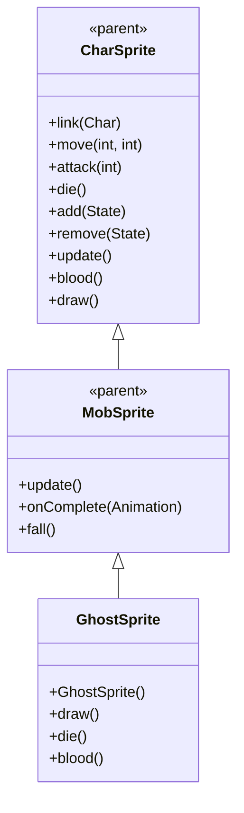

# GhostSprite 源码详解

## 1. 基本信息

| 属性 | 值 |
|------|-----|
| **文件路径** | core/src/main/java/com/shatteredpixel/shatteredpixeldungeon/sprites/GhostSprite.java |
| **包名** | com.shatteredpixel.shatteredpixeldungeon.sprites |
| **类类型** | class（非抽象） |
| **继承关系** | extends MobSprite |
| **代码行数** | 72 |

---

## 类职责

GhostSprite 是游戏中幽灵怪物的精灵类，继承自 MobSprite。它具有以下特殊功能：

1. **特殊混合模式**：重写 draw() 方法使用 Blending.setLightMode() 实现发光效果
2. **死亡粒子特效**：die() 方法添加 ShaftParticle 和 Speck.LIGHT 粒子效果
3. **简单动画设计**：idle 和 run 使用相同的两帧循环，体现幽灵的飘动特性
4. **纯白血液颜色**：重写 blood() 方法提供纯白色血液效果

**设计特点**：
- **发光视觉效果**：通过 Light 混合模式实现幽灵的发光特性
- **丰富的死亡特效**：结合光线粒子和光斑粒子创造完整的消散效果
- **简单高效的动画**：少量纹理帧实现生动的幽灵形象

---

## 4. 继承与协作关系



---

## 构造方法详解

### GhostSprite()

```java
public GhostSprite() {
    super();
    
    texture( Assets.Sprites.GHOST );
    
    TextureFilm frames = new TextureFilm( texture, 14, 15 );
    
    idle = new Animation( 5, true );
    idle.frames( frames, 0, 1 );
    
    run = new Animation( 10, true );
    run.frames( frames, 0, 1 );
    
    attack = new Animation( 10, false );
    attack.frames( frames, 0, 2, 3 );
    
    die = new Animation( 8, false );
    die.frames( frames, 0, 4, 5, 6, 7 );
    
    play( idle );
}
```

**构造方法作用**：初始化幽灵精灵的所有动画。

**纹理和帧设置**：
- **纹理源**：Assets.Sprites.GHOST
- **帧尺寸**：14 像素宽 × 15 像素高
- **帧总数**：8 帧（索引 0-7）

**动画参数说明**：

| 动画类型 | 帧率 (FPS) | 循环 | 帧序列 | 说明 |
|----------|------------|------|--------|------|
| `idle` | 5 | true | [0, 1] | 闲置状态，两帧循环模拟幽灵飘动 |
| `run` | 10 | true | [0, 1] | 跑动/移动状态，与 idle 相同但帧率更快 |
| `attack` | 10 | false | [0, 2, 3] | 攻击动画，从基础姿态开始攻击动作 |
| `die` | 8 | false | [0, 4, 5, 6, 7] | 死亡动画，5帧完整播放消散过程 |

**关键特性**：
- **Idle/Run 共享帧**：体现幽灵飘动和移动的相似性
- **帧率差异**：run 动画比 idle 快（10 FPS vs 5 FPS），表现速度差异
- **Attack起始姿态**：从帧0（基础姿态）开始攻击动作

---

## 特殊方法详解

### draw()

```java
@Override
public void draw() {
    Blending.setLightMode();
    super.draw();
    Blending.setNormalMode();
}
```

**方法作用**：重写绘制方法实现发光效果。

**发光效果实现**：
- **Blending.setLightMode()**：在绘制前切换到发光混合模式
- **super.draw()**：执行标准绘制逻辑
- **Blending.setNormalMode()**：绘制后恢复正常混合模式

**视觉效果**：
- 幽灵精灵会以发光形式显示
- 与其他正常精灵形成鲜明对比
- 增强幽灵的超自然视觉特征

### die()

```java
@Override
public void die() {
    super.die();
    emitter().start( ShaftParticle.FACTORY, 0.3f, 4 );
    emitter().start( Speck.factory( Speck.LIGHT ), 0.2f, 3 );
}
```

**方法作用**：死亡时添加特殊的粒子效果。

**粒子效果组合**：
- **ShaftParticle**：光线粒子，延长时间0.3秒，数量4个
- **Speck.LIGHT**：光斑粒子，延长时间0.2秒，数量3个
- **双重特效**：创造丰富的幽灵消散视觉效果

### blood()

```java
@Override
public int blood() {
    return 0xFFFFFF;
}
```

**方法作用**：返回幽灵受伤时的血液颜色。

**颜色说明**：
- **十六进制值**：0xFFFFFF
- **颜色名称**：纯白色
- **设计意图**：符合幽灵/灵体的超自然特征，区别于实体生物的红色血液

---

## 使用的资源

### 纹理和渲染资源

| 资源 | 用途 |
|------|------|
| `Assets.Sprites.GHOST` | 幽灵的完整纹理集 |
| `Blending.setLightMode()` | 发光混合模式 |

### 效果和工具类

| 类名 | 用途 |
|------|------|
| `TextureFilm` | 将大纹理分割成多个小帧用于动画 |
| `ShaftParticle` | 光线粒子效果 |
| `Speck.LIGHT` | 光斑粒子效果 |

---

## 与其他类的交互

### 继承关系

| 父类 | 继承/重写的功能 |
|------|----------------|
| `MobSprite` | 睡眠状态管理、死亡淡出效果、坠落动画等 |
| `CharSprite` | 所有基础动画、移动、状态效果、粒子系统等，重写特定方法 |

### 关联的怪物类

GhostSprite 对应的怪物类是 `com.shatteredpixel.shatteredpixeldungeon.actors.mobs.Ghost`，该类定义了幽灵的行为逻辑。

### 渲染系统交互

- **Blending 模式**：控制 OpenGL 混合模式实现发光效果
- **粒子系统**：通过 emitter() 创建和管理粒子效果
- **绘制顺序**：draw() 方法的调用时机确保正确的渲染效果

---

## 11. 使用示例

### 基本使用

```java
// 创建幽灵精灵
GhostSprite ghost = new GhostSprite();

// 关联幽灵怪物对象
ghost.link(ghostMob);

// 自动播放 idle 动画（发光效果自动应用）

// 触发动画
ghost.run();     // 播放跑动动画（更快的飘动）
ghost.attack(targetPos); // 播放攻击动画
ghost.die();     // 播放死亡动画（包含光线和光斑粒子）
```

### 发光效果

```java
// 发光效果自动应用，无需手动干预
// 绘制时自动：
// 1. 切换到 Light 混合模式
// 2. 执行标准绘制
// 3. 恢复 Normal 混合模式
```

### 死亡粒子效果

```java
// 死亡时自动创建两种粒子：
// - ShaftParticle: 4个光线粒子，持续0.3秒
// - Speck.LIGHT: 3个光斑粒子，持续0.2秒

ghost.die(); // 自动触发粒子效果
```

---

## 注意事项

### 设计模式理解

1. **混合模式封装**：通过重写 draw() 方法封装发光效果
2. **粒子效果组合**：使用多种粒子类型创造丰富的视觉效果
3. **生物特征还原**：纯白色血液和发光效果符合幽灵的超自然特征

### 性能考虑

1. **内存效率**：极少的纹理帧数量（8帧），适合常见敌人
2. **渲染开销**：混合模式切换会带来额外的 GPU 开销
3. **粒子管理**：合理的粒子数量和持续时间避免性能问题

### 常见的坑

1. **混合模式影响**：Blending 模式会影响后续绘制，必须正确恢复
2. **帧率理解**：idle 和 run 虽然帧相同但帧率不同，表现不同的飘动速度
3. **血液透明度**：0xFFFFFF 是纯白色但不透明，如需透明效果需要 alpha 通道

### 最佳实践

1. **视觉效果封装**：将复杂的视觉效果（如混合模式）封装在 draw() 方法中
2. **粒子效果组合**：使用多种粒子类型创造更丰富的视觉体验
3. **生物特征匹配**：为超自然生物设计符合其特征的特殊视觉效果