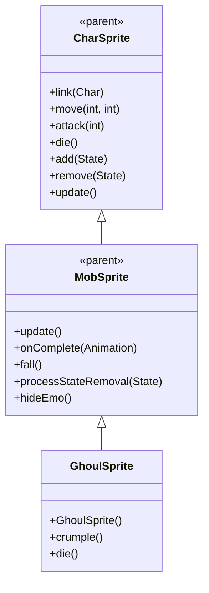

# GhoulSprite 源码详解

## 1. 基本信息

| 属性 | 值 |
|------|-----|
| **文件路径** | core/src/main/java/com/shatteredpixel/shatteredpixeldungeon/sprites/GhoulSprite.java |
| **包名** | com.shatteredpixel.shatteredpixeldungeon.sprites |
| **类类型** | class（非抽象） |
| **继承关系** | extends MobSprite |
| **代码行数** | 70 |

---

## 类职责

GhoulSprite 是游戏中食尸鬼怪物的精灵类，继承自 MobSprite。它具有以下特殊功能：

1. **特殊崩溃动画**：提供 crumple() 动画用于特定状态转换
2. **表情和状态管理**：crumple() 时自动隐藏表情并移除麻痹状态
3. **死亡动画优化**：根据当前动画状态动态调整死亡帧序列，避免重复动作
4. **复杂动画序列**：各种动画包含精细的帧序列设计

**设计特点**：
- **状态转换流畅**：crumple 动画专门处理特殊状态转换
- **死亡动画优化**：避免在 crumple 状态下重复播放上升/下降动画
- **生物特征还原**：动画序列符合食尸鬼的行动特征

---

## 4. 继承与协作关系



---

## 核心字段

### 动画字段

| 字段名 | 类型 | 说明 |
|--------|------|------|
| `crumple` | Animation | 特殊崩溃动画，用于状态转换 |

---

## 构造方法详解

### GhoulSprite()

```java
public GhoulSprite() {
    super();
    
    texture( Assets.Sprites.GHOUL );
    
    TextureFilm frames = new TextureFilm( texture, 12, 14 );
    
    idle = new Animation( 2, true );
    idle.frames( frames, 0, 0, 0, 1 );
    
    run = new Animation( 12, true );
    run.frames( frames, 2, 3, 4, 5, 6, 7 );
    
    attack = new Animation( 12, false );
    attack.frames( frames, 0, 8, 9 );
    
    crumple = new Animation( 15, false);
    crumple.frames( frames, 0, 10, 11, 12 );
    
    die = new Animation( 15, false );
    die.frames( frames, 0, 10, 11, 12, 13 );
    
    play( idle );
}
```

**构造方法作用**：初始化食尸鬼精灵的所有动画。

**纹理和帧设置**：
- **纹理源**：Assets.Sprites.GHOUL
- **帧尺寸**：12 像素宽 × 14 像素高
- **帧总数**：14 帧（索引 0-13）

**动画参数说明**：

| 动画类型 | 帧率 (FPS) | 循环 | 帧序列 | 说明 |
|----------|------------|------|--------|------|
| `idle` | 2 | true | [0, 0, 0, 1] | 闲置状态，大部分时间显示帧0，偶尔切换到帧1 |
| `run` | 12 | true | [2, 3, 4, 5, 6, 7] | 跑动动画，6帧循环 |
| `attack` | 12 | false | [0, 8, 9] | 攻击动画，从基础姿态开始 |
| `crumple` | 15 | false | [0, 10, 11, 12] | 崩溃动画，4帧完成 |
| `die` | 15 | false | [0, 10, 11, 12, 13] | 死亡动画，5帧完成 |

**关键特性**：
- **Idle动画节奏**：低帧率（2 FPS）配合大部分基础姿态创造自然等待效果
- **Attack起始姿态**：从帧0（基础姿态）开始攻击动作
- **Crumple与Die关联**：crumple 和 die 动画共享部分帧序列（10-12）

---

## 特殊方法详解

### crumple()

```java
public void crumple(){
    hideEmo();
    processStateRemoval(State.PARALYSED);
    play(crumple);
}
```

**方法作用**：执行崩溃动画，用于特殊状态转换。

**崩溃流程**：
1. **隐藏表情**：调用 hideEmo() 移除所有表情图标
2. **移除麻痹状态**：调用 processStateRemoval(State.PARALYSED) 清理麻痹效果
3. **播放崩溃动画**：开始 crumple 动画

**使用场景**：
- 食尸鬼从麻痹状态恢复时
- 特殊状态转换时需要播放崩溃动画
- 避免直接切换到正常动画造成视觉突兀

### die()

```java
@Override
public void die() {
    if (curAnim == crumple){
        //causes the sprite to not rise then fall again when dieing.
        die.frames[0] = die.frames[1] = die.frames[2] = die.frames[3];
    }
    super.die();
}
```

**方法作用**：重写死亡方法，优化 crumple 状态下的死亡动画。

**死亡动画优化**：
- **条件检查**：如果当前正在播放 crumple 动画
- **帧序列修改**：将 die 动画的前4帧都设为相同的帧（die.frames[3]）
- **避免重复动作**：防止角色先上升再下降的重复动画效果

**设计理念**：
- 当食尸鬼已经处于崩溃状态时，死亡应该直接完成，而不是重新播放完整的死亡动画
- 通过修改帧序列，确保死亡动画从当前姿态平滑过渡

---

## 使用的资源

### 纹理资源

| 资源 | 用途 |
|------|------|
| `Assets.Sprites.GHOUL` | 食尸鬼的完整纹理集 |

### 工具类

| 类名 | 用途 |
|------|------|
| `TextureFilm` | 将大纹理分割成多个小帧用于动画 |

---

## 与其他类的交互

### 继承关系

| 父类 | 继承/重写的功能 |
|------|----------------|
| `MobSprite` | 睡眠状态管理、死亡淡出效果、坠落动画等，提供 hideEmo() 和 processStateRemoval() 方法 |
| `CharSprite` | 所有基础动画、移动、状态效果、粒子系统等 |

### 关联的怪物类

GhoulSprite 对应的怪物类是 `com.shatteredpixel.shatteredpixeldungeon.actors.mobs.Ghoul`，该类定义了食尸鬼的行为逻辑。

### 状态系统交互

- **State.PARALYSED**：麻痹状态常量
- **processStateRemoval()**：状态移除方法
- **hideEmo()**：表情隐藏方法

---

## 11. 使用示例

### 基本使用

```java
// 创建食尸鬼精灵
GhoulSprite ghoul = new GhoulSprite();

// 关联食尸鬼怪物对象
ghoul.link(ghoulMob);

// 自动播放 idle 动画（构造时已设置）

// 触发动画
ghoul.run();     // 播放跑动动画  
ghoul.attack(targetPos); // 播放攻击动画
ghoul.crumple(); // 播放崩溃动画（用于状态转换）
ghoul.die();     // 播放死亡动画（包含优化逻辑）
```

### 崩溃动画使用

```java
// crumple 方法会自动：
// 1. 隐藏所有表情图标
// 2. 移除麻痹状态
// 3. 播放崩溃动画

// 通常在以下场景调用：
if (ghoulFromParalysis) {
    ghoul.crumple(); // 从麻痹状态恢复时
}
```

### 死亡动画优化

```java
// 死亡动画自动优化：
// - 如果当前在播放 crumple 动画，死亡动画会跳过上升动作
// - 如果当前在其他状态，死亡动画会播放完整序列

ghoul.crumple();
// ... later ...
ghoul.die(); // 此时会使用优化的死亡帧序列
```

---

## 注意事项

### 设计模式理解

1. **状态转换优化**：crumple 动画专门处理特殊状态转换，避免视觉突兀
2. **动画复用**：crumple 和 die 动画共享中间帧序列，减少资源重复
3. **动态帧修改**：运行时修改动画帧序列实现不同的视觉效果

### 性能考虑

1. **内存效率**：合理的纹理帧数量（14帧），适合中等复杂度怪物
2. **动画优化**：避免不必要的重复动画，提升视觉流畅性
3. **状态清理**：自动清理相关状态和表情，减少内存泄漏风险

### 常见的坑

1. **帧序列修改**：die.frames[] 的修改是临时的，只影响当前死亡动画
2. **状态移除时机**：processStateRemoval() 必须在播放动画前调用
3. **表情管理**：hideEmo() 会移除所有表情，包括睡眠、中毒等

### 最佳实践

1. **状态转换动画**：为特殊状态转换设计专门的过渡动画
2. **动画优化**：根据当前状态动态调整后续动画，避免重复动作
3. **资源复用**：在相关动画之间共享帧序列，减少资源占用