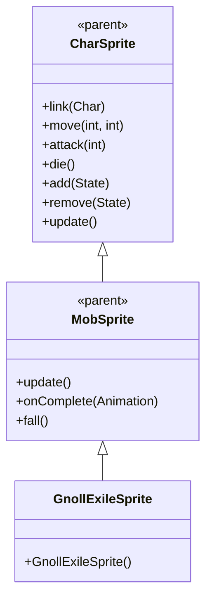

# GnollExileSprite 源码详解

## 1. 基本信息

| 属性 | 值 |
|------|-----|
| **文件路径** | core/src/main/java/com/shatteredpixel/shatteredpixeldungeon/sprites/GnollExileSprite.java |
| **包名** | com.shatteredpixel.shatteredpixeldungeon.sprites |
| **类类型** | class（非抽象） |
| **继承关系** | extends MobSprite |
| **代码行数** | 53 |

---

## 类职责

GnollExileSprite 是游戏中流放豺狼人怪物的精灵类，继承自 MobSprite。它与普通豺狼人共用同一套纹理资源，但使用不同的帧偏移，以表现流放者的不同外观：

1. **共享纹理资源**：使用 Assets.Sprites.GNOLL 纹理集，通过偏移量 c=21 访问不同部分
2. **动画定义**：为 idle、run、attack、die 四种状态定义具体的帧序列
3. **帧尺寸设置**：指定纹理帧的尺寸为 12x15 像素（与 GnollSprite 相同）
4. **默认状态**：初始化时自动播放 idle 动画

**设计特点**：
- **资源共享优化**：与 GnollSprite 共用纹理，减少资源重复
- **复杂 Idle 序列**：8帧序列创造自然的呼吸/等待效果
- **攻击姿态恢复**：攻击完成后回到基础姿态（帧0+c）

---

## 4. 继承与协作关系



---

## 构造方法详解

### GnollExileSprite()

```java
public GnollExileSprite() {
    super();
    
    texture( Assets.Sprites.GNOLL );
    
    TextureFilm frames = new TextureFilm( texture, 12, 15 );
    
    int c = 21;
    
    idle = new Animation( 2, true );
    idle.frames( frames, 0+c, 0+c, 0+c, 1+c, 0+c, 0+c, 1+c, 1+c );
    
    run = new Animation( 12, true );
    run.frames( frames, 4+c, 5+c, 6+c, 7+c );
    
    attack = new Animation( 12, false );
    attack.frames( frames, 2+c, 3+c, 0+c );
    
    die = new Animation( 12, false );
    die.frames( frames, 8+c, 9+c, 10+c );
    
    play( idle );
}
```

**构造方法作用**：初始化流放豺狼人精灵的所有动画。

**纹理和帧设置**：
- **纹理源**：Assets.Sprites.GNOLL（与 GnollSprite 共享）
- **帧尺寸**：12 像素宽 × 15 像素高
- **帧偏移**：c = 21（使用纹理集的后半部分，实际帧索引 21-31）
- **帧总数**：至少 32 帧（索引 0-31）

**动画参数说明**：

| 动画类型 | 帧率 (FPS) | 循环 | 帧序列（实际索引） | 说明 |
|----------|------------|------|-------------------|------|
| `idle` | 2 | true | [21, 21, 21, 22, 21, 21, 22, 22] | 闲置状态，大部分时间显示帧21，偶尔切换到帧22 |
| `run` | 12 | true | [25, 26, 27, 28] | 跑动动画，4帧循环 |
| `attack` | 12 | false | [23, 24, 21] | 攻击动画，从准备到恢复，最后回到帧21 |
| `die` | 12 | false | [29, 30, 31] | 死亡动画，3帧播放一次 |

**关键特性**：
- **Idle动画设计**：帧序列为 [21, 21, 21, 22, 21, 21, 22, 22] 表示大部分时间保持静止（帧21），偶尔有小动作（帧22）
- **Attack动画完整性**：攻击完成后回到帧21，确保角色回到基础姿态
- **帧分离清晰**：idle(21-22)、attack(23-24)、run(25-28)、die(29-31) 各状态帧不重叠

---

## 使用的资源

### 纹理资源

| 资源 | 用途 |
|------|------|
| `Assets.Sprites.GNOLL` | 豺狼人系列的通用纹理集（包含普通和流放变种） |

### 工具类

| 类名 | 用途 |
|------|------|
| `TextureFilm` | 将大纹理分割成多个小帧用于动画 |

---

## 与其他类的交互

### 继承关系

| 父类 | 继承的功能 |
|------|-----------|
| `MobSprite` | 睡眠状态管理、死亡淡出效果、坠落动画等 |
| `CharSprite` | 所有基础动画、移动、状态效果、粒子系统等 |

### 资源共享关系

| 共享类 | 共享资源 | 帧范围 | 说明 |
|--------|----------|--------|------|
| `GnollSprite` | Assets.Sprites.GNOLL | 0-10 vs 21-31 | 同一套纹理集，完全不重叠的帧区域 |

### 关联的怪物类

GnollExileSprite 对应的怪物类是 `com.shatteredpixel.shatteredpixeldungeon.actors.mobs.GnollExile`，该类定义了流放豺狼人的行为逻辑，而 GnollExileSprite 只负责视觉表现。

---

## 11. 使用示例

### 基本使用

```java
// 创建流放豺狼人精灵
GnollExileSprite exile = new GnollExileSprite();

// 关联流放豺狼人怪物对象
exile.link(exileMob);

// 自动播放 idle 动画（构造时已设置）

// 触发动画
exile.run();     // 播放跑动动画  
exile.attack(targetPos); // 播放攻击动画
exile.die();     // 播放死亡动画（包含淡出效果）
```

### 纹理共享示例

```java
// GnollSprite 和 GnollExileSprite 都使用同一纹理集
GnollSprite normalGnoll = new GnollSprite();           // 使用帧 0-10
GnollExileSprite exileGnoll = new GnollExileSprite(); // 使用帧 21-31
```

### 动画控制

```java
// 手动控制动画（通常不需要，由游戏逻辑自动触发）
exile.play(exile.idle);   // 播放闲置动画
exile.play(exile.run);    // 播放跑动动画
```

---

## 注意事项

### 设计模式理解

1. **资源共享策略**：相似怪物共用纹理集，通过帧偏移区分变种
2. **动画标准化**：遵循游戏统一的动画命名和触发机制
3. **分离关注点**：GnollExileSprite 只处理视觉表现，行为逻辑在 GnollExile 类中

### 性能考虑

1. **内存优化**：共享纹理大幅减少 GPU 内存占用
2. **渲染效率**：固定帧尺寸便于 GPU 批处理

### 常见的坑

1. **帧偏移计算**：确保偏移量 c=21 与纹理集实际布局匹配
2. **帧序列完整性**：attack 动画必须以帧21结尾，确保姿态正确
3. **纹理尺寸匹配**：12x15 的尺寸必须与实际纹理匹配

### 最佳实践

1. **遵循资源共享模式**：创建怪物变种时考虑共享纹理
2. **保持简洁**：除非必要，不要添加复杂效果
3. **测试动画流畅性**：确保各状态切换自然连贯