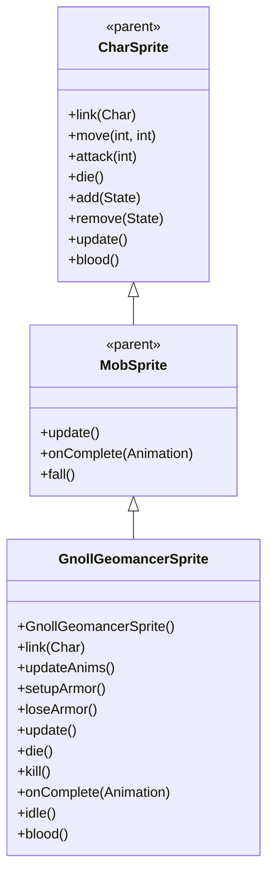

# GnollGeomancerSprite 源码详解

## 1. 基本信息

| 属性 | 值 |
|------|-----|
| **文件路径** | core/src/main/java/com/shatteredpixel/shatteredpixeldungeon/sprites/GnollGeomancerSprite.java |
| **包名** | com.shatteredpixel.shatteredpixeldungeon.sprites |
| **类类型** | class（非抽象） |
| **继承关系** | extends MobSprite |
| **代码行数** | 151 |

---

## 类职责

GnollGeomancerSprite 是游戏中豺狼人地法师怪物的精灵类，继承自 MobSprite。它具有以下复杂功能：

1. **双状态动画系统**：普通状态和石像状态，通过 isStatue 标志动态切换
2. **岩石护甲粒子效果**：当拥有岩爆者伙伴时显示 EarthParticle 护甲效果
3. **自动状态检测**：在 link() 和 idle() 方法中自动检测 RockArmor 状态变化
4. **特殊血液颜色**：石像状态下返回灰色血液，普通状态下继承父类血液颜色
5. **缩放处理**：应用 1.25f 缩放以适配实际尺寸需求

**设计特点**：
- **状态驱动渲染**：根据是否处于石像状态动态切换整套动画
- **粒子护甲效果**：围绕角色显示岩石护甲粒子，增强视觉表现
- **自动状态同步**：多处检测 RockArmor 状态确保动画与游戏状态一致

---

## 4. 继承与协作关系



---

## 核心字段

### 状态和特效字段

| 字段名 | 类型 | 说明 |
|--------|------|------|
| `isStatue` | boolean | 标识是否处于石像状态 |
| `earthArmor` | Emitter | 岩石护甲粒子发射器 |

---

## 构造方法详解

### GnollGeomancerSprite()

```java
public GnollGeomancerSprite() {
    super();
    
    texture(Assets.Sprites.GNOLL_GEOMANCER);
    
    updateAnims();
    
    scale.set(1.25f);
}
```

**构造方法作用**：初始化豺狼人地法师精灵的基础设置。

**初始化配置**：
- **纹理源**：Assets.Sprites.GNOLL_GEOMANCER
- **初始动画**：调用 updateAnims() 设置普通状态动画
- **缩放因子**：1.25f（使角色略大于标准尺寸）

---

## 核心方法详解

### link(Char ch)

```java
@Override
public void link( Char ch ) {
    super.link( ch );
    
    if (ch instanceof GnollGeomancer && ((GnollGeomancer) ch).hasSapper()){
        setupArmor();
    }
    if (ch != null && (ch.buff(GnollGeomancer.RockArmor.class) != null != isStatue)){
        isStatue = !isStatue;
        updateAnims();
    }
}
```

**方法作用**：关联角色时初始化护甲效果并检测初始石像状态。

**初始化逻辑**：
- **护甲检查**：如果地法师有岩爆者伙伴，调用 setupArmor() 创建护甲粒子
- **状态同步**：检查 RockArmor buff 状态，与当前 isStatue 不一致时切换状态

### updateAnims()

```java
private void updateAnims(){
    TextureFilm frames = new TextureFilm( texture, 12, 16 );
    
    int ofs = isStatue ? 21 : 0;
    idle = new Animation( isStatue ? 1 : 2, true );
    idle.frames( frames, ofs+0, ofs+0, ofs+0, ofs+1, ofs+0, ofs+0, ofs+1, ofs+1 );
    
    run = new Animation( 12, true );
    run.frames( frames, ofs+4, ofs+5, ofs+6, ofs+7 );
    
    attack = new Animation( 12, false );
    attack.frames( frames, ofs+2, ofs+3, ofs+0 );
    
    zap = attack.clone();
    
    die = new Animation( 12, false );
    die.frames( frames, ofs+8, ofs+9, ofs+10 );
    
    play(idle);
    play(idle); // 重复调用，可能是为了确保正确播放
}
```

**方法作用**：根据当前状态（普通/石像）更新所有动画。

**状态切换机制**：

| 状态 | 帧偏移(ofs) | Idle帧率 | 使用帧范围 | Idle序列 |
|------|------------|----------|------------|----------|
| 普通 | 0 | 2 FPS | 0-10 | [0,0,0,1,0,0,1,1] |
| 石像 | 21 | 1 FPS | 21-31 | [21,21,21,22,21,21,22,22] |

**关键特性**：
- **Idle帧率差异**：石像状态帧率更慢（1 FPS vs 2 FPS），体现僵硬感
- **帧分离清晰**：两种状态使用完全不重叠的帧区域
- **Attack恢复**：攻击完成后都回到基础姿态（ofs+0）

### setupArmor() 和 loseArmor()

```java
public void setupArmor(){
    if (earthArmor == null) {
        earthArmor = emitter();
        earthArmor.fillTarget = false;
        earthArmor.y = height()/2f;
        earthArmor.x = (2*scale.x);
        earthArmor.width = width()-(4*scale.x);
        earthArmor.height = height() - (10*scale.y);
        earthArmor.pour(EarthParticle.SMALL, 0.15f);
    }
}

public void loseArmor(){
    if (earthArmor != null){
        earthArmor.on = false;
        earthArmor = null;
    }
}
```

**方法作用**：
- **setupArmor()**：创建岩石护甲粒子效果，环绕角色显示
- **loseArmor()**：关闭并清理护甲粒子效果

**粒子配置**：
- **类型**：EarthParticle.SMALL（小型岩石粒子）
- **发射率**：0.15f（每秒15个粒子）
- **位置设置**：围绕角色中心，考虑缩放因素
- **填充模式**：fillTarget = false（不填充目标区域）

### 生命周期方法

```java
@Override
public void update() {
    super.update();
    if (earthArmor != null){
        earthArmor.visible = visible;
    }
}

@Override
public void die() {
    super.die();
    if (earthArmor != null){
        earthArmor.on = false;
        earthArmor = null;
    }
}

@Override
public void kill() {
    super.kill();
    if (earthArmor != null){
        earthArmor.on = false;
        earthArmor = null;
    }
}
```

**方法作用**：管理护甲粒子的生命周期和可见性。

### idle()

```java
@Override
public void idle() {
    super.idle();
    if (ch != null && ch.buff(GnollGeomancer.RockArmor.class) != null != isStatue){
        isStatue = !isStatue;
        updateAnims();
    }
}
```

**方法作用**：在每次进入 idle 状态时检查 RockArmor 状态变化。

**设计理念**：
- 多重状态检查确保动画与游戏状态始终保持同步
- 在 link() 和 idle() 中都进行检查，覆盖不同状态变化时机

### blood()

```java
@Override
public int blood() {
    return isStatue ? 0x555555 : super.blood();
}
```

**方法作用**：根据当前状态返回不同的血液颜色。

**血液颜色**：
- **石像状态**：0x555555（深灰色）
- **普通状态**：继承父类血液颜色（通常是红色）

---

## 使用的资源

### 纹理和粒子资源

| 资源 | 用途 |
|------|------|
| `Assets.Sprites.GNOLL_GEOMANCER` | 豺狼人地法师的完整纹理集 |
| `EarthParticle.SMALL` | 岩石护甲粒子效果 |

### 工具类

| 类名 | 用途 |
|------|------|
| `TextureFilm` | 纹理帧管理 |
| `Emitter` | 粒子发射器管理 |

---

## 与其他类的交互

### 继承关系

| 父类 | 继承/重写的功能 |
|------|----------------|
| `MobSprite` | 睡眠状态管理、死亡淡出效果、坠落动画等 |
| `CharSprite` | 所有基础动画、移动、状态效果、粒子系统等 |

### 关联的怪物类

GnollGeomancerSprite 对应的怪物类是 `com.shatteredpixel.shatteredpixeldungeon.actors.mobs.GnollGeomancer`，该类定义了地法师的行为逻辑，包括：
- **RockArmor buff**：石像护甲状态
- **hasSapper()**：是否有岩爆者伙伴
- **状态转换逻辑**

### 系统交互

- **Buff 系统**：通过 ch.buff(RockArmor.class) 检测状态
- **粒子系统**：完善的护甲粒子生命周期管理
- **缩放系统**：scale.set(1.25f) 影响所有相关计算

---

## 11. 使用示例

### 基本使用

```java
// 创建豺狼人地法师精灵
GnollGeomancerSprite geomancer = new GnollGeomancerSprite();

// 关联地法师怪物对象
geomancer.link(geomancerMob);

// 自动处理状态检测和护甲初始化

// 触发动画
geomancer.run();     // 播放跑动动画  
geomancer.attack(targetPos); // 播放攻击动画
geomancer.zap(enemyCell);   // 播放魔法攻击动画
geomancer.die();     // 播放死亡动画（自动清理护甲）
```

### 状态切换

```java
// 状态切换自动处理，无需手动干预
// 当地法师获得/失去 RockArmor buff 时：
// 1. idle() 或 link() 方法会检测到状态变化
// 2. isStatue 标志翻转
// 3. updateAnims() 重新加载对应状态的动画

// 石像状态特征：
// - 更慢的 idle 动画（1 FPS）
// - 深灰色血液
// - 不同的纹理帧
```

### 护甲效果管理

```java
// 护甲效果自动管理：
// - 创建：当地法师有岩爆者伙伴时自动调用 setupArmor()
// - 显示：earthArmor.visible 自动同步精灵可见性
// - 清理：死亡或销毁时自动调用 loseArmor()

// 手动控制（通常不需要）：
if (needToRemoveArmor) {
    geomancer.loseArmor();
}
```

---

## 注意事项

### 设计模式理解

1. **状态模式**：通过 isStatue 标志实现双状态切换
2. **观察者模式**：多处检测状态变化确保同步
3. **装饰器模式**：earthArmor 粒子作为护甲装饰效果

### 性能考虑

1. **内存管理**：完善的粒子清理机制避免内存泄漏
2. **条件初始化**：护甲粒子仅在需要时创建
3. **状态缓存**：isStatue 标志避免重复状态检测

### 常见的坑

1. **重复 play(idle)**：构造函数中重复调用 play(idle)，可能是历史遗留
2. **状态检测时机**：需要在多个方法中检测状态，容易遗漏
3. **缩放影响**：所有粒子位置计算都需要考虑 scale 因子

### 最佳实践

1. **状态驱动设计**：为复杂角色实现状态驱动的动画系统
2. **多重同步检查**：在关键时机多次检查状态确保一致性
3. **资源优化**：通过帧偏移实现状态变种，避免重复纹理资源