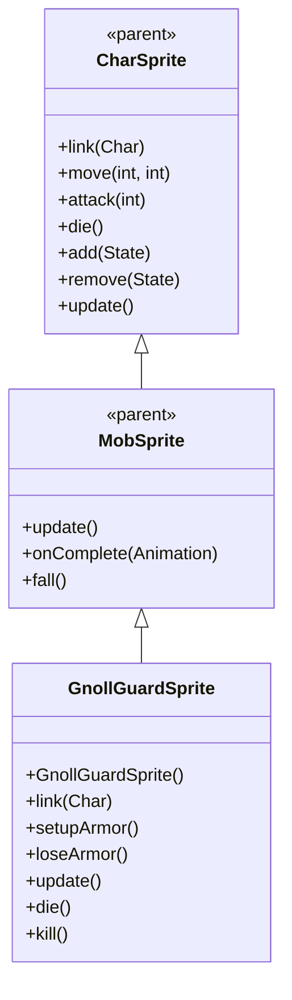

# GnollGuardSprite 源码详解

## 1. 基本信息

| 属性 | 值 |
|------|-----|
| **文件路径** | core/src/main/java/com/shatteredpixel/shatteredpixeldungeon/sprites/GnollGuardSprite.java |
| **包名** | com.shatteredpixel.shatteredpixeldungeon.sprites |
| **类类型** | class（非抽象） |
| **继承关系** | extends MobSprite |
| **代码行数** | 113 |

---

## 类职责

GnollGuardSprite 是游戏中豺狼人守卫怪物的精灵类，继承自 MobSprite。它具有以下功能：

1. **岩石护甲粒子效果**：当拥有岩爆者伙伴时显示 EarthParticle 护甲效果
2. **复杂动画序列**：idle 动画包含8帧序列，创造自然的等待效果
3. **攻击姿态恢复**：攻击完成后回到基础姿态（帧0）
4. **完整的生命周期管理**：护甲粒子效果的创建、更新和清理

**设计特点**：
- **粒子护甲效果**：围绕角色显示岩石护甲粒子，增强视觉表现
- **生动动画**：复杂的 idle 序列模拟自然的生物特征
- **条件护甲**：仅当地爆者存在时才显示护甲效果

---

## 4. 继承与协作关系



---

## 核心字段

### 特效字段

| 字段名 | 类型 | 说明 |
|--------|------|------|
| `earthArmor` | Emitter | 岩石护甲粒子发射器 |

---

## 构造方法详解

### GnollGuardSprite()

```java
public GnollGuardSprite() {
    super();
    
    texture(Assets.Sprites.GNOLL_GUARD );
    
    TextureFilm frames = new TextureFilm( texture, 12, 16 );
    
    idle = new Animation( 2, true );
    idle.frames( frames, 0, 0, 0, 1, 0, 0, 1, 1 );
    
    run = new Animation( 12, true );
    run.frames( frames, 4, 5, 6, 7 );
    
    attack = new Animation( 12, false );
    attack.frames( frames, 2, 3, 0 );
    
    die = new Animation( 12, false );
    die.frames( frames, 8, 9, 10 );
    
    play( idle );
}
```

**构造方法作用**：初始化豺狼人守卫精灵的所有动画。

**纹理和帧设置**：
- **纹理源**：Assets.Sprites.GNOLL_GUARD
- **帧尺寸**：12 像素宽 × 16 像素高
- **帧总数**：11 帧（索引 0-10）

**动画参数说明**：

| 动画类型 | 帧率 (FPS) | 循环 | 帧序列 | 说明 |
|----------|------------|------|--------|------|
| `idle` | 2 | true | [0, 0, 0, 1, 0, 0, 1, 1] | 闲置状态，大部分时间显示帧0，偶尔切换到帧1 |
| `run` | 12 | true | [4, 5, 6, 7] | 跑动动画，4帧循环 |
| `attack` | 12 | false | [2, 3, 0] | 攻击动画，从准备到恢复，最后回到帧0 |
| `die` | 12 | false | [8, 9, 10] | 死亡动画，3帧完整播放 |

**关键特性**：
- **Idle动画节奏**：低帧率（2 FPS）配合复杂序列创造自然的呼吸/等待效果
- **Attack动画完整性**：攻击完成后回到帧0，确保角色回到基础姿态
- **帧分离清晰**：各动画状态使用不同的帧区域（0-1, 2-3, 4-7, 8-10）

---

## 核心方法详解

### link(Char ch)

```java
@Override
public void link( Char ch ) {
    super.link( ch );
    
    if (ch instanceof GnollGuard && ((GnollGuard) ch).hasSapper()){
        setupArmor();
    }
}
```

**方法作用**：关联角色时检测是否拥有岩爆者伙伴，如果有则初始化护甲效果。

**条件逻辑**：
- **类型检查**：确保关联的是 GnollGuard 对象
- **伙伴检测**：调用 hasSapper() 方法检查岩爆者存在
- **护甲初始化**：符合条件时调用 setupArmor() 创建粒子效果

### setupArmor() 和 loseArmor()

```java
public void setupArmor(){
    if (earthArmor == null) {
        earthArmor = emitter();
        earthArmor.fillTarget = false;
        earthArmor.y = height()/2f;
        earthArmor.x = (2*scale.x);
        earthArmor.width = width()-(4*scale.x);
        earthArmor.height = height() - (10*scale.y);
        earthArmor.pour(EarthParticle.SMALL, 0.15f);
    }
}

public void loseArmor(){
    if (earthArmor != null){
        earthArmor.on = false;
        earthArmor = null;
    }
}
```

**方法作用**：
- **setupArmor()**：创建岩石护甲粒子效果，环绕角色显示
- **loseArmor()**：关闭并清理护甲粒子效果

**粒子配置**：
- **类型**：EarthParticle.SMALL（小型岩石粒子）
- **发射率**：0.15f（每秒15个粒子）
- **位置设置**：围绕角色中心，考虑缩放因素
- **填充模式**：fillTarget = false（不填充目标区域）

### 生命周期方法

```java
@Override
public void update() {
    super.update();
    if (earthArmor != null){
        earthArmor.visible = visible;
    }
}

@Override
public void die() {
    super.die();
    if (earthArmor != null){
        earthArmor.on = false;
        earthArmor = null;
    }
}

@Override
public void kill() {
    super.kill();
    if (earthArmor != null){
        earthArmor.on = false;
        earthArmor = null;
    }
}
```

**方法作用**：管理护甲粒子的生命周期和可见性。

**生命周期管理**：
- **update()**：同步粒子可见性与精灵可见性
- **die()**：死亡时关闭护甲粒子
- **kill()**：彻底销毁时清理护甲粒子

---

## 使用的资源

### 纹理和粒子资源

| 资源 | 用途 |
|------|------|
| `Assets.Sprites.GNOLL_GUARD` | 豺狼人守卫的完整纹理集 |
| `EarthParticle.SMALL` | 岩石护甲粒子效果 |

### 工具类

| 类名 | 用途 |
|------|------|
| `TextureFilm` | 将大纹理分割成多个小帧用于动画 |
| `Emitter` | 粒子发射器管理 |

---

## 与其他类的交互

### 继承关系

| 父类 | 继承的功能 |
|------|-----------|
| `MobSprite` | 睡眠状态管理、死亡淡出效果、坠落动画等 |
| `CharSprite` | 所有基础动画、移动、状态效果、粒子系统等 |

### 关联的怪物类

GnollGuardSprite 对应的怪物类是 `com.shatteredpixel.shatteredpixeldungeon.actors.mobs.GnollGuard`，该类定义了豺狼人守卫的行为逻辑，包括：
- **hasSapper()**：是否有岩爆者伙伴
- **护甲相关逻辑**

### 系统交互

- **粒子系统**：完善的护甲粒子生命周期管理
- **伙伴系统**：通过 hasSapper() 与岩爆者建立关联
- **渲染系统**：粒子位置计算考虑精灵缩放因素

---

## 11. 使用示例

### 基本使用

```java
// 创建豺狼人守卫精灵
GnollGuardSprite guard = new GnollGuardSprite();

// 关联守卫怪物对象
guard.link(guardMob);

// 自动检测岩爆者伙伴并初始化护甲

// 触发动画
guard.run();     // 播放跑动动画  
guard.attack(targetPos); // 播放攻击动画
guard.die();     // 播放死亡动画（自动清理护甲）
```

### 护甲效果管理

```java
// 护甲效果自动管理：
// - 创建：当守卫有岩爆者伙伴时自动调用 setupArmor()
// - 显示：earthArmor.visible 自动同步精灵可见性
// - 清理：死亡或销毁时自动调用 loseArmor()

// 手动控制（通常不需要）：
if (needToRemoveArmor) {
    guard.loseArmor();
}
```

### 条件护甲逻辑

```java
// 护甲只在特定条件下显示：
GnollGuard guardMob = new GnollGuard();
guardMob.hasSapper(); // 返回 true/false

// 只有当 hasSapper() 返回 true 时，才会显示护甲粒子
GnollGuardSprite guardSprite = new GnollGuardSprite();
guardSprite.link(guardMob); // 自动处理护甲初始化
```

---

## 注意事项

### 设计模式理解

1. **条件装饰器**：护甲粒子作为条件性装饰效果
2. **伙伴关联**：通过 hasSapper() 方法实现怪物间的关联
3. **生命周期管理**：完整的粒子创建、更新、清理流程

### 性能考虑

1. **内存管理**：完善的粒子清理机制避免内存泄漏
2. **条件初始化**：护甲粒子仅在需要时创建，节省资源
3. **粒子开销**：合理的粒子发射率（0.15f）平衡视觉效果和性能

### 常见的坑

1. **位置计算**：粒子位置必须考虑 scale 因子，确保正确环绕
2. **空值检查**：所有粒子操作前必须检查 earthArmor != null
3. **双重清理**：die() 和 kill() 都要处理粒子清理，避免遗漏

### 最佳实践

1. **条件特效**：为特殊条件下的角色添加相应的视觉效果
2. **伙伴系统集成**：将视觉效果与游戏逻辑紧密集成
3. **完整生命周期**：确保特效的完整生命周期管理，避免资源泄漏