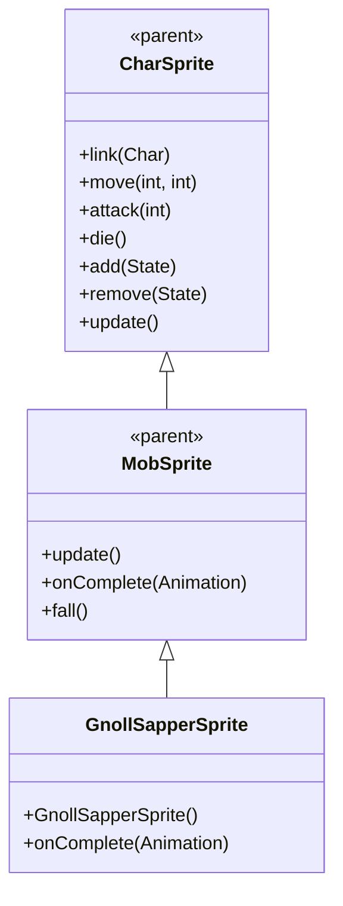

# GnollSapperSprite 源码详解

## 1. 基本信息

| 属性 | 值 |
|------|-----|
| **文件路径** | core/src/main/java/com/shatteredpixel/shatteredpixeldungeon/sprites/GnollSapperSprite.java |
| **包名** | com.shatteredpixel.shatteredpixeldungeon.sprites |
| **类类型** | class（非抽象） |
| **继承关系** | extends MobSprite |
| **代码行数** | 61 |

---

## 类职责

GnollSapperSprite 是游戏中豺狼人岩爆者怪物的精灵类，继承自 MobSprite。它具有以下功能：

1. **魔法攻击支持**：提供 zap 动画用于远程魔法攻击
2. **复杂动画序列**：idle 动画包含8帧序列，创造自然的等待效果
3. **攻击姿态恢复**：攻击完成后回到基础姿态（帧0）
4. **自动状态管理**：zap 动画完成后自动切换回 idle 状态

**设计特点**：
- **生动动画**：复杂的 idle 序列模拟自然的生物特征
- **魔法攻击集成**：zap 动画克隆 attack 动画，保持一致性
- **状态自动恢复**：魔法攻击完成后自动回到等待状态

---

## 4. 继承与协作关系



---

## 构造方法详解

### GnollSapperSprite()

```java
public GnollSapperSprite() {
    super();
    
    texture(Assets.Sprites.GNOLL_SAPPER );
    
    TextureFilm frames = new TextureFilm( texture, 12, 15 );
    
    idle = new Animation( 2, true );
    idle.frames( frames, 0, 0, 0, 1, 0, 0, 1, 1 );
    
    run = new Animation( 12, true );
    run.frames( frames, 4, 5, 6, 7 );
    
    attack = new Animation( 12, false );
    attack.frames( frames, 2, 3, 0 );
    
    zap = attack.clone();
    
    die = new Animation( 12, false );
    die.frames( frames, 8, 9, 10 );
    
    play( idle );
}
```

**构造方法作用**：初始化豺狼人岩爆者精灵的所有动画。

**纹理和帧设置**：
- **纹理源**：Assets.Sprites.GNOLL_SAPPER
- **帧尺寸**：12 像素宽 × 15 像素高
- **帧总数**：11 帧（索引 0-10）

**动画参数说明**：

| 动画类型 | 帧率 (FPS) | 循环 | 帧序列 | 说明 |
|----------|------------|------|--------|------|
| `idle` | 2 | true | [0, 0, 0, 1, 0, 0, 1, 1] | 闲置状态，大部分时间显示帧0，偶尔切换到帧1 |
| `run` | 12 | true | [4, 5, 6, 7] | 跑动动画，4帧循环 |
| `attack` | 12 | false | [2, 3, 0] | 攻击动画，从准备到恢复，最后回到帧0 |
| `zap` | 12 | false | 克隆 attack | 魔法攻击动画 |
| `die` | 12 | false | [8, 9, 10] | 死亡动画，3帧完整播放 |

**关键特性**：
- **Idle动画节奏**：低帧率（2 FPS）配合复杂序列创造自然的呼吸/等待效果
- **Attack动画完整性**：攻击完成后回到帧0，确保角色回到基础姿态
- **Zap克隆Attack**：魔法攻击复用近战攻击动画，保持视觉一致性
- **帧分离清晰**：各动画状态使用不同的帧区域（0-1, 2-3, 4-7, 8-10）

---

## 核心方法详解

### onComplete(Animation anim)

```java
@Override
public void onComplete( Animation anim ) {
    if (anim == zap) {
        idle();
    }
    super.onComplete( anim );
}
```

**方法作用**：处理 zap 动画完成后的状态切换。

**状态管理**：
- zap 动画完成后自动切换回 idle 状态
- 确保岩爆者不会停留在攻击姿态，保持自然的后续动作

---

## 使用的资源

### 纹理资源

| 资源 | 用途 |
|------|------|
| `Assets.Sprites.GNOLL_SAPPER` | 豺狼人岩爆者的完整纹理集 |

### 工具类

| 类名 | 用途 |
|------|------|
| `TextureFilm` | 将大纹理分割成多个小帧用于动画 |

---

## 与其他类的交互

### 继承关系

| 父类 | 继承的功能 |
|------|-----------|
| `MobSprite` | 睡眠状态管理、死亡淡出效果、坠落动画等 |
| `CharSprite` | 所有基础动画、移动、状态效果、粒子系统等 |

### 关联的怪物类

GnollSapperSprite 对应的怪物类是 `com.shatteredpixel.shatteredpixeldungeon.actors.mobs.GnollSapper`，该类定义了岩爆者的行为逻辑，包括远程魔法攻击。

### 伙伴系统交互

- **与 GnollGuard/GnollGeomancer 关联**：岩爆者作为伙伴为其他豺狼人提供护甲效果
- **魔法攻击能力**：具备远程 zap 攻击能力

---

## 11. 使用示例

### 基本使用

```java
// 创建豺狼人岩爆者精灵
GnollSapperSprite sapper = new GnollSapperSprite();

// 关联岩爆者怪物对象
sapper.link(sapperMob);

// 自动播放 idle 动画（构造时已设置）

// 触发动画
sapper.run();     // 播放跑动动画  
sapper.attack(targetPos); // 播放近战攻击动画
sapper.zap(enemyCell);   // 播放魔法攻击动画
sapper.die();     // 播放死亡动画
```

### 魔法攻击细节

```java
// zap 方法会自动处理状态管理：
sapper.zap(targetPosition);

// 攻击会自动：
// 1. 播放 zap 动画（克隆 attack 动画）
// 2. 完成后自动切换回 idle 状态
// 3. 无需手动调用 idle() 方法
```

### 动画控制

```java
// 手动控制动画（通常不需要，由游戏逻辑自动触发）
sapper.play(sapper.idle);   // 播放闲置动画
sapper.play(sapper.run);    // 播放跑动动画
```

---

## 注意事项

### 设计模式理解

1. **动画复用**：zap 动画克隆 attack 动画，减少资源重复
2. **状态自动管理**：攻击完成后自动回到正确状态
3. **生物特征还原**：复杂 idle 动画模拟真实生物的自然行为

### 性能考虑

1. **内存效率**：合理的纹理帧数量（11帧），适合中等复杂度怪物
2. **渲染优化**：固定帧尺寸便于 GPU 批处理
3. **动画复用**：克隆动画避免重复创建相同动画对象

### 常见的坑

1. **帧序列理解**：idle 的8帧序列需要正确理解其节奏和意图
2. **状态切换时机**：onComplete() 中的状态切换必须在 super.onComplete() 之前
3. **动画克隆限制**：zap = attack.clone() 意味着两者完全相同，无法单独修改

### 最佳实践

1. **动画复用策略**：相似的动画动作应考虑克隆复用
2. **状态自动管理**：确保特殊动画完成后自动回到合适的状态
3. **测试动画流畅性**：确保各状态切换自然连贯