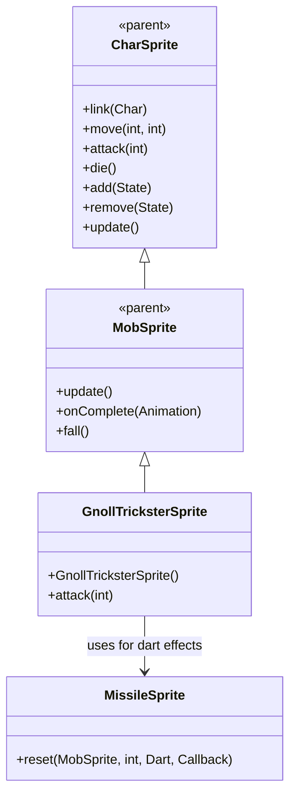

# GnollTricksterSprite 源码详解

## 1. 基本信息

| 属性 | 值 |
|------|-----|
| **文件路径** | core/src/main/java/com/shatteredpixel/shatteredpixeldungeon/sprites/GnollTricksterSprite.java |
| **包名** | com.shatteredpixel.shatteredpixeldungeon.sprites |
| **类类型** | class（非抽象） |
| **继承关系** | extends MobSprite |
| **代码行数** | 82 |

---

## 类职责

GnollTricksterSprite 是游戏中豺狼人诡术师怪物的精灵类，继承自 MobSprite。它具有以下特殊功能：

1. **共享纹理资源**：使用 Assets.Sprites.GNOLL 纹理集，通过偏移量 c=42 访问不同部分
2. **远程飞镖攻击**：attack() 方法根据距离智能选择近战或远程麻痹飞镖攻击
3. **MissileSprite 集成**：远程攻击时创建 ParalyticDart 飞镖特效
4. **复杂动画序列**：idle 动画包含8帧序列，创造自然的等待效果

**设计特点**：
- **资源共享优化**：与 GnollSprite、GnollExileSprite 共用纹理，减少资源重复
- **智能攻击机制**：根据目标距离自动选择最合适的攻击方式
- **飞镖特效集成**：复用游戏的导弹系统实现远程攻击特效

---

## 4. 继承与协作关系



---

## 核心字段

### 动画字段

| 字段名 | 类型 | 说明 |
|--------|------|------|
| `cast` | Animation | 投掷动画，克隆 attack 动画用于远程攻击 |

---

## 构造方法详解

### GnollTricksterSprite()

```java
public GnollTricksterSprite() {
    super();
    
    texture( Assets.Sprites.GNOLL );
    
    TextureFilm frames = new TextureFilm( texture, 12, 15 );
    
    int c = 42;
    
    idle = new MovieClip.Animation( 2, true );
    idle.frames( frames, 0+c, 0+c, 0+c, 1+c, 0+c, 0+c, 1+c, 1+c );
    
    run = new MovieClip.Animation( 12, true );
    run.frames( frames, 4+c, 5+c, 6+c, 7+c );
    
    attack = new MovieClip.Animation( 12, false );
    attack.frames( frames, 2+c, 3+c, 0+c );
    
    cast = attack.clone();
    
    die = new Animation( 12, false );
    die.frames( frames, 8+c, 9+c, 10+c );
    
    play( idle );
}
```

**构造方法作用**：初始化豺狼人诡术师精灵的所有动画。

**纹理和帧设置**：
- **纹理源**：Assets.Sprites.GNOLL（与其他豺狼人共用）
- **帧尺寸**：12 像素宽 × 15 像素高
- **帧偏移**：c = 42（使用纹理集的后半部分，实际帧索引 42-52）
- **帧总数**：至少 53 帧（索引 0-52）

**动画参数说明**：

| 动画类型 | 帧率 (FPS) | 循环 | 帧序列（实际索引） | 说明 |
|----------|------------|------|-------------------|------|
| `idle` | 2 | true | [42, 42, 42, 43, 42, 42, 43, 43] | 闲置状态，大部分时间显示帧42，偶尔切换到帧43 |
| `run` | 12 | true | [46, 47, 48, 49] | 跑动动画，4帧循环 |
| `attack` | 12 | false | [44, 45, 42] | 近战攻击动画，从准备到恢复，最后回到帧42 |
| `cast` | 12 | false | 克隆 attack | 投掷动画（用于远程攻击） |
| `die` | 12 | false | [50, 51, 52] | 死亡动画，3帧播放一次 |

**关键特性**：
- **Idle动画设计**：帧序列为 [42, 42, 42, 43, 42, 42, 43, 43] 表示大部分时间保持静止（帧42），偶尔有小动作（帧43）
- **Attack动画完整性**：攻击完成后回到帧42，确保角色回到基础姿态
- **Cast克隆Attack**：投掷动作复用近战攻击动画，保持视觉一致性

---

## 核心方法详解

### attack(int cell)

```java
@Override
public void attack( int cell ) {
    if (!Dungeon.level.adjacent(cell, ch.pos)) {
        ((MissileSprite)parent.recycle( MissileSprite.class )).
                reset( this, cell, new ParalyticDart(), new Callback() {
                    @Override
                    public void call() {
                        ch.onAttackComplete();
                    }
                } );
        
        play( cast );
        turnTo( ch.pos , cell );
        
    } else {
        super.attack( cell );
    }
}
```

**方法作用**：根据目标距离智能选择攻击方式。

**攻击逻辑**：
- **远程攻击**：如果目标不在相邻格子（!adjacent），则：
  1. 从父容器回收 MissileSprite 对象
  2. 重置为麻痹飞镖（ParalyticDart）从当前位置射向目标
  3. 播放 cast 动画（投掷姿态）
  4. 转向目标方向
  5. 攻击完成后回调通知怪物

- **近战攻击**：如果目标在相邻格子，则执行标准近战攻击

**导弹系统集成**：
- **parent.recycle()**：从对象池回收 MissileSprite 实例，提高性能
- **reset()**：重置导弹参数（发射者、目标、武器类型、完成回调）
- **ParalyticDart**：麻痹飞镖，造成麻痹效果

---

## 使用的资源

### 纹理和武器资源

| 资源 | 用途 |
|------|------|
| `Assets.Sprites.GNOLL` | 豺狼人系列的通用纹理集 |
| `ParalyticDart` | 麻痹飞镖武器类型 |

### 效果和工具类

| 类名 | 用途 |
|------|------|
| `TextureFilm` | 将大纹理分割成多个小帧用于动画 |
| `MissileSprite` | 导弹/飞镖特效系统 |
| `Dungeon.level` | 判断格子相邻关系 |
| `Callback` | 处理异步攻击完成回调 |

---

## 与其他类的交互

### 继承关系

| 父类 | 继承的功能 |
|------|-----------|
| `MobSprite` | 睡眠状态管理、死亡淡出效果、坠落动画等 |
| `CharSprite` | 所有基础动画、移动、状态效果、粒子系统等 |

### 资源共享关系

| 共享类 | 共享资源 | 帧范围 | 说明 |
|--------|----------|--------|------|
| `GnollSprite` | Assets.Sprites.GNOLL | 0-10 | 基础豺狼人 |
| `GnollExileSprite` | Assets.Sprites.GNOLL | 21-31 | 流放豺狼人 |
| `GnollTricksterSprite` | Assets.Sprites.GNOLL | 42-52 | 诡术师豺狼人 |

### 关联的怪物类

GnollTricksterSprite 对应的怪物类是 `com.shatteredpixel.shatteredpixeldungeon.actors.mobs.GnollTrickster`，该类定义了诡术师的行为逻辑。

### 导弹系统交互

- **对象池模式**：使用 parent.recycle() 回收 MissileSprite 实例
- **重置模式**：通过 reset() 方法重新配置导弹参数
- **回调机制**：攻击完成后通过 Callback 通知怪物逻辑

---

## 11. 使用示例

### 基本使用

```java
// 创建豺狼人诡术师精灵
GnollTricksterSprite trickster = new GnollTricksterSprite();

// 关联诡术师怪物对象
trickster.link(tricksterMob);

// 自动播放 idle 动画（构造时已设置）

// 触发动画（根据距离自动选择攻击方式）
trickster.attack(adjacentEnemy);   // 近战攻击
trickster.attack(distantEnemy);    // 远程麻痹飞镖攻击
trickster.die();                 // 播放死亡动画
```

### 智能攻击机制

```java
// 攻击方法自动判断距离：
// - 相邻目标：执行标准近战攻击
// - 非相邻目标：执行远程麻痹飞镖攻击

// 远程攻击会自动：
// 1. 回收 MissileSprite 对象
// 2. 重置为麻痹飞镖
// 3. 播放投掷动画 (cast)
// 4. 转向目标方向
// 5. 完成后通知怪物攻击完成
```

### 纹理共享示例

```java
// 多种豺狼人共用同一纹理集
GnollSprite normal = new GnollSprite();           // 使用帧 0-10
GnollExileSprite exile = new GnollExileSprite(); // 使用帧 21-31  
GnollTricksterSprite trickster = new GnollTricksterSprite(); // 使用帧 42-52
```

---

## 注意事项

### 设计模式理解

1. **资源共享策略**：相似怪物共用纹理集，通过帧偏移区分变种
2. **智能攻击模式**：根据环境条件自动选择最合适的攻击方式
3. **对象池模式**：复用 MissileSprite 实例提高性能

### 性能考虑

1. **内存优化**：共享纹理大幅减少 GPU 内存占用
2. **对象复用**：MissileSprite 对象池避免频繁创建/销毁
3. **渲染效率**：固定帧尺寸便于 GPU 批处理

### 常见的坑

1. **帧偏移计算**：确保偏移量 c=42 与纹理集实际布局匹配
2. **距离判断**：Dungeon.level.adjacent() 是核心逻辑，确保正确理解相邻概念
3. **对象回收**：parent.recycle() 要求父容器支持对象池，否则可能出错

### 最佳实践

1. **遵循资源共享模式**：创建怪物变种时考虑共享纹理
2. **环境感知攻击**：根据游戏环境条件智能选择行为
3. **对象池集成**：复用现有系统（如 MissileSprite）而非重复造轮子