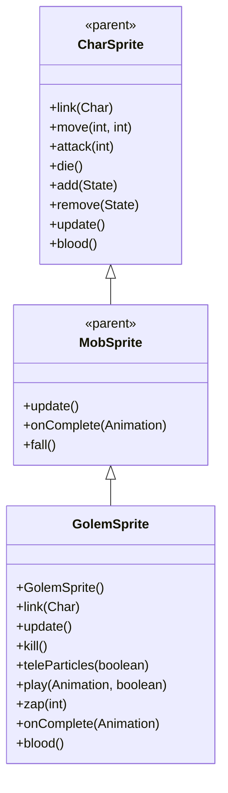

# GolemSprite 源码详解

## 1. 基本信息

| 属性 | 值 |
|------|-----|
| **文件路径** | core/src/main/java/com/shatteredpixel/shatteredpixeldungeon/sprites/GolemSprite.java |
| **包名** | com.shatteredpixel.shatteredpixeldungeon.sprites |
| **类类型** | class（非抽象） |
| **继承关系** | extends MobSprite |
| **代码行数** | 135 |

---

## 类职责

GolemSprite 是游戏中魔像怪物的精灵类，继承自 MobSprite。它具有以下特殊功能：

1. **传送粒子效果**：teleParticles 字段管理 ElmoParticle 传送粒子
2. **魔法导弹攻击**：zap() 方法创建 MagicMissile.ELMO 魔法导弹特效
3. **智能粒子控制**：play() 方法自动关闭传送粒子，避免动画冲突
4. **特殊死亡特效**：死亡时爆发 ElmoParticle 粒子效果
5. **特殊血液颜色**：重写 blood() 方法提供深棕色血液效果

**设计特点**：
- **粒子状态管理**：传送粒子可开关，与动画状态同步
- **死亡特效增强**：使用 died 标志确保死亡粒子只触发一次
- **魔法攻击集成**：完整的魔法导弹攻击流程

---

## 4. 继承与协作关系



---

## 核心字段

### 特效字段

| 字段名 | 类型 | 说明 |
|--------|------|------|
| `teleParticles` | Emitter | 传送粒子发射器，使用 ElmoParticle |
| `died` | boolean | 死亡状态标志，确保死亡特效只触发一次 |

---

## 构造方法详解

### GolemSprite()

```java
public GolemSprite() {
    super();
    
    texture( Assets.Sprites.GOLEM );
    
    TextureFilm frames = new TextureFilm( texture, 17, 19 );
    
    idle = new Animation( 4, true );
    idle.frames( frames, 0, 1 );
    
    run = new Animation( 12, true );
    run.frames( frames, 2, 3, 4, 5 );
    
    attack = new Animation( 10, false );
    attack.frames( frames, 6, 7, 8 );
    
    zap = attack.clone();
    
    die = new Animation( 15, false );
    die.frames( frames, 9, 10, 11, 12, 13 );
    
    play( idle );
}
```

**构造方法作用**：初始化魔像精灵的所有动画。

**纹理和帧设置**：
- **纹理源**：Assets.Sprites.GOLEM
- **帧尺寸**：17 像素宽 × 19 像素高
- **帧总数**：14 帧（索引 0-13）

**动画参数说明**：

| 动画类型 | 帧率 (FPS) | 循环 | 帧序列 | 说明 |
|----------|------------|------|--------|------|
| `idle` | 4 | true | [0, 1] | 闲置状态，两帧循环 |
| `run` | 12 | true | [2, 3, 4, 5] | 跑动动画，4帧循环 |
| `attack` | 10 | false | [6, 7, 8] | 攻击动画，3帧完成 |
| `zap` | 10 | false | 克隆 attack | 魔法攻击动画 |
| `die` | 15 | false | [9, 10, 11, 12, 13] | 死亡动画，5帧完整播放 |

**关键特性**：
- **Idle低帧率**：4 FPS 创造缓慢的等待效果，符合魔像特征
- **Zap克隆Attack**：魔法攻击复用近战攻击动画，保持一致性
- **Death动画长度**：5帧死亡动画提供完整的死亡过程

---

## 核心方法详解

### link(Char ch)

```java
@Override
public void link(Char ch) {
    super.link(ch);
    
    teleParticles = emitter();
    teleParticles.autoKill = false;
    teleParticles.pour(ElmoParticle.FACTORY, 0.05f);
    teleParticles.on = false;
}
```

**方法作用**：关联角色时初始化传送粒子效果。

**粒子配置**：
- **类型**：ElmoParticle.FACTORY（Elmo粒子）
- **发射率**：0.05f（每秒5个粒子）
- **自动清理**：autoKill = false（手动管理生命周期）
- **初始状态**：on = false（默认关闭）

### update()

```java
@Override
public void update() {
    super.update();
    if (teleParticles != null){
        teleParticles.pos( this );
        teleParticles.visible = visible;
    }
}
```

**方法作用**：同步传送粒子的位置和可见性。

### kill()

```java
@Override
public void kill() {
    super.kill();
    
    if (teleParticles != null) {
        teleParticles.on = false;
    }
}
```

**方法作用**：彻底销毁时关闭传送粒子。

### teleParticles(boolean value)

```java
public void teleParticles(boolean value){
    if (teleParticles != null) teleParticles.on = value;
}
```

**方法作用**：外部控制传送粒子的开关状态。

**使用场景**：
- 魔像准备传送时开启粒子
- 传送完成后关闭粒子
- 由游戏逻辑控制粒子显示时机

### play(Animation anim, boolean force)

```java
@Override
public synchronized void play(Animation anim, boolean force) {
    if (teleParticles != null) teleParticles.on = false;
    super.play(anim, force);
}
```

**方法作用**：重写 play 方法，在播放任何动画前自动关闭传送粒子。

**设计理念**：
- 避免传送粒子与动画效果冲突
- 确保动画播放时视觉效果清晰
- 自动管理粒子状态，减少外部控制复杂度

### zap(int cell)

```java
public void zap( int cell ) {
    super.zap( cell );
    
    MagicMissile.boltFromChar( parent,
            MagicMissile.ELMO,
            this,
            cell,
            new Callback() {
                @Override
                public void call() {
                    ((Golem)ch).onZapComplete();
                }
            } );
    Sample.INSTANCE.play( Assets.Sounds.ZAP );
}
```

**方法作用**：执行魔法导弹攻击。

**攻击流程**：
1. **调用父类 zap()**：开始 zap 动画
2. **创建魔法导弹**：MagicMissile.ELMO 从当前位置指向目标
3. **回调通知**：攻击完成后通知魔像怪物
4. **播放音效**：Assets.Sounds.ZAP

### onComplete(Animation anim)

```java
@Override
public void onComplete( Animation anim ) {
    if (anim == die && !died) {
        died = true;
        emitter().burst( ElmoParticle.FACTORY, 4 );
    }
    if (anim == zap) {
        idle();
    }
    super.onComplete( anim );
}
```

**方法作用**：处理动画完成事件。

**特殊处理**：
- **死亡特效**：使用 died 标志确保 Elmo 粒子只爆发一次
- **Zap状态恢复**：zap 完成后自动切换回 idle 状态

### blood()

```java
@Override
public int blood() {
    return 0xFF80706c;
}
```

**方法作用**：返回魔像受伤时的血液颜色。

**颜色说明**：
- **十六进制值**：0xFF80706c
- **颜色名称**：深棕色/铜色
- **设计意图**：符合魔像/构造体的金属或岩石特征

---

## 使用的资源

### 纹理和音频资源

| 资源 | 用途 |
|------|------|
| `Assets.Sprites.GOLEM` | 魔像的完整纹理集 |
| `Assets.Sounds.ZAP` | 魔法攻击音效 |

### 效果和工具类

| 类名 | 用途 |
|------|------|
| `TextureFilm` | 纹理帧管理 |
| `MagicMissile.ELMO` | Elmo魔法导弹特效 |
| `ElmoParticle` | Elmo粒子效果 |
| `Sample` | 音频播放 |
| `Callback` | 异步操作完成回调 |

---

## 与其他类的交互

### 继承关系

| 父类 | 继承/重写的功能 |
|------|----------------|
| `MobSprite` | 睡眠状态管理、死亡淡出效果、坠落动画等 |
| `CharSprite` | 所有基础动画、移动、状态效果、粒子系统等 |

### 关联的怪物类

GolemSprite 对应的怪物类是 `com.shatteredpixel.shatteredpixeldungeon.actors.mobs.Golem`，该类定义了魔像的行为逻辑，包括 onZapComplete() 方法。

### 粒子系统交互

- **Emitter 管理**：完善的粒子生命周期管理
- **位置同步**：teleParticles.pos(this) 确保粒子跟随精灵
- **状态同步**：visible 和 on 属性的正确管理

---

## 11. 使用示例

### 基本使用

```java
// 创建魔像精灵
GolemSprite golem = new GolemSprite();

// 关联魔像怪物对象
golem.link(golemMob);

// 自动初始化传送粒子（默认关闭）

// 触发动画
golem.run();     // 播放跑动动画  
golem.attack(targetPos); // 播放近战攻击动画
golem.zap(enemyCell);   // 播放魔法攻击动画
golem.die();     // 播放死亡动画（包含Elmo粒子爆发）
```

### 传送粒子控制

```java
// 外部控制传送粒子：
golem.teleParticles(true);  // 开启传送粒子（准备传送时）
// ... 传送逻辑 ...
golem.teleParticles(false); // 关闭传送粒子（传送完成后）

// 注意：播放任何动画时会自动关闭粒子
golem.run(); // 自动关闭传送粒子
```

### 魔法攻击细节

```java
// zap 方法会自动处理完整攻击流程
golem.zap(targetPosition);

// 攻击会自动：
// 1. 开始 zap 动画
// 2. 创建 ELMO 魔法导弹
// 3. 播放 ZAP 音效
// 4. 完成后通知怪物
// 5. 切换回 idle 状态
```

---

## 注意事项

### 设计模式理解

1. **自动状态管理**：play() 方法自动关闭传送粒子，避免冲突
2. **单次特效保证**：died 标志确保死亡粒子只触发一次
3. **外部控制接口**：teleParticles() 方法提供外部粒子控制

### 性能考虑

1. **内存管理**：manual autoKill = false 需要手动管理粒子生命周期
2. **粒子开销**：合理的粒子发射率（0.05f）平衡视觉效果和性能
3. **自动清理**：动画播放时自动关闭粒子，避免无效渲染

### 常见的坑

1. **粒子冲突**：忘记在动画播放前关闭传送粒子会导致视觉混乱
2. **重复死亡特效**：如果没有 died 标志，死亡粒子可能重复触发
3. **空值检查**：所有粒子操作前必须检查 teleParticles != null

### 最佳实践

1. **自动状态管理**：在关键方法中自动管理相关状态，减少外部依赖
2. **单次特效保护**：为重要特效添加标志位防止重复触发
3. **外部控制接口**：提供简洁的外部控制方法，同时保持内部逻辑完整性