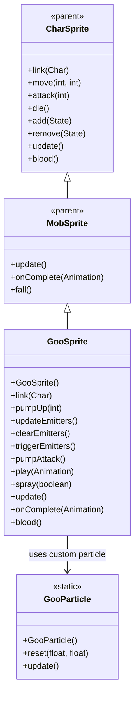

# GooSprite 源码详解

## 1. 基本信息

| 属性 | 值 |
|------|-----|
| **文件路径** | core/src/main/java/com/shatteredpixel/shatteredpixeldungeon/sprites/GooSprite.java |
| **包名** | com.shatteredpixel.shatteredpixeldungeon.sprites |
| **类类型** | class（非抽象） |
| **继承关系** | extends MobSprite |
| **代码行数** | 223 |

---

## 类职责

GooSprite 是游戏中史莱姆王（Goo）Boss的精灵类，继承自 MobSprite。作为重要的Boss角色，它具有以下复杂功能：

1. **充能攻击系统**：pump 和 pumpAttack 动画用于充能和释放强力攻击
2. **多发射器系统**：spray（中心喷射）和 pumpUpEmitters（范围预警）两套粒子系统
3. **视野计算机制**：通过 Ballistica 和 fieldOfView 计算可见范围内的格子
4. **自定义粒子效果**：GooParticle 内部类提供特殊的黑色收缩粒子
5. **智能状态管理**：根据生命值自动开启 spray 粒子，移动时更新预警范围
6. **特殊血液颜色**：重写 blood() 方法提供纯黑色血液效果

**设计特点**：
- **充能可视化**：通过粒子效果和动画表现充能过程
- **范围预警**：在攻击范围内显示粒子预警效果
- **生命周期管理**：完善的粒子发射器创建、更新和清理机制
- **性能优化**：使用对象池和条件更新减少计算开销

---

## 4. 继承与协作关系



---

## 核心字段

### 动画字段

| 字段名 | 类型 | 说明 |
|--------|------|------|
| `pump` | Animation | 充能动画（循环播放帧4-0） |
| `pumpAttack` | Animation | 充能攻击动画（非循环，最后播放帧7） |

### 粒子特效字段

| 字段名 | 类型 | 说明 |
|--------|------|------|
| `spray` | Emitter | 中心喷射粒子，生命值≤50%时开启 |
| `pumpUpEmitterDist` | int | 充能预警距离（0表示无预警） |
| `lastPumpUpPos` | int | 上次充能位置，用于检测移动 |
| `pumpUpEmitters` | ArrayList<Emitter> | 范围预警粒子发射器列表 |

---

## 构造方法详解

### GooSprite()

```java
public GooSprite() {
    super();
    
    texture( Assets.Sprites.GOO );
    
    TextureFilm frames = new TextureFilm( texture, 20, 14 );
    
    idle = new Animation( 10, true );
    idle.frames( frames, 2, 1, 0, 0, 1 );
    
    run = new Animation( 15, true );
    run.frames( frames, 3, 2, 1, 2 );
    
    pump = new Animation( 20, true );
    pump.frames( frames, 4, 3, 2, 1, 0 );
    
    pumpAttack = new Animation ( 20, false );
    pumpAttack.frames( frames, 4, 3, 2, 1, 0, 7);
    
    attack = new Animation( 10, false );
    attack.frames( frames, 8, 9, 10 );
    
    die = new Animation( 10, false );
    die.frames( frames, 5, 6, 7 );
    
    play(idle);
    
    spray = centerEmitter();
    if (spray != null) {
        spray.autoKill = false;
        spray.pour(GooParticle.FACTORY, 0.04f);
        spray.on = false;
    }
}
```

**构造方法作用**：初始化史莱姆王的所有动画和粒子系统。

**纹理和帧设置**：
- **纹理源**：Assets.Sprites.GOO
- **帧尺寸**：20 像素宽 × 14 像素高
- **帧总数**：11 帧（索引 0-10）

**动画参数说明**：

| 动画类型 | 帧率 (FPS) | 循环 | 帧序列 | 说明 |
|----------|------------|------|--------|------|
| `idle` | 10 | true | [2, 1, 0, 0, 1] | 闲置状态，5帧循环 |
| `run` | 15 | true | [3, 2, 1, 2] | 跑动动画，4帧循环 |
| `pump` | 20 | true | [4, 3, 2, 1, 0] | 充能动画，5帧循环 |
| `pumpAttack` | 20 | false | [4, 3, 2, 1, 0, 7] | 充能攻击动画，6帧完成 |
| `attack` | 10 | false | [8, 9, 10] | 普通攻击动画，3帧完成 |
| `die` | 10 | false | [5, 6, 7] | 死亡动画，3帧完成 |

**关键特性**：
- **Pump与Idle关联**：pump 动画反向播放 idle 的部分帧序列 [4,3,2,1,0]
- **PumpAttack特殊结尾**：以帧7结束，与死亡动画起始帧一致
- **Spray粒子初始化**：创建中心发射器但默认关闭

### GooParticle 内部类

```java
public static class GooParticle extends PixelParticle.Shrinking {
    public static final Emitter.Factory FACTORY = new Factory() {
        @Override
        public void emit( Emitter emitter, int index, float x, float y ) {
            ((GooParticle)emitter.recycle( GooParticle.class )).reset( x, y );
        }
    };
    
    public GooParticle() {
        super();
        color( 0x000000 );      // 纯黑色
        lifespan = 0.3f;        // 0.3秒生命周期
        acc.set( 0, +50 );      // 向下加速度
    }
    
    public void reset( float x, float y ) {
        revive();
        this.x = x;
        this.y = y;
        left = lifespan;
        size = 4;
        speed.polar( -Random.Float( PointF.PI ), Random.Float( 32, 48 ) );
    }
    
    @Override
    public void update() {
        super.update();
        float p = left / lifespan;
        am = p > 0.5f ? (1 - p) * 2f : 1; // 前半段不透明，后半段淡出
    }
}
```

**粒子特性**：
- **颜色**：纯黑色 (0x000000)
- **运动**：随机向上方向（负角度），速度32-48像素/秒
- **物理**：向下加速度 (+50)，模拟重力效果
- **透明度**：前半生命周期完全不透明，后半生命周期逐渐淡出
- **大小**：4像素

---

## 核心方法详解

### link(Char ch)

```java
@Override
public void link(Char ch) {
    super.link(ch);
    if (ch.HP*2 <= ch.HT)
        spray(true);
}
```

**方法作用**：关联角色时检查生命值，如果≤50%则开启 spray 粒子。

### pumpUp(int warnDist)

```java
public void pumpUp( int warnDist ) {
    pumpUpEmitterDist = warnDist;
    if (warnDist > 0){
        play(pump);
        Sample.INSTANCE.play( Assets.Sounds.CHARGEUP, 1f, warnDist == 1 ? 0.8f : 1f );
    }
    updateEmitters();
}
```

**方法作用**：开始充能过程并显示预警范围。

**充能流程**：
- **设置预警距离**：pumpUpEmitterDist = warnDist
- **播放充能动画**：仅当 warnDist > 0 时播放
- **音效反馈**：CHARGEUP 音效，距离为1时音调更低 (0.8f)
- **更新发射器**：调用 updateEmitters() 显示预警粒子

### updateEmitters()

```java
public void updateEmitters( ){
    clearEmitters();
    if (pumpUpEmitterDist > 0 && ch != null) {
        lastPumpUpPos = ch.pos;
        // 确保视野数组存在
        if (ch.fieldOfView == null || ch.fieldOfView.length != Dungeon.level.length()) {
            ch.fieldOfView = new boolean[Dungeon.level.length()];
            Dungeon.level.updateFieldOfView(ch, ch.fieldOfView);
        }
        // 遍历所有格子，查找可见且在预警范围内的格子
        for (int i = 0; i < Dungeon.level.length(); i++) {
            if (ch.fieldOfView != null && ch.fieldOfView[i]
                    && Dungeon.level.distance(i, ch.pos) <= pumpUpEmitterDist
                    && new Ballistica(ch.pos, i, Ballistica.STOP_TARGET | Ballistica.STOP_SOLID | Ballistica.IGNORE_SOFT_SOLID).collisionPos == i
                    && new Ballistica(i, ch.pos, Ballistica.STOP_TARGET | Ballistica.STOP_SOLID | Ballistica.IGNORE_SOFT_SOLID).collisionPos == ch.pos) {
                Emitter e = CellEmitter.get(i);
                e.pour(GooParticle.FACTORY, 0.04f);
                pumpUpEmitters.add(e);
            }
        }
    }
}
```

**方法作用**：根据当前充能距离和角色位置，更新预警粒子发射器。

**视野和弹道计算**：
- **视野检查**：ch.fieldOfView[i] 确保格子在角色视野内
- **距离检查**：Dungeon.level.distance(i, ch.pos) ≤ pumpUpEmitterDist
- **双向弹道检查**：
  - 从角色到目标格子的弹道终点必须是目标格子
  - 从目标格子到角色的弹道终点必须是角色位置
- **碰撞检测**：Ballistica 配置包含 STOP_TARGET、STOP_SOLID、IGNORE_SOFT_SOLID

### triggerEmitters()

```java
public void triggerEmitters(){
    for (Emitter e : pumpUpEmitters){
        e.burst(ElmoParticle.FACTORY, 10);
    }
    Sample.INSTANCE.play( Assets.Sounds.BURNING );
    pumpUpEmitterDist = 0;
    pumpUpEmitters.clear();
}
```

**方法作用**：触发预警粒子爆发，表示充能攻击释放。

**爆发效果**：
- **粒子爆发**：每个预警发射器爆发10个 ElmoParticle
- **音效**：BURNING 音效
- **状态重置**：清除预警距离和发射器列表

### play(Animation anim)

```java
@Override
public void play(Animation anim) {
    if (anim != pump && anim != pumpAttack){
        pumpUpEmitterDist = 0;
        clearEmitters();
    }
    super.play(anim);
}
```

**方法作用**：重写 play 方法，在播放非充能动画时清理预警状态。

**状态保护**：
- 只有 pump 和 pumpAttack 动画会保留预警状态
- 其他任何动画都会清除预警粒子

### onComplete(Animation anim)

```java
@Override
public void onComplete( Animation anim ) {
    super.onComplete(anim);
    
    if (anim == pumpAttack) {
        triggerEmitters();
        idle();
        ch.onAttackComplete();
    } else if (anim == die) {
        spray.killAndErase();
    }
}
```

**方法作用**：处理动画完成事件。

**特殊逻辑**：
- **充能攻击完成**：触发粒子爆发、切换回 idle、通知怪物攻击完成
- **死亡完成**：彻底清理 spray 粒子

### 其他重要方法

- **clearEmitters()**: 关闭并清空所有预警发射器
- **spray(boolean on)**: 控制中心喷射粒子开关
- **update()**: 同步粒子位置和可见性，检测移动时更新预警
- **blood()**: 返回纯黑色血液 (0xFF000000)

---

## 使用的资源

### 纹理和音频资源

| 资源 | 用途 |
|------|------|
| `Assets.Sprites.GOO` | 史莱姆王的完整纹理集 |
| `Assets.Sounds.CHARGEUP` | 充能音效 |
| `Assets.Sounds.BURNING` | 攻击爆发音效 |

### 效果和工具类

| 类名 | 用途 |
|------|------|
| `TextureFilm` | 纹理帧管理 |
| `CellEmitter` | 格子粒子发射器 |
| `Ballistica` | 弹道计算和碰撞检测 |
| `Dungeon.level` | 关卡信息和距离计算 |
| `ElmoParticle` | 爆发粒子效果 |
| `Random` | 随机数生成 |

---

## 与其他类的交互

### 继承关系

| 父类 | 继承/重写的功能 |
|------|----------------|
| `MobSprite` | 睡眠状态管理、死亡淡出效果、坠落动画等 |
| `CharSprite` | 所有基础动画、移动、状态效果、粒子系统等 |

### 关联的怪物类

GooSprite 对应的怪物类是 `com.shatteredpixel.shatteredpixeldungeon.actors.mobs.Goo`，该类定义了史莱姆王的复杂行为逻辑，包括：
- **充能机制**：控制 pumpUp() 调用时机
- **生命值检查**：决定何时开启 spray 粒子
- **攻击完成回调**：onAttackComplete() 通知

### 系统交互

- **视野系统**：Dungeon.level.updateFieldOfView() 计算可见范围
- **弹道系统**：Ballistica 进行精确的视线和碰撞检测
- **粒子系统**：完善的发射器生命周期管理
- **音频系统**：多种音效配合不同攻击阶段

---

## 11. 使用示例

### 基本使用

```java
// 创建史莱姆王精灵
GooSprite goo = new GooSprite();

// 关联史莱姆王怪物对象
goo.link(gooMob);

// 自动处理生命值检查和粒子初始化

// 触发动画
goo.run();              // 播放跑动动画  
goo.attack(targetPos);   // 播放普通攻击动画
goo.pumpUp(3);          // 开始充能，预警范围3格
goo.pumpAttack();       // 执行充能攻击
goo.die();              // 播放死亡动画
```

### 充能攻击流程

```java
// 完整的充能攻击流程：
goo.pumpUp(3);          // 1. 开始充能，显示3格预警范围
// ... 玩家看到预警粒子 ...
goo.pumpAttack();       // 2. 释放充能攻击
// 3. 自动触发：
//    - 粒子爆发效果
//    - BURNING 音效
//    - 切换回 idle 状态
//    - 通知怪物攻击完成
```

### 粒子效果管理

```java
// 生命值≤50%时自动开启中心喷射
if (gooMob.HP <= gooMob.HT / 2) {
    // spray 粒子自动开启
}

// 手动控制中心喷射（通常不需要）
goo.spray(true);        // 开启喷射
goo.spray(false);       // 关闭喷射
```

---

## 注意事项

### 设计模式理解

1. **状态驱动渲染**：充能状态通过粒子效果和动画直观表现
2. **范围可视化**：通过复杂的视野和弹道计算精确显示预警范围
3. **对象池模式**：GooParticle 使用 recycle() 复用粒子实例

### 性能考虑

1. **条件更新**：只在必要时更新预警粒子（移动时或充能时）
2. **视野缓存**：fieldOfView 数组避免重复计算
3. **粒子复用**：对象池减少内存分配和垃圾回收

### 常见的坑

1. **双向弹道检查**：必须同时检查两个方向的弹道，确保双向可见
2. **状态清理时机**：非充能动画会自动清理预警状态，需要注意
3. **视野数组初始化**：确保 fieldOfView 数组正确初始化和更新

### 最佳实践

1. **复杂Boss设计**：为重要Boss实现完整的充能和预警系统
2. **视觉反馈完整性**：结合动画、粒子、音效提供沉浸式体验
3. **性能优化**：通过条件更新和缓存避免不必要的计算开销