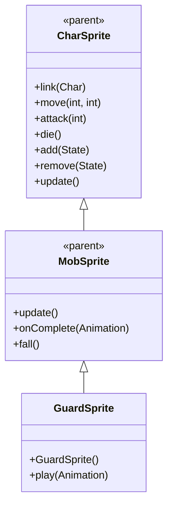

# GuardSprite 源码详解

## 1. 基本信息

| 属性 | 值 |
|------|-----|
| **文件路径** | core/src/main/java/com/shatteredpixel/shatteredpixeldungeon/sprites/GuardSprite.java |
| **包名** | com.shatteredpixel.shatteredpixeldungeon.sprites |
| **类类型** | class（非抽象） |
| **继承关系** | extends MobSprite |
| **代码行数** | 60 |

---

## 类职责

GuardSprite 是游戏中守卫怪物的精灵类，继承自 MobSprite。它具有以下功能：

1. **复杂动画序列**：idle 动画包含8帧序列，创造自然的等待效果
2. **死亡粒子特效**：play() 方法重写，在播放死亡动画时添加 ShadowParticle.UP 粒子效果
3. **攻击姿态恢复**：攻击完成后回到基础姿态
4. **流畅的跑动动画**：6帧跑动序列提供平滑的移动效果

**设计特点**：
- **生动动画**：复杂的 idle 序列模拟自然的生物特征
- **死亡特效增强**：向上飘散的阴影粒子增强死亡视觉效果
- **标准动画流程**：遵循游戏统一的动画设计模式

---

## 4. 继承与协作关系



---

## 构造方法详解

### GuardSprite()

```java
public GuardSprite() {
    super();
    
    texture( Assets.Sprites.GUARD );
    
    TextureFilm frames = new TextureFilm( texture, 12, 16 );
    
    idle = new Animation( 2, true );
    idle.frames( frames, 0, 0, 0, 1, 0, 0, 1, 1 );
    
    run = new MovieClip.Animation( 15, true );
    run.frames( frames, 2, 3, 4, 5, 6, 7 );
    
    attack = new MovieClip.Animation( 12, false );
    attack.frames( frames, 8, 9, 10 );
    
    die = new MovieClip.Animation( 8, false );
    die.frames( frames, 11, 12, 13, 14 );
    
    play( idle );
}
```

**构造方法作用**：初始化守卫精灵的所有动画。

**纹理和帧设置**：
- **纹理源**：Assets.Sprites.GUARD
- **帧尺寸**：12 像素宽 × 16 像素高
- **帧总数**：15 帧（索引 0-14）

**动画参数说明**：

| 动画类型 | 帧率 (FPS) | 循环 | 帧序列 | 说明 |
|----------|------------|------|--------|------|
| `idle` | 2 | true | [0, 0, 0, 1, 0, 0, 1, 1] | 闲置状态，大部分时间显示帧0，偶尔切换到帧1 |
| `run` | 15 | true | [2, 3, 4, 5, 6, 7] | 跑动动画，6帧循环 |
| `attack` | 12 | false | [8, 9, 10] | 攻击动画，3帧完成 |
| `die` | 8 | false | [11, 12, 13, 14] | 死亡动画，4帧完整播放 |

**关键特性**：
- **Idle动画节奏**：低帧率（2 FPS）配合复杂序列创造自然的呼吸/等待效果
- **Run动画流畅性**：6帧跑动序列提供平滑的移动动画
- **Attack动画完整性**：攻击完成后自然结束，无需特殊恢复逻辑

---

## 核心方法详解

### play(Animation anim)

```java
@Override
public void play( Animation anim ) {
    if (anim == die) {
        emitter().burst( ShadowParticle.UP, 4 );
    }
    super.play( anim );
}
```

**方法作用**：重写 play 方法，在播放死亡动画时添加特殊的粒子效果。

**死亡特效**：
- **触发条件**：仅当播放 die 动画时触发
- **粒子类型**：ShadowParticle.UP（向上飘散的阴影粒子）
- **粒子数量**：4个粒子
- **时机**：在调用 super.play(anim) 之前，确保特效可见

**设计理念**：
- 通过重写 play() 方法实现特定动画的特殊效果
- 避免在 die() 方法中处理，确保粒子效果与动画同步
- 向上飘散的粒子效果符合守卫死亡时的灵魂/能量消散概念

---

## 使用的资源

### 纹理资源

| 资源 | 用途 |
|------|------|
| `Assets.Sprites.GUARD` | 守卫的完整纹理集 |

### 效果和工具类

| 类名 | 用途 |
|------|------|
| `TextureFilm` | 将大纹理分割成多个小帧用于动画 |
| `ShadowParticle.UP` | 向上飘散的阴影粒子效果 |
| `MovieClip.Animation` | 动画定义（显式使用全限定名） |

---

## 与其他类的交互

### 继承关系

| 父类 | 继承的功能 |
|------|-----------|
| `MobSprite` | 睡眠状态管理、死亡淡出效果、坠落动画等 |
| `CharSprite` | 所有基础动画、移动、状态效果、粒子系统等 |

### 关联的怪物类

GuardSprite 对应的怪物类是 `com.shatteredpixel.shatteredpixeldungeon.actors.mobs.Guard`，该类定义了守卫的行为逻辑。

### 粒子系统交互

- **Emitter 管理**：通过 emitter().burst() 创建一次性粒子爆发
- **粒子方向**：UP 方向的粒子创造向上升腾的视觉效果
- **时机控制**：在动画开始时触发，确保与死亡动画同步

---

## 11. 使用示例

### 基本使用

```java
// 创建守卫精灵
GuardSprite guard = new GuardSprite();

// 关联守卫怪物对象
guard.link(guardMob);

// 自动播放 idle 动画（构造时已设置）

// 触发动画
guard.run();     // 播放跑动动画  
guard.attack(targetPos); // 播放攻击动画
guard.die();     // 播放死亡动画（包含阴影粒子效果）
```

### 死亡特效细节

```java
// 死亡特效自动触发，无需手动干预
guard.die();

// 自动执行：
// 1. 创建4个 ShadowParticle.UP 粒子
// 2. 粒子向上飘散
// 3. 开始播放死亡动画
// 4. 粒子效果与动画同步消失
```

### 动画控制

```java
// 手动控制动画（通常不需要，由游戏逻辑自动触发）
guard.play(guard.idle);   // 播放闲置动画
guard.play(guard.run);    // 播放跑动动画
guard.play(guard.die);    // 播放死亡动画（自动触发粒子效果）
```

---

## 注意事项

### 设计模式理解

1. **方法重写模式**：通过重写 play() 方法实现特定动画的特殊效果
2. **时机控制**：粒子效果在动画开始前触发，确保最佳视觉同步
3. **生物特征还原**：复杂 idle 动画模拟真实生物的自然行为

### 性能考虑

1. **内存效率**：合理的纹理帧数量（15帧），适合守卫级别怪物
2. **粒子开销**：一次性粒子爆发（4个）性能开销极小
3. **渲染优化**：固定帧尺寸便于 GPU 批处理

### 常见的坑

1. **帧序列理解**：idle 的8帧序列需要正确理解其节奏和意图
2. **粒子时机**：必须在 super.play() 之前触发粒子效果
3. **空值检查**：emitter() 可能返回 null，但 burst() 方法内部已处理

### 最佳实践

1. **动画特效集成**：将特殊效果集成到 play() 方法中，确保时机准确
2. **粒子效果匹配**：选择符合角色特征的粒子效果（守卫使用阴影粒子）
3. **测试动画流畅性**：确保各状态切换自然连贯